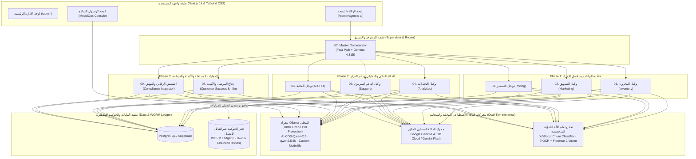

# 👑 الدليل التنفيذي الشامل لمنظومة الوكلاء الأذكياء ونظام ModelOps
## مشروع تخرج AI-COS Pharmacy — كلية تكنولوجيا الإدارة ونظم المعلومات (BIS)
### *المعمارية المؤسسية المتكاملة للأنظمة المستقلة متعددة الوكلاء (Autonomous Multi-Agent Enterprise OS)*

---

## 🧭 فهرس المنظومة ودليل الملفات التسعة (Master File Index)

تحتوي هذه الحزمة التوثيقية الهندسية على **10 ملفات متخصصة** تغطي كافة أركان الذكاء الاصطناعي المؤسسي المطبق في صيدلية AI-COS:

| رقم الملف | اسم الوكيل / النظام | المرحلة (Phase) | المحرك الذكي المعتمد | الوظيفة الجوهرية |
| :---: | :--- | :---: | :--- | :--- |
| **`01`** | [وكيل المخزون وسلاسل الإمداد](01_Inventory_Agent_وكيل_المخزون_وسلاسل_الإمداد.md) | **Phase 1** | Gemma 4:31B + Math Core | التنبؤ بنفاد الأدوية المزمنة وتوليد أوامر توريد اقتصادية (EOQ). |
| **`02`** | [وكيل التسويق والاستهداف الذكي](02_Marketing_Agent_وكيل_التسويق_والاستهداف_الذكي.md) | **Phase 1** | Gemma 4:31B + Lead Scoring | صياغة رسائل واتساب مخصصة وكوبونات إعادة صرف للأدوية التكميلية. |
| **`03`** | [وكيل التسعير الديناميكي وتعظيم الربحية](03_Pricing_Agent_وكيل_التسعير_الديناميكي_وتعظيم_الربحية.md) | **Phase 1** | qwen2.5:3b + Elasticity Rules | تحديد الخصم الأمثل وفق مرونة الطلب وشرائح العملاء مع حماية الهامش. |
| **`04`** | [وكيل التحليلات التنفيذية والذكاء الاستراتيجي](04_Analytics_Agent_وكيل_التحليلات_التنفيذية.md) | **Phase 2** | Gemma 4:31B + Multi-KPI | تحويل مؤشرات الأداء (KPIs) إلى إحاطات وقرارات توجيهية للإدارة العليا. |
| **`05`** | [وكيل الدعم الفني والفرز السريري الآلي](05_Support_Agent_وكيل_الدعم_الفني_والفرز_الآلي.md) | **Phase 2** | AI-COS-Qwen-2.5 + Triage | تحليل شكاوى المرضى، فرز الخطورة الطبية، والتصعيد البشري الفوري. |
| **`06`** | [وكيل المالية والمطابقات المحاسبية](06_Finance_Agent_وكيل_المالية_والمطابقات_المحاسبية.md) | **Phase 2** | AI CFO + Deterministic Clamp | حساب الـ CLV، فرض سقف الخصم الآمن قسرياً، وبدائل الولاء للخصم 0%. |
| **`07`** | [وكيل التنسيق العام وإدارة تدفق العمليات](07_Orchestrator_Agent_وكيل_التنسيق_العام_وإدارة_تدفق_العمليات.md) | **Phase 3** | Supervisor Pattern + FastPath | تفكيك استفسارات الصيدلي وتوجيهها للوكيل المختص وسلاسل المهام. |
| **`08`** | [وكيل الأتمتة واستبقاء المرضى المزمنين](08_Customer_Success_Automation_Agent_وكيل_الأتمتة_ونجاح_المرضى.md) | **Phase 3** | XGBoost Churn + n8n RPA | رصد احتمالية انقطاع المرضى وإطلاق مسارات العمل الروبوتية تلقائياً. |
| **`09`** | [وكيل التوثيق والتفتيش الرقابي المستمر](09_Documentation_Agent_مركز_التفتيش_والامتثال_الرقابي.md) | **Phase 3** | WORM Ledger + Spot Inspector | حوكمة القرارات، مطابقة معايير COSO و FDA، وتوليد ملف التفتيش الرسمي. |
| **`10`** | [نظام إدارة النماذج والذكاء السيادي (ModelOps)](10_ModelOps_System_نظام_إدارة_النماذج_والذكاء_الاصطناعي_المحلي.md) | **Core Engine** | Ollama Local (7 Models) | الخصوصية الطبية 100% Offline، دعم كروت 4GB VRAM، والتبديل اللحظي. |
| **`11`** | [استوديو تخصيص النماذج وضوابط الحوكمة](11_Modelfile_Studio_استوديو_تخصيص_النماذج_وهندسة_الحوكمة.md) | **Studio & IaC** | Modelfile Engine + Presets | بناء نماذج مخصصة للأطفال، الكاشير، والـ CDSS مع ضبط الـ Temperature. |

---

## 🏛️ المخطط الشامل لمعمارية منظومة AI-COS المؤسسية

---

## 💎 الفروق الجوهرية بين AI-COS ومشاريع التخرج العادية (The BIS Competitive Edge)

| وجه المقارنة | مشاريع التخرج التقليدية | منظومة AI-COS Pharmacy المؤسسية |
| :--- | :--- | :--- |
| **نوع الذكاء الاصطناعي** | شات بوت سطحي مربوط بـ API جاهز يهلوس في الأرقام | **منظومة 9 وكلاء متخصصة (Autonomous Multi-Agent System)** بنمط المشرف الأعلى |
| **الحسابات المالية والكميات** | يترك الـ LLM يخترع الأسعار والكميات بنبرة تخمينية | **حسابات قطعية كودية (Deterministic Code Calculates, LLM Articulates)** مع صفر هلوسة |
| **خصوصية بيانات المرضى** | إرسال أسماء وروشتات المرضى لسيرفرات أجنبية (انتهاك HIPAA) | **معالجة محلية 100% Offline بـ Ollama** مع درع تشفير هوية المريض (*PII Masking*) |
| **الأمان والحوكمة والرقابة** | جداول عادية يسهل التعديل والحذف فيها من الـ Admin | **سجل WORM Ledger غير قابل للتعديل** بسلاسل هاشات SHA-256 مطابقة لمعايير COSO و FDA |
| **أتمتة الإجراءات** | مجرد كلام ونصوص على الشاشة بدون أي تنفيذ | **تنفيذ فعلي عبر محرك RPA (n8n)** لإرسال رسائل حقيقية، تفعيل كوبونات، وأوامر توريد |
| **استهلاك العتاد والتكاليف** | يتطلب سيرفرات سحابية بمئات الدولارات شهرياً | **تكميم رباعي Q4_K_M يعمل على كروت شاشة اقتصادية 4GB VRAM** بتكلفة تشغيل \$0 |

---

## 🎯 دليل المناقشة الشفهية أمام لجنة التحكيم (Defense Questions & Answers)

### س1: "لماذا لم تكتفوا بنموذج واحد (Monolithic LLM) بدلاً من تقسيم النظام لـ 9 وكلاء؟"
> **الإجابة:** *"يا فندم، في هندسة البرمجيات المعاصرة، أثبتت أبحاث الذكاء الاصطناعي أن النماذج الأحادية تعاني من تشتت السياق (Context Degradation) وتزداد نسبة الهلوسة عند دمج مهام متعددة. تقسيم النظام لـ 9 وكلاء يطبق مبدأ Separation of Concerns؛ فوكيل التسعير محكوم بمرونة الأسعار، ووكيل المخزون محكوم بـ EOQ، ووكيل الحوكمة يراقب الجميع بشكل مستقل تماماً."*

### س2: "كيف تضمنون عدم هلوسة الذكاء الاصطناعي في إعطاء خصومات تسبب خسائر للصيدلية؟"
> **الإجابة:** *"الذكاء الاصطناعي في AI-COS لا يحسب الأرقام بمفرده؛ بل نتبع مبدأ (Code Calculates, AI Articulates). كود البايثون في دالة evaluate_financial_decision يحسب سقف الأمان جبرياً: MaxSafeDiscount = Margin * 0.5، ثم يفرض تقييداً قسرياً (Hard Clamp) يستحيل تجاوزه حتى لو اقترح النموذج خصماً أعلى."*

### س3: "ما هي القيمة المضافة لتقنية WORM Ledger في وكيل التوثيق والحوكمة (Agent 09)؟"
> **الإجابة:** *"معظم الأنظمة معرضة لهجمات Rogue DBA؛ أي أن مسؤول قاعدة البيانات يمكنه الدخول لقاعدة بيانات SQL وتعديل الأسعار أو حذف سجلات اختلاس. تقنية WORM Ledger تحفظ السجلات في ملف خارجي كل سطر فيه مشفر بهاش السطر السابق بسلسلة SHA-256؛ فأي تعديل في حرف واحد بجدول الأوردرات يُكتشف فوراً كاختراق رقابي."*

### س4: "لماذا أضفتم نظام ModelOps والنماذج المحلية طالما تستخدمون Gemma السحابي؟"
> **الإجابة:** *"لتحقيق ثلاثة متطلبات حتمية في القطاع الصحي: أولاً، الامتثال لقانون حماية البيانات الشخصية المصري ومعايير HIPAA لمنع خروج بيانات المرضى لخوادم أجنبية. ثانياً، استمرارية العمل بدون إنترنت (Offline CDSS) إذا انقطع الاتصال بالفروع. ثالثاً، تقليل تكاليف التشغيل إلى صفر جنيه بالاعتماد على كروت شاشة اقتصادية 4GB VRAM وتكميم Q4_K_M."*
