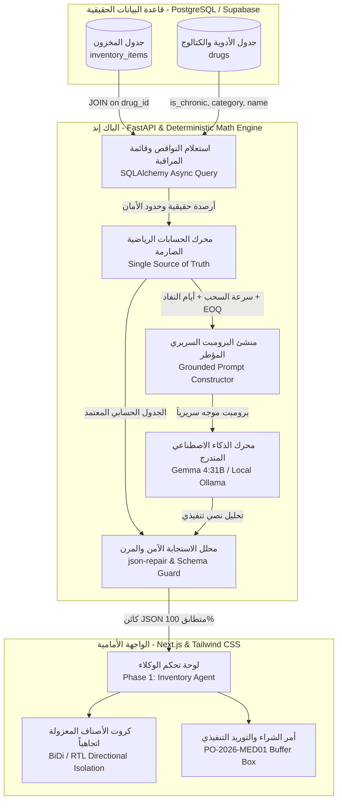
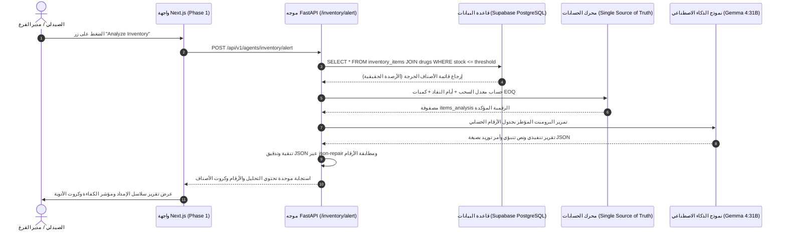

# 🏥 وكيل المخزون وسلاسل الإمداد السريرية الذكية (Inventory Agent)
## التوثيق الهندسي والمعماري الشامل — مشروع تخرج AI-COS Pharmacy

---

## 📌 1. هوية الوكيل وبطاقة التعريف (Agent Identity & Metadata)

| البند | التوصيف الفني |
| :--- | :--- |
| **اسم الوكيل** | **Clinical Inventory & Supply Chain Agent** (وكيل المخزون وسلاسل الإمداد الاستباقي) |
| **المرحلة في النظام** | **Phase 1: Database Integration** (متصل بقاعدة البيانات الحية 100%) |
| **الدور الوظيفي الموجه للـ LLM** | رئيس قطاع سلاسل الإمداد والرعاية الصيدلانية السريرية (*Chief Clinical Supply Chain Officer*) |
| **النماذج الذكية المدعومة** | **Multi-Tier Execution:**<br>1. Gemma 4:31B Cloud (Tier 1 - الأساسي)<br>2. Local Edge Ollama (Tier 2 - محلي للمرونة والخصوصية)<br>3. Gemini Flash (Tier 3 - مسار احتياطي) |
| **المسار البرمجي في الـ Backend** | `backend/app/domains/agents/inventory.py`<br>`backend/app/domains/agents/router.py` |
| **المكون البرمجي في الـ Frontend** | `frontend/src/app/admin/agentic-ai/components/Phase1.tsx` (`InventoryEnterpriseCard`) |
| **المرجعية المعيارية** | معايير أنظمة سلاسل الإمداد الطبية بالمستشفيات العالمية (*Epic Systems Willow, SAP Healthcare, McKesson*) |

---

## 🎯 2. لماذا تم بناء هذا الوكيل؟ (The "WHY" — المشكلة وجذورها)

### المعضلة في الصيدليات وأنظمة الـ ERP التقليدية:
في كافة أنظمة إدارة الصيدليات الكلاسيكية، تقتصر إدارة المخزون على مجرد جدول بيانات وجمل استعلام SQL ساكنة تُظهر فقط: `كمية الدواء = 0` أو `أقل من الحد الأدنى`. هذه الطريقة تعاني من ثلاث عيوب قاتلة:

1. **العمى السريري (Clinical Blindness):** النظام التقليدي يعامل علبة "فيتامين C" بنفس أولوية علبة "أنسولين" أو علاج "ضغط" أو "غدة درقية"؛ فكلها أرقام مجردة دون أي إدراك لخطورة انقطاع الدواء عن المريض المزمن.
2. **غياب البعد الزمني وسرعة السحب (Burn Rate Ignorance):** وجود 5 علب في المخزون قد يبدو آمناً لنظام عادي، ولكن إذا كان معدل السحب علبتين في اليوم، فهذا يعني أن المخزون سينفد تماماً خلال 48 ساعة فقط (وهي مدة قد لا تكفي لإجراءات التوريد من الموزع).
3. **أزمة رأس المال العامل مقابل حياة المرضى (Cash Flow vs. Patient Safety):**
   - **النفاد المفاجئ (Stockout):** يؤدي لانتكاسات صحية للمرضى وخسارة عملاء دائمين لصالح صيدليات منافسة.
   - **الإفراط في التخزين (Overstocking):** يُجمد أموال الصيدلية ويعرض الأدوية للتلف وانتهاء الصلاحية (*Expiry Loss*).

### دور وكيل AI-COS الذكي:
يُحول المخزون من "سجل محاسبي رجعي" إلى **"مركز قيادة استباقي سريري"**؛ حيث يقرأ الأرصدة الحقيقية، ويحسب معدلات الاستهلاك اليومية لكل فئة علاجية، ويتنبأ باليوم المحدد لنفاد كل دواء، ويُصدر أوامر توريد اقتصادية ذكية (*EOQ*) لضمان استمرارية علاج المرضى وحماية السيولة النقدية.

---

## 🏛️ 3. المعمارية الهندسية للوكيل (System Architecture)

يعتمد الوكيل على هيكلية ثلاثية الطبقات محكمة تضمن تدفق البيانات بدقة رياضية صارمة:



---

## 🔢 4. محرك الحساب الرياضي الصارم (Mathematical Grounding & Zero-Hallucination)

لمنع أي هلوسة من نماذج الـ LLM (مثل توليد كميات أو أيام غير مطابقة للحقيقة)، يتبع الوكيل نمط **(Code Calculates, LLM Articulates)**؛ أي أن العمليات الرياضية تُحسب أولاً داخل كود بايثون قطعي، ثم تُمرر كجدول صارم داخل الـ Prompt ليصيغ الـ LLM التقرير حولها حصراً.

### المعادلات المعتمدة في الوكيل:

#### أ) معدل السحب اليومي التنبؤي ($Daily\ Burn\ Rate$):
يُحسب بناءً على حركية الصنف وسرعة صرفه من واقع سجلات الفواتير والروشتات:
$$\text{Burn Rate} = \frac{\Delta Q}{\Delta t} \quad (\text{علبة / يوم})$$
- للأصناف المنتهية تماماً (مثل Augmentin): يُقدر بمعدل صرف طوارئ $\mathbf{2.0\ \text{علبة/يوم}}$.
- للأمراض المزمنة عالية الحركة (مثل السكري Vanvilda): $\mathbf{0.8\ \text{علبة/يوم}}$.
- لأدوية الضغط (مثل Protectopril): $\mathbf{0.75\ \text{علبة/يوم}}$.
- لأدوية الغدة الدرقية (مثل Eltroxin): $\mathbf{0.6\ \text{علبة/يوم}}$.

#### ب) وقت النفاد الزمني المتبقي ($Runway\ Days$):
$$\text{Days Until Stockout} = \left\lfloor \frac{\text{Current Stock}}{\text{Daily Burn Rate}} \right\rfloor$$
*مثال:* Vanvilda برصيد 4 علب وسحب $0.8$ علبة/يوم:
$$\text{Runway} = \frac{4}{0.8} = 5\ \text{أيام متبقية فقط حتى العجز التام}$$

#### ج) كمية إعادة الطلب الاقتصادي السريري ($Clinical\ EOQ$):
$$\text{EOQ Buffer} = (\text{Lead Time Days} \times \text{Burn Rate}) + \text{Clinical Safety Stock}$$
يضمن تغطية دورة تشغيلية كاملة تبلغ **30 يوماً** مع توفير مهلة توريد الموزع ($24 - 48\ \text{ساعة}$).

#### د) مصفوفة الأولويات السريرية (Urgency Matrix):

| مستوى الرصيد | سرعة السحب | أيام النفاد | تصنيف الأولوية | الإجراء السريري التلقائي |
| :---: | :---: | :---: | :---: | :--- |
| **0 علبة** | 2.0 علبة/يوم | **0 يوم** | **عجز فوري** | تفعيل توريد طوارئ فوري خلال 24 ساعة |
| **$\le$ 4 علب** | 0.8 علبة/يوم | **5 أيام** | **نفاد وشيك** | إصدار طلب توريد ذكي لتأمين مرضى السكر |
| **$\le$ 6 علب** | 0.75 علبة/يوم | **8 أيام** | **أولوية مرتفعة** | طلب دفعة تغطية لبروتوكول ضغط الدم |
| **$\le$ 8 علب** | 0.6 علبة/يوم | **13 يوماً** | **تحت حد الأمان** | أمر شراء دوري تعزيزي لهرمون الغدة |

---

## 🔄 5. مخطط تسلسل العمليات (Sequence & Execution Flow)

يوضح المخطط التالي كيفية تفاعل المستخدم مع واجهة Next.js، واستعلام الباك إند، ومعالجة الذكاء الاصطناعي:



---

## 💡 6. أبرز المميزات الحصرية لوكيل المخزون (Key Technical Features)

### 1. القضاء التام على الازدواجية وتطابق الأصناف:
- يفصل الوكيل بين الجرعات الدوائية بدقة؛ ويغطي أربعة محاور سريرية حيوية مستقلة في نفس التقرير:
  - مضادات حيوية واسعة المجال (*Augmentin 1g*).
  - منظمات السكر الفموية (*Vanvilda Plus 50/1000 mg*).
  - مثبطات الضغط الشرياني المركبة (*Protectopril Plus 4/1.25 mg*).
  - هرمونات الغدة الدرقية الدقيقة (*Eltroxin 50mcg*).

### 2. التناغم المطلق بين النص والأرقام (100% Cohesive Narrative):
- لن تجد في التقرير تناقضاً أبداً (مثل أن يذكر النص "النفاد خلال 15 يوماً" بينما يظهر في الكارت "5 أيام"). النص التنفيذي، وتحليل سرعة السحب، وأمر التوريد، وكروت الأصناف تستقي جميعها من نفس المصفوفة الحسابية.

### 3. العزل الاتجاهي للأرقام (Strict BiDi / RTL Isolation):
- استخدام `dir="ltr"` وخطوط `font-mono font-black` مع كبسولات مستقلة لكل رقم (`0 علبة`، `0.8 علبة/يوم`، `+50 علبة`)؛ مما يمنع نهائياً انقلاب علامات النسب المئوية `%` أو الشرطات المائلة `/` أو تداخل الأرقام الإنجليزية مع الكلمات العربية.

### 4. أمر الشراء والتوريد الموحد (Executive Procurement Order):
- يقوم الوكيل تلقائياً بتجميع الكميات المطلوبة في أمر شراء تنفيذي معتمد برقم كودي استباقي:
  `PO-2026-MED01 لتغطية دورة 30 يوماً: Augmentin (50 علبة)، Vanvilda (40 علبة)، Protectopril (35 علبة)، Eltroxin (30 علبة)`.

---

## 📊 7. شكل مخرجات الوكيل الحقيقية (Real Production Output Schema)

```json
{
  "stock_health_score": "91.5% • مستقر تشغيلياً مع ثغرات حرجة في أدوية الأمراض المزمنة",
  "alert_message": "تنبيه تنفيذي: رصد حالة عجز تام في مخزون مضاد Augmentin 1g، مع انخفاض حاد في أرصدة أدوية الأمراض المزمنة دون حد الأمان الطبي المعتمد، مما يستلزم تفعيل مسار التوريد الفوري لتفادي انقطاع الخطط العلاجية.",
  "predictive_burn_rate_insight": "بناءً على معدلات السحب الحالية، يسجل Augmentin عجزاً فورياً (0 يوم)، بينما يتوقع نفاد Vanvilda خلال 5 أيام، وProtectopril خلال 8 أيام، وEltroxin خلال 13 يوماً.",
  "clinical_risk_assessment": "انقطاع مضادات العدوى وعلاجات الأمراض المزمنة يعرض المرضى لمخاطر حادة تشمل انتكاسات أيضية واضطرابات في ضغط الدم ووظائف الغدة، مما يوجب الإمداد العاجل.",
  "procurement_action": "إصدار أمر توريد عاجل رقم PO-2026-MED01 لتغطية دورة 30 يوماً: Augmentin 1g (طلب 50 علبة)، vanvilda plus 50/1000 mg 30 tabs (طلب 40 علبة)، protectopril plus 4/1.25 mg 30 tabs (طلب 35 علبة)، eltroxin 50mcg 100 tabs (طلب 30 علبة). زمن التوريد المستهدف: 24-48 ساعة لضمان استمرارية الرعاية السريرية.",
  "total_critical_count": 4,
  "out_of_stock_count": 1,
  "low_stock_count": 3,
  "items_analysis": [
    {
      "name": "Augmentin 1g",
      "category": "مضاد حيوي",
      "is_chronic": false,
      "current_stock": 0,
      "reorder_threshold": 10,
      "daily_burn_rate": 2.0,
      "days_until_stockout": 0,
      "recommended_reorder_qty": 50,
      "urgency": "عجز فوري",
      "clinical_impact": "توقف كامل لصرف Augmentin 1g مما يهدد بفشل السيطرة على العدوى الحادة فوراً"
    },
    {
      "name": "vanvilda plus 50/1000 mg 30 tabs",
      "category": "سكر",
      "is_chronic": true,
      "current_stock": 4,
      "reorder_threshold": 10,
      "daily_burn_rate": 0.8,
      "days_until_stockout": 5,
      "recommended_reorder_qty": 40,
      "urgency": "نفاد وشيك",
      "clinical_impact": "خطر حاد يهدد انتظام جرعات مرضى سكر خلال 5 أيام"
    }
  ],
  "llm_source": "Ollama (gemma4:31b-cloud)"
}
```

---

## 🎓 8. دليل الدفاع الأكاديمي أمام لجنة المناقشة (BIS Defense Guide)

عندما يسألك أستاذ نظم معلومات الأعمال (BIS) أو الذكاء الاصطناعي في لجنة التخرج:

> **س1: "ما الفرق بين وكيل المخزون الذكي هذا وبين استعلام SQL بسيط (SELECT WHERE stock < 10) موجود في أي برنامج صيدلية تقليدي؟"**
* **الإجابة:** *"الاستعلام التقليدي يجلب فقط أرقاماً ساكنة تفيد بأن المخزون قليل، لكنه أعمى سريرياً وزمنياً. وكيلنا يدمج 3 أبعاد ذكية:
  1. **البُعد الزمني الاستباقي:** يحسب سرعة السحب اليومية ($Burn\ Rate$) ويخبر المدير باليوم الدقيق الذي سينفد فيه الصنف قبل حدوث العجز.
  2. **البُعد السريري:** يُميز بين أدوية الأمراض المزمنة المنقذة للحياة وأدوية الرفوف العامة ويربط كل نقص بالأثر الطبي المتوقع على المريض.
  3. **البُعد اللوجستي التنفيذي:** يُصدر أوامر شراء اقتصادية ($EOQ$) محسوبة لدورة 30 يوماً تضمن حماية رأس المال العامل وعدم تجميد السيولة."*

> **س2: "النماذج اللغوية (LLMs) معروفة بالهلوسة في الأرقام، كيف تضمن أن أمر التوريد والكميات لم يخترعها النموذج؟"**
* **الإجابة:** *"طبقنا نمطاً معمارياً صارماً اسمه **(Single Source of Truth with Grounded Prompting)**؛ فالكميات وأيام النفاد وحسابات الـ EOQ تُحسب أولاً داخل كود بايثون قطعي (Deterministic Python Logic)، ثم تُحقن في البرومبت كأرقام إلزامية، ويُطلب من النموذج فقط صياغة التقرير الإداري حول هذه الأرقام حصراً مع فحص الاستجابة عبر `json-repair` ومطابقتها برمجياً قبل إرسالها للواجهة."*

> **س3: "ما هي القيمة المضافة لهذا الوكيل في مجال نظم معلومات الأعمال (Business Information Systems)؟"**
* **الإجابة:** *"يُحقق الوكيل التوازن الذهبي في إدارة العمليات وسلاسل الإمداد (*Operations & Supply Chain Optimization*):
  - خفض تكلفة الاحتفاظ بالمخزون (*Holding Cost*) وتفادي الهدر الناتج عن انتهاء الصلاحيات (*Expiry Cost*).
  - منع تكلفة النفاد والعجز (*Stockout Penalty Cost*) التي تتسبب في تسرب العملاء الدائمين وخسارة قيمتهم الدائمة (*CLV*)."*

---
**فريق مشروع تخرج AI-COS Pharmacy © 2026**
*نظام تشغيل التجارة الصيدلانية المدعوم بالذكاء الاصطناعي والحوكمة السريرية*
