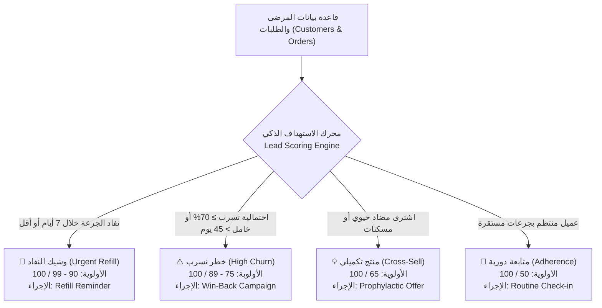
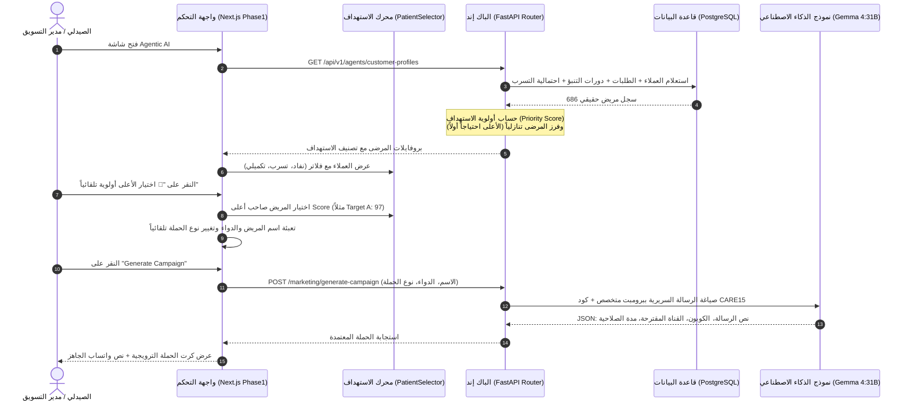

# 📢 وكيل التسويق الدوائي والاستهداف الذكي (Marketing Agent)
## التوثيق الهندسي والمعماري الشامل — مشروع تخرج AI-COS Pharmacy

---

## 📌 1. هوية الوكيل وبطاقة التعريف (Agent Identity & Metadata)

| البند | التوصيف الفني |
| :--- | :--- |
| **اسم الوكيل** | **Clinical Marketing & Smart Patient Targeting Agent** (وكيل التسويق الدوائي والاستهداف الذكي) |
| **المرحلة في النظام** | **Phase 1: Database Integration** (مربوط بقاعدة البيانات الحية 100%) |
| **الدور الوظيفي الموجه للـ LLM** | صيدلي استشاري ومسؤول الالتزام الدوائي والتواصل السريري (*Clinical Patient Engagement & Retention Specialist*) |
| **محرك الاستهداف الذكي** | **AI Lead Scoring Engine:** تحليل آلي لسجلات الشراء + دورات نفاد الأدوية المزمنة + نموذج تنبؤ التسرب (XGBoost Churn Model) |
| **النماذج الذكية المدعومة** | **Multi-Tier Execution:** 1. Gemma 4:31B Cloud (Tier 1 - الأساسي) 2. Local Edge Ollama (Tier 2 - محلي للمرونة والخصوصية) 3. Gemini Flash (Tier 3 - احتياطي) |
| **المسار البرمجي في الـ Backend** | `backend/app/domains/agents/marketing.py` `backend/app/domains/agents/router.py` (`/api/v1/agents/customer-profiles` & `/generate-campaign`) |
| **المكون البرمجي في الـ Frontend** | `frontend/src/app/admin/agentic-ai/components/Phase1.tsx` (`Marketing Agent Card`) `frontend/src/app/admin/agentic-ai/components/Shared.tsx` (`PatientSelector`) |
| **المرجعية المعيارية** | معايير الالتزام العلاجي والـ CRM الطبي بالمؤسسات الصحية (*WHO Medication Adherence Guidelines, Salesforce Health Cloud*) |

---

## 🎯 2. لماذا تم بناء هذا الوكيل؟ (The "WHY" — المشكلة وجذورها)

### المعضلة في الصيدليات والتسويق التقليدي:
في الصيدليات والتجارة الإلكترونية العادية، يُعامل التسويق بطريقة **"الرسائل الجماعية المزعجة" (Spamming & Bulk SMS)**؛ حيث تُرسل رسائل عشوائية لآلاف العملاء بنفس العرض والخصم دون مراعاة لحالتهم الصحية. هذه الطريقة تسبب:
1. **انزعاج المرضى وفقدان الثقة الطبية:** عندما يتلقى مريض سكر أو ضغط رسائل عشوائية عن مستحضرات تجميل لا تهمه، تنخفض مصداقية الصيدلية.
2. **انقطاع الالتزام الدوائي (Medication Non-Adherence):** حسب تقارير منظمة الصحة العالمية (WHO)، أكثر من 50% من مرضى الأمراض المزمنة ينقطعون عن تناول أدويتهم بانتظام بسبب نسيان موعد تجديد العبوة قبل نفادها، مما يسبب مضاعفات خطيرة.
3. **تسرب العملاء الصامت (Silent Customer Churn):** يغادر المريض الصيدلية ويشتري من المنافس دون أن تدري الإدارة إلا بعد فوات الأوان.

### دور وكيل AI-COS الذكي:
لا يُرسل هذا الوكيل عروضاً عشوائية، بل يعمل وفق مبدأ **"التسويق السريري القائم على القيمة" (Value-Driven Clinical Outreach)**:
- يراقب دورات صرف الأدوية ومواعيد نفاد الجرعات ويتدخل استباقياً لتذكير المريض قبل نفاد علاجه بـ 3-5 أيام.
- يكتشف العملاء المعرضين للتسرب بناءً على نموذج الذكاء الاصطناعي (XGBoost Churn Prediction)، ويُخصص لهم حوافز ترحيبية فورية لاستعادتهم.
- يقترح منتجات تكميلية ووقائية ملائمة علاجياً للمريض (مثل اقتراح البروبيوتيك أو الفيتامينات عند صرف المضادات الحيوية).

---

## 🧠 3. محرك الاستهداف الذكي: كيف يُحدد النظام من يحتاج حملة؟ (Lead Qualification Engine)

سؤال جوهري: **"كيف يعرف النظام من هم العملاء الذين يحتاجون لحملة ترويجية دون أن يضطر الصيدلي للبحث العشوائي بين مئات المرضى؟"**

يقوم محرك الاستهداف في الباك إند (`get_agent_customer_profiles`) بمسح قاعدة البيانات (686+ مريضاً) وتطبيق **خوارزمية تقييم أولوية الاستهداف (Priority Scoring Algorithm)** عبر أربع ركائز:

### 📊 المخطط البصري المعتمد لمحرك الاستهداف وتصنيف أولويات المرضى (Lead Scoring Architecture):

> **شرح المخطط التوضيحي أعلاه:** يُبين المخطط مسار تدفق البيانات من قاعدة بيانات الصيدلية الحقيقية (628 مريضاً حقيقياً بعد استبعاد الحسابات الصفرية) عبر عقل محرك الاستهداف (Lead Scoring Engine)، والذي يُفرع المرضى إلى 4 مسارات محددة بدقة رياضية وسريرية، مع تعيين درجة أولوية وإجراء تلقائي ملائم لكل حالة.

### معايير التصنيف الدقيقة:

| الفئة السريرية والتسويقية | المؤشرات والشروط البرمجية في DB | الإجراء الموصى به | درجة الأولوية | نص التعليل الذكي الظاهر للصيدلي |
| :--- | :--- | :--- | :--- | :--- |
| **🔴 تجديد الجرعة (Refill Urgency)** | `predicted_days <= 7` في جدول `pending_reminders` | `refill_reminder` | **90 – 99** | `"موعد تجديد الجرعة لـ {الدواء} خلال {X} أيام (تذكير استباقي لضمان الالتزام)"` |
| **⚠️ استعادة مريض (Win-Back / Churn)** | `churn_probability >= 0.70` أو غياب لأكثر من 45 يوماً | `win_back` | **75 – 89** | `"استعادة مريض غائب (احتمالية تسرب {X}%) - يستلزم حافز تنشيط"` |
| **💡 عروض مقترحة (Smart Recommendations)** | شراء مضاد حيوي (Augmentin) أو مسكنات أو مكملات | `cross_sell` | **65** | `"اشترى مؤخراً {الدواء} - مؤهل لعروض مقترحة لتعزيز الرعاية الوقائية"` |
| **🔹 متابعة دورية (Adherence & Loyalty)** | عميل نشط بجرعات دورية مستقرة | `refill_reminder` | **50** | `"متابعة دورية منتظمة لضمان الالتزام الدوائي بـ {الدواء}"` |

---

## 🏛️ 4. المعمارية الهندسية ومسار تنفيذ الحملة (Architecture & Sequence)

---

## 📝 5. أنواع الحملات ونماذج الرسائل السريرية المولدة

يدعم الوكيل 3 استراتيجيات تسويقية طبية متقدمة:

### 1) تذكير إعادة الصرف (Refill Reminder):
- **الهدف السريري:** الحفاظ على استمرارية الجرعات الدوائية للأمراض المزمنة ومنع الانتكاسات.
- **كود الخصم:** `CARE15` (خصم 15% تشجيعي على عبوة التجديد صالح لمدة 48 ساعة).
- **نموذج المخرجات:**
  > *"مرحباً بك أستاذ أحمد، نأمل أنك بأفضل صحة وعافية. نود تذكيرك بلطف بأن جرعتك من دواء Concor 5mg قاربت على النفاد خلال 3 أيام. حرصاً منا على استقرار ضغط الدم وتفادي انقطاع العلاج، خصصنا لك خصماً استثنائياً 15% بكود (CARE15) عند تجديد طلبك اليوم عبر الصيدلية."*

### 2) استعادة العميل المعرض للتسرب (Win-Back Campaign):
- **الهدف السريري والتجاري:** استعادة التواصل الدافئ مع المريض الذي غاب عن الصيدلية وحمايته من التوجه لصيدليات منافسة.
- **كود الخصم:** `CARE15` (حافز ترحيبي لإعادة تنشيط حسابه).
- **نموذج المخرجات:**
  > *"أهلاً بك مجدداً أستاذة دعاء، افتقدنا وجودك ونتمنى أنك بأتم صحة وعافية. حرصاً منا على استمرار انتظام خطتك العلاجية، أعددنا لك كود خصم ترحيبي خاص 15% (CARE15) صالح لطلبك القادم خلال 48 ساعة. فريقنا الصيدلي دائماً في خدمتك."*

### 3) العرض التكميلي الوقائي (Cross-Sell / Prophylaxis):
- **الهدف السريري:** اقتراح دواء مساعد أو مكمل غذائي ضروري سريرياً لحماية المريض من الآثار الجانبية للدواء الأساسي (مثال: بروبيوتيك بعد المضاد الحيوي لحماية فلورا الأمعاء، أو واقي معدة مع المسكنات).
- **نموذج المخرجات:**
  > *"مرحباً بك أستاذة ياسمين، نرجو لك الشفاء العاجل. بناءً على استخدامك لمضاد Augmentin 1g، نوصيك بتناول مكمل بروبيوتيك داعم لحماية الجهاز الهضمي وتعزيز كفاءة الاستشفاء. يسعدنا إهداؤك خصماً خاصاً 15% بكود (CARE15) عند إضافته لطلبك اليوم."*

---

## 🛠️ 6. دليل التشغيل والاستخدام العملي خطوة بخطوة (How to Run it)

1. **الوصول للوكيل:**
   - افتح لوحة التحكم الإدارية: `http://localhost:3000/admin/agentic-ai`.
   - ستجد الوكيل الثاني في صف **Phase 1: Marketing Agent**.

2. **الاستهداف بضغطة زر واحدة (1-Click Auto Targeting):**
   - في أعلى كرت الوكيل، انقر على زر **"⚡ اختيار الأعلى أولوية"**.
   - سيقوم النظام فوراً باختيار المريض الأكثر احتياجاً للحملة من بين 686 مريضاً في قاعدة البيانات، وتعبئة اسمه، ودوائه، وضبط "نوع الإجراء" المناسب لحالته تلقائياً.

3. **الفلترة والتصفح اليدوي الذكي:**
   - يمكنك الضغط على فلاتر التبويب السريعة:
     - `الكل (686)`: لعرض جميع المرضى في قاعدة البيانات.
     - `🔴 نفاد وشيك`: لعرض المرضى الذين أوشكت أدويتهم على النفاد.
     - `⚠️ خطر تسرب`: لعرض المرضى ذوي احتمالية التسرب المرتفعة بناءً على نموذج ML.
     - `💡 بيع تكميلي`: لعرض المرضى المؤهلين لمنتجات وقائية مكملة.
   - يمكنك استخدام **مربع البحث** للبحث الفوري بالاسم أو اسم الدواء.

4. **توليد الحملة:**
   - انقر على **"Generate Campaign"**.
   - يقوم نموذج **Gemma 4:31B** بتوليد نص الرسالة السريرية وكود الخصم وقناة التواصل الموصى بها (WhatsApp / SMS) في ثوانٍ معدودة، مع إمكانية نسخ الرسالة وإرسالها للمريض مباشرة.

---

## 🎓 7. أسئلة المناقشة أمام لجنة التحكيم (BIS Defense Q&A)

### س1: "لماذا لم تستخدموا التسويق التقليدي بإرسال رسائل جماعية للجميع؟"
> **الرد:** "التسويق الدوائي يختلف جذرياً عن التجارة التقليدية؛ إرسال رسائل عشوائية لمرضى بأدوية لا تخصهم يُعد انتهاكاً لأخلاقيات الرعاية الصحية ويسبب انعدام ثقة. اعتمدنا في AI-COS على **Clinical Lead Scoring**؛ حيث يُحلل النظام دورات العلاج المزمن ونموذج التسرب (XGBoost) ليوجه الرسالة الصحيحة، بالدواء المناسب، في التوقيت الحرج قبل نفاد الدواء، وهو ما يحقق أعلى معدل عائد على الاستثمار (ROI) ويحمي حياة المريض."

### س2: "كيف يضمن النظام عدم التلاعب بنسب الخصومات من قبل الذكاء الاصطناعي؟"
> **الرد:** "تطبيقاً لمبدأ **Deterministic Financial Governance**؛ نسبة الخصم وكود الكوبون (`CARE15`) محكومان برمجياً بقواعد عمل صارمة في الباك إند (Hard Business Rules)، والذكاء الاصطناعي مسؤول فقط عن الصياغة اللغوية والتواصل السريري الراقي، ولا يملك صلاحية تغيير نسبة الخصم أو تمديد الصلاحية عن 48 ساعة."

### س3: "ما الفارق بين المحاكاة (Sandbox) والبيانات الحقيقية في هذا الوكيل؟"
> **الرد:** "الوكيل مصمم بنمط هجين مزدوج: يمكن للصيدلي إدخال أي سيناريو تجريبي لاختبار ذكاء الوكيل (What-If Simulation)، أو اختيار مرضى حقيقيين مسجلين بالفعل في قاعدة بيانات الصيدلية، وحينها يسحب الوكيل سجلات المريض الحقيقية وتاريخه الدوائي ونسبة تسربه بدقة 100%."

### س4: "ما هي قيمة وسير عمل هذا الوكيل إذا كان دور المستخدم مجرد اختيار عميل من قائمة منسدلة؟" (سؤال جوهري)
> **الرد:** "السهولة الظاهرية في واجهة المستخدم هي نتيجة **للهندسة التحليلية العميقة (Analytical Heavy Lifting)** في الخلفية. بدون هذا الوكيل، كان سيتوجب على الصيدلي سحب تقارير معقدة لمئات المرضى وتخمين من يحتاج تدخلاً. الوكيل هنا لا يوفر مجرد قائمة، بل يوفر **محرك استهداف (Lead Scoring Engine)** يحلل 628 مريضاً في كسر من الثانية، ويفرزهم، ويرتبهم حسب الأولوية. وعند اختيار المريض، لا يكتب الصيدلي رسالة، بل يقوم نموذج الذكاء الاصطناعي (Gemma 4:31B) بصياغة رسالة سريرية مخصصة بالاسم والدواء والهدف العلاجي، ليقتصر دور الصيدلي على **حوكمة القرار (Human-in-the-loop Governance)** واعتماد الإرسال فقط، مما يضاعف الإنتاجية والمبيعات بأقل تدخل بشري."

---
*تم إعداد هذا التوثيق ليكون مرجعاً معمارياً رسمياً لوكيل التسويق والاستهداف في مشروع تخرج AI-COS Pharmacy (BIS).*
