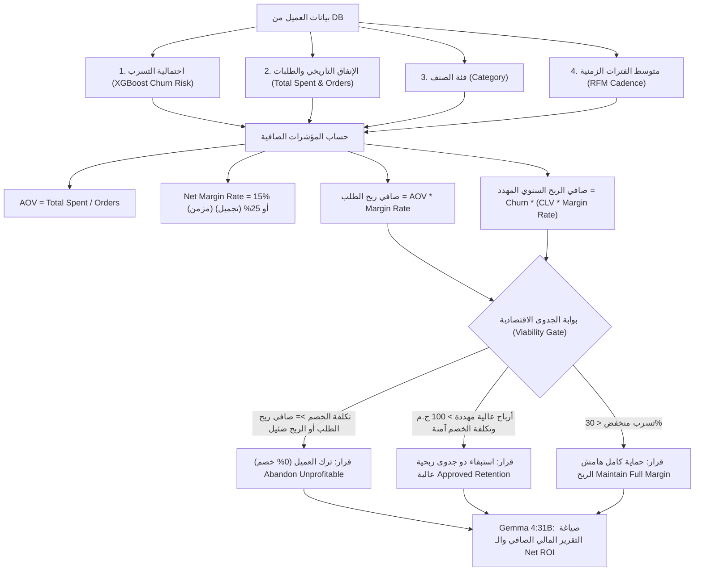
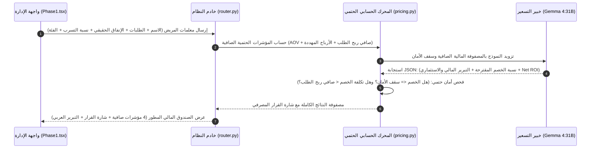

# 🏷️ وكيل التسعير الديناميكي وتعظيم الربحية (Pricing Agent)
## التوثيق الهندسي والمعماري الشامل — مشروع تخرج AI-COS Pharmacy (BIS)
### *النموذج المصرفي المتقدم لاقتصاديات الاستبقاء (Enterprise Retention Economics)*

---

## 📌 1. هوية الوكيل وبطاقة التعريف (Agent Identity & Metadata)

| البند | التوصيف الفني |
| :--- | :--- |
| **اسم الوكيل** | **Dynamic Pricing & Revenue Optimization Agent** (وكيل التسعير الديناميكي وتعظيم الربحية الصافية) |
| **المرحلة في النظام** | **Phase 1: Database Integration** (متصل بقاعدة البيانات وسجلات الإنفاق وهامش الربح الصافي الحية) |
| **الدور الوظيفي الموجه للـ LLM** | كبير مسؤولي المخاطر والتحليل المالي للاستبقاء (*Chief Financial & Risk Officer - Retention Economics*) |
| **المحرك الحسابي والتحليلي** | **Net Margin & Retention Feasibility Matrix:** حساب صافي ربح الطلب ($Net\ Margin$)، وتكلفة الاستبقاء ($Retention\ Cost$)، والخسارة في صافي الأرباح، مع تفعيل بوابة **"ترك العميل غير المربح" (Unprofitable Customer Abandonment)** |
| **النماذج الذكية المدعومة** | **Multi-Tier Execution:**<br>1. Gemma 4:31B Cloud (Tier 1 - التحليل المالي المصرفي الأعمق)<br>2. Local Edge Ollama (Tier 2 - محلي)<br>3. Gemini Flash (Tier 3 - احتياطي) |
| **المسار البرمجي في الـ Backend** | `backend/app/domains/agents/pricing.py`<br>`backend/app/domains/agents/router.py` (`/api/v1/agents/pricing/calculate-discount`) |
| **المكون البرمجي في الـ Frontend** | `frontend/src/app/admin/agentic-ai/components/Phase1.tsx` (`Pricing Agent Card`) |
| **المرجعية المعيارية** | معايير الـ Retention Economics بالمؤسسات المصرفية العالمية (*Harvard Business Review: Customer Profitability Analysis, Net CLV Margin Retention*) |

---

## 🎯 2. فلسفة القرار المالي: المبيعات ليست أرباحاً (The Core Economic Law)

### المغالطة التجارية الكبرى في التجارة الإلكترونية والصيدليات:
في الأنظمة البدائية، يقيس النظام قيمة العميل بحجم **المبيعات الإجمالية (Gross Revenue)**، فيعتقد أن عميلاً اشترى بـ 1,000 جنيه يستحق خصماً 150 جنيه.
**الحقيقة المحاسبية القاتلة:**
- في الصيدليات، الأدوية ذات هامش ربح إجمالي محدود (15% للأدوية المزمنة).
- طلب بقيمة 1,000 جنيه يحقق للصيدلية **150 جنيه صافي ربح فقط** (والـ 850 جنيه الباقية تكلفة شراء الدواء للمصنع/المورد).
- إذا منح النظام هذا العميل خصماً بقيمة 150 ج.م، فإن الصيدلية حققت **0 جنيه صافي ربح** وتحملت مخاطر الشحن والتشغيل!

### قانون الاستبقاء المصرفي في AI-COS (Corporate Retention Rule):
لا يُمنح أي خصم استبقاء إلا إذا استوفى شرطين إجباريين:
1. **الربحية الإيجابية للطلب الواحد:** 
   $$\text{Retention Cost (Discount EGP)} < \text{Order Net Profit}$$
   (تكلفة الخصم بالجنيه يجب أن تكون أقل قطعاً من صافي ربح الطلب الواحد، لضمان بقاء ربح كاش للصيدلية في كل معاملة).
2. **بوابة الجدوى الاقتصادية (Economic Viability Gate):**
   إذا كان العميل يحقق أرباحاً ضئيلة جداً، أو كانت تكلفة استبقائه بالخصم تلتهم كامل أرباحه، يُصدر النظام فوراً قرار:
   $$\text{Decision: Abandon Unprofitable Customer (ترك العميل / حجب الخصم 0\%)}$$
   *(لأن تركه يتسرب أوفر للصيدلية من الاحتفاظ بعميل يسبب استنزافاً تشغيلياً وهامش ربح صفري أو سالب).*

---

## 🧠 3. المنظومة الحسابية ومصفوفة القرار المصرفي (The Mathematical Matrix)

### 📊 المخطط الهندسي لتدفق القرار المالي واختبار الجدوى الاقتصادية:



### المعادلات الرياضية الدقيقة المطبقة في كود الـ Backend (`pricing.py`):

1. **متوسط قيمة الطلب (Average Order Value):**
   $$AOV = \frac{\text{Total Spent}}{\text{Orders}}$$

2. **هامش الربح الإجمالي للصنف (Gross Margin Rate):**
   $$\text{Margin Rate} = \begin{cases} 15\% & \text{الأدوية المزمنة (Chronic)} \\ 25\% & \text{مستحضرات التجميل والعناية (Cosmetics/OTC)} \\ 18\% & \text{الأدوية العامة} \end{cases}$$

3. **صافي ربح الصيدلية من الطلب الواحد (Order Net Profit):**
   $$\text{Order Net Profit} = AOV \times \text{Margin Rate}$$

4. **صافي الربح السنوي المتوقع (Annual Net Profit Contribution):**
   $$\text{Net Profit}_{\text{annual}} = \text{CLV} \times \text{Margin Rate}$$

5. **صافي الأرباح المهددة بالضياع عند التسرب (Expected Net Profit Loss):**
   $$\text{Expected Profit Loss} = \text{Churn Probability} \times \text{Net Profit}_{\text{annual}}$$

6. **تكلفة الاستبقاء الفعلية (Retention Cost):**
   $$\text{Retention Cost (EGP)} = AOV \times \left(\frac{\text{Discount \%}}{100}\right)$$

7. **صافي العائد المحقق (Net Financial Gain):**
   $$\text{Net Gain} = \text{Expected Profit Loss} - \text{Retention Cost}$$

8. **العائد الصافي على الاستثمار (Net Profit ROI):**
   $$\text{Net ROI \%} = \frac{\text{Net Gain}}{\text{Retention Cost}} \times 100$$

---

## 🎛️ 4. دليل خيارات واجهة المستخدم (Dropdown Options Manual)

في شاشة لوحة تحكم الوكيل (`Pricing Agent Card`)، يوجد حقل اختيار **"فئة الصنف وهامش الربح"**، ولهذه الخيارات مدلول مالي وقانوني بالغ الأهمية:

| الخيار في الواجهة | الأصناف التابعة له | هامش الربح الإجمالي (Margin) | سقف الخصم الأقصى (Safety Cap) | المبرر المحاسبي والاقتصادي |
| :--- | :--- | :--- | :--- | :--- |
| **1. أدوية مزمنة** | أدوية الضغط، السكر، القلب، الكبد، الأورام، والوصفات الطبية المقيدة | **15%** | **سقف 10%** | هذه الأدوية **مسعرة جبرياً** من وزارة الصحة. هامش الصيدلية القانوني ضئيل (~15%). يفرض النظام سقف 10% ليتبقى للصيدلية **5% صافي ربح كاش** على الأقل، ويمنع البيع بسعر التكلفة أو بالخسارة نهائياً. |
| **2. مستحضرات وتجميل** | العناية بالبشرة والشعر، مستحضرات التجميل، المكملات الغذائية، الفيتامينات المستوردة | **25%** | **سقف 20%** | منتجات حرة التسعير وهوامشها الربحية مرتفعة. يمنح النظام الذكاء الاصطناعي مرونة حتى 20% لاستعادة العميل لأن أرباح الصنف تسمح بامتصاص الخصم دون تصفير الأرباح. |
| **3. عام / OTC** | الأدوية التي تُصرف دون تذكرة طبية (Over The Counter) كالمسكنات (بنادول)، أدوية البرد، الفوارات، الشاش والمطهرات | **18%** | **سقف 12%** | سلع سريعة الدوران ذات هامش متوسط (~18%). سقف 12% يضمن التوازن بين تحفيز حركة المبيعات وحماية الربحية التشغيلية. |

---

## ⚡ 5. دورة المعالجة اللحظية عند الضغط على زر «Calculate Optimal Discount»

عند نقر المسؤول على الزر البنفسجي، تنطلق دورة معالجة هجينة من **4 مراحل** في زمن استجابة لا يتعدى ثانية واحدة:



1. **المرحلة الأولى (قراءة السجلات الحقيقية):** جلب بيانات المريض من جدول `customers` و `latest_orders` بدون تقريب أو افتراض.
2. **المرحلة الثانية (حساب المؤشرات الصافية الحتمية):** حساب $AOV$، وصافي ربح الطلب ($AOV \times \text{Margin}$)، وصافي الأرباح السنوية المهددة بالضياع.
3. **المرحلة الثالثة (استشارة الذكاء الاصطناعي):** تشغيل النموذج المالي لتقييم حساسية العميل السلوكية ومدى حاجته للخصم.
4. **المرحلة الرابعة (صمام الأمان الحتمي والعرض):** إخضاع اقتراح النموذج لشرط الأمان الصارم، ثم عرض شارة القرار المصرفي بالألوان وشبكة المؤشرات الرباعية في المتصفح.

---

## 📋 5. دليل قراءة صندوق النتائج المالي خانة بخانة (Result Box Field-by-Field Breakdown)

عند ظهور صندوق النتائج المالي بعد الضغط على الزر، تحتوي الشاشة على **7 عناصر ومؤشرات مالية دقيقة**، وإليك معنى كل خانة بالتفصيل مع مثال حي:

```
┌────────────────────────────────────────────────────────────────────────┐
│  صافي مكسب الطلب الواحد: 75.97 ج.م    │  تكلفة الخصم: 50.65 ج.م         │
├──────────────────────────────────────┼─────────────────────────────────┤
│  أرباح مهددة سنوياً: 603.71 ج.م      │  صافي العائد المحقق: +553.06 ج.م │
└────────────────────────────────────────────────────────────────────────┘
  القيمة البيعية المتوقعة (Gross CLV): 6,077.88 ج.م  │  ROI: +1,191%
```

| اسم الخانة في الواجهة | القيمة في المثال الحي | المعادلة المحاسبية | المعنى التجاري والمصرفي الدقيق |
| :--- | :--- | :--- | :--- |
| **1. صافي مكسب الطلب الواحد** | **75.97 ج.م** | $\text{AOV} \times \text{Margin Rate}$<br>($506.49 \times 15\%$) | **المكسب النقي للصيدلية** من هذا الطلب قبل أي خصم؛ ثمن بيع الدواء مطروحاً منه تكلفة شرائه من المورد/المصنع. |
| **2. تكلفة الخصم (Retention Cost)** | **50.65 ج.م** | $\text{AOV} \times \text{Discount \%}$<br>($506.49 \times 10\%$) | **المبلغ "الكاش"** الذي تتنازل عنه الصيدلية كخصم لتحفيز العميل على الشراء ومنعه من الذهاب للمنافس. *(لاحظ: 50.65 ج.م أقل من مكسب الطلب 75.97 ج.م، فيتبقى للصيدلية **25.32 ج.م ربح كاش فوري** في نفس اللحظة ولا تبيع بالخسارة).* |
| **3. أرباح مهددة بالتسرب سنوياً** | **603.71 ج.م** | $\text{Churn \%} \times \text{Annual Net Profit}$ | **مجموع الأرباح الصافية الحقيقية** التي ستخسرها الصيدلية على مدار عام كامل إذا تسرب هذا العميل وذهب لمكان آخر. |
| **4. صافي العائد المحقق (Net Gain)** | **+553.06 ج.م** | $\text{الربح المهدد} - \text{تكلفة الخصم}$<br>($603.71 - 50.65$) | **صافي الربح الفعلي المكتسب** من وراء قرار الخصم بعد استرداد تكلفته؛ أي أن التضحية بـ 50.65 ج.م أنقذت مكسباً صافياً قدره 553.06 ج.م! |
| **5. القيمة البيعية المتوقعة (Gross CLV)** | **6,077.88 ج.م** | $\text{AOV} \times \text{Annual Orders}$<br>($506.49 \times 12$) | **إجمالي حجم المشتريات (المبيعات)** المتوقع أن يشتري بها العميل سنوياً (قيمة المبيعات الإجمالية وليس الأرباح). |
| **6. العائد على الاستثمار (ROI %)** | **+1,191%** | $\frac{\text{Net Gain}}{\text{Retention Cost}} \times 100$ | **كفاءة الاستثمار؛** تعني أن كل جنيه خصم استثمرته الصيدلية في هذا العميل أعاد لها **قرابة 12 جنيهاً صافي أرباح**. |
| **7. التحليل المالي والاقتصادي للقرار** | نص سردي ذكي | تحليل بالـ LLM مدعوم بمحرك الأمان | **التقرير الاستثماري الذكي** الذي يصيغه النموذج لشرح المبررات المحاسبية بالأرقام للمدير التنفيذي أو للجنة التحكيم. |

---

## 🏛️ 6. محاكاة التجارب الواقعية ومقارنة القرارات (Live Case Studies)

### الحالة الأولى: استبقاء ذو جدوى استثمارية عالية (أميرة سليمان)
- **البيانات الحقيقية:** 25 طلب | إنفاق: 10,356.9 ج.م | فئة: مزمن (15% هامش) | تسرب: 92.7%.
- **الحساب المالي:**
  - $AOV = 414.28$ ج.م.
  - صافي ربح الطلب الواحد = $414.28 \times 15\% = \mathbf{62.14}$ **ج.م**.
  - صافي الربح السنوي المهدد بالضياع = $\mathbf{691.26}$ **ج.م**.
- **القرار المتخذ:** خصم **10%** (سقف الأمان).
- **تكلفة الخصم الكاش:** $414.28 \times 10\% = \mathbf{41.43}$ **ج.م**.
- **الأثر المالي:** تكلفة الخصم (41.43 ج.م) أقل من ربح الطلب (62.14 ج.م)، مما يترك للصيدلية ربحاً كاش 20.71 ج.م في نفس الطلب، وينقذ أرباحاً سنوية بـ 691.26 ج.م!
- **القرار المصرفي:** `approved_profitable_retention` (عائد صافي $+1,568.5\%$).

---

### الحالة الثانية: عميلة وفية بمخاطر تسرب منخفضة (شيماء محمد)
- **البيانات الحقيقية:** 28 طلب | إنفاق: 9,137.4 ج.م | فئة: مزمن (15% هامش) | تسرب: 35% (منخفض).
- **الحساب المالي:**
  - $AOV = 9,137.4 / 28 = \mathbf{326.33}$ **ج.م**.
  - صافي ربح الطلب الواحد = $326.33 \times 15\% = \mathbf{48.95}$ **ج.م**.
  - صافي الربح السنوي المهدد = $\mathbf{205.5}$ **ج.م**.
- **القرار المتخذ:** خصم **5%** فقط (أو 0%).
- **التبرير الصادر من النموذج:** *"شيماء عميلة وفية جداً ومنتظمة (28 طلب سابق) واحتمالية تسربها 35% فقط؛ منح أقصى خصم 10% يعتبر هدراً واستنزافاً غير مبرر للأرباح. خصم 5% رمزي (تكلفته 16.31 ج.م فقط) يكفي كحافز ولاء مع الحفاظ على أغلب أرباح الصيدلية."*
- **القرار المصرفي:** `approved_profitable_retention` (حافز ولاء مقنن).

---

### الحالة الثالثة: ترك العميل لتجنب الخسارة (عميل ذو هامش هزيل)
- **البيانات:** طلب واحد | إنفاق: 40 ج.م | فئة: مزمن (15% هامش) | تسرب: 85%.
- **الحساب المالي:**
  - صافي ربح الطلب = $40 \times 15\% = \mathbf{6.0}$ **ج.م فقط**.
  - لو منحناه خصم 10% (4 جنيه)، فإنه يلتهم 66% من أرباح الطلب الهزيلة، ويسجل مكسباً لا يغطي تكلفة التغليف والموظف!
- **القرار المتخذ:** **خصم 0%** (حجب الخصم تماماً).
- **التبرير الصادر:** *"تم رفض تقديم أي خصم لأن صافي ربح العميل المتوقع هزيل جداً، وأي خصم سيحول المعاملة إلى خسارة تشغيلية. القرار المصرفي هو ترك العميل (Abandon Unprofitable Customer) وتوجيه الميزانية للعملاء ذوي الربحية."*
- **القرار المصرفي:** `unprofitable_retention_abandon`.

---

## 🎓 7. أسئلة المناقشة المتوقعة أمام لجنة BIS (Defense Strategy)

### س1: "لماذا يقرر النظام أحياناً حجب الخصم وترك العميل يرحل بدلاً من التمسك به؟"
> **الإجابة النموذجية:** "دكتور، هذه إحدى أهم الركائز في نظم دعم القرار المصرفية (Customer Profitability Analysis). ليس كل عميل هو عميل مربح؛ بعض العملاء يُعرفون في الاقتصاد بـ (Negative Margin Customers). إذا كان العميل يشتري بـ 40 جنيه وهامش ربح الصيدلية 6 جنيهات، فمحاولة استبقائه بخصومات ستكلف الصيدلية أكثر مما تجنيه منه. الذكاء الاصطناعي لدينا يمتلك وعياً استثمارياً يفوق الأنظمة التقليدية: فهو يحمي رأس المال ويرفض الاستبقاء الخاسر."

### س2: "كيف يضمن النظام ألا تبيع الصيدلية أي طلب بخسارة في اللحظة نفسها؟"
> **الإجابة النموذجية:** "برمجنا قيداً حسابياً حتمياً (Deterministic Margin Guard) في ملف `pricing.py` ينص على أن تكلفة الخصم بالجنيه يجب أن تكون قطعاً أقل من صافي ربح الطلب (`retention_cost < order_net_profit`). حتى لو أراد الذكاء الاصطناعي المجاملة، يُلغي المحرك الحتمي قراره فوراً ويُخفض الخصم لضمان بقاء هامش ربح تشغيلي لا يقل عن 5% صافي في جيب الصيدلية."

---
*تم تحديث هذا التوثيق المعماري ليعكس النموذج المصرفي لاقتصاديات الاستبقاء في مشروع تخرج AI-COS Pharmacy (BIS).*
