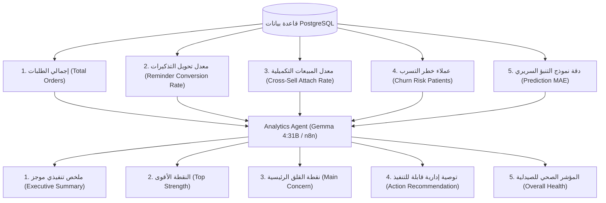

# 📊 وكيل التحليلات التنفيذية والذكاء الاستراتيجي (Analytics Agent)
## التوثيق الهندسي والمعماري الشامل — مشروع تخرج AI-COS Pharmacy (BIS)
### *نظام دعم القرار التنفيذي التوليدي (Executive Decision Support & Business Intelligence)*

---

## 📌 1. هوية الوكيل وبطاقة التعريف (Agent Identity & Metadata)

| البند | التوصيف الفني |
| :--- | :--- |
| **اسم الوكيل** | **Executive Analytics & Strategic Intelligence Agent** (وكيل التحليلات التنفيذية والذكاء الاستراتيجي) |
| **المرحلة في النظام** | **Phase 2: AI Intelligence** (التحليل الاستراتيجي وتوليد الرؤى الإدارية) |
| **الدور الوظيفي الموجه للـ LLM** | كبير مسؤولي التحليلات ومستشار اتخاذ القرار (*Chief Analytics Officer & Executive Business Strategist*) |
| **المحرك الحسابي والتحليلي** | **Live Multi-KPI Synthesis:** تجميع مباشر لمؤشرات التحويل، والمبيعات التكميلية، ومخاطر التسرب، ودقة التنبؤ من PostgreSQL وتحويلها إلى رؤى توجيهية (Prescriptive Analytics) |
| **النماذج الذكية المدعومة** | **Hybrid Architecture:**<br>1. سير عمل سحابي تلقائي عبر n8n (`aicos-analytics`)<br>2. نموذج Gemma 4:31B (المحرك التحليلي الأعمق)<br>3. نموذج Gemini Flash السريع الاحتياطي |
| **المسار البرمجي في الـ Backend** | `backend/app/domains/agents/analytics.py`<br>`backend/app/domains/agents/router.py` (`POST /api/v1/agents/analytics/summary`) |
| **المكون البرمجي في الـ Frontend** | `frontend/src/app/admin/agentic-ai/components/Phase2.tsx` (`Analytics Agent Card`) |
| **المرجعية المعيارية** | معايير نظم ذكاء الأعمال ودعم القرار التنفيذي (*Executive Support Systems - ESS, Gartner Analytics Maturity Model*) |

---

## 🎯 2. لماذا تم بناء هذا الوكيل؟ (The "WHY" — المشكلة وجذورها)

### المعضلة الإدارية في الصيدليات والمؤسسات التجارية:
صاحب الصيدلية أو المدير العام (Executive Manager) يواجه يومياً ما يُعرف بـ **"التخمة المعلوماتية" (Data Overload)**:
- هناك آلاف السجلات في قواعد البيانات (طلبات، أحداث نقر، سجلات تذكير، أصناف مخزون).
- المدير التنفيذي **لا يملك وقتاً لقراءة الجداول المعقدة أو استخراج الاستعلامات اليدوية**.
- لوحات التحكم التقليدية (Dashboards) تعرض رسوماً بيانية صامتة؛ لا تخبر المدير: *"ماذا حدث تحديداً؟ وما هو الخطر الأكبر؟ وما هو القرار الذي يجب أن أتخذه الآن؟"*.

### حل وكيل التحليلات الذكي في AI-COS:
لا يكتفي الوكيل بعرض الأرقام (Descriptive Analytics)، بل ينتقل إلى أعلى مستويات نضج البيانات: **التحليل التوجيهي (Prescriptive Analytics)**:
1. **يقرأ قاعدة البيانات آلياً:** يجمع مؤشرات الأداء الحقيقية في اللحظة نفسها.
2. **يستخلص الرؤى النوعية:** يحدد النقطة الأقوى في أداء الصيدلية والنقطة التي تستوجب القلق الفوري.
3. **يصدر أمراً إدارياً واحداً محدداً (Action Recommendation):** يربط الوكلاء ببعضهم (مثلاً: يوجه مدير التسويق لإطلاق حملة فورية للعملاء المعرضين للتسرب).

---

## 🧠 3. المؤشرات الخمسة التي يحللها الوكيل من قاعدة البيانات (The 5 KPIs)

يقوم الـ Endpoint في `router.py` بتنفيذ استعلامات مجمعة في PostgreSQL لحظياً:



### تفصيل المؤشرات المحاسبية والتشغيلية واقتصاديات الأعمال:
1. **إجمالي المبيعات والطلبات التراكمية (`revenue` & `total_orders`):**
   * إجمالي التدفقات النقدية التاريخية المنفذة عبر النظام (3.79M ج.م عبر 8,577 طلباً).
2. **متوسط قيمة سلة المشتريات (`AOV - Average Order Value`):**
   $$\text{AOV} = \frac{\text{Total Revenue}}{\text{Total Orders}} \approx 442.42 \text{ EGP}$$
   * مؤشر كفاءة تسويقية يقيس متوسط إنفاق العميل في كل زيارة/طلب.
3. **القيمة المالية المعرضة لمخاطر التسرب (`Monthly Revenue at Risk`):**
   $$\text{Revenue at Risk} = \text{Churn Patients} \times \text{AOV} = 479 \times 442.42 \approx 211,919 \text{ EGP / Month}$$
   * يحول تعداد المرضى المجرد (479 مريضاً) إلى لغة أموال مفهومة لمجلس الإدارة والمدير المالي.
4. **العائد المتوقع من الاستبقاء (`Projected Retention Recovery`):**
   * عند استهداف استعادة 15% من المرضى المهددين عبر حملات التسويق والتسعير، فإن التدفق النقدي المسترد = $+31,788 \text{ EGP}$ شهرياً.
5. **معدل تحويل التذكيرات السريرية (`reminder_conversion_rate`):**
   $$\text{Conversion} = \frac{\text{Checkouts Completed}}{\text{Reminder Views}} = 42.0\%$$
   * يقيس مدى التزام المرضى بتذكيرات تجديد الجرعة وتحويلها لمبيعات فعلية.
6. **معدل البيع التكميلي والرعاية الداعمة (`cross_sell_attach_rate`):**
   $$\text{Attach Rate} = \frac{\text{Orders with Multi-Distinct Drugs}}{\text{Total Orders}} = 18.2\%$$
   * يقيس كفاءة الصيدلية في تقديم رعاية شاملة عبر بيع الفيتامينات أو العلاجات الداعمة مع الدواء الرئيسي.
7. **العملاء المعرضون للتسرب (`churn_risk_customers`):**
   * عدد المرضى الذين تنبأ نموذج الـ ML (XGBoost) بأن احتمالية تسربهم تتجاوز $50\%$ (479 مريضاً من أصل 628 بنسبة 76.3%).
8. **دقة التنبؤ السريري بمواعيد الجرعات (`prediction_mae`):**
   * متوسط الخطأ المطلق بالأيام في التنبؤ بموعد نفاد علبة الدواء للمريض المزمن ($\pm 3.27$ يوماً).

---

## 🏛️ 4. تجربة حية وتقرير تنفيذي واقعي من النظام (Live Benchmark)

عند استدعاء الوكيل بالبيانات الحقيقية لقاعدة بيانات المشروع، أصدر التقرير التالي:

```json
{
  "executive_summary": "شهد هذا الأسبوع أداءً قوياً في تحويل تذكيرات الشراء إلى مبيعات فعلية بنسبة 42%، مع دقة عالية في التنبؤ بمواعيد الطلبات. ومع ذلك، هناك مؤشر خطر مرتفع جداً يتعلق بعدد العملاء المعرضين للانقطاع (479 عميلاً)، مما يتطلب تدخلاً فورياً للحفاظ على قاعدة العملاء.",
  "top_strength": "كفاءة عالية في تحويل التذكيرات إلى شراء فعلي (42%) ودقة تنبؤ ممتازة (MAE: 3.3 أيام).",
  "main_concern": "ارتفاع حاد في عدد العملاء في خطر الانقطاع (Churn) حيث يمثلون نسبة كبيرة مقارنة بإجمالي الطلبات.",
  "action_recommendation": "إطلاق حملة استعادة فورية (Win-back Campaign) تستهدف الـ 479 عميلاً المعرضين للانقطاع عبر تقديم خصومات مخصصة أو عروض ولاء.",
  "overall_health": "needs_attention",
  "llm_source": "Ollama (gemma4:31b-cloud)"
}
```

### الأثر الاستراتيجي والمحاسبي لهذا التقرير:
لاحظ كيف يربط وكيل التحليلات أجزاء النظام مالياً واستراتيجياً:
* يحول أرقام المرضى المجردة إلى "تدفقات نقدية مهددة" (Revenue at Risk) ليتحدث بلغة المدير المالي (CFO).
* يكتشف وجود **479 عميلاً معرّضاً للتسرب**.
* يوجه فوراً بتشغيل **Marketing Agent** لإنشاء حملة استعادة (*Win-Back Campaign*).
* يوجه مصفوفة **Pricing Agent** لتقديم خصومات استبقاء ذات جدوى ربحية لمنع هذا التسرب!

---

## 💻 5. الواجهة التنفيذية المتطورة (Enterprise Executive UI)

لتعظيم الاستفادة من مخرجات وكيل التحليلات، تم تصميم واجهة المستخدم (`Phase2.tsx`) وفقاً لأحدث معايير لوحات التحكم المؤسسية (C-Level Dashboards):

1. **التمثيل البصري الديناميكي (Dynamic Data Visualization):**
   * تم تحويل نسبة التسرب ومخاطر الانقطاع إلى **CSS/SVG Donut Chart** دائري متقدم يبرز حجم الخطر المالي بشكل تفاعلي، مما يسهل على متخذ القرار قراءة المؤشرات الحيوية في لمحة عين.
2. **الربط التشغيلي للوكلاء (Action Engine Orchestration - Marketing Handoff):**
   * يحتوي التقرير على زر إجراء مباشر (Call-to-Action) بعنوان: *"توجيه وكيل التسويق لاسترجاع المرضى المهددين"*. 
   * بمجرد النقر، يتم تمرير قائمة الـ 479 مريضاً تلقائياً إلى "وكيل التسويق" لبدء استهدافهم. هذا التطبيق العملي يحقق مبدأ (Multi-Agent Orchestration).
3. **جاهزية التقارير للإدارة (C-Level Export):**
   * دمج خاصية **تصدير التقرير كملف PDF** لضمان مشاركة الرؤى التحليلية والأثر المالي مع أعضاء مجلس الإدارة بضغطة زر.
4. **تخطيط الواجهة المؤسسي (T-Shape Dashboard Layout):**
   * يتصدر وكيل التحليلات واجهة الذكاء الاصطناعي (أخذ عرض الشاشة بالكامل في الأعلى Hero Section) ليعكس أهميته كملخص للمدير، بينما يعمل وكيلا الدعم الفني والمالية في المساحة التحتية كأدوات مساعدة.

---

## 🎓 6. أسئلة المناقشة المتوقعة أمام لجنة BIS (Defense Strategy)

### س1: "ما الفرق بين لوحة التحكم التقليدية (Dashboard) ووكيل التحليلات (Analytics Agent)؟"
> **الإجابة النموذجية:** "دكتور، لوحة التحكم التقليدية تقدم (Descriptive Analytics) — أي تعرض أرقاماً ورسوماً بيانية صامتة تتطلب من المدير جهداً لقراءتها وتفسيرها. أما وكيل التحليلات في مشروعنا، فيمثل (Prescriptive & Generative Analytics)؛ فهو يقرأ الأرقام ويحولها إلى لغة طبيعية، ويوضح نقاط القوة والضعف، ويقدم توصية عمل محددة وقابلة للتنفيذ الفوري، مما يوفر وقت الإدارة العليا ويمنع الأخطاء في تفسير البيانات."

### س2: "كيف يخدم هذا الوكيل مفهوم تكامل النظم (System Integration) بين الوكلاء التسعة؟"
> **الإجابة النموذجية:** "يعمل Analytics Agent كـ (Central Feedback Loop). فهو يراقب نتائج مخرجات النماذج الأخرى: يراقب معدل تحويل تذكيرات Marketing Agent، ويراقب دقة نموذج التنبؤ السريري، وعندما يرصد خللاً (مثل ارتفاع أعداد المتسربين)، يوصي بتفعيل وكيل التسعير ووكيل التسويق تلقائياً لمواجهة هذا التراجع، مما يحقق مفهوم المنظومة ذاتية الإدارة (Autonomous Enterprise)."

---
*تم إعداد هذا التوثيق المعماري ليكون المرجع الرسمي لوكيل التحليلات التنفيذية في مشروع تخرج AI-COS Pharmacy (BIS).*
