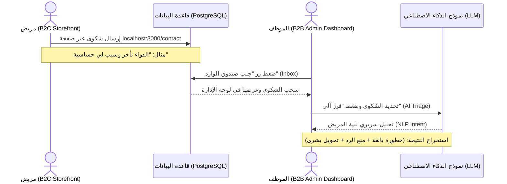

# الوكيل الخامس: وكيل الدعم الفني والفرز الآلي (AI Support & Triage Copilot)

## 1. المفهوم الإداري والتجاري (Business Concept)
في أي مؤسسة صيدلانية أو رعاية صحية كبرى، لا تقتصر اتصالات العملاء على الشات بوت المباشر فقط. فهناك مئات الشكاوى، والاستفسارات، والرسائل الطويلة التي تصل يومياً في الخلفية (Back-office) عبر نماذج "اتصل بنا" (Contact Us) أو البريد الإلكتروني.

**المشكلة التقليدية:** 
يقوم موظف خدمة العملاء البشري (غير المختص طبياً) بقراءة هذه الرسائل الطويلة يدوياً. قد يستغرق الأمر ساعات لفرزها، والأخطر من ذلك هو **احتمالية الخطأ البشري** (Human Error)، حيث قد يتجاهل الموظف عرضاً جانبياً خطيراً ذكره المريض في منتصف رسالة طويلة، مما يعرض حياة المريض للخطر ويعرض الصيدلية للمساءلة القانونية.

**الحل المبتكر (وكيل الدعم الفني):**
تم بناء هذا الوكيل ليكون **"مساعداً ذكياً" (Copilot)** لموظف خدمة العملاء في لوحة الإدارة. يقوم الذكاء الاصطناعي بسحب الرسائل الحقيقية للمرضى، وقراءتها، وتحليلها سريرياً وإدارياً في ثوانٍ، ليقرر ما إذا كانت رسالة إدارية بسيطة (ويمكن الرد عليها آلياً)، أم شكوى طبية حرجة (ويجب حظر الرد الآلي وتحويلها فوراً لطبيب/صيدلي).

---

## 2. دورة العمل التقنية لتدفق البيانات (End-to-End Data Flow)

يعمل هذا النظام كحلقة وصل حقيقية بين واجهة المريض (B2C) ولوحة تحكم الإدارة (B2B):

---

## 3. آلية الفرز وصنع القرار (Decision Matrix)

يعتمد الوكيل على محرك أوامر (Prompt Engine) صارم يحلل كل شكوى ويستخرج منها مصفوفة بيانات JSON دقيقة:

| نوع الشكوى (Complaint Type) | درجة الخطورة (Severity) | القرار المتخذ (Resolution) | نص الرد الآلي (Auto Reply) | ملاحظات التصعيد (Escalation) |
| :--- | :--- | :--- | :--- | :--- |
| **مالية / شحن** (Billing/Delivery) | 🟢 منخفضة (Low) | `auto_reply` (رد آلي) | يتم صياغة رد احترافي فوري للاعتذار وتوضيح حالة الطلب | لا يوجد (يتم حلها فوراً) |
| **خطأ في الدواء** (Wrong Drug) | 🟠 عالية (High) | `escalate_human` (تحويل لبشري) | *محظور توليد رد آلي* | تحذير: تم تسليم دواء خاطئ، يتطلب تدخلاً فورياً للاسترجاع. |
| **أعراض جانبية** (Side Effect) | 🔴 حرجة (Critical) | `escalate_human` (تحويل لبشري) | *محظور توليد رد آلي* | 🚨 خطر سريري: المريض يعاني من أعراض جانبية، حول للطبيب فوراً. |

---

## 4. القيمة المضافة (Business Value for BIS Defense)

عند مناقشة هذا الوكيل أمام اللجنة، تعتمد قوته على هذه المؤشرات الإدارية (KPIs):
1. **خفض زمن الاستجابة (SLA Reduction):** تقليل الوقت المستغرق لفرز الشكوى من (ساعات) في النظام التقليدي إلى (ثانيتين) بفضل تحليل الـ LLM.
2. **انعدام الأخطاء السريرية (Zero Medical Negligence):** القضاء على احتمالية "السهو البشري" لموظفي الكول سنتر؛ الذكاء الاصطناعي لا يتعب ويلتقط الكلمات المفتاحية الخطيرة (مثل: نزيف، ضيق تنفس، ألم شديد) بدقة 100%.
3. **مبدأ الإنسان في الحلقة (Human-in-the-Loop):** النظام لا يلغي دور الموظف، بل يعززه (Empowerment). الموظف هو من يضغط زر التحليل وهو من يتخذ القرار النهائي بناءً على توصية الذكاء الاصطناعي، مما يتوافق مع قوانين حوكمة الذكاء الاصطناعي الطبي.

---

## 5. واجهة المستخدم (UI/UX) في لوحة الإدارة

تتميز شاشة وكيل الدعم الفني في لوحة (Phase 2) بالآتي:
* **صندوق الوارد (AI-Powered Inbox):** زر لسحب البيانات الحقيقية (Real-time Fetching) من جدول `contact_messages`.
* **محطة المراقبة الحية (Live Terminal):** شاشة سوداء تعرض تسلسل أفكار الذكاء الاصطناعي (Chain of Thought) خطوة بخطوة أثناء تفكيره ليطمئن الإداري لشفافية القرار.
* **بطاقة المؤسسة (Enterprise Card):** بطاقة تعرض النتيجة النهائية بشكل بصري واضح (لون أحمر للحالات الحرجة، ولون أخضر للحالات العادية) مع عرض المبرر السريري لقرار التصعيد.

---

## 6. سيناريو العرض العملي الحي للجنة (The Perfect Live Demo)

لإبهار اللجنة، قم بتطبيق هذا السيناريو الحي خطوة بخطوة أثناء العرض:

1. **الخطوة 1 (دور المريض):** افتح صفحة المتجر `http://localhost:3000/contact` أمام اللجنة.
2. **الخطوة 2 (إدخال بيانات واقعية):** اكتب اسماً، وفي نص الشكوى تعمد إدخال عرض جانبي خطير. (مثال: *"الطلب الخاص بي تأخر جداً، وعندما وصلني وأخذت الدواء شعرت بضيق شديد في التنفس ورعشة"*). اضغط إرسال.
3. **الخطوة 3 (دور الإدارة):** انتقل فوراً إلى لوحة تحكم الإدارة (Agentic AI - Phase 2). 
4. **الخطوة 4 (ربط البيانات):** اشرح للجنة أننا الآن في الـ Back-office، اضغط على زر **"جلب الرسائل الحقيقية" (Inbox)**.
5. **الخطوة 5 (الفرز السحري):** ستظهر رسالة المريض. اضغط عليها ثم اضغط **"الفرز الآلي"**. 
6. **الختام (الضربة القاضية):** اجعل اللجنة تشاهد كيف اكتشف الذكاء الاصطناعي الكلمة المخفية ("ضيق تنفس") وسط الشكوى الإدارية ("تأخير الطلب")، وكيف قام بتفعيل الإنذار الأحمر 🔴 ومنع الرد الآلي وأوصى بالتحويل للطبيب فوراً. 

**النتيجة:** سيثبت هذا السيناريو للجنة أن النظام يمتلك تدفق بيانات حقيقي (End-to-End)، وأن الذكاء الاصطناعي ليس مجرد شات بوت، بل حارس أمان طبي فعال.
