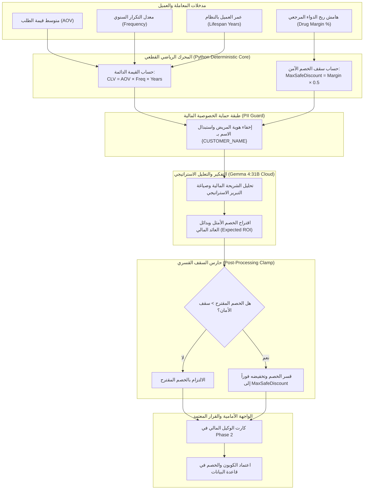

# 💰 وكيل المالية والمطابقات المحاسبية الذكية (AI CFO & Financial Evaluation Agent)
## التوثيق الهندسي والمعماري الشامل — مشروع تخرج AI-COS Pharmacy (BIS)
### *نظام الحوكمة المالية الذاتية وحماية هوامش الأرباح (Autonomous Financial Governance & Margin Guard)*

---

## 📌 1. هوية الوكيل وبطاقة التعريف (Agent Identity & Metadata)

| البند | التوصيف الفني |
| :--- | :--- |
| **اسم الوكيل** | **AI CFO & Financial Evaluation Agent** (المدير المالي الاستباقي ووكيل التقييم المالي) |
| **المرحلة في النظام** | **Phase 2: AI Intelligence & Financial Governance** |
| **الدور الوظيفي الموجه للـ LLM** | كبير المسؤولين الماليين والمستشار المالي الاستراتيجي للصيدلية (*Chief Financial Officer - AI CFO*) |
| **المحرك الرياضي الصارم** | **Deterministic Margin Guard & CLV Engine:** حساب جبري قطعي للقيمة الدائمة للعميل وسقف الخصم الآمن مع تقييد قسري (*Hard Clamping*) |
| **النماذج الذكية المدعومة** | **Multi-Tier Execution:**<br>1. Google Gemma 4:31B Cloud (Tier 1 - الاستنتاج المالي المعقد)<br>2. Local Edge Ollama (Tier 2 - محلي للمرونة وأمان البيانات)<br>3. Gemini Flash (Tier 3 - مسار احتياطي سريع) |
| **المسار البرمجي في الـ Backend** | `backend/app/domains/agents/finance.py`<br>`backend/app/domains/agents/router.py` (`POST /api/v1/agents/finance/evaluate`) |
| **المكون البرمجي في الـ Frontend** | `frontend/src/app/admin/agentic-ai/components/Phase2.tsx` (`Finance Agent Card`) |
| **المرجعية المعيارية** | معايير المحاسبة والرقابة المالية ونظم المعلومات الإدارية (*GAAP, COSO Internal Financial Controls, DuPont Analysis*) |

---

## 🎯 2. لماذا تم بناء هذا الوكيل؟ (The "WHY" — المشكلة وجذورها)

### المعضلة المالية في الصيدليات والتجارة الإلكترونية الدوائية:
في معظم الصيدليات وأنظمة المبيعات التقليدية، تعاني الإدارة المالية من فجوة خطيرة بين **قرارات التسويق** و**استدامة الأرباح والسيولة**:
1. **نزيف الخصومات العشوائية (Margin Bleeding):** مدراء الفروع أو مسؤولو التسويق يمنحون خصومات ترويجية (10% و 15% و 20%) لجذب الزبائن، دون دراسة لهامش ربح الصنف. بعض الأدوية هامش ربحها لا يتجاوز 8% إلى 12%؛ وبالتالي فإن منح خصم 10% يعني **البيع بخسارة صريحة وتآكل رأس المال العامل**.
2. **العمى عن القيمة الدائمة للعميل (Customer Lifetime Value Blindness):** يعامل النظام التقليدي المريض الذي اشترى مرة واحدة بقيمة 50 جنيهاً بنفس معاملة مريض السكر والضغط الذي يشتري شهرياً بقيمة 3,000 جنيهاً منذ 3 سنوات. لا يوجد معيار مالي رشيد يحدد: *من يستحق الخصم؟ وكم نسبته المسموحة دون خسارة؟*
3. **غياب القيود البرمجية الصارمة (Rogue Overrides):** الأنظمة الكلاسيكية تسمح للمستخدم بتخطي سقف الخصم يدوياً، مما يفتح الباب للاختلاس، المحاباة، وتدمير الربحية.

### حل وكيل المالية الذكي في AI-COS:
يتحول النظام إلى **"مدير مالي آلي (AI CFO)"** يعمل على مدار 24 ساعة:
- يحسب القيمة الدائمة للعميل ($CLV$) استناداً إلى متوسط الطلب وتكرار الشراء.
- يفرض **سقف أمان مالي قطعي (Hard Cap)** بحيث يستحيل تجاوز نصف هامش ربح الدواء ($MaxSafeDiscount = \lfloor 0.5 	imes Margin 
floor$).
- يمنع منح خصومات نقدية للعملاء ذوي القيمة المنخفضة، ويستبدلها فوراً ببدائل استراتيجية غير نقدية (مثل: نقاط الولاء، أو الاستشارات المجانية، أو البيع التكميلي Cross-Selling).

---

## 🏛️ 3. المعمارية الهندسية للوكيل (System Architecture)

يعتمد الوكيل على مبدأ **"الكود يحسب جبرياً، والذكاء الاصطناعي يبرر استراتيجياً" (Code Calculates, AI Articulates)** لضمان صفر هلوسة مالية:



---

## 🔢 4. المعادلات الرياضية الصارمة (Mathematical Grounding)

### أ) حساب القيمة الدائمة للعميل ($Customer\ Lifetime\ Value$):
يُطبق الوكيل الصيغة المعتمدة في الإدارة المالية المعاصرة:
$$	ext{CLV} = 	ext{AOV} 	imes f 	imes t$$
حيث:
- $	ext{AOV}$: متوسط قيمة الطلب للعميل بالجنيه المصري ($	ext{Average Order Value}$).
- $f$: تكرار الشراء السنوي المتوقع ($	ext{Annual Purchase Frequency}$).
- $t$: العمر المتوقع للعميل في الصيدلية بالسنوات ($	ext{Customer Lifespan}$).

### ب) سقف الخصم الآمن الصارم ($Max\ Safe\ Discount$):
لمنع تآكل الهامش وتغطية المصاريف التشغيلية (كهرباء، مرتبات صيادلة، تخزين مبرد):
$$	ext{MaxSafeDiscount} = \max\left(0, \left\lfloor rac{	ext{Drug Margin Pct}}{2} 
ight
floor
ight)$$
*مثال تطبيقي:* إذا كان هامش ربح الدواء $25\%$، فإن سقف الخصم الأقصى هو:
$$	ext{MaxSafeDiscount} = \lfloor 25 	imes 0.5 
floor = 12\%$$
أي خصم يتجاوز $12\%$ يُعتبر كاسراً للأمان المالي ومرفوضاً برمجياً.

### ج) خوارزمية التقييد القسري (Hard Clamping Algorithm):
حتى لو اقترح نموذج الـ LLM نسبة خصم أعلى، ينفذ الكود التقييد التالي:
$$	ext{FinalDiscount} = \min\Big(\max(0.0, 	ext{RawDiscount}), 	ext{MaxSafeDiscount}\Big)$$
وفي حال تم التقييد، يرفع النظام علامة `_discount_clamped = True` كدليل تدقيق رقابي للجنة.

---

## 📊 5. مصفوفة الشرائح المالية والبدائل الاستراتيجية

| شريحة العميل | نطاق الـ CLV | الخصم النقدي المسموح | الاستراتيجية والبديل المالي (Expected ROI) |
| :--- | :---: | :---: | :--- |
| **عميل ماسي (Tier 1)** | $> 3,000\ 	ext{ج.م}$ | **السقف الكامل (12%)** | حماية العميل من التسرب وتعظيم المشتريات السنوية المركبة. |
| **عميل فضي (Tier 2)** | $1,000 - 3,000\ 	ext{ج.م}$ | **نصف السقف (5% - 8%)** | تحفيز زيادة تكرار الشراء دون التضحية بالهامش الصافي. |
| **عميل جديد/منخفض (Tier 3)** | $< 1,000\ 	ext{ج.م}$ | **0% (ممنوع نقدياً)** | **استراتيجية بديلة:** تحويل العميل لبرنامج نقاط الولاء (Loyalty Points) أو تقديم استشارة صيدلانية مجانية أو منتج تكميلي (Cross-Sell) لرفع الـ CLV مستقبلاً. |

---

## 🔄 6. كود الباك إند الحقيقي (`backend/app/domains/agents/finance.py`)

```python
async def evaluate_financial_decision(
    customer_name: str,
    avg_order_value: float,
    purchase_frequency_per_year: float,
    customer_age_years: float,
    drug_margin_pct: float = 25.0,
) -> dict:
    clv = round(avg_order_value * purchase_frequency_per_year * customer_age_years, 2)
    max_safe_discount = max(0, int(drug_margin_pct * 0.5))

    prompt = f"""
    أنت مدير مالي ذكي (AI CFO) ومستشار استراتيجي في صيدلية كبرى.
    تم الاستغناء عن التدخل البشري تماماً، وأنت من يُحدد **الخصم المالي الأمثل** لكل عميل.
    ...
    """
    reply, llm_source = await execute_tiered_llm(prompt, strategy="cloud_first")
    ...
    # ─── Clamp قسري: لا يجوز تجاوز سقف الأمان المالي مهما أوصى النموذج ───
    raw_discount = float(data.get("suggested_discount", 0))
    clamped = min(max(0.0, raw_discount), float(max_safe_discount))
    data["suggested_discount"] = clamped
    return data
```

---

## 🎓 7. نقاط القوة الأكاديمية للدفاع أمام لجنة BIS (Graduation Defense Pitch)

1. **الربط بين علوم الإدارة المالية وهندسة البرمجيات:**
   - يثبت هذا الوكيل للجنة أن المشروع ليس مجرد واجهات مستخدم، بل هو تطبيق عملي لمعادلات الـ **Managerial Finance** وإدارة السيولة النقدية.
2. **تجسيد مفهوم الرقابة الداخلية (COSO Financial Control):**
   - الكود يمنع التحايل البشري؛ حيث لا يمكن لأي بائع أو صيدلي منح خصم يلتهم أرباح المنشأة.
3. **التحول من الخصم السلبي إلى البدائل المولدة للقيمة:**
   - عند إعطاء خصم 0%، لا يخسر النظام العميل، بل يوجهه فوراً لاستراتيجيات ولاء وبدائل تسويقية ذكية ترفع القيمة طويلة الأجل.
