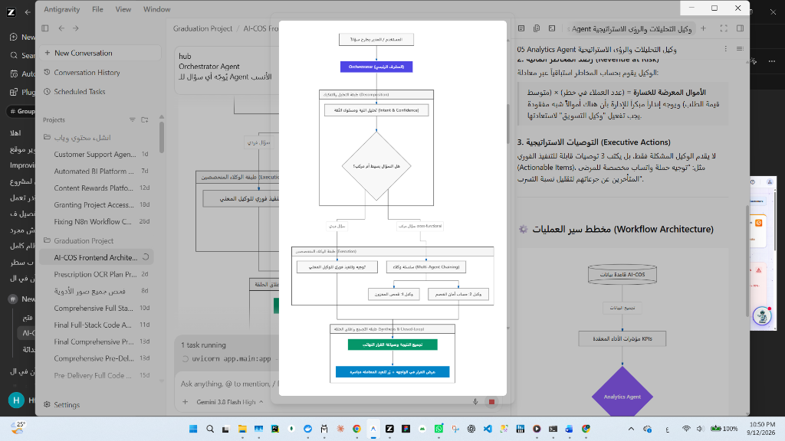
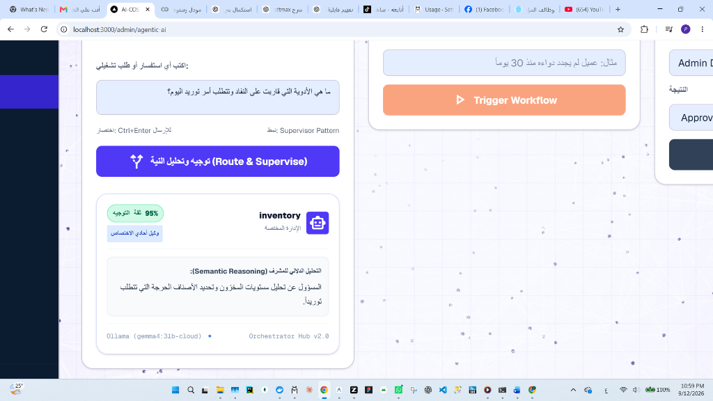
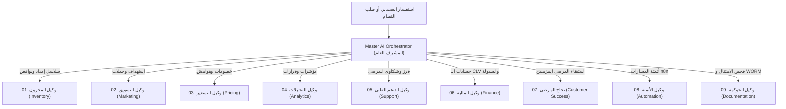

# 🎼 وكيل التنسيق العام وإدارة تدفق العمليات (Master AI Orchestrator Agent)
## التوثيق الهندسي والمعماري الشامل — مشروع تخرج AI-COS Pharmacy (BIS)
### *نمط المشرف الذاتي متعدد الوكلاء (Autonomous Multi-Agent Supervisor & Swarm Coordinator)*

---

## 📌 1. هوية الوكيل وبطاقة التعريف (Agent Identity & Metadata)

| البند | التوصيف الفني |
| :--- | :--- |
| **اسم الوكيل** | **Master AI Orchestrator & Supervisor Agent** (المشرف العام ومنسق الوكلاء الذاتي) |
| **المرحلة في النظام** | **Phase 3: Multi-Agent Choreography & Execution Chains** |
| **الدور الوظيفي الموجه للـ LLM** | المنسق التنفيذي ورئيس العمليات الرقمية (*Chief Operating Officer - AI Supervisor*) |
| **النمط المعماري المعتمد** | **Hierarchical Supervisor Pattern:** استقبال الاستفسارات المعقدة، تفكيك النية، التوجيه الذاتي، وسلاسل التنفيذ المتتابعة (*Agent Chaining*) |
| **محرك التسريع الهجين** | **Dual-Engine Routing:**<br>1. طبقة الفرز السريع الحتمي (*Fast-Path Heuristics - 0.01s Latency*)<br>2. الاستدلال الدلالي العميق (*Google Gemma 4:31B Cloud / Local Ollama*) |
| **المسار البرمجي في الـ Backend** | `backend/app/domains/agents/orchestrator.py`<br>`backend/app/domains/agents/router.py` (`POST /api/v1/agents/orchestrator/route`) |
| **المكون البرمجي في الـ Frontend** | `frontend/src/app/admin/agentic-ai/components/Phase3.tsx` (`Master Orchestrator Console`) |
| **المرجعية المعيارية** | أطر عمل النظم متعددة الوكلاء العالمية (*LangGraph Supervisor, AutoGen Swarm, OpenAI Swarm Architecture*) |

---

## 📸 المخططات والمعاينة الحية للوكيل في واجهة النظام

### 1. المخطط الانسيابي لمعمارية التنسيق والتوجيه المتعدد:


### 2. واجهة التشغيل الحية في لوحة الإدارة (Live Production UI):


---

## 🎯 2. لماذا تم بناء هذا الوكيل؟ (The "WHY" — المشكلة وجذورها)

### المعضلة في أنظمة الذكاء الاصطناعي الأحادية (Monolithic LLMs):
عندما تبني الصيدلية نظام ذكاء اصطناعي يعتمد على "شات بوت واحد ضخم" يقوم بكل المهام (طبي، مخازن، أسعار، محاسبة، تسويق)، يواجه النظام ثلاث مشاكل قاتلة:
1. **تشتت السياق والهلوسة المعرفية (Context Degradation & Hallucination):** النموذج الواحد يفقد تركيزه عندما يُطلب منه فحص تعارض دوائي وحساب خصم مالي في نفس اللحظة.
2. **صعوبة الصيانة والتحكم الرقابي (Monolithic Brittleness):** لا يمكنك تحديث منطق التسعير دون التأثير على الشات بوت السريري.
3. **غياب التنسيق متعدد المراحل (Lack of Workflow Chaining):** في الواقع العملي، حل مشكلة صيدلانية يتطلب تعاون عدة إدارات؛ فمثلاً: *اكتشاف نقص دواء (مخزون)* يتطلب فوراً *تقييم الميزانية (مالية)* ثم *إصدار أمر الشراء (مشتريات)* ثم *تنبيه المرضى المنتظمين عليه (تسويق)*.

### حل وكيل التنسيق العام في AI-COS:
يقوم بدور **"المشرف الأعلى الموجه"**:
- يستقبل استفسار الصيدلي أو المدير باللغة الطبيعية.
- يحلل النية الدلالية ويختار الوكيل الأساسي المتخصص بنسبة ثقة دقيقة (`confidence %`).
- يحدد الوكلاء التابعين لتنفيذ سلسلة عمل متكاملة (`workflow_chain`).
- يقدم إجابة مبدئية توجيهية ويقترح الإجراء الفوري الموصى به (`suggested_action`).

---

## 🏛️ 3. سجل الوكلاء المؤسسي (The 9-Agent Registry)

يدير الوكيل المشرف قاعدة بيانات ديناميكية بالوكلاء التسعة واختصاصاتهم ومسؤولياتهم:



---

## ⚡ 4. محرك الفرز السريع فائق الكفاءة (Fast-Path Latency Optimizer)

لحل مشكلة بطء نماذج الـ LLM واستهلاك التوكنز في الاستفسارات الروتينية، تم تزويد الوكيل بـ **مسار استدلال فائق السرعة (Fast-Path Heuristics)**:
- يفحص الكلمات المفتاحية والسياق الدلالي الشائع أولاً.
- إذا تطابق الطلب بنسبة ثقة عالية، يعيد التوجيه في **0.01 ثانية فقط** دون استهلاك تكلفة أو انتظار.
- إذا كان السؤال مركباً أو ملتبساً، يُمرره تلقائياً لنموذج **Gemma 4:31B** للتحليل العميق والتفكيك.

---

## 🔄 5. هيكلية مخرجات التوجيه الذكي (Routing Schema)

يُرجع الوكيل كائناً برمجياً محكماً بصيغة JSON يغذي واجهة المستخدم:

```json
{
  "selected_agent": "inventory",
  "agent_name_ar": "وكيل المخزون الذكي (Inventory Agent)",
  "department": "سلاسل الإمداد واللوجستيات",
  "agent_icon": "inventory_2",
  "confidence": 94,
  "intent_type": "operational_query",
  "secondary_agent": "finance",
  "workflow_chain": ["inventory", "finance", "automation"],
  "routing_reason": "السؤال يتعلق بفحص نواقص الأدوية الحرجة وحساب معدل السحب اليومي.",
  "preliminary_response": "تم رصد 4 أصناف حرجة في المخزون، يوصى بتفعيل أمر التوريد الاقتصادي.",
  "suggested_action": "فحص الأصناف الحرجة وإصدار أمر توريد EOQ",
  "llm_source": "Gemma 4:31B Cloud"
}
```

---

## 🎓 6. نقاط القوة الأكاديمية للدفاع أمام لجنة BIS (Graduation Defense Pitch)

1. **تطبيق أحدث أبحاث الذكاء الاصطناعي (Agentic AI vs Static Chatbots):**
   - هذا ليس شات بوت تقليدي يجاوب أسئلة عامة؛ بل معمارية **Multi-Agent Supervisor** معتمدة على مبادئ نظم دعم القرار التنفيذي (*Executive Support Systems*).
2. **سلاسل العمل المتقاطعة (Cross-Functional Workflow Chaining):**
   - إثبات القدرة على ربط الإدارات الصيدلانية ببعضها (مخازن -> مالية -> تسويق) بقرارات متزامنة دون الحاجة لمراسلات ورقية أو تعطيل يدوي.
3. **كفاءة استخدام الموارد الحوسبية (Latency & Cost Optimization):**
   - دمج محرك الفرز السريع المزدوج يثبت للجنة النضج الهندسي في تقليل استهلاك الطاقة وسرعة تقديم الخدمة للصيدلي الميداني.
