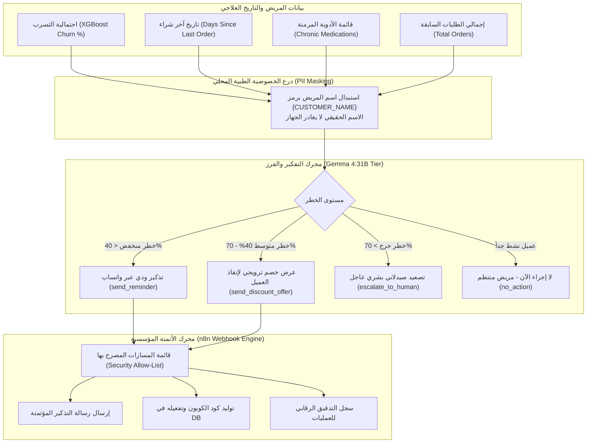

# 🤝 وكيل الأتمتة ونجاح واستبقاء المرضى (Customer Success & Automation Agent)
## التوثيق الهندسي والمعماري الشامل — مشروع تخرج AI-COS Pharmacy (BIS)
### *نظام استبقاء مرضى الحالات المزمنة وأتمتة العمليات الروبوتية (AI Retention & n8n RPA Engine)*

---

## 📌 1. هوية الوكيل وبطاقة التعريف (Agent Identity & Metadata)

| البند | التوصيف الفني |
| :--- | :--- |
| **اسم الوكيل** | **Customer Success & Autonomous RPA Agent** (وكيل نجاح المرضى والأتمتة التشغيلية) |
| **المرحلة في النظام** | **Phase 3: Autonomous Action & Patient Retention** |
| **الدور الوظيفي الموجه للـ LLM** | كبير مسؤولي تجربة ورعاية المرضى ومهندس أتمتة العمليات (*Chief Patient Success Officer & RPA Lead*) |
| **النماذج والتقنيات المدعومة** | **Hybrid AI/ML & Automation:**<br>1. نموذج تعلم الآلة التنبؤي للتسرب (XGBoost Churn Classifier)<br>2. نموذج التفكير والتوليد اللغوي (Google Gemma 4:31B Cloud)<br>3. محرك الأتمتة الروبوتية للعمليات المؤسسية (n8n Webhook Workflows) |
| **المسار البرمجي في الـ Backend** | `backend/app/domains/agents/customer_success.py`<br>`backend/app/domains/agents/automation.py`<br>`backend/app/domains/prediction/service.py` |
| **المكون البرمجي في الـ Frontend** | `frontend/src/app/admin/agentic-ai/components/Phase3.tsx` (`Customer Success & Automation Cards`) |
| **المرجعية المعيارية** | بروتوكولات منظمة الصحة العالمية لالتزام مرضى الأمراض المزمنة (*WHO Medication Adherence Guidelines*) وأطر أتمتة الأعمال (*Gartner RPA Framework*) |

---

## 🎯 2. لماذا تم بناء هذا الوكيل؟ (The "WHY" — المشكلة وجذورها)

### المعضلة في إدارة مرضى الحالات المزمنة (Chronic Patients):
في قطاع الصيدلة، تشكل أدوية الأمراض المزمنة (مثل السكر، الضغط، الغدة، والقلب) أكثر من **65% من إيرادات الصيدلية المنتظمة**. ومع ذلك، تقع معظم الصيدليات في فخين قاتلين:
1. **انقطاع المرضى عن العلاج (Medication Non-Adherence):** تشير دراسات الرعاية الصحية إلى أن أكثر من 50% من المرضى ينسون أو يتكاسلون عن إعادة صرف علاجهم في الموعد المحدد، مما يسبب مضاعفات صحية خطيرة ووفيات مفاجئة.
2. **فقدان وتسرب المرضى المنافسين (Patient Churn):** إذا لم تبادر الصيدلية بالتواصل الاستباقي قبل نفاد الجرعة، فإن المريض يشتري من أي صيدلية بديلة أو تطبيق منافس.
3. **الإرهاق البشري في المتابعة (Human Bottleneck):** من المستحيل على صيدلي الفرع الاتصال هاتفياً بـ 5,000 مريض شهرياً لتذكيرهم يدوياً.

### حل وكيل النجاح والأتمتة في AI-COS:
يقدم الوكيل منظومة استباقية مؤتمتة تجمع بين **الذكاء التنبؤي** و**الأتمتة الفورية**:
- يقرأ احتمالية التسرب ($Churn\ Probability$) المحسوبة بنموذج **XGBoost**.
- يفرز المرضى ويقرر الإجراء المناسب آلياً: (تذكير ودي، عرض خصم مستهدف، أو تصعيد عاجل للصيدلي).
- يطلق مسارات عمل تلقائية في **n8n** لإرسال رسائل WhatsApp، جدولة التنبيهات، وإصدار الكوبونات دون أي تدخل بشري.

---

## 🏛️ 3. المعمارية الهندسية للوكيل (System Architecture)



---

## 🛡️ 4. درع حماية الخصوصية الطبية (PII Masking Protocol)

وفقاً لقوانين سرية المرضى (HIPAA والمعايير المصرية لحماية البيانات الشخصية)، يمنع الكود إرسال اسم المريض صراحة للنموذج السحابي:
```python
# استبدال الاسم برمز مشفر قبل الخروج للسحابة
prompt = f"... اسم العميل: {PII_PLACEHOLDER} ..."
reply, llm_source = await execute_tiered_llm(prompt, strategy="cloud_first")

# استعادة الاسم الحقيقي محلياً داخل جهاز الصيدلية فقط
data = _restore_pii(data, customer_name)
```
بهذه التقنية، **لا تستطيع خوادم الذكاء الاصطناعي الخارجية معرفة هوية أي مريض نهائياً**.

---

## 🤖 5. محرك الأتمتة المؤسسية عبر مسارات n8n (RPA Dispatcher)

يرتبط الوكيل بخادم **n8n** عبر بروتوكول Webhook آمن ومقيد بقائمة سماح بيضاء (*Allow-List Guard*) لمنع أي حقن أو تنفيذ مسارات غير مصرح بها:

| اسم المسار (Workflow) | الدور الوظيفي | المشغل التلقائي |
| :--- | :--- | :--- |
| `send_reminder` | إرسال تذكير واتساب لإعادة صرف الجرعة الدورية | نفاد الدواء المتوقع خلال 3 أيام |
| `send_discount_offer` | إصدار كوبون خصم مالي وإرساله للعميل المعرض للانقطاع | احتمالية تسرب بين 40% و 70% |
| `weekly_summary` | إرسال تقرير إحصائي للمدير التنفيذي بحالات الاستبقاء | نهاية كل أسبوع عمل |
| `emergency-alert` | تنبيه الصيدلي المناوب فوراً بحالة مريض حرجة | احتمالية تسرب > 70% أو خطر سريري |

---

## 🎓 6. نقاط القوة الأكاديمية للدفاع أمام لجنة BIS (Graduation Defense Pitch)

1. **تحقيق مفهوم إدارة علاقات العملاء التحليلية والاستباقية (Analytical & Proactive CRM):**
   - الانتقال من الـ CRM التقليدي السلبي الذي ينتظر قدوم العميل، إلى نظام تنبؤي استباقي يقيس دورة استهلاك الدواء ويتواصل قبل نفاد الجرعة.
2. **دمج الذكاء الاصطناعي مع أتمتة العمليات الروبوتية (Agentic AI + RPA):**
   - الوكيل لا يكتفي بإعطاء نصائح أو نصوص، بل يتخذ قراراً ويطلقه للتنفيذ الفعلي عبر أدوات الأتمتة المؤسسية (n8n).
3. **تطبيق صارم لمعايير خصوصية البيانات الصحية (Healthcare Privacy Compliance):**
   - استخدام بروتوكول PII Masking يُبهر لجان التحكيم لأنه يحل المشكلة القانونية الأكبر في تطبيقات الذكاء الاصطناعي الطبية.
