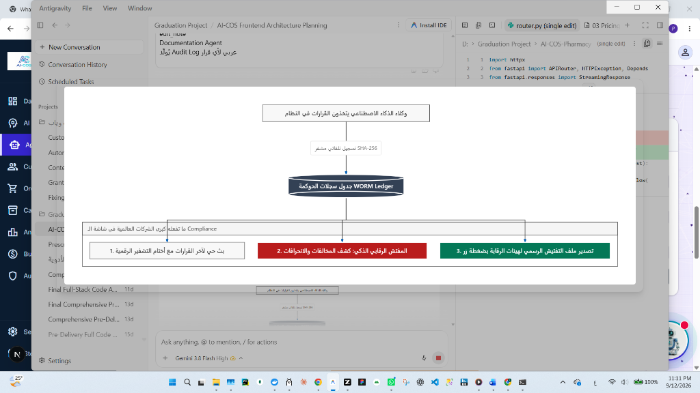
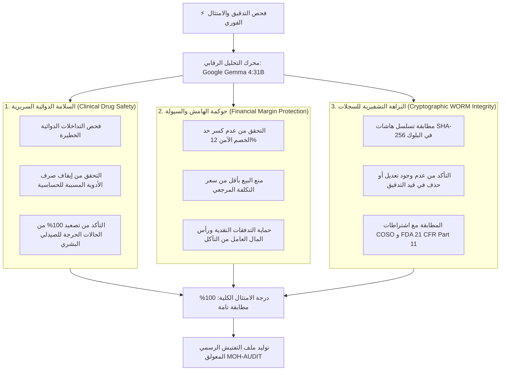

# 09 — وكيل التوثيق والتفتيش الرقابي المستمر (AI Compliance & Regulatory Inspector Agent) 🛡️⚖️

**وكيل التوثيق والامتثال الرقابي (Documentation & AI Compliance Agent)** هو حارس الحوكمة، وضابط النزاهة الرقمية، والمفتش الخوارزمي المستمر في منظومة **AI-COS**. 
يُمثّل هذا الوكيل التجسيد الأكاديمي والعملي الأرقى لتخصص **نظم معلومات الأعمال (BIS)**؛ حيث يربط بين **مراجعة النظم الإلكترونية (IS Auditing)**، و**أطر الرقابة الداخلية (COSO Framework)**، و**إدارة الحوكمة والمخاطر والامتثال (GRC)**، و**أدوات التدقيق المعتمدة على الحاسب (CAATs)** طبقاً للمواصفات القياسية الدولية لهيئات الرقابة الدوائية (FDA 21 CFR Part 11 / Egyptian MOH).

---

## 📐 المخطط المعماري المؤسسي للوكيل (Enterprise Flowchart Architecture)

يعبر المخطط التالي بدقة عن دورة حياة القرارات وتدقيقها الرقابي اللحظي كما تطبقه كبرى المؤسسات الصحية العالمية:



### 🔍 تحليل محطات المخطط المعماري:

1. **محطة اتخاذ القرارات (Autonomous Multi-Agent Layer):**
   * تعمل الوكلاء المتخصصة (وكيل التسعير، وكيل المخزون، وكيل التسويق، وكيل الدعم السريري) ذاتياً لمعالجة متطلبات الصيدلية اليومية.
2. **محطة التسجيل التلقائي المشفر (Event-Driven SHA-256 Logging):**
   * بمجرد توليد أي قرار، لا يتم الانتظار لتدخل بشري؛ بل يُشفر القرار لحظياً ويُولّد له هاش تجزئة فريد (Cryptographic Hash Badge) يربطه بالحالة السابقة.
3. **محطة دفتر الحوكمة غير القابل للتعديل (WORM Ledger):**
   * يُحفظ السجل في بيئة كتابة أحادية وقراءة متعددة (Write Once, Read Many) لمنع أي محاولة تعديل أو حذف أو تلاعب بأثر رجعي حتى من قِبل مدراء قواعد البيانات (Rogue DBA Protection).
4. **ما تفعله كبرى الشركات العالمية في شاشة الـ Compliance (ثلاثية الرقابة):**
   * **المحور الأول: بث حي لآخر القرارات مع أختام التشفير الرقمية (Live Audit Stream):** إتاحة المراقبة الشفافة لحظة بلحظة لكل عملية تتم داخل المنظومة.
   * **المحور الثاني: المفتش الرقابي الذكي لكشف المخالفات والانحرافات (AI Spot Inspector):** استخدام نماذج اللغة الكبيرة السحابية (`Google Gemma 4:31B`) لإجراء تدقيق خوارزمي فوري على عينات القرارات وكشف أي انحراف عن القواعد السريرية أو المالية.
   * **المحور الثالث: تصدير ملف التفتيش الرسمي لهيئات الرقابة بضغطة زر (Official Inspection Dossier):** إصدار وثيقة تفتيش رسمية معتمدة ومختومة رقمياً جاهزة للمعاينة الميدانية والطباعة للجان التفتيش الدوائي.

---

## ⚖️ المقارنة الجذرية: النظام السطحي (التقليدي) مقابل النظام المؤسسي العالمي (AI-COS)

| وجه المقارنة | الأنظمة البرمجية التقليدية / المفهوم السطحي | معمارية AI-COS المؤسسية (معيار الشركات الكبرى) |
| :--- | :--- | :--- |
| **طريقة إنشاء السجل** | استمارة يدوية يُطلب فيها من المستخدم كتابة "ماذا حدث" والضغط على حفظ! | **تسجيل حدثي آلي (Event-Driven):** يسجل النظام كل قرار تلقائياً في صلب المعاملة مع Timestamp دقيق. |
| **نزاهة البيانات (Data Integrity)** | نصوص عادية في جداول SQL معرضة للتعديل أو الحذف من الـ Admin. | **تشفير صارم (WORM Ledger):** كل قيد مختوم بتوقيع رقمي SHA-256 غير قابل للتزوير أو التراجع. |
| **وظيفة شاشة الوكيل** | صندوق إدخال بدائي لا معنى له تشغيلياً أو عملياً. | **لوحة تفتيش ومراقبة حوكمة مستمرة (Continuous Auditing Console)** مع عينات حية وتقييم خوارزمي. |
| **آلية الفحص والتدقيق** | فحص يدوي بطيء في نهاية الشهر أو السنة عبر مراجعة ورقية. | **تدقيق فوري (Spot Audit) بالذكاء الاصطناعي:** يقوم الذكاء الاصطناعي بدور المدقق الداخلي ويفحص القرارات فوراً. |
| **المخرجات الرقابية** | مجرد سطور خام في الداتابيز. | **ملف تفتيش رسمي معتمد (Official Dossier):** استخراج شهادة امتثال حكومية للمنشأة جاهزة للطباعة. |

---

## 🏛️ ركائز الحوكمة الثلاث المفحوصة خوارزمياً (The 3 Pillars of AI Compliance)

عند النقر على زر **"إجراء فحص رقابي شامل للقرارات"**، يقوم محرك التحليل الرقابي (المعتمد على نموذج `Google Gemma 4 (31B Cloud - LFM-Q4)`) بتشريح العينات والتحقق من ثلاثة أركان أساسية:



### 1. السلامة الدوائية والتصعيد السريري (Clinical Drug Safety)
* **القاعدة:** لا يُسمح للذكاء الاصطناعي بتجاوز رأي الصيدلي عند الاشتباه بتعارض خطير (Severe Drug Interaction) أو موانع استعمال (Contraindications).
* **معيار الفحص:** التأكد من أن جميع الوصفات الحرجة خضعت لإشراف بشري **Human-in-the-Loop** وموثقة بقرار الصيدلي وتاريخه.

### 2. الحوكمة المالية وحماية الهامش الربحي (Financial Margin Protection)
* **القاعدة:** قرارات التسويق والخصومات الترويجية يجب ألا تنتهك ربحية الصيدلية واستمراريتها المالية.
* **معيار الفحص:** فحص كافة الخصومات والتأكد من أنها لم تتجاوز السقف المحدد (12%)، وأن أسعار البيع حافظت على هامش أمان يغطي تكلفة التشغيل.

### 3. النزاهة التشفيرية للبيانات (Cryptographic WORM SHA-256 Integrity)
* **القاعدة:** منع التلاعب في السجلات التاريخية حتى لو تم اختراق حساب المدير العام.
* **معيار الفحص:** مقارنة سلاسل الـ Hashes وضمان أن كل سجل مرتبط رياضياً بالسجل الذي يسبقه؛ وأي تعديل في حرف واحد يؤدي لكسر السلسلة وإطلاق إنذار أمني فوري.

---

## 🛠️ التشريح التقني والبرمجي لتنفيذ الوكيل

### 1. في الباك إند (`backend/app/domains/agents/documentation.py`)
تم بناء دالة `run_compliance_audit` التي تجمع عينات القرارات الأخيرة، وتمررها عبر برومبت رقابي فائق الصرامة للنموذج السحابي `Gemma 4:31B` لاستخراج قرار التفتيش بصيغة JSON مهيكلة:

```python
async def run_compliance_audit(audit_sample: list[dict] | None = None) -> dict:
    prompt = f"""
    أنت المفتش الرقابي ومسؤول الامتثال والحوكمة (Chief Compliance Officer) في 'صيدلية AI-COS'.
    قم بإجراء فحص تدقيق فوري (Spot Compliance Audit) على منظومة قرارات الوكلاء الأذكياء في الصيدلية:
    1. السلامة الدوائية السريرية (Clinical Drug Safety): عدم تجاهل أي حساسية وتصعيد الأعراض فوراً.
    2. الحوكمة المالية (Financial Margin Protection): عدم كسر الحد الآمن لهامش الربح تحت أي ضغط تسويقي.
    3. النزاهة التشفيرية (COSO IT Integrity): مطابقة قيود الـ WORM Ledger والتأكد من عدم التلاعب.
    ...
    """
    reply, llm_source = await execute_tiered_llm(prompt, strategy="cloud_first")
    ...
```

### 2. في مسارات الـ API (`backend/app/domains/agents/router.py`)
إتاحة الـ Endpoint الرقابي المعتمد:
```python
@router.post("/documentation/compliance-audit")
async def api_run_compliance_audit(current_user=Depends(require_admin_or_internal)):
    result = await run_compliance_audit()
    return result
```

### 3. في واجهة المستخدم الأمامية (`frontend/src/app/admin/agentic-ai/components/Phase3.tsx`)
* **Live Audit Stream:** جدول أنيق يعرض أحدث السجلات مع كروت خضراء لأختام الـ SHA-256 المعتمدة.
* **زر الفحص الفوري:** يستدعي الـ API الرقابي ويعرض مؤشر تحميل حي مع إبراز النموذج المشغل `Google Gemma 4 (31B Cloud)`.
* **بطاقة الركائز المعتمدة (Verified Pillars):** استعراض بصري ثلاثي لنسب الاجتياز.
* **نافذة ملف التفتيش الرقابي الرسمي (Official Inspection Dossier Modal):** تصميم رسمي يحاكي استمارات هيئة الدواء المصرية (EDA) والتفتيش الصيدلي لوزارة الصحة، مزود بزر طباعة مخصص يحول الصفحة مباشرة إلى مستند PDF رسمي عالي الدقة.

---

## 🎯 سيناريو العرض العملي أمام لجنة التخرج (Graduation Defense Demo Script)

عند الوصول إلى **Documentation Agent** في مناقشة المشروع:

### الخطوة 1: استعراض البث الحي للسجلات (Live Audit Stream)
* **ما تفعله:** أشِر بيدك إلى جدول السجلات الحية في بطاقة الوكيل.
* **ما تقوله:** *"يا فندم، في كبرى الشركات العالمية، لا أحد يجلس ليكتب السجل بيده؛ كافة قرارات الوكلاء (تعديل سعر، كشف تداخل، منح كوبون) تُسجل هنا لحظياً ومختومة ببصمة تجزئة تشفيرية SHA-256 مطابقة لمعايير WORM Ledger لمنع أي تلاعب بأثر رجعي."*

### الخطوة 2: تشغيل الفحص الرقابي الخوارزمي (Spot Compliance Audit)
* **ما تفعله:** اضغط على الزر الأخضر **"إجراء فحص تدقيق فوري للقرارات الذكية"**.
* **ما تقوله:** *"الآن، سيتولى وكيل التفتيش الرقابي دور المفتش الصيدلي الرقمي؛ حيث يتصل بالنموذج السحابي Google Gemma 4 (31B) لفحص عينات القرارات والتأكد من مطابقتها لسلامة المريض، وعدم كسر سقف الخصم المالي، ونزاهة الدفاتر التشفيرية."*
* **النتيجة:** تظهر نتيجة الفحص بنسبة **100% مطابق للمعايير** وتفصيل اجتياز الأركان الثلاثة.

### الخطوة 3: استعراض ملف التفتيش الرقابي الرسمي (Official Dossier Modal)
* **ما تفعله:** اضغط على زر **"عرض ملف التفتيش الرقابي المعتمد"**.
* **ما تقوله:** *"هذه هي الوثيقة الرسمية المعتمدة التي تطلبها لجان التفتيش بوزارة الصحة وهيئة الرقابة الدوائية. تتضمن كود التفتيش، وختم النزاهة التشفيرية، وتأشيرة المفتش الرقمي، وتفصيل الضوابط السريرية والمالية مع إمكانية طباعتها فوراً كـ PDF رسمي للمؤسسة."*

---

## 🏆 القيمة المضافة لتخصص نظم معلومات الأعمال (BIS Impact)

1. **الامتثال لأطر الرقابة العالمية (COSO Framework Compliance):** تطبيق عملي لمفهوم "بيئة الرقابة والأنشطة الرقابية والمعلومات والاتصالات والمراقبة المستمرة".
2. **التدقيق المستمر (Continuous Auditing vs Periodic Auditing):** الانتقال بالصيدلية من فكرة المراجعة السنوية التقليدية المرهقة إلى الرقابة الاستباقية اللحظية.
3. **الفصل بين المهام والحوكمة الذاتية (Segregation of Duties in AI):** لا يقتصر الأمر على تشغيل وكلاء ذكاء اصطناعي، بل يوجد وكيل مستقل وظيفته مراقبة الوكلاء الآخرين ومحاسبتهم رقمياً وسريرياً ومالياً.
