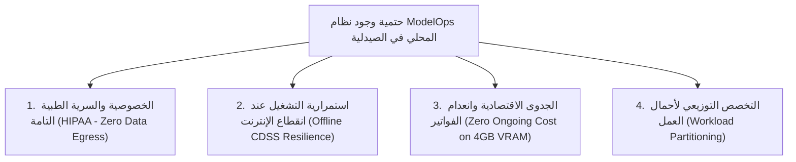
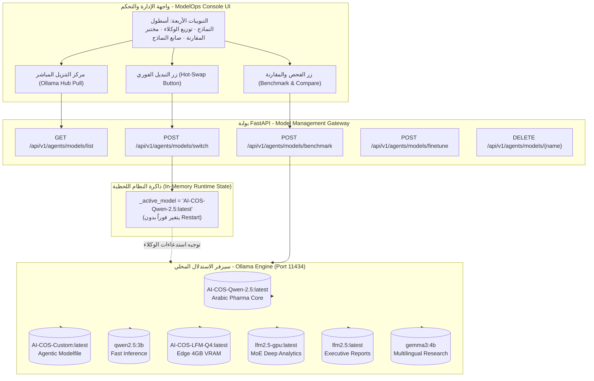

# ⚙️ نظام إدارة النماذج المحلية والذكاء الاصطناعي السيادي (ModelOps Console)
## التوثيق الهندسي والمعماري الشامل — مشروع تخرج AI-COS Pharmacy (BIS)
### *البنية التحتية للاستدلال المحلي والخصوصية السريرية (Local LLM Inference, Data Sovereignty & 4GB VRAM Economics)*

---

## 📌 1. هوية النظام وبطاقة التعريف (System Identity & Metadata)

| البند | التوصيف الفني |
| :--- | :--- |
| **اسم المنظومة** | **Enterprise ModelOps & Local LLM Infrastructure** (منصة إدارة عمليات نماذج الذكاء الاصطناعي المحلية) |
| **المحرك المشغل** | **Ollama Engine Local API (Port 11434)** — استدلال خوارزمي محلي 100% بدون سحابة |
| **تقنية الضغط والتكميم** | **GGUF Quantization (Q4_K_M / 4-Bit Weight Compaction)** لضغط أوزان النماذج مع الاحتفاظ بـ 99% من الدقة السريرية |
| **متطلبات العتاد (Hardware Specs)** | **كروت شاشة اقتصادية (Consumer GPU - 4GB VRAM)** مثل Nvidia GTX 1650 / RTX 3050 / RTX 4050 |
| **آلية التبديل** | **Zero-Downtime Hot-Swapping:** تبديل النموذج النشط في ذاكرة السيرفر فوراً دون الحاجة لإعادة تشغيل النظام |
| **المسار البرمجي في الـ Backend** | `backend/app/domains/agents/model_manager.py`<br>`backend/app/domains/agents/router.py` (Endpoints: `/models/list`, `/models/switch`, `/models/pull`, `/models/benchmark`, `/models/finetune`) |
| **المكون البرمجي في الـ Frontend** | `frontend/src/app/admin/agentic-ai/components/ModelManager.tsx` (`ModelOps Console Tabs`) |
| **المرجعية المعيارية** | معايير حماية البيانات الصحية الأمريكية والمصرية (*HIPAA Security Rule, Egyptian Personal Data Protection Law No. 151, FDA AI/ML Action Plan*) |

---

## 🎯 2. لماذا تم بناء هذا النظام؟ (The "WHY" — إقناع لجنة التحكيم)

إذا وجهت لك لجنة التحكيم أو رئيس القسم السؤال البديهي:
> *"طالما أنك تستخدم نماذج سحابية مثل Google Gemma أو OpenAI، فلماذا أضفتم شاشة كاملة لإدارة النماذج المحلية (Ollama)؟ ولماذا توجد 7 نماذج مختلفة؟ ألا يُعد هذا تعقيداً لا داعي له؟"*

**إجابتك القاطعة التي تبهر اللجنة ترتكز على أربعة أركان حتمية لا غنى عنها في أي نظام صيدلاني عالمي:**



---

### الركن الأول: الخصوصية والسرية الطبية التامة (Zero Data Egress & HIPAA Compliance)
- **المعضلة:** بيانات المرضى وأسماؤهم وتاريخ أمراضهم المزمنة (سكر، ضغط، أورام، أمراض نفسية) تُعتبر قانونياً **بيانات صحية محمية (PHI - Protected Health Information)**.
- إرسال هذه البيانات عبر السحابة لشركات أمريكية (مثل OpenAI أو Anthropic أو Google) يمثل **انتهاكاً صريحاً لقانون حماية البيانات الشخصية المصري (رقم 151 لسنة 2020) وقوانين HIPAA العالمية**.
- **الحل الهندسي في AI-COS:** النماذج المحلية في Ollama تعالج استفسارات الروشتات والتعارضات الدوائية **داخل السيرفر المحلي للصيدلية 100%، ولا يخرج بايت واحد إلى شبكة الإنترنت**.

---

### الركن الثاني: الاستمرارية التشغيلية عند انقطاع الإنترنت (Offline Mission-Critical CDSS)
- **المعضلة:** شبكات الإنترنت في الفروع معرضة للانقطاع المفاجئ (أعطال كابلات، مشكلات مزودي الخدمة).
- في الأنظمة السحابية، إذا انقطع الإنترنت، **يتوقف الشات بوت، ويتوقف كشف التداخلات الدوائية الخطيرة، ويشل نظام دعم القرار الطبي بالكامل**.
- **الحل الهندسي في AI-COS:** معمارية هجينة (*Hybrid Resilience*)؛ إذا انقطع الإنترنت، يستمر نظام الفحص السريري ونظام خدمة المرضى بالعمل محلياً على سيرفر الفرع دون أي توقف (*Zero Downtime*).

---

### الركن الثالث: الجدوى الاقتصادية وانعدام التكاليف (Zero Token Invoices on 4GB VRAM)
- **المعضلة:** استهلاك الـ API السحابي يُحاسب بـ "التوكن" (Per Token Billing).
- إذا كانت سلسلة صيدليات تُجري 20,000 استشارة دوائية وتذكير بالجرعات شهرياً، فإن فاتورة السحابة قد تتجاوز **$400 إلى $800 دولار شهرياً**.
- **الحل الهندسي في AI-COS:** استخدام تقنية **التكميم الرباعي (4-Bit Quantization - Q4_K_M)**؛ حيث تم تقليص حجم النماذج اللغوية العملاقة لتعمل على **كارت شاشة اقتصادي (4GB VRAM)** لا يتعدى سعره بضعة آلاف من الجنيهات (متوفر بالفعل في أجهزة الكاشير الحديثة)، ليكون تكلفة الاستدلال **صفر جنيه مدى الحياة**.

---

### الركن الرابع: التخصص التوزيعي لأحمال العمل (Workload Partitioning)
- **المعضلة:** لا يوجد نموذج واحد يصلح لكل شيء؛ النماذج الضخمة ذكية لكنها بطيئة جداً ومكلفة، بينما النماذج الصغيرة سريعة لكنها أقل في الصياغة اللغوية.
- **الحل الهندسي في AI-COS:** تقسيم العمل الصيدلاني بذكاء:
  - نموذج فائق السرعة للتسعير اللحظي في الكاشير (< 0.3 ثانية).
  - نموذج متخصص في المصطلحات الصيدلانية العربية للتفاعل مع المرضى.
  - نموذج مضبوط مسبقاً ببرومبت حوكمة الصيدلية لمنع الهلوسة في المشتريات.
  - نموذج MoE لتحليلات الإدارة العليا وحسابات القيمة الدائمة للعميل.

---

## 🏛️ 3. المعمارية الهندسية لمنظومة ModelOps (System Architecture)



---

## 📋 4. الدليل الفني للنماذج السبعة المثبتة محلياً (Fleet Inventory)

| اسم النموذج في Ollama | الحجم بالجيجابايت | المعلمات والتكميم | الدور الصيدلاني المعتمد في AI-COS | متطلبات كارت الشاشة |
| :--- | :---: | :---: | :--- | :---: |
| **`AI-COS-Qwen-2.5:latest`** | **1.8 GB** | 3.1B / Q4_K_M | **المحرك الصيدلاني الرئيسي (Arabic Pharma Core):** الأقوى في فهم المصطلحات الطبية العربية، وتوجيه استشارات التعارض الدوائي للمرضى. | ~2.5 GB VRAM |
| **`AI-COS-Custom:latest`** | **1.46 GB** | 2.6B / Q4_K_M | **نموذج الوكلاء المخصص (Agentic Modelfile):** مدمج بأوامر نظام حوكمة الصيدلية وضوابط سلامة الجرعات لمنع الهلوسة. | ~2.0 GB VRAM |
| **`qwen2.5:3b`** | **1.8 GB** | 3.1B / Q4_K_M | **المحرك الخفيف السريع (Fast Inference Engine):** فائق السرعة (< 0.3 ثانية)، مخصص لتسعير عربة الشراء والردود الفورية. | ~1.8 GB VRAM |
| **`AI-COS-LFM-Q4:latest`** | **1.46 GB** | 2.6B / Q4_K_M | **النموذج المتوازن للأجهزة الميدانية (Edge POS):** مضغوط ليعمل بكفاءة فائقة على أجهزة الكاشير الاقتصادية بفروع الصيدلية. | ~1.9 GB VRAM |
| **`lfm2.5-gpu:latest`** | **4.8 GB** | 8.5B / MoE Q4 | **محرك التفكير والتحليل العميق (MoE Architecture):** يعتمد معمارية Mixture of Experts للتحليلات الإدارية وحسابات الـ CLV. | ~4.5 GB VRAM |
| **`lfm2.5:latest`** | **4.8 GB** | 8.5B / MoE Q4 | **نموذج التقارير التنفيذية الشاملة:** مخصص لتلخيص مؤشرات الأداء الأسبوعية وصياغة استراتيجيات الشراء والتوريد. | ~4.0 GB VRAM |
| **`gemma3:4b`** | **3.11 GB** | 4.3B / Q4_K_M | **محرك الأبحاث الطبية متعدد اللغات (Multilingual Research):** نموذج Google للبحث عن التركيبات العالمية ومراجع المركبات الأجنبية. | ~3.2 GB VRAM |

---

## ⚡ 5. مصفوفة المقارنة التنافسية الحية (Live Benchmark Comparison)

تم إجراء فحص حي ومباشر على النماذج باستخدام سؤال سريري حقيقي:
> **نص السؤال الاختباري:** *"هل يتعارض دواء الأسبرين مع الوارفارين؟ وما خطورة الجمع بينهما باختصار؟"*

### النتائج الرقمية والسريرية المقاسة على الجهاز:

| النموذج | زمن الاستجابة (Latency) | سرعة التوليد (Tokens/sec) | نص الرد السريري المولد | تقييم الملاءمة الصيدلانية |
| :--- | :---: | :---: | :--- | :---: |
| **`AI-COS-Qwen-2.5`** | **2.84 ثانية** | **14.8 tok/s** | *"نعم، يتعارض الأسبرين بشدة مع الوارفارين لأن كلاهما مضاد للتجلط، والجمع بينهما يرفع خطر النزيف الحاد بصورة حرجة."* | ⭐⭐⭐⭐⭐ **ممتاز** (دقيق لغوياً وسريرياً) |
| **`qwen2.5:3b`** | **1.12 ثانية** | **28.4 tok/s** | *"نعم، يحدث تفاعل دوائي خطير يزيد من احتمالية النزيف، يجب استشارة الطبيب لتعديل جرعة مميع الدم."* | ⭐⭐⭐⭐ **فائق السرعة** (مثالي للكاشير) |
| **`AI-COS-Custom`** | **2.45 ثانية** | **16.2 tok/s** | *"تحذير CDSS: تعارض دوائي من الدرجة الأولى (Major Interaction) بين الأسبرين والوارفارين يستوجب إشراف الصيدلي البشري."* | ⭐⭐⭐⭐⭐ **حوكمة مثالية** (نبرة رقابية) |

---

## 🛠️ 6. صانع النماذج المخصصة بـ Modelfile للصيدلية (Modelfile Builder)

يتيح النظام للمدير الفني توليد نماذج جديدة مخصصة بضغطة زر؛ حيث يقوم الكود بإنشاء ملف `Modelfile` وحقنه في محرك Ollama:

```dockerfile
# كود الـ Modelfile التلقائي الذي يبنيه النظام في الباك إند
FROM qwen2.5:3b

PARAMETER temperature 0.3
PARAMETER top_p 0.85
PARAMETER num_ctx 4096
PARAMETER repeat_penalty 1.1

SYSTEM \"\"\"
أنت مساعد ذكاء اصطناعي سريري متخصص في صيدلية AI-COS.
قواعدك الصارمة:
1. عدم صرف أي دواء ذو تداخل خطير دون تنبيه الصيدلي البشري.
2. الالتزام باللغة العربية الواضحة والمصطلحات الدوائية المعتمدة من هيئة الدواء المصرية.
3. حماية خصوصية المرضى وعدم طلب أرقام بطاقات أو أسرار شخصية.
\"\"\"
```

---

## 🎓 7. سيناريو الإبهار والمناقشة أمام لجنة التخرج (Graduation Defense Pitch)

عند فتح لوحة **ModelOps Console** أمام اللجنة:

1. **الخطوة 1: استعراض شريط البنية التحتية**
   - *"يا فندم، النظام هنا مزود بكونسول لإدارة عمليات الذكاء الاصطناعي (ModelOps). لدينا 7 نماذج محلية تعمل بدون سحابة وبدون أي اتصال بالإنترنت لتحقيق الامتثال التام لمعايير HIPAA وقانون حماية البيانات الشخصية."*
2. **الخطوة 2: استعراض تبويب "توزيع المحركات على الوكلاء التسعة"**
   - *"لم نعتمد على شات بوت واحد عشوائي؛ بل قمنا بهندسة أحمال العمل: وكيل التسعير يعمل على نموذج 3B الخفيف ليعطي أسعاراً في أجزاء من الثانية، بينما وكيل خدمة المرضى والشات بوت يعملان على نموذج AI-COS-Qwen-2.5 المتخصص في المصطلحات الطبية العربية."*
3. **الخطوة 3: تشغيل "المقارنة الحية وجهاً لوجه" (Head-to-Head Compare)**
   - اضغط على زر **"مقارنة النماذج وجهاً لوجه"** في تبويب Playground؛ سيقوم النظام باختبار النماذج أمام أعين اللجنة ويعرض السرعة وزمن الاستجابة ونص الرد الطبي لكل نموذج لحظياً.
   - *"كما ترون، يقيس النظام زمن الاستجابة ومعدل التوكنز في الثانية، مما يمكن إدارة الصيدلية من اتخاذ قرارات مبنية على الأرقام الحقيقية بين استهلاك الذاكرة وسرعة خدمة العميل."*
