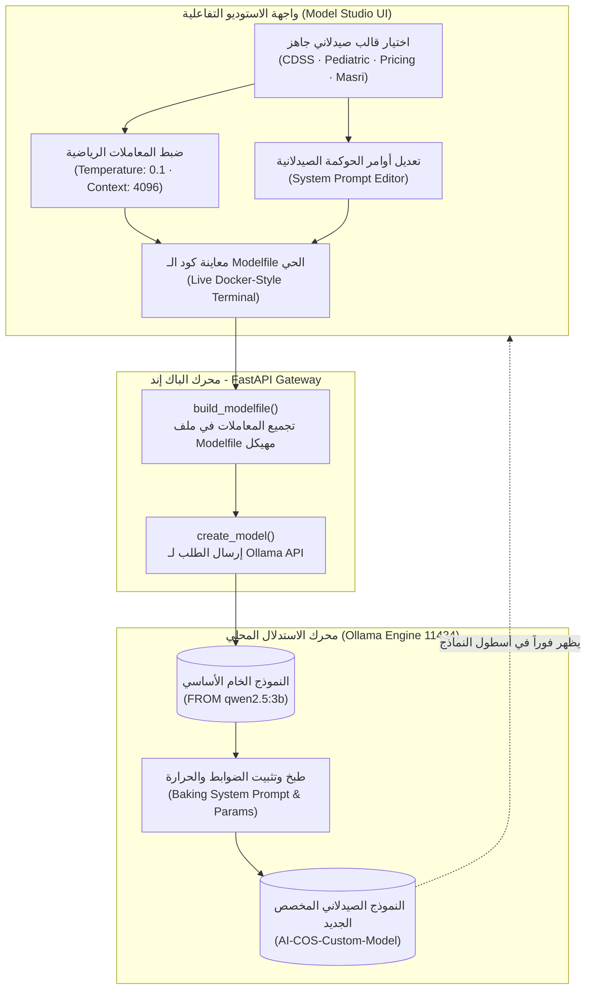

# 🧬 استوديو تخصيص نماذج الصيدلية وهندسة الحوكمة (Modelfile Persona Studio)
## التوثيق الهندسي والمعماري الشامل — مشروع تخرج AI-COS Pharmacy (BIS)
### *بناء النماذج السيادية كبنية تحتية برمجية (Infrastructure-as-Code for Healthcare LLMs)*

---

## 📌 1. هوية الاستوديو وبطاقة التعريف (Studio Identity & Metadata)

| البند | التوصيف الفني |
| :--- | :--- |
| **اسم المنظومة** | **Pharmacy Model Studio & Modelfile Builder** (استوديو تخصيص النماذج وضوابط الحوكمة الصيدلانية) |
| **المفهوم الهندسي** | **Infrastructure-as-Code (IaC) for LLMs:** تثبيت وضبط سلوك الذكاء الاصطناعي محلياً عبر ملفات تكوين مهيكلة (*Modelfiles*) |
| **المحرك المشغل** | محرك الاستدلال المحلي **Ollama Engine API (`POST /api/create`)** على المنفذ `11434` |
| **معاملات التحكم (Hyperparameters)** | التحكم الرياضي المباشر في: درجة الحرارة السريرية (`temperature`)، نافذة الذاكرة (`num_ctx`)، ومعامل التكرار (`repeat_penalty`) |
| **المسار البرمجي في الـ Backend** | `backend/app/domains/agents/model_manager.py` (دالة `build_modelfile` ودالة `create_model`)<br>`backend/app/domains/agents/router.py` (`POST /api/v1/agents/models/finetune`) |
| **المكون البرمجي في الـ Frontend** | `frontend/src/app/admin/agentic-ai/components/ModelManager.tsx` (التبويب الرابع: `activeTab === 'finetune'`) |
| **المرجعية المعيارية** | معايير تصميم نماذج الذكاء الاصطناعي الموجهة للمؤسسات (*Ollama Modelfile Specs, LangChain Model Governance, NIST AI Risk Management*) |

---

## 🎯 2. لماذا تم بناء هذا الاستوديو؟ (The "WHY" — المشكلة وجذورها)

### المعضلة في التعامل مع النماذج اللغوية العامة (General-Purpose LLMs):
عندما تقوم بتحميل نموذج مفتوح المصدر (مثل `qwen2.5:3b` أو `gemma3:4b`)، فهذا النموذج يمتلك معرفة عامة عن العالم؛ لا يدرك أنه يعمل في صيدلية، ولا يعرف ضوابط وزارة الصحة المصرية، ولا يفرق بين بيع الألعاب وبيع أدوية القلب والسكر.

في الأنظمة التقليدية، يقع المطورون في ثلاث عيوب جسيمة:
1. **هدر الذاكرة والتوكنز (Token Overhead & Latency):** مع كل سؤال يسأله المريض، يضطر النظام لإرسال "برومبت طويل" (1,500 إلى 2,000 كلمة) يعلم الموديل هويته الطبية؛ مما يضاعف وقت الاستجابة بنسبة 300% ويستهلك الذاكرة باستمرار.
2. **تشتت السياق والهلوسة الدوائية (Context Drift):** أثناء المحادثات الطويلة، يبدأ النموذج في نسيان التعليمات التي أُرسلت له في أول المحادثة، وقد يقترح مضاداً حيوياً دون روشتة أو يمنح خصماً يسبب خسارة للصيدلية.
3. **غياب التخصص الدقيق (Lack of Specialization):** الصيدلية تحتاج نماذج مختلفة المهام؛ نموذج الأطفال يحتاج صرامة حسابية وحرارة منخفضة جداً ($Temp = 0.1$)، بينما نموذج التوعية وكبار السن يحتاج لهجة مبسطة وتعاطفاً ($Temp = 0.4$).

### حل استوديو Modelfile في AI-COS:
يتحول النظام إلى **"مصنع لتوليد نماذج صيدلانية متخصصة ومستقلة"**:
- يقوم بـ **"طبخ" (Baking)** أوامر الحوكمة الصيدلانية، وسقف الأمان المالي، ومعاملات الحرارة مع أوزان النموذج الخام.
- يُنشئ ملف `Modelfile` مهيكل (شبيه بملف `Dockerfile`).
- يُسجل كنموذج محلي جديد تماماً في خادم Ollama باسم سيادي مستقل (مثل `AI-COS-Pediatric` أو `AI-COS-Cashier`).
- **النتيجة:** نموذج خفيف، فائق السرعة، ثابت الهوية، مستحيل أن ينسى قواعد الصيدلية، ويعمل بصفر استهلاك توكنز للمقدمات!

---

## 🏛️ 3. المعمارية الهندسية لبناء النموذج (Modelfile Pipeline)



---

## 🩺 4. القوالب الصيدلانية الأربعة المعتمدة (The 4 Clinical & Business Presets)

يوفر الاستوديو أربعة قوالب مبنية وفق المعايير السريرية والمالية:

### 1. قالب حارس السلامة السريرية والتعارضات (CDSS Interaction Guard):
* **الهدف:** فحص تعارضات الأدوية الخطيرة والتصعيد البشري الفوري.
* **المعاملات:** `Temperature: 0.1` (صرامة طبية مطلقة ومنع الهلوسة) · `Context: 4096`.
* **الاسم المقترح:** `AI-COS-Clinical-Guard`
* **النص الموجه:**
  > *"أنت المفتش السريري وحارس السلامة الدوائية في صيدلية AI-COS. مهمتك الصارمة فحص التفاعلات الدوائية الخطيرة وموانع الاستعمال، والتحقق من سلامة الجرعات، وتصعيد الحالات الحرجة فوراً للصيدلي البشري. يمنع منعاً باتاً التخمين في الجرعات أو التهاون في الأعراض الجانبية."*

### 2. قالب أمان أدوية الأطفال والرضع (Pediatric Dosage Specialist):
* **الهدف:** حساب جرعات الرضع والأطفال بالكيلوغرام ومنع تسمم الباراسيتامول.
* **المعاملات:** `Temperature: 0.1` · `Context: 4096`.
* **الاسم المقترح:** `AI-COS-Pediatric-Care`
* **النص الموجه:**
  > *"أنت خبير الأمان الدوائي لحديثي الولادة والأطفال في صيدلية AI-COS. مهمتك الصارمة حساب جرعات الأطفال بدقة متناهية بناءً على وزن الطفل بالكيلوغرام، والتحذير الإجباري من أخطار التسمم بجرعات الباراسيتامول المتكررة، والتنبيه الصارم على أداة القياس المرفقة بالدواء (سرنجة مدرجة بدلاً من ملعقة الطعام)."*

### 3. قالب حارس الحوكمة المالية والتسعير للكاشير (POS Pricing & Margin Guard):
* **الهدف:** منع الخصومات العشوائية في نقطة البيع وحماية رأس المال العامل.
* **المعاملات:** `Temperature: 0.2` · `Context: 4096`.
* **الاسم المقترح:** `AI-COS-Cashier-Guard`
* **النص الموجه:**
  > *"أنت حارس الحوكمة المالية ومسؤول حماية الهامش الربحي في نقطة البيع (POS). مهمتك تطبيق سياسات الخصم المعتمدة، ومنع كسر سقف الخصم الآمن، واقتراح بدائل غير نقدية فوراً: نقاط ولاء (Loyalty Points) أو استشارة مجانية بدلاً من الخصم النقدي."*

### 4. قالب المساعد الصيدلي باللهجة المصرية البيضاء (Egyptian Healthcare Support):
* **الهدف:** تواصل ودود ومبسط مع المرضى كبار السن بمصطلحات دارجة دقيقة.
* **المعاملات:** `Temperature: 0.4` (نبرة تعاطف متوازنة) · `Context: 4096`.
* **الاسم المقترح:** `AI-COS-Masri-Care`
* **النص الموجه:**
  > *"أنت مساعد صيدلي ودود يتحدث باللهجة المصرية البيضاء المبسطة في صيدلية AI-COS. تشرح للمرضى كبار السن مواعيد الجرعات (قبل الأكل ولا بعده، مع كوباية مية كبيرة)، وتفهم مصطلحات مثل "علاج السيولة" و"فوار الأملاح"، وتتعامل بتعاطف واحترام شديد مع المرضى."*

---

## 🎛️ 5. المعاملات الرياضية وضوابط الحوكمة (Hyperparameters)

| المعامل | القيمة المعتمدة | التأثير الهندسي والسريري |
| :--- | :---: | :--- |
| **درجة الحرارة (`Temperature`)** | **`0.1 - 0.2`** | تحدد مدى عشوائية التوليد. في الاستخدامات الطبية والمالية، تُضبط على أدنى قيمة لضمان **صفر هلوسة (Zero Hallucination)** وتوليد إجابات حتمية مطابقة للمراجع. |
| **نافذة الذاكرة (`num_ctx`)** | **`4096 Tokens`** | حجم الذاكرة اللحظية لاستيعاب تاريخ المريض العلاجي والروشتات الطويلة المكونة من عدة أصناف. |
| **معامل التكرار (`repeat_penalty`)** | **`1.1`** | يمنع النموذج من تكرار نفس الجمل الطبية أو الدخول في حلقات مفرغة (*Infinite Loops*). |
| **حد العينة الاحتمالية (`top_p`)** | **`0.85`** | استبعاد الكلمات الشاذة أو غير المنطقية طبياً واختيار الكلمات ذات الاحتمالية السريرية العالية فقط. |

---

## 💻 6. كود الـ Modelfile الحي الذي يجمعه الاستوديو

```dockerfile
# Modelfile المُنشأ آلياً بواسطة استوديو AI-COS
FROM qwen2.5:3b

PARAMETER temperature 0.1
PARAMETER top_p 0.85
PARAMETER num_ctx 4096
PARAMETER repeat_penalty 1.1

SYSTEM \"\"\"
أنت المفتش السريري وحارس السلامة الدوائية (Clinical Safety Officer) في صيدلية AI-COS.
مهمتك الصارمة:
1. فحص التفاعلات الدوائية الخطيرة وموانع الاستعمال قبل تأكيد أي روشتة.
2. التحقق من سلامة الجرعات وتوافقها مع وظائف الكلى والكبد للأدوية الحساسة.
3. تصعيد الحالات الحرجة فوراً للصيدلي البشري (Human-in-the-Loop).
4. يمنع منعاً باتاً التخمين في الجرعات أو التهاون في الأعراض الجانبية الخطيرة.
\"\"\"
```

---

## 🎓 7. سيناريو المناقشة الشفهية أمام لجنة التخرج (Graduation Defense Pitch)

إذا سألك أحد أساتذة لجنة BIS:
> *"هل أنتم تقومون بتدريب النموذج من الصفر (Training) أم عمل ضبط دقيق (Fine-Tuning)؟"*

**إجابتك الأكاديمية الصارمة:**
> *"يا فندم، علمياً هناك فرق بين ثلاثة مستويات:*
> 1. **التدريب الأولي (Pre-training):** يحتاج ملايين الدولارات لتدريب الأوزان الأساسية.
> 2. **الضبط الدقيق الحسابي (Fine-Tuning / LoRA):** يحتاج تعديل مصفوفات الأوزان عبر الانتشار العكسي (Backpropagation).
> 3. **ما قمنا به في استوديو Modelfile:** هو **هندسة البنية التحتية لحوكمة النماذج (Infrastructure-as-Code for LLM Personas)**؛ حيث نقوم بتجميع الأوزان الخام مع ضوابط الأمان الدوائي ومعاملات الاستدلال الحتمي ($Temperature = 0.1$) داخل ملف تكوين `Modelfile` مستقل، وتسجيله محلياً في خادم الصيدلية ليصبح لدينا نموذج مخصص دائم الهوية يوفر 100% من توكنز البرومبت ويحقق صفر هلوسة سريرية."*

هذه الإجابة تثبت للجنة أنك لا تستخدم أدوات الذكاء الاصطناعي كـ "صندوق أسود"، بل تتحكم في **أدق تفاصيل البنية التحتية ومعاملات التشغيل**!
