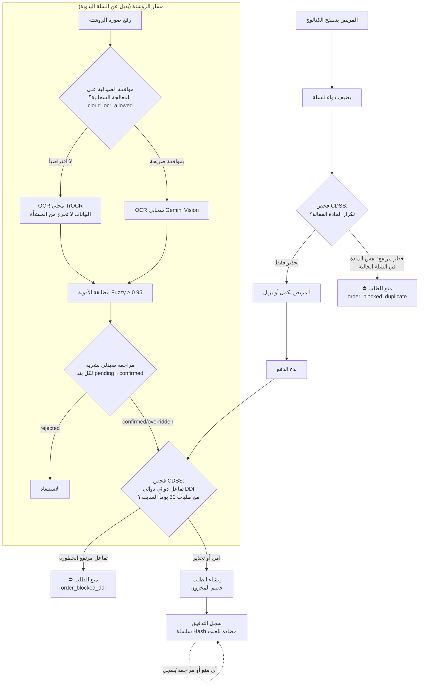

# AI-COS Pharmacy — خريطة عملية الأعمال ونقاط الضبط الرقابية
## BPMN Process Map + COSO-style Internal Controls (BIS Documentation)

> هذا المستند يجيب على سؤال لجنة BIS الجوهري: **أين الضبط الرقابي في نظامك، وما نوعه؟**
> الضبط الرقابي (Internal Control) في نظم المعلومات يصنف إلى: وقائي (Preventive) وكاشف (Detective) وتصحيحي (Corrective).

---

## 1) مخطط BPMN — عملية "صرف الدواء" الرقمية

## 2) سجل الضوابط الرقابية (Control Register — COSO style)

| # | نقطة الضبط | نوع الضبط | التصنيف COSO | التنفيذ التقني | الدليل/القياس |
|---|---|---|---|---|---|
| C1 | منع بيع دوائين متفاعلين (DDI عالي الخطورة) | **وقائي Preventive** | Risk Assessment → Control Activities | `order/service.py` → `check_interactions` + `BusinessRuleViolation` | `audit_logs.action_type = order_blocked_ddi` → عدّاد لوحة Business Value |
| C2 | منع الجرعة المزدوجة (تكرار المادة الفعالة في السلة) | **وقائي Preventive** | Control Activities | `check_duplicate_therapy` + حظر عند severity=high داخل السلة | `order_blocked_duplicate` في audit_logs |
| C3 | حارس التفاعلات في المحادثة | **وقائي Preventive** | Information & Communication | `InteractionGuard` قبل أي إجابة كتالوج + fuzzy matching | `ai_chat_logs.ddi_detected` → معدل الرصد في Scorecard |
| C4 | مراجعة صيدلي بشرية إجبارية لكل بند روشتة | **وقائي + تصحيحي** | Monitoring | `pharmacist_decision` إجباري قبل finalize (لا صرف دون مراجعة) | `prescription_items` → override rate في Scorecard |
| C5 | سلسلة تجزئة (Hash Chain) لسجل الأحداث | **كاشف Detective** | Information & Communication | `events_chain` BEFORE INSERT trigger + REVOKE | `GET /governance/events-chain/verify` |
| C6 | عدم الثقة في هوية العميل المُرسلة من المتصفح | **وقائي Preventive** | Control Environment | `customer_name = current_user.full_name` فقط | `/ai/chat` يتجاهل هوية الجسم عند وجود توكن |
| C7 | فصل صلاحيات: توكن n8n ≠ أدمن | **وقائي Preventive** | Control Environment | `require_admin_or_internal` + `require_role` على إدارة الموديلات | `admin_required=True` على مسارات /models/* |
| C8 | خصوصية بيانات المريض: الموافقة قبل المعالجة السحابية | **وقائي Preventive** | Control Environment (Privacy by Design) | `tenant_settings.cloud_ocr_allowed` (افتراضي: ممنوع) + فرضها في `analyze` | `GET/PUT /business-value/privacy/cloud-ocr` |
| C9 | تصعيد الحالات الطبية الطارئة للإنسان | **تصحيحي Corrective** | Risk Response | `EscalationEngine` + webhook n8n → Telegram + Outbox لإعادة الإرسال | `escalation_status` في ai_chat_logs + جدول emergency_outbox |
| C10 | الحاكمية الآلية: قياس تجاوز الإنسان للـ AI | **كاشف Detective** | Monitoring | `/business-value/governance-scorecard` | human_override_rate, ddi_warning_rate |
| C11 | حماية رأس المال وهامش الربح الصافي (Pricing & Retention Guard) | **وقائي Preventive** | Control Activities (Capital Preservation) | `agents/pricing.py` → `retention_cost < order_net_profit` + بوابة حجب الخصم للعملاء الخاسرين `unprofitable_retention_abandon` | منع البيع بهامش سالب + توجيه ميزانية الاستبقاء للعملاء ذوي الربحية الإيجابية فقط |

## 3) لماذا هذا هو "قسم BIS" وليس "قسم CS"؟

- **القياس المالي واقتصاديات الاستبقاء (Retention Economics)**: وكيل التسعير (`Pricing Agent`) لا يحسب الخصومات على إجمالي المبيعات، بل يطبق مصفوفة **صافي هامش الربح (Net Margin)**. فإذا كانت تكلفة الخصم بالجنيه تفوق صافي ربح الطلب، أو كان العميل ذا هامش ربح هزيل، يقرر النظام تلقائياً **ترك العميل (Abandon Unprofitable Customer)** وحجب الخصم (0%) لحماية رأس المال، وهو المعيار المتبع بالمؤسسات المصرفية لمنع استنزاف الأرباح (Negative Margin Elimination).
- **القياس المالي للمخاطر**: لوحة Business Value تحسب الوفر المقدر من الطلبات الممنوعة بمعادلة موثقة الافتراضات (Blocked × AOV × Incident Factor) — قرارات الأعمال تحتاج أرقاماً.
- **مسار التحويل**: جدول الأحداث (المربوط بسلسلة تجزئة) يقيس page_view → add_to_cart → checkout → purchase — منهجية قياس التحويل التجاري.
- **اختبارات A/B**: جدولا `ab_tests` / `ab_test_results` يقيسان فعالية العروض بدلالة إحصائية (z-test) — إدارة بالبيانات لا بالحدس.
- **الحاكمية**: كل قرار AI (حظر/تحذير/توصية) قابل للتتبع، والإنسان يتجاوز الآلة بنسبة مقيسة ومعلنة — الشفافية شرط الحاكمية.

---
*Generated as part of the AI-COS-Pharmacy graduation project — Business Information Systems track.*
