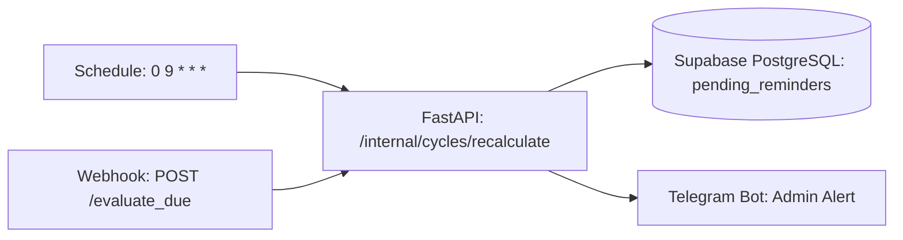

# المعمارية الفنية: evaluate_due Architecture

## 🔐 ضوابط الحوكمة والأمان
- **رمز المصادقة الداخلي (Internal Token):** محمي برأس `X-Internal-Token` لمنع الاستدعاء الخارجي غير المصرح به.
- **الاستجابة الفورية (Immediately):** الـ Webhook يرسل استجابة `200 OK` فوراً لمنع حدوث Timeout في السيرفر الرئيسي.
- **تصنيف الضابط الرقابي (COSO):** ضابط وقائي وتوجيهي (Preventive & Directive Control).
