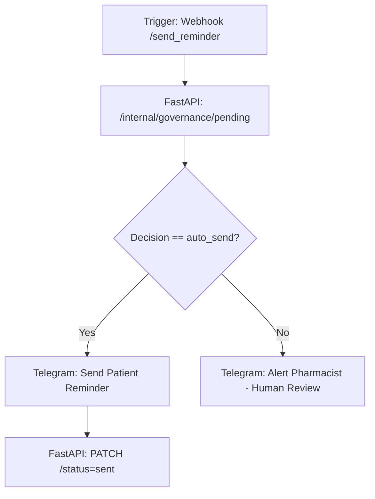

# المعمارية الفنية: send_reminder Architecture

## 📊 تدفق البيانات (Data Payload)
- **Customer Name & Drug Name:** تُعرض في الرسالة الموجهة للمريض بصيغة HTML مريحة للعين.
- **Audit Tracking:** بمجرد نجاح الإرسال، يُطلق استدعاء PATCH لتوثيق وقت الإرسال وحالة السجل.
