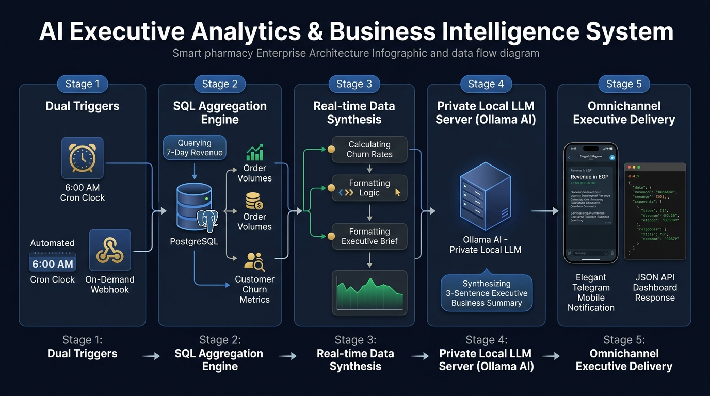
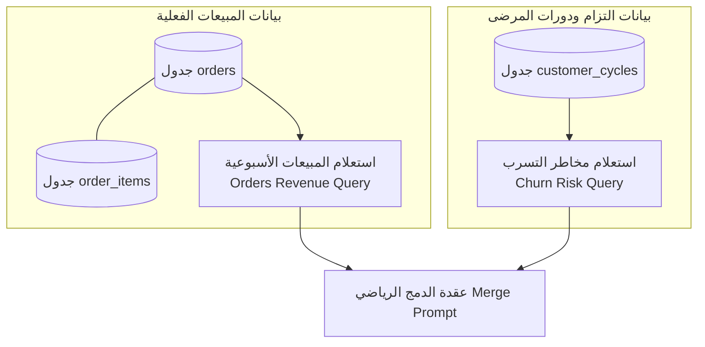
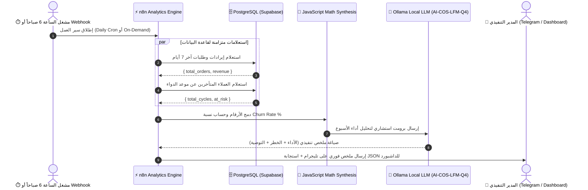

# 📊 دليل المعمارية ودورة حياة البيانات: وكيل التحليلات الذكية ومؤشرات الأداء
## AI-COS Executive Analytics & Business Intelligence Agent (`workflow_analytics_agent.json`)

> **المشروع:** AI-COS Pharmacy — منظومة الصيدلية الذكية، الدعم السريري، وإدارة العمليات بالأتمتة  
> **القسم:** نظم معلومات الأعمال (BIS) | **العام الأكاديمي:** 2026 / 2027  
> **الموقع:** `D:\Graduation Project\N8N\AI-COS Analytics Agent\`

---

## 🖼️ المخطط البصري المعماري وتدفق التحليلات (Architecture Infographic)



---

## 📑 فهرس المحتويات

1. [الملخص التنفيذي وفلسفة التصميم (Executive Summary)](#1-الملخص-التنفيذي-وفلسفة-التصميم)
2. [دورة تكوين البيانات واستعلامات الـ SQL (Data Genesis & Aggregation)](#2-دورة-تكوين-البيانات-واستعلامات-الـ-sql)
3. [المخطط المعماري التفاعلي (System Architecture & Sequence)](#3-المخطط-المعماري-التفاعلي)
4. [التشريح الفني للعقد الـ 9 بالتفصيل (Node-by-Node Technical Breakdown)](#4-التشريح-الفني-للعقد-الـ-9-بالتفصيل)
5. [التحليل البرمجي والرياضي لكود دمج المؤشرات (JavaScript Analysis)](#5-التحليل-البرمجي-والرياضي-لكود-دمج-المؤشرات)
6. [التكامل مع الذكاء الاصطناعي لتوليد الملخص التنفيذي (Ollama AI Integration)](#6-التكامل-مع-الذكاء-الاصطناعي-لتوليد-الملخص-التنفيذي)
7. [الأثر الاستراتيجي في نظم معلومات الأعمال (BIS Value & Decision Support)](#7-الأثر-الاستراتيجي-في-نظم-معلومات-الأعمال)
8. [بنك أسئلة وأجوبة لجنة المناقشة (Defense Committee Q&A Bank)](#8-بنك-أسئلة-وأجوبة-لجنة-المناقشة)

---

## 1. الملخص التنفيذي وفلسفة التصميم

في الإدارة الصيدلانية الحديثة، يواجه المدير التنفيذي أو صاحب الصيدلية مشكلة تسمى **"إرهاق البيانات (Data Overload)"**؛ حيث توجد مئات الجداول وآلاف الفواتير، لكن يصعب عليه معرفة: **"هل نحن في أمان مالي؟ وما هو أكبر خطر يهددنا اليوم؟ وماذا يجب أن نفعل؟"**

### 💡 الابتكار في `AI-COS: Analytics Agent`:
هذا السير عمل يمثل **المستشار التنفيذي الذكي (Executive AI Copilot)**؛ فهو يجمع بين:
1. **استخراج المؤشرات الحسابية الحقيقية (Hard KPIs):** إجمالي الطلبات، والإيرادات بالجنيه المصري، ونسبة العملاء المعرضين لخطر التسرب من قاعدة البيانات.
2. **الذكاء الاصطناعي التوليدي المحلي (Local LLM):** قراءة هذه الأرقام وتحويلها إلى **ملخص تنفيذي باللغة الطبيعية من 3 جمل محددة** (الأداء المالي، الخطر الأكبر، والتوصية المباشرة).
3. **التشغيل المزدوج (Dual Trigger):** ينطلق تلقائياً كل صباح في تمام **الساعة 6:00 صباحاً (Daily Cron)** ليكون التقرير جاهزاً على هاتف المدير عبر Telegram مع قهوة الصباح، أو يُطلب لحظياً (On-Demand) من لوحة تحكم النظام.

---

## 2. دورة تكوين البيانات واستعلامات الـ SQL

الوكيل لا يعتمد على أرقام عشوائية، بل يستخرج حقائق المعاملات من جدولين أساسيين:



### أ. استعلام الإيرادات وحجم المبيعات (`Orders Revenue`):
```sql
SELECT 
    COUNT(*) as total_orders, 
    COALESCE(SUM(oi.price * oi.quantity), 0) as revenue 
FROM orders o 
LEFT JOIN order_items oi ON oi.order_id = o.order_id 
WHERE o.order_date >= NOW() - INTERVAL '7 days'
```
* **الشرح:** يحسب عدد الطلبات المكتملة في آخر 7 أيام، ويجمع إجمالي المبيعات بضرب سعر كل دواء في كميته مع معالجة القيم الفارغة بـ `COALESCE`.

### ب. استعلام مخاطر تسرب العملاء المتأخرين (`Churn Risk`):
```sql
SELECT 
    COUNT(*) as total_cycles, 
    COUNT(*) FILTER (WHERE last_purchase_date + (avg_cycle_days * INTERVAL '1 day') < NOW()) as at_risk 
FROM customer_cycles
```
* **الشرح:** يقيس عدد دورات الأدوية النشطة، ويفلتر الحالات التي تأخرت عن موعد نفاد العبوة المعتاد (`last_purchase_date + avg_cycle_days < NOW()`)، مما يعطي رقم العملاء المعرضين للخطر بدقة لحظية.

---

## 3. المخطط المعماري التفاعلي



---

## 4. التشريح الفني للعقد الـ 9 بالتفصيل

### 1️⃣ `Webhook` (Node ID: `a1`)
* **المسار:** `POST /webhook/aicos-analytics`
* **النمط:** `responseNode` (انتظار إتمام السلسلة وإرجاع الرد النهائي المتزامن).
* **الدور:** يتيح استدعاء التحليلات عند الطلب من لوحة تحكم الأدمن في أي وقت.

---

### 2️⃣ `Daily 6AM` (Node ID: `a0`)
* **النوع:** `n8n-nodes-base.scheduleTrigger` (v1.2)
* **التعبير الزمني (Cron):** `0 6 * * *` (يومياً الساعة 6:00 صباحاً).
* **الدور:** يضمن وصول التقرير الصباحي الاستباقي لصاحب الصيدلية قبل بدء ساعات العمل اليومية.

---

### 3️⃣ `Orders Revenue` (Node ID: `a2`)
* **النوع:** `n8n-nodes-base.postgres` (v2.5)
* **الدور:** استخراج إجمالي المبيعات وعدد الفواتير للأسبوع الحالي.

---

### 4️⃣ `Churn Risk` (Node ID: `a3`)
* **النوع:** `n8n-nodes-base.postgres` (v2.5)
* **الدور:** استخراج أعداد المرضى المتأخرين عن إعادة صرف أدويتهم الدورية.

---

### 5️⃣ `Merge Prompt` (Node ID: `a4`)
* **النوع:** `n8n-nodes-base.code` (v2 - JavaScript)
* **الدور:** دمج الأرقام المالية مع مؤشرات العملاء، وحساب نسبة الخطر الإجمالية، وتجهيز صياغة البرومت الموجه للـ LLM.

---

### 6️⃣ `Ask Ollama` (Node ID: `a5`)
* **النوع:** `n8n-nodes-base.httpRequest` (v4.2)
* **الرابط:** `http://host.docker.internal:11434/api/generate`
* **النموذج:** `AI-COS-LFM-Q4:latest` (محلي وخاص لحماية أسرار المبيعات).
* **الحمولة:** تطلب صياغة ملخص من 3 أجزاء محددة بدقة:
  1. الأداء المالي والطلبات (Performance).
  2. الخطر الأساسي على استمرارية العمل (Main Risk).
  3. التوصية التشغيلية المباشرة (Actionable Recommendation).

---

### 7️⃣ `Build Report` (Node ID: `a6`)
* **النوع:** `n8n-nodes-base.code` (v2 - JavaScript)
* **الدور:** تنظيف نص الذكاء الاصطناعي ودمجه مع المؤشرات الرقمية في كائن إحصائي متكامل.

---

### 8️⃣ `Send Report` (Node ID: `a7`)
* **النوع:** `n8n-nodes-base.telegram` (v1.2)
* **المستلم:** `chatId: 6262223810`
* **قالب الرسالة الصباحية على هاتف المدير:**
  ```text
  📊 Analytics this week | Orders: 54 | Rev: 24,800 EGP | Churn Risk: 14
  
  💡 بلغت إيرادات الأسبوع 24,800 ج.م عبر 54 طلباً بزيادة مستقرة في المبيعات. يكمن الخطر الرئيسي في تأخر 14 عميلاً مزمناً عن دورات أدويتهم بنسبة مخاطرة 18.5%. يُوصى بإطلاق حملة استرجاع فورية عبر WhatsApp بكوبونات خصم لإعادة تنشيطهم.
  ```

---

### 9️⃣ `Respond` (Node ID: `a8`)
* **النوع:** `n8n-nodes-base.respondToWebhook` (v1.1)
* **الدور:** إرجاع حمولة JSON متكاملة إلى شاشة الإدارة لعرض الرسوم البيانية.

---

## 5. التحليل البرمجي والرياضي لكود دمج المؤشرات

في العقدة رقم 5 (`Merge Prompt`):

```javascript
const ord = $('Orders Revenue').first().json;
const chrn = $('Churn Risk').first().json;
let period = 'this week';
try { period = $('Webhook').first().json.body.period || period; } catch(e) {}

const to = parseInt(ord.total_orders) || 0;
const rev = parseFloat(ord.revenue) || 0;
const tc = parseInt(chrn.total_cycles) || 1;
const ar = parseInt(chrn.at_risk) || 0;

// حساب النسبة المئوية للعملاء المعرضين للتسرب:
const cr = (ar / tc * 100).toFixed(1);

return [{
  json: {
    period,
    total_orders: to,
    revenue: parseFloat(rev.toFixed(2)),
    churn_risk_customers: ar,
    churn_rate: parseFloat(cr) / 100,
    reminder_conversion_rate: 0,
    reminders_sent: 0,
    // صياغة البرومت التنفيذي الدقيق:
    ollama_prompt: 'Pharmacy analytics for ' + period + ': orders=' + to + ', revenue=' + rev.toFixed(0) + ' EGP, churn_risk=' + ar + '/' + tc + ' (' + cr + '%). Write 3-sentence executive summary: performance, main risk, recommendation.'
  }
}];
```

---

## 6. التكامل مع الذكاء الاصطناعي لتوليد الملخص التنفيذي

### 🔒 لماذا نموذج Ollama المحلي؟
* **سرية الأرقام المالية:** إيرادات الصيدلية وأرباحها وأعداد عملائها أسرار تجارية لا يجوز إرسالها لخدمات خارجية عامة.
* **التركيز والانضباط:** بفضل باراميتر `temperature: 0.3`، يُمنع النموذج من المبالغة أو الهلوسة، ويلتزم حصراً بالحقائق الرقمية الواردة في البرومت.

---

## 7. الأثر الاستراتيجي في نظم معلومات الأعمال (BIS Value)

1. **دعم اتخاذ القرار للإدارة العليا (Executive Decision Support):** تحويل التقارير المحاسبية المعقدة إلى خلاصة تنفيذية واضحة في 3 جمل.
2. **الربط بين الأداء المالي والأداء السريري:** الجمع بين إيرادات المبيعات ونسبة التزام المرضى بأدويتهم في مؤشر واحد.
3. **الأتمتة الاستباقية للرقابة:** عدم انتظار نهاية الشهر لاكتشاف تراجع الإيرادات، بل متابعة يومية وأسبوعية ترصد الانحرافات فور حدوثها.

---

## 8. بنك أسئلة وأجوبة لجنة المناقشة

### س1: "ليه بتستخدموا استعلامين منفصلين (Orders Revenue و Churn Risk) مش استعلام واحد؟"
> **الإجابة النموذجية:**  
> *"لفصل الاهتمامات التشغيلية (Separation of Concerns) ولتحسين أداء قاعدة البيانات؛ جدول `orders` يسجل المعاملات المالية المكتملة، بينما جدول `customer_cycles` يسجل السلوك الزمني للمرضى. تشغيل الاستعلامين بشكل منفصل أسرع وأخف على الفهارس (Indexes) ويمنع عمليات الـ Cartesian Product الثقيلة."*

### س2: "ماذا يحدث لو لم توجد أي مبيعات في الأسبوع الأخير؟"
> **الإجابة النموذجية:**  
> *"استخدمنا دالة `COALESCE(SUM(...), 0)` في الـ SQL؛ لضمان أنه في حال انعدام المبيعات يرجع الرقم `0` كقيمة عددية آمنة بدلاً من `NULL`، مما يحمي محرك الجافاسكريبت والذكاء الاصطناعي من أي أخطاء حسابية."*

### س3: "هل يمكن تعديل الفترة الزمنية لتحليل شهر أو سنة كاملة؟"
> **الإجابة النموذجية:**  
> *"نعم بكل تأكيد؛ الـ Webhook مهيأ لاستقبال متغير `period` في الـ Request Body (مثلاً: 'this month' أو 'last quarter')، ويقوم كود الجافاسكريبت بتكييف البرومت والتحليلات بناءً على الفترة المطلوبة ديناميكياً."*

---

## 📁 ملفات السير عمل المرتبطة:
* **ملف كود السير عمل في n8n:** [`workflow_analytics_agent.json`](workflow_analytics_agent.json)
* **المخطط البصري المعماري:** [`analytics_agent_architecture.jpg`](analytics_agent_architecture.jpg)
* **المسار في خادم n8n المحلي:** `http://localhost:5678/workflow/ofhk7M9PfQzHx0BV`
