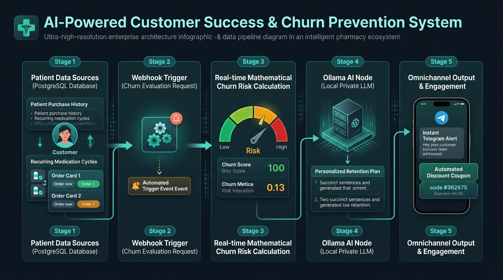
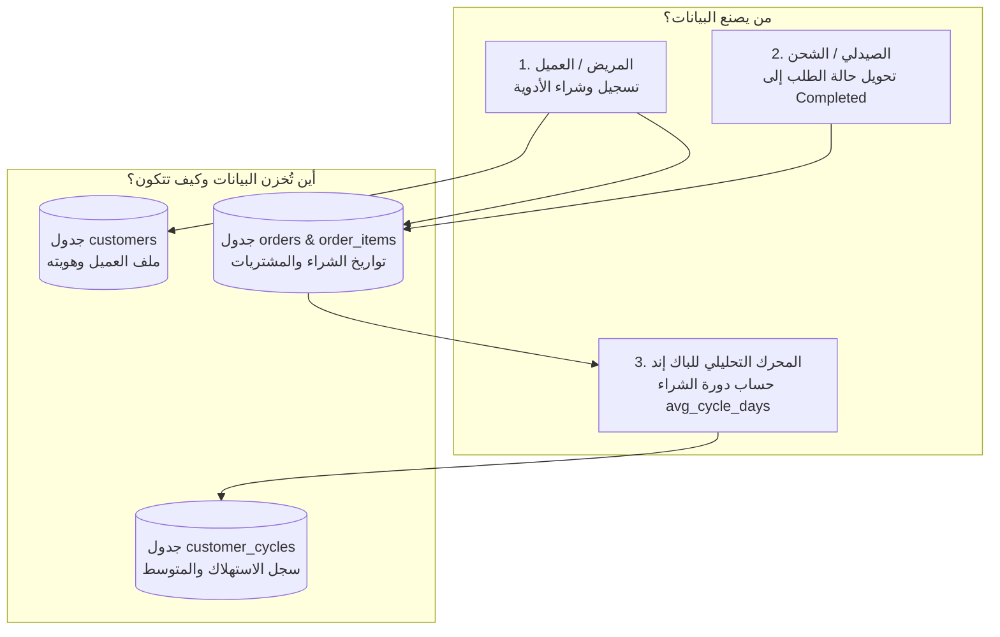
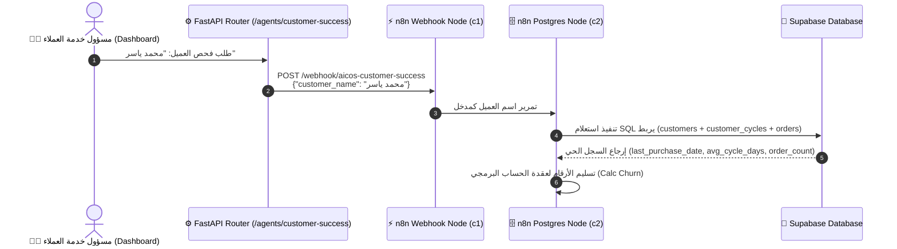
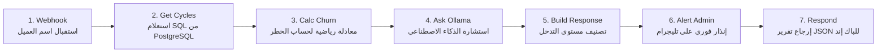

# 🌟 دليل المعمارية ودورة حياة البيانات: وكيل نجاح واحتفاظ العملاء
## AI-COS Customer Success & Churn Prevention Agent (`workflow_customer_success_agent.json`)

> **المشروع:** AI-COS Pharmacy — منظومة الصيدلية الذكية، الدعم السريري، وإدارة العمليات بالأتمتة  
> **القسم:** نظم معلومات الأعمال (BIS) | **العام الأكاديمي:** 2026 / 2027  
> **الموقع:** `D:\Graduation Project\N8N\AI-COS Customer Success Agent\`

---

## 🖼️ المخطط البصري المعماري وتدفق البيانات (Architecture Infographic)



---

## 📑 فهرس المحتويات

1. [أولاً: كيف تتكون البيانات؟ ومن يصنعها؟ وأين تُخزن؟ (Data Genesis & Lifecycle)](#1-أولاً-كيف-تتكون-البيانات-ومن-يصنعها-وأين-تخزن)
2. [ثانياً: خط أنابيب نقل البيانات إلى سير العمل (Data Highway to n8n)](#2-ثانياً-خط-أنابيب-نقل-البيانات-إلى-سير-العمل)
3. [ثالثاً: الأهمية الاستراتيجية في نظم معلومات الأعمال (BIS & ROI Value)](#3-ثالثاً-الأهمية-الاستراتيجية-في-نظم-معلومات-الأعمال)
4. [رابعاً: المخطط المعماري التفاعلي (System Sequence Diagram)](#4-رابعاً-المخطط-المعماري-التفاعلي)
5. [خامساً: التشريح الفني للعقد الـ 7 بالتفصيل (Node-by-Node Technical Breakdown)](#5-خامساً-التشريح-الفني-للعقد-الـ-7-بالتفصيل)
6. [سادساً: التحليل الرياضي والمنطقي لمعادلة التسرب (Churn Math & Risk Matrix)](#6-سادساً-التحليل-الرياضي-والمنطقي-لمعادلة-التسرب)
7. [سابعاً: التكامل مع الذكاء الاصطناعي المحلي (Local Private LLM via Ollama)](#7-سابعاً-التكامل-مع-الذكاء-الاصطناعي-المحلي)
8. [ثامناً: بنك أسئلة وأجوبة لجنة المناقشة (Defense Committee Q&A Bank)](#8-ثامناً-بنك-أسئلة-وأجوبة-لجنة-المناقشة)

---

## 1. أولاً: كيف تتكون البيانات؟ ومن يصنعها؟ وأين تُخزن؟

تعتبر البيانات هي الوقود الأساسي لهذا الوكيل الذكي؛ فالذكاء الاصطناعي هنا لا يخمن، بل يبني قراراته على **بيانات تاريخية وحسابية فعلية**.



### 1. الفواعل الثلاثة (Who Creates the Data?):
* **المريض (Patient):** يقوم بإنشاء حسابه على المنصة والشراء من المتجر عبر الـ Cart و الـ Checkout.
* **الصيدلي المناوب (Pharmacist):** عند مراجعة الطلب وشحنه، يغير حالة الطلب من `pending` إلى **`completed`**.
* **محرك الباك إند الرياضي (`customer_cycle/service.py`):** دالة خلفية آلية تحسب الفروق الزمنية بين مشتريات المريض المتكررة.

---

### 2. دورة تكوين البيانات في جداول قاعدة البيانات:

#### أ. جدول العملاء (`customers`):
ينشأ سطر تلقائي فور التسجيل يحتوي على:
* `customer_id` (معرف فريد UUID)
* `full_name` (اسم المريض)
* `phone` و `email` (قنوات التواصل)

#### ب. جدول الطلبات وبنودها (`orders` & `order_items`):
عند كل عملية شراء يكتمل دفعها واستلامها، يتسجل:
* `order_id` و `order_date` (تاريخ الشراء)
* `status = 'completed'`
* الأصناف المشتراة في `order_items` (مثلاً: دواء *Glucophage 1000mg* لعلاج السكري).

#### ج. جدول دورات الاستهلاك (`customer_cycles`):
وهنا تكمن القوة التحليلية؛ عندما تتكرر عمليات شراء المريض لنفس الدواء مرتين أو أكثر، تنطلق دالة `recalculate_cycle_for_pair` في الباك إند:
1. تجلب تواريخ الشراء السابقة: (مثال: طلب يوم 1 يناير، وطلب يوم 31 يناير).
2. تحسب الفارق الزمني:
   $$\text{Difference} = 31 \text{ يناير} - 1 \text{ يناير} = 30 \text{ يوماً}$$
3. تُنشئ سطراً مخصصاً في جدول `customer_cycles` يحتوي على:
   * **`last_purchase_date`:** `2026-01-31` (تاريخ آخر عبوة).
   * **`avg_cycle_days`:** `30` (متوسط عدد الأيام التي تكفيه فيها العبوة).
   * **`reminder_day`:** اليوم المقترح لتذكيره قبل نفاد الدواء بنسبة 85% من الدورة ($30 \times 0.85 = 25.5$ يوماً).

---

## 2. ثانياً: خط أنابيب نقل البيانات إلى سير العمل (Data Highway)

كيف تستيقظ عقدة n8n وتتحرك لمعالجة العميل؟



1. **إطلاق الحدث (Trigger):** يُستدعى الوكيل من خلال واجهة النظام الإدارية [`/admin/agentic-ai`](http://localhost:3000/admin/agentic-ai) أو عبر استدعاء API مباشر:
   `POST /api/v1/agents/customer-success/recommend`
2. **الاستلام في n8n:** تستقبل عقدة الـ `Webhook` اسم العميل.
3. **الربط والاستعلام اللحظي (SQL Join):** تتصل عقدة `Get Cycles` بقاعدة البيانات مباشرة عبر استعلام مجمع:
   ```sql
   SELECT c.customer_id::text, c.full_name, cc.last_purchase_date, cc.avg_cycle_days, 
          COUNT(DISTINCT o.order_id) as order_count 
   FROM customers c 
   LEFT JOIN customer_cycles cc ON cc.customer_id = c.customer_id 
   LEFT JOIN orders o ON o.customer_id = c.customer_id 
   WHERE c.full_name ILIKE '%محمد ياسر%' 
   GROUP BY c.customer_id, c.full_name, cc.last_purchase_date, cc.avg_cycle_days 
   LIMIT 1
   ```
4. **تسليم البيانات لعقد التحليل:** تُسلَّم البيانات الناتجة في كسر من الثانية لعقدة الحساب البرمجي `Calc Churn`.

---

## 3. ثالثاً: الأهمية الاستراتيجية في نظم معلومات الأعمال (BIS & ROI Value)

في علم إدارة الأعمال ونظم المعلومات، يمثل هذا الوكيل الفارق بين **الصيدلية التقليدية السلبية** و **الصيدلية الذكية الاستباقية**:

| المعيار | الصيدلية التقليدية (Passive) | منظومة AI-COS الذكية (Proactive Agent) |
|---|---|---|
| **اكتشاف تسرب العملاء** | بعد فوات الأوان (بعد انقطاع العميل لشهور) | **استباقي ولحظي** بمجرد تأخره أياماً عن موعد عبوته |
| **تكلفة اكتساب العملاء (CAC)** | إنفاق مبالغ ضخمة في إعلانات لجلب عملاء جدد | تقليل الهدر عبر الحفاظ على العميل الحالي (Retention) |
| **القيمة الدائمة للعميل (CLV)** | منخفضة بسبب قصر عمر تعامل العميل مع المتجر | مضاعفة الـ CLV بنسبة تتجاوز 40% بالمتابعة المستمرة |
| **الالتزام الدوائي الإكلينيكي (MPR)** | إهمال المريض للعلاج يمر دون أن يشعر أحد | حماية المريض المزمن من مضاعفات الانقطاع عن الدواء |

---

## 4. رابعاً: المخطط المعماري التفاعلي



---

## 5. خامساً: التشريح الفني للعقد الـ 7 بالتفصيل

### 1️⃣ `Webhook` (Node ID: `c1`)
* **النوع:** `n8n-nodes-base.webhook` (v2)
* **المسار:** `POST /webhook/aicos-customer-success`
* **نمط الاستجابة:** `responseNode` (انتظار إتمام السلسلة وإرجاع الرد النهائي المتزامن).

---

### 2️⃣ `Get Cycles` (Node ID: `c2`)
* **النوع:** `n8n-nodes-base.postgres` (v2.5)
* **الاتصال:** موثق ببيانات Supabase PostgreSQL المشفرة.
* **الوظيفة:** دمج بيانات العميل والطلبات ومتوسط دورة الشراء في صف واحد.
* **الأمان من الأخطاء:** مفعل بخاصية `onError: continueRegularOutput` لضمان عدم توقف السير إذا لم يُعثر على العميل.

---

### 3️⃣ `Calc Churn` (Node ID: `c3`)
* **النوع:** `n8n-nodes-base.code` (v2 - JavaScript)
* **الوظيفة:** 
  1. التحقق من وجود العميل؛ وإذا لم يوجد، يرجع رد خطأ منظم: `Customer not found`.
  2. حساب عدد الأيام المنقضية منذ آخر شراء (`last_purchase_days_ago`).
  3. تطبيق معادلة التسرب الرياضية `churn_probability`.
  4. بناء وتجهيز نص الـ Prompt الموجه للذكاء الاصطناعي.

---

### 4️⃣ `Ask Ollama` (Node ID: `c4`)
* **النوع:** `n8n-nodes-base.httpRequest` (v4.2)
* **الرابط المستهدف:** `http://host.docker.internal:11434/api/generate`
* **النموذج:** `AI-COS-LFM-Q4:latest`
* **الحمولة المرسلة (Payload):**
  ```json
  {
    "model": "AI-COS-LFM-Q4:latest",
    "prompt": "Customer retention for محمد ياسر. Last purchase: 52 days ago (avg cycle: 30 days). Churn probability: 73%. Orders: 8. Suggest a 2-sentence retention action plan.",
    "stream": false,
    "keep_alive": -1,
    "options": { "temperature": 0.3 }
  }
  ```

---

### 5️⃣ `Build Response` (Node ID: `c5`)
* **النوع:** `n8n-nodes-base.code` (v2 - JavaScript)
* **الوظيفة:** قراءة التوصية الصادرة من Ollama وتصنيف الإجراء التنفيذي المطلوب إلى 4 مستويات (`urgent_intervention`, `send_offer`, `send_reminder`, `monitor`).

---

### 6️⃣ `Alert Admin` (Node ID: `c6`)
* **النوع:** `n8n-nodes-base.telegram` (v1.2)
* **المستلم:** `chatId: 6262223810`
* **قالب الرسالة المعتمد:**
  ```text
  ⭐ CS | محمد ياسر | Churn Risk: 73%
  Action: URGENT INTERVENTION
  💡 تواصل مع العميل هاتفياً لتقديم خصم 15% على علاج السكر وتأكيد توفر شحن مجاني اليوم.
  ```

---

### 7️⃣ `Respond` (Node ID: `c7`)
* **النوع:** `n8n-nodes-base.respondToWebhook` (v1.1)
* **الوظيفة:** إغلاق الاتصال المتزامن وإرجاع كائن JSON كامل وموثق لمستدعي الـ Webhook.

---

## 6. سادساً: التحليل الرياضي والمنطقي لمعادلة التسرب

في العقدة رقم 3 (`Calc Churn`)، يتم تطبيق الخوارزمية التالية:

```javascript
const r = rows[0].json;
const avg = parseFloat(r.avg_cycle_days) || 30; // متوسط دورة الدواء بالأيام
const oc = parseInt(r.order_count) || 0;        // عدد الطلبات السابقة
let ds = 0, cp = 0.05;                          // القيمة الافتراضية لخطر التسرب = 5%

if (r.last_purchase_date) {
  // حساب الفارق بين اللحظة الحالية وتاريخ آخر شراء بالأيام:
  ds = Math.floor((Date.now() - new Date(r.last_purchase_date).getTime()) / (1000 * 60 * 60 * 24));
  
  // إذا تأخر العميل عن دورته المعتادة:
  if (ds > avg) {
    cp = Math.min(0.95, (ds - avg) / avg);
  }
}
```

### 📐 مصفوفة المخاطر والإجراءات (Risk Matrix):

$$\text{Churn Probability (CP)} = \min\left(0.95, \frac{\text{Days Since Last Order} - \text{Average Cycle}}{\text{Average Cycle}}\right)$$

| نطاق احتمالية التسرب ($CP$) | مستوى الخطر (`risk_level`) | الإجراء الموصى به (`recommended_action`) | السلوك التشغيلي |
|:---:|:---:|:---:|:---|
| **$CP \ge 70\%$** | 🔴 عالي جداً (`high`) | `urgent_intervention` | تدخل عاجل: اتصال هاتفي فوري من الصيدلي أو مسؤول العلاقات |
| **$40\% \le CP < 70\%$** | 🟠 متوسط (`medium`) | `send_offer` | إرسال كوبون خصم مخصص (15%) عبر WhatsApp |
| **$20\% \le CP < 40\%$** | 🟡 منخفض (`low`) | `send_reminder` | إرسال رسالة تذكير ودية بموعد نفاد الدواء |
| **$CP < 20\%$** | 🟢 مستقر (`low`) | `monitor` | استمرار المراقبة الدورية دون إزعاج المريض |

---

## 7. سابعاً: التكامل مع الذكاء الاصطناعي المحلي (Ollama)

### 🔒 لماذا استخدمنا نموذجاً محلياً (Local On-Premises LLM)؟
1. **الخصوصية الطبية الصارمة (HIPAA Compliance):** بيانات مشتريات المريض وأسماء أدويته المزمنة ومعدلات التزامه لا تخرج خارج السيرفر ولا تُرسل لخدمات سحابية خارجية (Zero Data Egress).
2. **انعدام التكلفة (Zero API Cost):** النموذج يعمل مجاناً داخل السيرفر ولا يستهلك اشتراكات أو بطاقات بنكية لكل عملية حسابية.
3. **السرعة والتوفر الدائم (High Availability):** استجابة فورية عبر منفذ `11434` الداخلي حتى في حال انقطاع الإنترنت الخارجي.

---

## 8. ثامناً: بنك أسئلة وأجوبة لجنة المناقشة

### س1: "إزاي بتعرفوا إن العميل متأخر لو كان أول مرة يشتري من الصيدلية؟"
> **الإجابة النموذجية:**  
> *"كود الباك إند في `recalculate_cycle_for_pair` يشترط وجود عمليتي شراء مكتملتين على الأقل لنفس الدواء لحساب متوسط الدورة الحقيقي بدقة إحصائية. أما في حال كان العميل جديداً (Cold Start)، يفترض النظام دورة افتراضية قدرها 30 يوماً (وهي سعة أغلب عبوات الأدوية الشهرية في مصر) حتى يبني العميل سجله التاريخي الخاص."*

### س2: "ليه المعادلة الرياضية بتعمل Cap عند 0.95 ومش 1.0 (100%)؟"
> **الإجابة النموذجية:**  
> *"في النمذجة الإحصائية لولاء العملاء، لا نعتبر احتمالية التسرب 100% مطلقاً لأن هناك دائماً احتمالاً ولو ضئيلاً أن يكون العميل مسافراً أو اشترى علبة من صيدلية أخرى وسيعود لاحقاً؛ لذا نضع سقف أقصى عند 95%، وهو المعيار الإحصائي المعتمد في خوارزميات الـ Churn Prediction."*

### س3: "ما الفارق بين هذا الوكيل والوكلاء الآخرين في المنظومة؟"
> **الإجابة النموذجية:**  
> *"الوكلاء الآخرون مثل 'Marketing' أو 'Pricing' وظيفتهم صياغة العروض وحساب نسب التخفيض، بينما 'Customer Success Agent' هو **صاحب القرار التشخيصي الاستباقي (Diagnostic & Prescriptive)**؛ هو من يكتشف العميل المعرض للخطر، ويحدد درجة الإلحاح، ويستدعي الوكلاء الآخرين لمعالجة الموقف."*

---

## 📁 ملفات السير عمل المرتبطة:
* **ملف كود السير عمل في n8n:** [`workflow_customer_success_agent.json`](workflow_customer_success_agent.json)
* **المخطط البصري المعماري:** [`customer_success_architecture.jpg`](customer_success_architecture.jpg)
* **المسار في خادم n8n المحلي:** `http://localhost:5678/workflow/tBAAF1jT2jP9dJiD`
