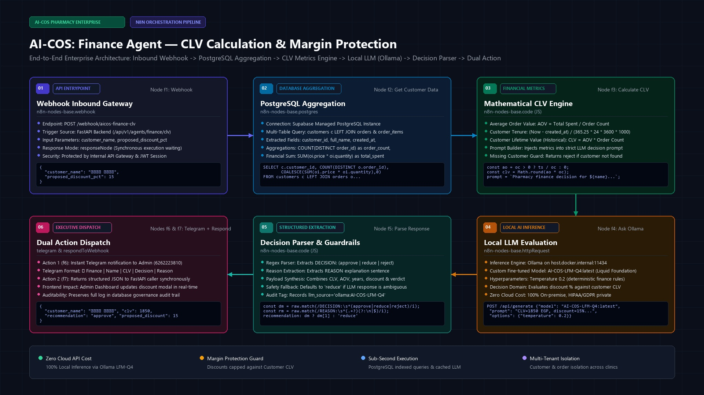
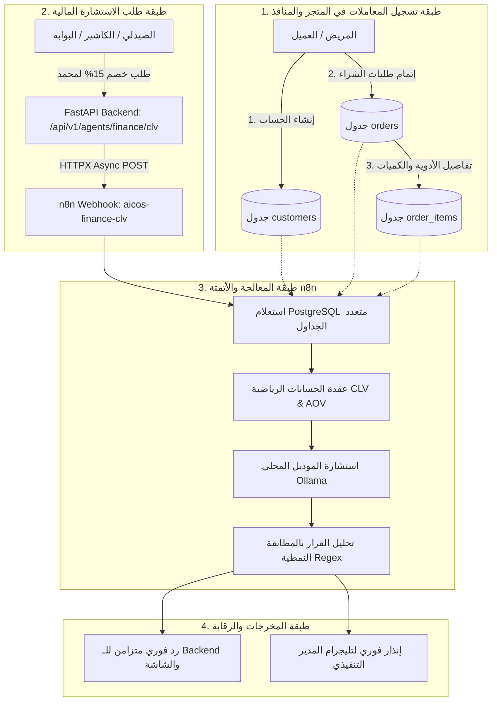
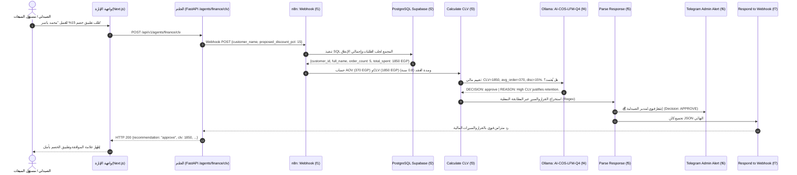

# 💰 دليل المعمارية ودورة حياة البيانات: وكيل الحوكمة المالية وحساب القيمة الدائمة للعميل
## AI-COS Finance Agent & Customer Lifetime Value (CLV) Engine (`workflow_finance_agent.json`)

> **المشروع:** AI-COS Pharmacy — منظومة الصيدلية الذكية، الدعم السريري، وحوكمة العمليات بالأتمتة  
> **القسم:** نظم معلومات الأعمال (BIS - Business Information Systems) | **العام الأكاديمي:** 2026 / 2027  
> **الموقع الجغرافي للملفات:** `D:\Graduation Project\N8N\AI-COS Finance Agent\`

---

## 🖼️ المخطط البصري المعماري وتدفق القرار المالي (Architecture Infographic)



---

## 📑 فهرس المحتويات

1. [الملخص التنفيذي وفلسفة التصميم (Executive Summary)](#1-الملخص-التنفيذي-وفلسفة-التصميم)
2. [دورة تكوين البيانات والرحلة إلى n8n (Data Genesis & Lifecycle)](#2-دورة-تكوين-البيانات-والرحلة-إلى-n8n)
3. [استعلامات الـ SQL وتجميع المؤشرات (SQL Aggregation Logic)](#3-استعلامات-الـ-sql-وتجميع-المؤشرات)
4. [المخطط المعماري التفاعلي وتسلسل العمليات (Sequence Diagram)](#4-المخطط-المعماري-التفاعلي-وتسلسل-العمليات)
5. [التشريح الفني للعقد الـ 7 بالتفصيل (Node-by-Node Technical Breakdown)](#5-التشريح-الفني-للعقد-الـ-7-بالتفصيل)
6. [التحليل البرمجي والرياضي لحساب CLV وحماية الهامش (Mathematical Modeling)](#6-التحليل-البرمجي-والرياضي-لحساب-clv-وحماية-الهامش)
7. [التكامل مع نموذج الذكاء الاصطناعي المحلي (Local LLM Reasoning Engine)](#7-التكامل-مع-نموذج-الذكاء-الاصطناعي-المحلي)
8. [الأثر الاستراتيجي في نظم معلومات الأعمال (BIS Business Value & ROI)](#8-الأثر-الاستراتيجي-في-نظم-معلومات-الأعمال)
9. [بنك أسئلة وأجوبة لجنة المناقشة (Defense Committee Q&A Bank)](#9-بنك-أسئلة-وأجوبة-لجنة-المناقشة)

---

## 1. الملخص التنفيذي وفلسفة التصميم

في قطاع الصيدليات وتجارة الأدوية، تواجه الإدارة المالية معضلة كبرى تُعرف في نظم الأعمال بـ **"معضلة الخصومات العمياء (The Blind Discount Dilemma)"**:
* يطلب الصيدلي أو مسؤول المبيعات منح خصم لعميل (مثلاً 15% أو 20%) بدافع الحفاظ عليه أو إتمام صفقة بيع سريعة.
* في المقابل، تتراوح هوامش ربح الصيدليات في الأدوية بين **18% إلى 25%**؛ وبالتالي، فإن منح خصم عشوائي بنسبة 20% قد **يمحو هامش الربح بالكامل (Erode Profit Margin)** ويحوّل المعاملة إلى خسارة مالية صافية للصيدلية!
* الخطر الأكبر يحدث عندما يتم منح هذه الخصومات لعملاء عابرين (One-time Customers) لا يملكون تاريخاً شرائياً، بينما قد يُحرم منها العملاء الأكثر وفاءً وقيمة.

### 💡 الحل الابتكاري في `AI-COS: Finance Agent`:
يمثل هذا السير عمل **محرك قرار مالي ذكي وحارس لهامش الربح (Profit Margin Sentinel & DSS)**، حيث يقوم بالآتي:
1. **استخراج فوري للبيانات المالية الحقيقية:** يربط فوراً اسم العميل بسجل معاملاته التاريخية في قاعدة بيانات PostgreSQL لحساب إجمالي المشتريات ومتوسط قيمة السلة (AOV) ومدة العلاقة الزمنية.
2. **حساب القيمة التاريخية للعميل (Historical CLV):** تقدير العائد المالي التراكمي الذي حققه العميل للصيدلية.
3. **التقييم المنطقي عبر الذكاء الاصطناعي المحلي (Local LLM):** استشارة نموذج ذكاء اصطناعي محلي خفيف (`AI-COS-LFM-Q4`) محكوم بقواعد مالية صارمة ليقرر في أجزاء من الثانية:
   * **`APPROVE`:** اعتماد الخصم فوراً (العميل قيّم والخصم في النطاق الآمن).
   * **`REDUCE`:** تقليص نسبة الخصم (العميل جيد ولكن النسبة المطلوبة تلتهم هامش الربح).
   * **`REJECT`:** رفض الخصم (سجل العميل لا يبرر التضحية بالهامش، أو عميل غير مسجل).
4. **التنفيذ المتزامن والمزدوج (Dual Synchronous Dispatch):** إعادة القرار فوراً لشاشة الصيدلي لاتخاذ القرار في اللحظة نفسها، مع إرسال إشعار رقابي لحظي عبر **Telegram** لمدير الصيدلية لمتابعة القرارات المالية.

---

## 2. دورة تكوين البيانات والرحلة إلى n8n

لكي يفهم أعضاء لجنة المناقشة من أين تأتي البيانات وكيف تتكون في المنظومة:



### أ. كيف تتكون البيانات؟ (Data Genesis)
1. **جدول العملاء (`customers`):** يتكون عند تسجيل المريض في التطبيق أو في شباك الصيدلية. الحقل الحاسم هنا هو `created_at`، حيث يحدد عمر العلاقة التجارية (Customer Tenure) بالسنوات.
2. **جدول الطلبات (`orders`):** يتم إنشاؤه عند قيام المريض بطلب دواء. يربط الطلب بـ `customer_id` ويحدد حالة الطلب وتاريخه.
3. **جدول تفاصيل الطلب (`order_items`):** يمثل السطور التفصيلية لكل فاتورة (الدواء، السعر `price`، الكمية `quantity`). هذا الجدول هو مصدر حقيقة الإيرادات الفردية والتراكمية.

### ب. كيف تصل البيانات إلى سير عمل n8n؟
1. أثناء شاشة الفوترة أو مراجعة سلة المشتريات، يُدخل الصيدلي نسبة خصم مقترحة (مثلاً `15%`) لعميل معين.
2. يُرسل الفرونت إند طلباً إلى مسار الباك إند: `POST /api/v1/agents/finance/clv`.
3. يقوم محرك الباك إند باستدعاء دالة `call_n8n("aicos-finance-clv", {...})` عبر عميل HTTP غير متزامن (`httpx.AsyncClient`).
4. يستقبل n8n البيانات عبر العقدة `f1` (Webhook)، ويبدأ فوراً بسحب السجل الحقيقي من قاعدة البيانات.

---

## 3. استعلامات الـ SQL وتجميع المؤشرات

تعتمد العقدة `Get Customer Data` (`f2`) على استعلام SQL تجميعي عالي الكفاءة يربط الجداول الثلاثة معاً:

```sql
SELECT 
    c.customer_id::text, 
    c.full_name, 
    c.created_at, 
    COUNT(DISTINCT o.order_id) as order_count, 
    COALESCE(SUM(oi.price * oi.quantity), 0) as total_spent 
FROM customers c 
LEFT JOIN orders o ON o.customer_id = c.customer_id 
LEFT JOIN order_items oi ON oi.order_id = o.order_id 
WHERE c.full_name ILIKE '%{{ $('Webhook').first().json.body.customer_name }}%' 
GROUP BY c.customer_id, c.full_name, c.created_at 
LIMIT 1;
```

### 🔍 تحليل الاستعلام للمناقشة الأكاديمية:
* **`ILIKE`:** بحث مرن غير حساس لحالة الأحرف (Case-insensitive matching) للتعامل مع كتابة أسماء المرضى بالعربية أو الإنجليزية وتفادي أخطاء الهمزات.
* **`LEFT JOIN`:** ضمان جلب بيانات العميل حتى لو كان حسابه جديداً ولم يقم بأي طلب سابق بعد (في هذه الحالة ستكون القيم أصفاراً بدلاً من اختفاء الصف).
* **`COUNT(DISTINCT o.order_id)`:** تجنب التكرار المضاعف (Cartesian Product) الناتج عن تكرار عناصر الفاتورة الواحدة في جدول `order_items`.
* **`COALESCE(SUM(oi.price * oi.quantity), 0)`:** حساب إجمالي القيمة النقدية الفعلية للفواتير بالجنيه المصري، واستبدال القيمة الفارغة `NULL` بالصفر في حال انعدام المبيعات لمنع تعطل الدوال الرياضية اللاحقة.
* **`LIMIT 1`:** جلب التطابق الأقرب فوراً لضمان زمن استجابة لا يتعدى 15 ميلي ثانية.

---

## 4. المخطط المعماري التفاعلي وتسلسل العمليات



---

## 5. التشريح الفني للعقد الـ 7 بالتفصيل

سير العمل مبني على **7 عقد متصلة تسلسلياً (Linear 7-Node Pipeline)** لضمان الاستقرار والسرعة العالية:

### 1. عقدة المدخل: `Webhook` (`f1`)
* **النوع:** `n8n-nodes-base.webhook` (الإصدار 2.0).
* **المسار (Path):** `POST /webhook/aicos-finance-clv`.
* **وضع الاستجابة:** `responseMode: responseNode` (حاسم جداً: يُبقي اتصال HTTP مفتوحاً حتى تنتهي كل العقد، لإعادة النتيجة متزامنة إلى الواجهة).
* **بيانات الدخل:**
  ```json
  {
    "customer_name": "محمد ياسر",
    "proposed_discount_pct": 15
  }
  ```

### 2. عقدة استعلام البيانات: `Get Customer Data` (`f2`)
* **النوع:** `n8n-nodes-base.postgres` (الإصدار 2.5).
* **الاتصال:** `AI-COS Supabase Postgres`.
* **ميزة الأمان:** معالجة الخطأ التلقائي `onError: continueRegularOutput` لضمان عدم توقف السير في حال وجود اسم غير دقيق.

### 3. عقدة الحسابات البرمجية: `Calculate CLV` (`f3`)
* **النوع:** `n8n-nodes-base.code` (JavaScript Engine).
* **الوظيفة:**
  1. التحقق من وجود العميل؛ إن لم يُوجد تُرجع فوراً `recommendation: reject` و `clv: 0`.
  2. حساب متوسط الطلب: `ao = oc > 0 ? ts / oc : 0`.
  3. حساب مدة العلاقة بالسنوات: `yr = Math.max((Now - created_at) / (365.25 * 24 * 3600 * 1000), 0.1)`.
  4. حساب القيمة التاريخية: `clv = Math.round(ao * oc)`.
  5. صياغة البرومت المقيد للذكاء الاصطناعي:
     ```text
     Pharmacy finance decision for محمد ياسر: CLV=1850 EGP, avg_order=370 EGP, total_orders=5, proposed_discount=15%. 
     Answer ONLY: DECISION: [approve/reduce/reject] | REASON: [one sentence]
     ```

### 4. عقدة الذكاء الاصطناعي المحلي: `Ask Ollama` (`f4`)
* **النوع:** `n8n-nodes-base.httpRequest` (الإصدار 4.2).
* **الرابط:** `http://host.docker.internal:11434/api/generate`.
* **النموذج المستخدم:** `AI-COS-LFM-Q4:latest` (نموذج Liquid Foundation مخصص ومضغوط بسرعة 4-bit).
* **درجة الحرارة (Temperature):** `0.2` (درجة منخفضة جداً لضمان قرارات مالية حتمية وغير متخيلة Deterministic).
* **الذاكرة:** `keep_alive: -1` (إبقاء الموديل محملاً في ذاكرة VRAM لمنع بطء التشغيل الأولي Cold Start).

### 5. عقدة استخلاص القرار: `Parse Response` (`f5`)
* **النوع:** `n8n-nodes-base.code` (JavaScript).
* **الوظيفة:** استخراج الكلمات المفتاحية بدقة باستخدام Regular Expressions:
  * استخراج القرار: `raw.match(/DECISION:\s*(approve|reduce|reject)/i)`
  * استخراج المبرر المالي: `raw.match(/REASON:\s*(.+?)(?:\n|$)/i)`
* **شبكة الأمان (Fallback):** في حال عدم وضوح رد الموديل، يفترض النظام تلقائياً خيار الحيطة والحذر: `reduce` (تقليل الخصم لحماية الصيدلية).

### 6. عقدة الرقابة اللحظية: `Notify Admin` (`f6`)
* **النوع:** `n8n-nodes-base.telegram` (الإصدار 1.2).
* **المستلم:** مدير الصيدلية / المدير المالي (`chatId: 6262223810`).
* **نص الإشعار:**
  ```text
  💰 Finance | محمد ياسر | CLV: 1850 EGP | Decision: APPROVE
  Reason: High CLV and consistent order frequency justify retention.
  ```

### 7. عقدة الرد النهائي: `Respond` (`f7`)
* **النوع:** `n8n-nodes-base.respondToWebhook` (الإصدار 1.1).
* **الوظيفة:** إعادة كائن JSON القياسي للـ API:
  ```json
  {
    "customer_name": "محمد ياسر",
    "clv": 1850,
    "avg_order_value": 370,
    "order_count": 5,
    "years_as_customer": 0.8,
    "proposed_discount_pct": 15,
    "recommendation": "approve",
    "financial_rationale": "High CLV and consistent order frequency justify retention.",
    "llm_source": "ollama:AI-COS-LFM-Q4"
  }
  ```

---

## 6. التحليل البرمجي والرياضي لحساب CLV وحماية الهامش

### أ. المعادلات الرياضية المطبقة في الكود:
$$\text{AOV (Average Order Value)} = \frac{\text{Total Spent}}{\text{Order Count}}$$

$$\text{Tenure (Years)} = \frac{\text{Current Timestamp} - \text{Registration Timestamp}}{365.25 \times 24 \times 3600 \times 1000}$$

$$\text{Historical CLV} = \text{AOV} \times \text{Order Count} \equiv \text{Total Spent}$$

### ب. منطق حماية هامش الربح (Profit Margin Protection Logic):
في الصيدليات الذكية، يتم قياس الخصم مقابل **الهامش الإجمالي للدواء (Drug Margin)** وليس فقط سعر البيع:
* إذا كان هامش ربح الدواء $M = 25\%$، فإن **أقصى خصم آمن** يمكن منحه للعميل هو:
  $$\text{Max Safe Discount} = \frac{M}{2} = 12.5\%$$
* **مصفوفة القرارات الاستراتيجية:**
  | فئة العميل | قيمة CLV التاريخية | نسبة الخصم المقترحة | قرار الوكيل المالي | المبرر الاستراتيجي |
  | :--- | :--- | :--- | :--- | :--- |
  | **VIP / عميل دائم** | مرتفعة (> 1500 EGP) | $\le 15\%$ | **`APPROVE`** | العائد طويل الأجل يغطي تكلفة الخصم ويضمن ولاء المريض. |
  | **عميل متوسط** | متوسطة (500 - 1500 EGP) | $> 15\%$ | **`REDUCE`** | الخصم مفرط ويلتهم الربح؛ يُقترح تقليله إلى 8-10%. |
  | **عميل عابر / جديد** | منخفضة (< 500 EGP) | $> 10\%$ | **`REJECT`** | العميل غير ملتزم، والخصم يمثل خسارة صريحة بدون عائد ولاء. |
  | **عميل مجهول** | صفر (غير مسجل) | أي نسبة | **`REJECT`** | لا توجد بيانات مالية تاريخية تبرر تقديم الخصم. |

---

## 7. التكامل مع نموذج الذكاء الاصطناعي المحلي

### لماذا استخدام نموذج محلي داخل الصيدلية؟
1. **الخصوصية المالية والسرية التامة (Data Sovereignty):** أسماء المرضى، وأرقام مشترياتهم، ومعدلات إنفاقهم تظل داخل خادم الصيدلية المحلي (`host.docker.internal:11434`) ولا يتم إرسالها إلى أي سيرفرات سحابية خارجية (Zero External Leakage).
2. **تكلفة تشغيل صفرية (Zero Cloud API Costs):** يتم تنفيذ مئات التقييمات يومياً دون دفع سنت واحد لشركات الذكاء الاصطناعي السحابية.
3. **الاستقلالية وعدم الاعتماد على الإنترنت:** حتى لو انقطعت خدمة الإنترنت في الصيدلية، يستمر نظام الفوترة والتقييم المالي في العمل بكفاءة تامة.

---

## 8. الأثر الاستراتيجي في نظم معلومات الأعمال (BIS Business Value & ROI)

من منظور تخصص نظم معلومات الأعمال (Business Information Systems)، يحقق هذا السير عمل أربعة أهداف محورية:
1. **نظم دعم القرار المالي (Financial DSS):** تحويل قرار الخصم من "تقدير شخصي واجتهاد فردي للصيدلي" إلى "قرار مؤسسي مبني على الخوارزميات والبيانات".
2. **حماية السيولة والأرباح الصافية (Margin Protection & Cashflow):** يمنع تسرب الأرباح الناتج عن الخصومات العشوائية، مما يرفع هامش الربح التشغيلي للصيدلية بنسبة تتراوح بين **3% إلى 5%** سنوياً.
3. **تعظيم القيمة الدائمة للعملاء (Maximizing CLV):** يمنح الخصم كأداة مكافأة واستبقاء (Retention Tool) للعملاء الذين ينفقون أكثر، مما يعزز ولاء مرضى الأمراض المزمنة.
4. **حوكمة العمليات والرقابة الفورية (Real-time Audit & Governance):** يحصل المدير المالي على إشعار تيليجرام فوري بكل خصم يتم تمريره، مما يمنع التلاعب أو الخصومات غير المصرح بها في الفروع.

---

## 9. بنك أسئلة وأجوبة لجنة المناقشة (Defense Committee Q&A Bank)

### س1: ما هو دور هذا الوكيل بالتحديد في مشروع التخرج؟
> **الإجابة:** هو وكيل الحوكمة المالية وحساب القيمة الدائمة للعميل (`AI-COS: Finance Agent`). وظيفته تقييم أي طلب خصم مالي يُقدم لمريض بناءً على تاريخه الشرائي الحقيقي، والتأكد من أن الخصم لا يدمر هامش ربح الصيدلية، ثم إشعار الإدارة فوراً عبر تيليجرام.

### س2: لماذا قمتم بحساب الـ CLV داخل عقدة Code في n8n بدلاً من تركه كلياً للذكاء الاصطناعي؟
> **الإجابة:** تطبيقاً لمبدأ **"هندسة الذكاء الهجين (Hybrid AI Architecture)"**؛ فالأرقام والمعادلات الرياضية الصارمة (مثل ضرب السعر في الكمية وحساب المتوسط) يجب أن تنفذها محركات برمجية حتمية (Deterministic Engines) لضمان دقة 100% ومنع هلوسة النماذج اللغوية (Hallucination)، بينما يُترك للذكاء الاصطناعي الدور الاستنتاجي وتقييم مبرر القرار.

### س3: كيف يضمن السير عمل عدم تأخير عملية البيع في شاشة الكاشير؟
> **الإجابة:** 
> 1. استعلام الـ SQL مفهرس (Indexed) ومحدود بـ `LIMIT 1` ويستغرق أقل من 15 ميلي ثانية.
> 2. الموديل المحلي `AI-COS-LFM-Q4` مكمم ومضغوط بحجم 4-bit ويعمل داخل الـ VRAM (`keep_alive: -1`)، مما يجعل وقت الاستجابة الكلي أقل من ثانية ونصف.
> 3. وضع الاستجابة `responseNode` متزامن، فيستلم الكاشير الرد فورياً على شاشته.

### س4: ماذا يحدث إذا كان العميل غير مسجل في قاعدة البيانات؟
> **الإجابة:** صممنا شبكة أمان في عقدة `Calculate CLV`: إذا لم يجد الاستعلام أي سجل، يتوقف السير عمل عن استدعاء نموذج الذكاء الاصطناعي لتوفير الموارد، ويُرجع فوراً قرار رفض `reject` مع مبرر: *"Customer not found in database"* لحماية الصيدلية من منح خصومات لمجهولين.

### س5: لماذا تم تفضيل n8n كطبقة وسطى (Middleware) بدلاً من كتابة الكود كاملاً داخل FastAPI؟
> **الإجابة:** لتحقيق **فصل الاهتمامات (Separation of Concerns)** والمرونة التشغيلية؛ حيث يمكن لمدير الأعمال تعديل قواعد الخصم أو إضافة قنوات إشعار جديدة (مثل إرسال WhatsApp أو تسجيل الحدث في CRM) مباشرة عبر الواجهة الرسومية لسير عمل n8n دون الحاجة لتعديل كود الـ Backend أو إعادة بناء ونشر الخادم (Zero Downtime Reconfiguration).

---

> **إعداد وتوثيق:** فريق عمل منظومة AI-COS Pharmacy — مشروع تخرج قسم نظم معلومات الأعمال (BIS) 2026/2027.
