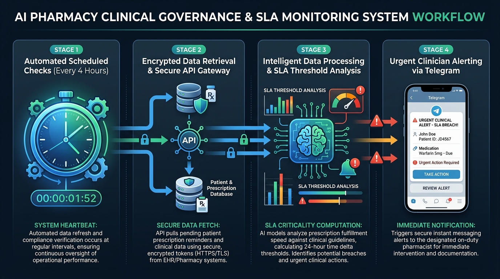
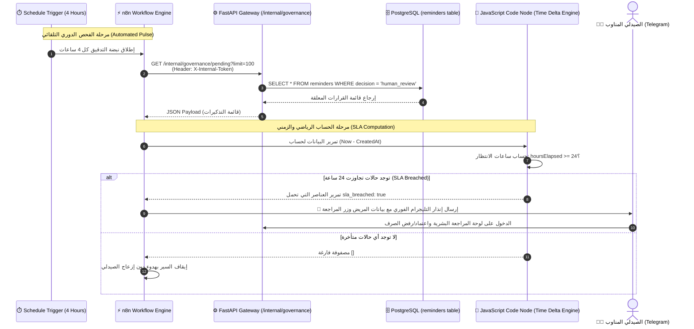
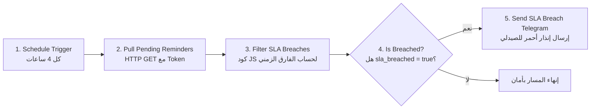

# ⏳ دليل المعمارية والمخطط البصري: مراقب اتفاقية مستوى الخدمة للحوكمة
## AI-COS Governance SLA Monitor (`workflow_3_governance_sla_monitor.json`)

> **المشروع:** AI-COS Pharmacy — منظومة الصيدلية الذكية والحوكمة السريرية  
> **القسم:** نظم معلومات الأعمال (BIS) | **العام الأكاديمي:** 2026 / 2027  
> **الموقع:** `D:\Graduation Project\N8N\AI-COS Governance SLA Monitor\`

---

## 🖼️ المخطط البصري المعماري (Architecture Infographic)



---

## 📑 فهرس المحتويات

1. [الملخص التنفيذي وفلسفة التصميم (Executive Summary)](#1-الملخص-التنفيذي-وفلسفة-التصميم)
2. [المخطط المعماري التفاعلي (System Architecture & Sequence)](#2-المخطط-المعماري-التفاعلي)
3. [التشريح الفني للعقد خطوة بخطوة (Node-by-Node Technical Breakdown)](#3-التشريح-الفني-للعقد-خطوة-بخطوة)
4. [التحليل البرمجي والرياضي لكود الفلترة (JavaScript Code Analysis)](#4-التحليل-البرمجي-والرياضي-لكود-الفلترة)
5. [الأمان، العزل الشبكي، وإدارة الأسرار (Security & Network Isolation)](#5-الأمان-والعزل-الشبكي-وإدارة-الأسرار)
6. [الأثر السريري والتجاري في نظم معلومات الأعمال (Clinical & BIS Impact)](#6-الأثر-السريري-والتجاري-في-نظم-معلومات-الأعمال)
7. [بنك أسئلة وأجوبة لجنة المناقشة (Defense Committee Q&A Bank)](#7-بنك-أسئلة-وأجوبة-لجنة-المناقشة)

---

## 1. الملخص التنفيذي وفلسفة التصميم

في أنظمة الرعاية الصحية الذكية، يُعتبر مبدأ **الرقابة البشرية (Human-in-the-Loop - HITL)** أساسياً لمنع أخطاء الذكاء الاصطناعي. فعندما تنخفض نسبة ثقة نموذج التعلم الآلي عن حد معين (مثل 80%)، يمتنع النظام عن الصرف الآلي ويحول الطلب إلى **طابور المراجعة البشرية الصيدلانية**.

### ⚠️ الأزمة التي يعالجها هذا السير عمل:
لو تُرِك هذا الطابور دون رقابة آلية، قد يتراكم ويتعرض المريض المزمن (مثل مرضى السكري أو القلب أو الضغط) لانقطاع في إمداد الدواء بسبب انشغال أو نسيان الصيدلي، مما يُلغي الفائدة الإكلينيكية للنظام ويخلق مسؤولية طبية وقانونية.

### 💡 الحل المعماري المنفذ:
يعمل هذا الـ Workflow كـ **"مراقب جودة رقمي ذاتي التشغيل (Autonomous SLA Auditor)"**؛ حيث يقوم دورياً كل **4 ساعات** باستجواب قاعدة البيانات، وحساب الفارق الزمني الحقيقي بالمللي ثانية لكل قرار معلق، فإذا تجاوز المريض حد الأمان الزمني المعتمد وهو **24 ساعة** دون اتخاذ قرار صيدلاني، يُطلق السير عمل فوراً إنذاراً حازماً عبر **Telegram Bot** إلى هاتف الصيدلي المناوب محتوياً على اسم المريض، الدواء، نسبة الثقة، ومدة الانتظار الحالية، مع توجيهه المباشر لشاشة المراجعة.

---

## 2. المخطط المعماري التفاعلي



---

## 3. التشريح الفني للعقد خطوة بخطوة

يتكون السير عمل من **5 عقد متسلسلة بدقة**:



### 1️⃣ العقدة الأولى: `Schedule Trigger (Every 4 Hours)`
* **النوع:** `n8n-nodes-base.scheduleTrigger` (v1)
* **الإعدادات:** `interval: [{ field: "hours", hoursInterval: 4 }]`
* **الدور:** يضمن الرقابة المستمرة على مدار اليوم (6 مرات يومياً) دون الحاجة لأي مشغل يدوي.

---

### 2️⃣ العقدة الثانية: `1. Pull Pending Reminders`
* **النوع:** `n8n-nodes-base.httpRequest` (v4)
* **طريقة الاستدعاء:** `GET`
* **الرابط:** `http://host.docker.internal:8000/internal/governance/pending?limit=100`
* **ترويسة الحماية:**
  ```http
  X-Internal-Token: dev-secret-key-12345-very-long-and-secure-32-chars
  ```
* **الدور:** سحب جميع التذكيرات الصيدلانية التي تم تجميدها آلياً في قاعدة البيانات وتنتظر موافقة الصيدلي البشري.

---

### 3️⃣ العقدة الثالثة: `2. Filter SLA Breaches (>24h)`
* **النوع:** `n8n-nodes-base.code` (v2 - JavaScript Runtime)
* **الدور:** إجراء مقارنة زمنية دقيقة بين توقيت إنشاء القرار وتوقيت الفحص الحالي، وفرز الحالات التي تخطت الـ 24 ساعة فقط.

---

### 4️⃣ العقدة الرابعة: `3. Is Breached?`
* **النوع:** `n8n-nodes-base.if` (v1)
* **الشرط المنطقي:** `{{ $json.sla_breached }} === true`
* **الدور:** بوابة عبور تمنع استهلاك اتصالات التليجرام إلا إذا كانت هناك حالات متأخرة بالفعل.

---

### 5️⃣ العقدة الخامسة: `4. Send SLA Breach Telegram Alert`
* **النوع:** `n8n-nodes-base.telegram` (v1.2)
* **معرف المحادثة:** `chatId: 6262223810`
* **التنسيق:** `HTML Parse Mode`
* **الدور:** صياغة الرسالة الإنذارية وإرسالها فوراً لهاتف الصيدلي المناوب.

---

## 4. التحليل البرمجي والرياضي لكود الفلترة

في العقدة رقم 3، يتم تشغيل كود JavaScript مخصص:

```javascript
const items = $input.all();
const breached = [];
const now = new Date().getTime(); // التوقيت الحالي بـ Epoch Unix Timestamp (مللي ثانية)

for (const item of items) {
  const data = item.json;
  
  // فحص أن القرار في حالة مراجعة بشرية
  if (data.decision === 'human_review') {
    const createdTime = data.created_at ? new Date(data.created_at).getTime() : now;
    
    // التحويل الرياضي من مللي ثانية إلى ساعات:
    // hours = (now - createdTime) / (1000ms * 60s * 60m)
    const hoursElapsed = Math.round((now - createdTime) / (1000 * 60 * 60));
    
    // تطبيق قاعدة الـ SLA الصارمة: 24 ساعة
    if (hoursElapsed >= 24) {
      breached.push({
        json: {
          ...data,
          hours_elapsed: hoursElapsed,
          sla_breached: true
        }
      });
    }
  }
}

return breached;
```

### 🧮 الدقة الزمنية:
- يتم تحويل التوقيت إلى Epoch Timestamp (Millisecond Resolution) لضمان دقة الحساب وتفادي أخطاء فروق التوقيت المحلي (Timezone Offsets).
- إذا كان حقل `created_at` غير متوفر، يفترض النظام توقيت اللحظة الحالية كإجراء أمان لمنع احتساب حالات غير صحيحة.

---

## 5. الأمان، العزل الشبكي، وإدارة الأسرار

تم بناء السير عمل وفق معايير الأمان المؤسسي:
1. **الوصول عبر الشبكة الداخلية فقط (Internal Network Only):**
   يستخدم الرابط `http://host.docker.internal:8000/internal/...`، وهو نطاق داخلي مغلق بين حاويات Docker والخادم المضيف، ولا يمكن الوصول إليه من خارج السيرفر أو عبر الإنترنت العام.
2. **المصادقة بالمفتاح المتبادل (Pre-Shared Key via Header):**
   الـ Endpoint في الباك إند محمي بواسطة Dependency:
   `verify_internal_token` في ملف `backend/app/dependencies/auth.py`
   والذي يستخدم خوارزمية `secrets.compare_digest` للتحقق من المفتاح في زمن ثابت (Constant-Time) لمنع هجمات القنوات الجانبية (Timing Attacks).
3. **انعدام كشف البيانات الطبية لغير المعنيين:**
   رسالة التليجرام تُرسل حصراً إلى `chatId` محدد ومصرح به للصيدلي المسؤول دون مشاركتها في قنوات عامة.

---

## 6. الأثر السريري والتجاري في نظم معلومات الأعمال (BIS Impact)

| البعد | في الأنظمة العادية | في منظومة AI-COS مع SLA Monitor |
|---|---|---|
| **مصير التذكيرات المعلقة** | تظل مكدسة في قاعدة البيانات دون متابعة | يُعاد تدقيقها آلياً كل 4 ساعات |
| **معدل الالتزام الدوائي (MPR)** | ينخفض بسبب تأخر استلام دواء السكر أو الضغط | يرتفع ويظل في النطاق الأمثل (Optimal > 80%) |
| **المسؤولية القانونية والمهنية** | يتحمل النظام مسؤولية إهمال المريض | النظام يبرئ ساحة التكنولوجيا ويصعد التحذير للمسؤول البشري |
| **الكفاءة التشغيلية** | إهدار وقت الصيدلي في البحث اليدوي اليومي | إشعار فوري بالحالات الحرجة فقط (Management by Exception) |

---

## 7. بنك أسئلة وأجوبة لجنة المناقشة

### س1: "ليه عملتوا الفحص كل 4 ساعات ومش كل دقيقة أو ساعة؟"
> **الإجابة النموذجية:**  
> *"اخترنا دورة الـ 4 ساعات بناءً على موازنة معمارية دقيقة (Resource Optimization & Anti-Alert Fatigue):  
> 1. معيار الـ SLA المعتمد هو 24 ساعة، وبالتالي فحص كل 4 ساعات يمنح 6 نقاط مراقبة يومية كافية جداً لاكتشاف أي تجاوز فور حدوثه.  
> 2. تقليل استهلاك استعلامات قاعدة البيانات وموارد شبكة السيرفر ومنع إرهاق الصيدلي بكثرة الإشعارات (Alert Fatigue)."*

### س2: "ماذا يحدث لو قاعدة البيانات كانت معطلة أو الباك إند مغلق وقت تشغيل الـ Workflow؟"
> **الإجابة النموذجية:**  
> *"سير العمل مربوط بسير عمل عام صائد للأعطال وهو **`AI-COS Global Error Handler`** عبر خاصية الـ `Error Trigger` في n8n؛ في حال فشل الاتصال بالباك إند، يلتقط الـ Error Handler الاستثناء فوراً، ويوثق رقم التشغيل وسبب الفشل ويرسل تنبيهاً لمهندسي الـ DevOps دون أن يسقط النظام في صمت (Zero Silent Failure)."*

### س3: "هل يمكن للصيدلي اعتماد التذكير مباشرة من التليجرام؟"
> **الإجابة النموذجية:**  
> *"التليجرام مصمم في هذه المرحلة كـ **قناة تنبيه سريعة ورابط مباشر (Alert & Deep-Link)**؛ حرصاً على الأمان السريري، لا تتم الموافقة بنقرة عشوائية من الهاتف لتفادي الضغط بالخطأ، بل تطلب الرسالة من الصيدلي فتح شاشة المراجعة البشرية الموثقة برمز الدخول والصلاحيات المعتمدة لمراجعة الجرعة وتاريخ المريض قبل الاعتماد النهائي."*

---

## 📁 ملفات السير عمل المرتبطة:
* **ملف كود السير عمل في n8n:** [`workflow_3_governance_sla_monitor.json`](workflow_3_governance_sla_monitor.json)
* **الصورة التوضيحية للمعمارية:** [`sla_monitor_architecture.jpg`](sla_monitor_architecture.jpg)
* **المسار في خادم n8n المحلي:** `http://localhost:5678/workflow/zWNggcB1fRoc7VJN`
