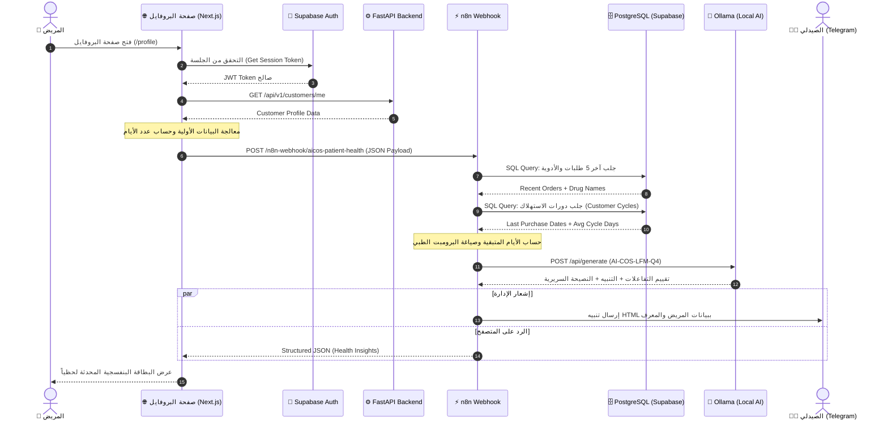

# 🏥 AI-COS Patient Health Agent — المعمارية الهندسية ومخططات تدفق البيانات
### (System Architecture & Data Flow Specification)

---

## 1. مخطط المعمارية الشامل (High-Level Architecture)

```
┌─────────────────────────────────────────────────────────────────────────────────┐
│                          1. FRONTEND / CLIENT LAYER                             │
│                                                                                 │
│   ┌───────────────────────────┐          ┌──────────────────────────────────┐   │
│   │   Patient Profile Page    │          │      Supabase Auth Session       │   │
│   │    (/profile - Next.js)   │◀─────────┤      (JWT Access Token)          │   │
│   └─────────────┬─────────────┘          └──────────────────────────────────┘   │
└─────────────────┼───────────────────────────────────────────────────────────────┘
                  │
                  │  POST /n8n-webhook/aicos-patient-health
                  │  { customer_id, customer_name, order_count, condition, days }
                  ▼
┌─────────────────────────────────────────────────────────────────────────────────┐
│                      2. n8n AGENTIC WORKFLOW LAYER                              │
│                                                                                 │
│   ┌───────────────────────────┐          ┌──────────────────────────────────┐   │
│   │       Webhook Node        │─────────▶│    Postgres Node (Orders)        │   │
│   │   (Entry Point Receiver)  │          │ (SQL Query: Recent Medications)  │   │
│   └───────────────────────────┘          └────────────────┬─────────────────┘   │
│                                                           │                     │
│   ┌───────────────────────────┐          ┌────────────────▼─────────────────┐   │
│   │    Code Node: Evaluator   │◀─────────┤    Postgres Node (Cycles)        │   │
│   │   (Math & Prompt Builder) │          │ (SQL Query: Refill Gaps & Days)  │   │
│   └─────────────┬─────────────┘          └──────────────────────────────────┘   │
│                 │                                                               │
│                 │  Clinical Context + Structured Prompt                         │
│                 ▼                                                               │
│   ┌───────────────────────────┐          ┌──────────────────────────────────┐   │
│   │     Ask Ollama (LLM)      │─────────▶│    Code Node: Response Parser    │   │
│   │  (AI-COS-LFM-Q4:latest)   │          │ (Extracts 3 Structured Outputs)  │   │
│   └───────────────────────────┘          └────────────────┬─────────────────┘   │
│                                                           │                     │
│   ┌───────────────────────────┐          ┌────────────────▼─────────────────┐   │
│   │    Respond to Webhook     │          │    Notify Admin (Telegram)       │   │
│   │ (Instant JSON to Profile) │◀─────────┤ (HTML Alert to Pharmacy Staff)   │   │
│   └───────────────────────────┘          └──────────────────────────────────┘   │
└─────────────────────────────────────────────────────────────────────────────────┘
```

---

## 2. مخطط التسلسل الزمني (Sequence Diagram)



---

## 3. مواصفات كائن البيانات (Data Contracts)

### أ. البيانات الصادرة من الفرونت إند (Input Payload to n8n):
```json
{
  "customer_id": "ed680fa0-e241-4231-bae6-b377f96f03a6",
  "customer_name": "محمد ياسر",
  "order_count": 3,
  "chronic_condition": "حساسية ومناعة (Allergy)",
  "days_since_join": 25
}
```

### ب. الاستعلامات التكميلية لقاعدة البيانات (Internal Enrichment):
1. **استعلام سجل الأدوية (`Get Patient Orders`):**
   ```sql
   SELECT o.order_id::text, o.order_date::text, o.status,
          COALESCE(SUM(oi.price * oi.quantity)::text, '0') as total_amount,
          COALESCE(STRING_AGG(d.name, ', '), 'No drugs recorded') as drugs
   FROM orders o
   LEFT JOIN order_items oi ON oi.order_id = o.order_id
   LEFT JOIN drugs d ON d.drug_id = oi.drug_id
   LEFT JOIN customers c ON c.customer_id = o.customer_id
   WHERE c.customer_id = :customer_id
   GROUP BY o.order_id, o.order_date, o.status
   ORDER BY o.order_date DESC LIMIT 5;
   ```
2. **استعلام دورات الاستهلاك (`Get Churn Data`):**
   ```sql
   SELECT cc.last_purchase_date::text, cc.avg_cycle_days, d.name as drug_name, d.category
   FROM customer_cycles cc
   LEFT JOIN drugs d ON d.drug_id = cc.drug_id
   WHERE cc.customer_id = :customer_id;
   ```

### ج. البيانات المعادة للمتصفح (Response Payload from n8n):
```json
{
  "patient_name": "محمد ياسر",
  "customer_id": "ed680fa0-e241-4231-bae6-b377f96f03a6",
  "order_count": 3,
  "chronic_condition": "حساسية ومناعة (Allergy)",
  "interaction_check": "لا توجد تعارضات معروفة مع الأدوية الحالية للمريض.",
  "refill_alert": "يُرجى استشارة الصيدلي قبل إعادة التعبئة لتقييم الحساسية.",
  "ai_recommendation": "يُنصح بتجنب المضادات الحيوية واسعة الطيف بسبب تاريخ الحساسية.",
  "llm_source": "ollama:AI-COS-LFM-Q4"
}
```
