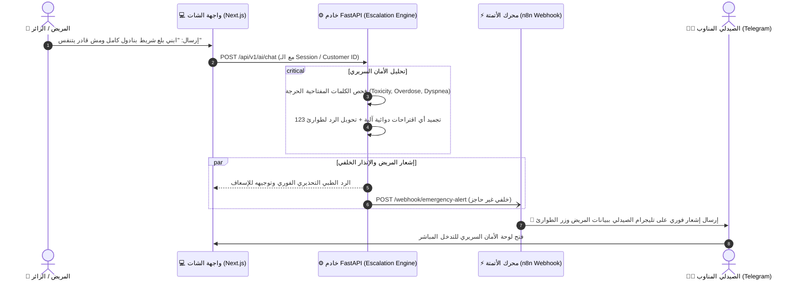

# 🚨 دليل سير العمل الأول: التصعيد والإنذار السريري للحالات الطارئة
## AI-COS Medical Emergency Escalation Workflow (`workflow_1_emergency_escalation.json`)

---

## 1. 🎯 ملخص تنفيذي وفلسفة التصميم (Executive Summary)
في أي منظومة صيدلانية ذكية تتعامل مع مرضى حقيقيين، يُعتبر **الخطأ أو التأخير في حالات التسمم أو الجرعات الزائدة مسألة حياة أو موت**.
أغلب مشاريع التخرج تكتفي بوضع شات بوت (AI Chatbot) يجيب بردود نصية عامة، مما يشكل خطراً قانونياً وسريرياً كبيراً (Clinical & Legal Liability).

**الابتكار في هذا السير عمل:**
تحويل الشات بوت من مجرد "مولّد نصوص" إلى **نظام استشعار مبكر للحوادث (Event-Driven Incident Sensor)**. بمجرد أن يكتب المريض عبارة استغاثة حرجة (مثل: *"ابني بلع شريط بنادول ومش قادر يتنفس"* أو *"أعاني من ألم حاد في الصدر"*):
1. يلتقط محرك `EscalationEngine` في الباك إند النية السريرية فورياً وبزمن استجابة **صفر تأخير (0 Latency)**.
2. يطلق الباك إند حدثاً في الخلفية (Background Asynchronous Task) دون تعطيل رد الشات بوت للمريض.
3. يستقبل هذا الـ Workflow الحدث عبر **Webhook آمن**، ويقوم في كسر من الثانية بتوليد وتوجيه **إنذار أحمر طارئ إلى تليجرام الصيدلي المناوب** مرفقاً بهوية المريض الدقيقة، ورقم الجلسة، ونص الاستغاثة، وزر انتقال سريع للوحة التحكم.

---

## 2. 🏗️ المخطط المعماري وتدفق البيانات (System Architecture)



---

## 3. 🧩 التشريح الفني لعقد سير العمل (Node-by-Node Breakdown)

يتكون سير العمل من عقدتين رئيستين تم تصميمهما لتوفير أقصى درجات السرعة والموثوقية:

### العقدة الأولى: `1. Emergency Webhook`
* **النوع:** `n8n-nodes-base.webhook` (الإصدار v2).
* **المسار (Path):** `/webhook/emergency-alert` (أو `/webhook-test/emergency-alert` أثناء التطوير).
* **طريقة الاستدعاء (Method):** `POST`.
* **نمط الاستجابة (Response Mode):** `On Received` — يرد فوراً بـ `HTTP 200 OK` على الباك إند بمجرد استلام الرسالة، حتى لا يتم حجز أي اتصالات في خادم الصيدلية.
* **عقد الأمان (Security Token):** يدعم التحقق من ترويسة `X-Internal-Token` لمطابقتها مع مفتاح الخدمة الداخلي `N8N_SERVICE_KEY` لمنع أي استدعاء عشوائي من خارج المنظومة.
* **عقد البيانات المستلمة (JSON Payload Contract):**
```json
{
  "event": "medical_emergency",
  "session_id": "محمد ياسر سعد نقودي (ID: a080ebc5...)",
  "customer_name": "محمد ياسر سعد نقودي",
  "customer_id": "a080ebc5-b08e-4f74-bc3e-e863450440d7",
  "user_message": "ابني الصغير بلع شريط بنادول كامل ومش قادر يتنفس",
  "priority": "critical_emergency",
  "alert_message": "حالة طوارئ طبية عاجلة: يُرجى التوجه فوراً إلى أقرب مستشفى...",
  "timestamp": "2026-09-06 02:40:15"
}
```

---

### العقدة الثانية: `2. Send Telegram Alert`
* **النوع:** `n8n-nodes-base.telegram` (الإصدار v1.2).
* **معرّف المحادثة (Chat ID):** `6262223810` (معرف قناة أو شات الصيدلي المناوب).
* **تنسيق النص (Parse Mode):** `HTML` مع تمييز العناوين والأكواد بالخط الغامق والأقواس البرمجية `<code>`.
* **قالب الرسالة المعتمد (Template):**
```html
🚨 <b>إنذار سريري حرج — AI-COS Emergency Alert</b>
━━━━━━━━━━━━━━━━━━━━━━━━━━━━
👤 <b>المريض:</b> {{ $json.body.customer_name || 'زائر غير مسجل (Guest)' }}
🆔 <b>المعرّف / الجلسة:</b> <code>{{ $json.body.customer_id || $json.body.session_id }}</code>
⚠️ <b>درجة الخطورة:</b> 🔴 حالة طوارئ حرجة ({{ $json.body.priority }})
💬 <b>نص الاستغاثة:</b>
<i>"{{ $json.body.user_message }}"</i>

⚡ <b>الإجراء الآلي المتخذ:</b>
{{ $json.body.alert_message || 'تم توجيه المريض للإسعاف وتجميد التوصيات الدوائية فوراً.' }}

👨‍⚕️ <b>الإجراء البشري المطلوب:</b> يرجى تدخل الصيدلي المناوب فوراً.
🕒 <b>التوقيت:</b> {{ $json.body.timestamp }}
```
* **الأزرار التفاعلية (Inline Keyboard):**
  * زر: `🚑 لوحة تحكم الأمان السريري`
  * الرابط: `http://localhost:3000/admin/agentic-ai` (ينقل الصيدلي بنقرة واحدة لشاشة المراقبة المباشرة).

---

## 4. 🔬 الربط مع الكود البرمجي للباك إند (Backend Code Integration)

يتم تفعيل هذا السير عمل من خلال دالة `generate_ai_response` داخل ملف `service.py`:

```python
# فحص الطوارئ اللحظي
if escalation.get("is_emergency"):
    try:
        # إطلاق الحدث في الخلفية دون تعطيل الرد على العميل
        asyncio.create_task(_notify_emergency_n8n(
            session_id=session_id,
            message=message,
            escalation=escalation,
            customer_name=customer_name,
            customer_id=customer_id,
        ))
    except Exception as e:
        logger.warning(f"[Emergency Webhook Task] Failed to spawn task: {e}")
```

كما تتولى دالة `_notify_emergency_n8n` إرسال الـ HTTP POST Request باستخدام مكتبة `httpx.AsyncClient` مع Timeout سريع (4 ثوانٍ فقط) لضمان عدم تأثر الخادم إطلاقاً.

---

## 5. 🎓 كيف تشرح هذا السير عمل في مناقشة مشروع التخرج؟ (Defense Strategy)

### الفكرة الجوهرية التي تبهر بها اللجنة:
> *"يا دكتور، في أغلب المواقع الشات بوت لو مريض قال له (ابني بلع علبة دواء كاملة ومغماً عليه)، البوت ممكن يقعد يقترح عليه أدوية أو يشرح له المادة الفعالة وده خطر جنائي وسريري جسيم.*
> *في منظومتنا AI-COS طبقنا معيار **Zero-Latency Clinical Circuit Breaker**:*
> *1. الذكاء الاصطناعي بيتعمل له Override لحظي ويتجمد تماماً ويطلب منه الاتصال بالإسعاف (123).*
> *2. في نفس الثانية وبدون أي تدخل بشري، سير العمل في n8n بيبعت Alarm فوري لتليجرام الصيدلي المناوب باسم المريض ورقمه ومعرف جلسته وزر للتدخل السريع.*
> *ده بينقل المشروع من مجرد تطبيق تجاري، لنظام رعاية صحية ذكي متوافق مع معايير السلامة السريرية العالمية."*

---

## 6. ❓ أهم أسئلة الدكاترة المتوقعة وكيفية الرد عليها:

* **س1: لو المريض زائر ومش عامل تسجيل دخول، هتعرفوا منين؟**
  * **الإجابة:** الواجهة بتولد تلقائياً معرّف جلسة فريد لكل متصفح `guest_xxxx` وبتسجله في رسالة التليجرام كـ `زائر غير مسجل`، ولو مسجل دخول، بيظهر اسمه الكامل من جدول `customers` في قاعدة البيانات ورقم هاتفه.
* **س2: هل إرسال التنبيه لـ n8n بيبطأ رد الشات بوت على المريض؟**
  * **الإجابة:** إطلاقاً؛ لأننا بنستخدم `asyncio.create_task` في بايثون بتقنية **Fire-and-Forget**؛ الرد بيرجع للمريض في أقل من ثانية، وعملية إرسال الـ Webhook والتليجرام بتتم في Background Thread منفصل تماماً.
* **س3: ليه استخدمتوا n8n كـ Orchestration Engine ومبعتوش لتليجرام من بايثون مباشرة؟**
  * **الإجابة:** لفصل المسؤوليات (Separation of Concerns). خادم الـ Core Backend مسؤول فقط عن المنطق الطبي وقاعدة البيانات، بينما مسارات التواصل والإشعارات وتعدد القنوات (تليجرام، واتساب، رسائل SMS، Slack للمستشفى) يتم إدارتها وتعديلها مركزياً وبمرونة عبر n8n دون الحاجة لإعادة عمل Deploy أو تعديل كود الباك إند.
