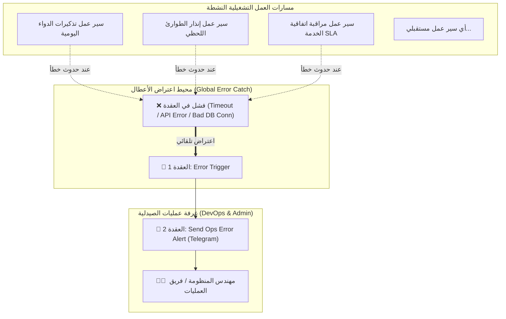

# ⚠️ دليل سير العمل الثاني: المعالج المركزي للأعطال التشغيلية
## AI-COS Centralized Ops Error Monitoring & Dead Letter Queue (`workflow_2_global_error_handler.json`)

---

## 1. 🎯 ملخص تنفيذي وفلسفة التصميم (Executive Summary)
أخطر ما يهدد مشاريع الأتمتة السحابية ونظم المعلومات هو ما يُعرف برمجياً بـ **"الأعطال الصامتة" (Silent Failures)**. 
تخيل أن نظام الصيدلية يقوم يومياً بجدولة مئات التذكيرات الدوائية لمرضى القلب والسكر عبر WhatsApp أو Telegram، وفجأة ينقطع الإنترنت أو تنتهي صلاحية API Token؛ إذا توقف النظام في صمت دون أن يعلم فريق الـ DevOps أو الصيدلي المسؤول، سينقطع الدواء عن المرضى ويتعرض النظام لأزمة ثقة ومسؤولية قانونية.

**الابتكار في هذا السير عمل:**
بناء **موجّه أعطال مركزي فوري (Global Dead Letter Queue / Error Orchestrator)** يربط جميع مسارات العمل المؤتمتة في المنظومة. 
بمجرد حدوث أي استثناء برمجـي (Unhandled Exception) أو فشل اتصال أو خطأ منطقي في أي عقدة داخل n8n:
1. يتم اعتراض الخطأ فوراً وحجزه عبر مشغل `Error Trigger` الأصلي.
2. يتم تجميع سياق العطل بالكامل: (اسم الـ Workflow، العقدة المتعثرة، رسالة الخطأ الصادرة من الخادم، رقم الـ Execution الفريد، وتوقيت الحدوث).
3. يتم إطلاق إنذار تشغيلي مباشر لقناة الدعم الفني وDevOps على Telegram للتدخل السريع ومنع توقف الخدمات الحيوية.

---

## 2. 🏗️ المخطط المعماري وتدفق معالجة الأعطال (Error Interception Architecture)



---

## 3. 🧩 التشريح الفني لعقد سير العمل (Node-by-Node Breakdown)

يتكون سير العمل من عقدتين أساسيتين توفران حماية 360 درجة لجميع التدفقات:

### العقدة الأولى: `Error Trigger`
* **النوع:** `n8n-nodes-base.errorTrigger` (الإصدار v1).
* **الوظيفة:** تعمل كمستمع عام (Global Event Listener). هذه العقدة لا تحتاج لمشغّل زمني ولا Webhook خارجي؛ بل ترتبط بإعدادات مسارات العمل الأخرى عبر خاصية `Settings -> Error Workflow`.
* **البيانات المستلمة تلقائياً من نظام n8n:**
```json
{
  "execution": {
    "id": "231",
    "url": "http://localhost:5678/execution/231",
    "error": {
      "message": "connect ECONNREFUSED 127.0.0.1:8000",
      "node": {
        "name": "1. Pull Pending Reminders",
        "type": "n8n-nodes-base.httpRequest"
      }
    },
    "lastNodeExecuted": "2026-09-06T02:26:14.120Z"
  },
  "workflow": {
    "id": "e3300003-a1c0-4000-8000-000000000001",
    "name": "AI-COS Governance SLA Monitor"
  }
}
```

---

### العقدة الثانية: `Send Ops Error Alert`
* **النوع:** `n8n-nodes-base.telegram` (الإصدار v1.2).
* **معرّف المحادثة (Chat ID):** `6262223810` (قناة تنبيهات العمليات والـ DevOps).
* **نمط التنسيق:** `HTML`.
* **قالب الرسالة التشغيلية المعتمد:**
```html
⚠️ <b>عطل تشغيلي في منظومة الأتمتة — AI-COS Ops Alert</b>
━━━━━━━━━━━━━━━━━━━━━━━━━━━━
⚙️ <b>سير العمل المتأثر:</b> {{ $json.workflow.name }}
🛑 <b>العقدة المتعثرة:</b> {{ $json.execution.error.node.name || 'Unknown Node' }}
❌ <b>رسالة الخطأ:</b> <code>{{ $json.execution.error.message || 'Execution Error' }}</code>
🆔 <b>رقم التشغيل:</b> #{{ $json.execution.id }}
🕒 <b>التوقيت:</b> {{ $json.execution.lastNodeExecuted || new Date().toISOString() }}

🛠️ <b>الإجراء المتبع:</b> تم تسجيل الخطأ في سجلات المراقبة لإعادة المحاولة (Self-Healing).
```

---

## 4. ⚙️ كيفية ربط أي سير عمل جديد بـ Global Error Handler

لكي يستفيد أي سير عمل موجود أو جديد في المنظومة من هذا المعالج المركزي:
1. افتح الـ Workflow في واجهة n8n.
2. من القائمة العلوية يميناً، اضغط على أيقونة الترس (**Workflow Settings**).
3. في حقل **Error Workflow**، اختر: `AI-COS Global Error Handler`.
4. احفظ الـ Workflow (`Save`).
5. **النتيجة:** في حال تعثر أي خطوة في الـ Workflow مستقبلاً، سيتم تفعيل سير عمل الأخطاء فوراً دون توقف النظام.

---

## 5. 🎓 كيف تشرح هذا السير عمل في مناقشة مشروع التخرج؟ (Defense Strategy)

### القيمة المضافة لطلاب نظم معلومات الأعمال (BIS):
> *"يا دكتور، في علوم نظم المعلومات وهندسة البرمجيات (Software Engineering)، كتابة كود بيشتغل في الحالة الطبيعية (Happy Path) يمثل فقط 50% من جودة النظام؛ الـ 50% الأخرى هي: **ماذا يحدث عندما يقع السيستم؟ (Failure Handling & Resiliency)**.*
> *لو خادم قاعدة البيانات توقف فجأة أو مزود خدمة الواتساب تعطل، نظامنا لا يفشل بصمت (Zero Silent Failures).*
> *قمنا بتطبيق نمط **Centralized Dead-Letter Queue (DLQ)** عبر n8n؛ بمجرد تعثر أي عقدة، يتم التقاط الاستثناء وإرسال تقرير تشخيصي (Diagnostics Report) لمهندسي الدعم الفني يحدد بالضبط رقم الـ Execution والعقدة الفاشلة ونص الخطأ، لتفعيل المعالجة الذاتية (Self-Healing).*
> *هذا يثبت أن مشروعنا مبني وفق معايير **Enterprise Observability & Site Reliability Engineering (SRE)** الجاهزة لسوق العمل الحقيقي."*

---

## 6. ❓ أهم أسئلة الدكاترة المتوقعة وكيفية الرد عليها:

* **س1: ما فائدة هذا السير طالما n8n يعرض الأخطاء في لوحة التحكم؟**
  * **الإجابة:** مهندس العمليات أو الصيدلي لا يجلس 24 ساعة يراقب شاشة n8n؛ التنبيه التلقائي عبر Telegram يحقق مبدأ **Push Notification vs Pull Monitoring**، فيصل الإنذار إلى هاتف المهندس في نفس ثانية حدوث العطل مع تشخيص دقيق للسبب.
* **س2: هل هذا يغني عن الـ Logging الداخلي في الباك إند؟**
  * **الإجابة:** لا، هما يكملان بعضهما؛ الباك إند يوثق في `audit_logs` و `backend_debug.log` باستخدام بايثون، بينما n8n يتولى مراقبة طبقة التكامل الخارجي (Integration Layer) مع APIs والشبكات ومزودي الطرف الثالث.
* **س3: كيف يمكن تطوير هذا السير عمل مستقبلاً؟**
  * **الإجابة:** يمكن إضافة عقدة تقوم تلقائياً بعمل `Retry Execution` بعد 5 دقائق (Exponential Backoff)، أو فتح Ticket تلقائياً في Jira / GitHub Issues لمتابعة العطل برمجياً.
