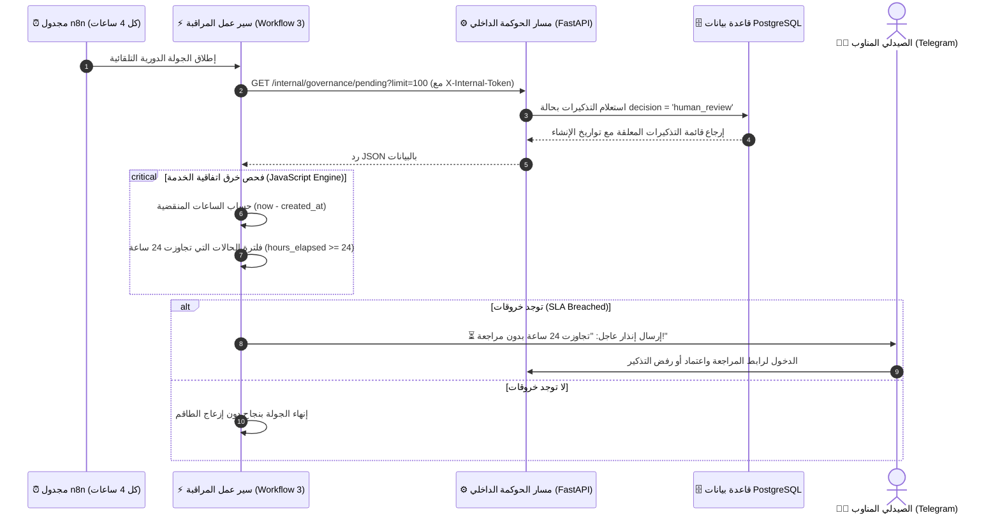

# ⏳ دليل سير العمل الثالث: مراقب اتفاقية مستوى الخدمة لحوكمة الذكاء الاصطناعي
## AI-COS Governance SLA Monitor & Human Review Escort (`workflow_3_governance_sla_monitor.json`)

---

## 1. 🎯 ملخص تنفيذي وفلسفة التصميم (Executive Summary)
أكبر نقطة ضعف في مشاريع الذكاء الاصطناعي الطبية هي ترك القرارات للذكاء الاصطناعي بنسبة 100% دون إشراف بشري (Autonomous Black Box).
لذلك، قامت منصة **AI-COS** بتطبيق معيار عالمي يُدعى **"الإنسان في الحلقة" (Human-in-the-Loop - HITL)**:
* عندما تكون ثقة الذكاء الاصطناعي في تحديد موعد جرعة المريض المزمن عالية (>80%)، يقوم النظام بإرسال التذكير آلياً (`auto_send`).
* عندما تقل الثقة عن الحد الآمن، يرفض النظام إرسال التذكير تلقائياً ويحوّله إلى طابور المراجعة البشرية (`human_review`) ليعتمده الصيدلي بيده.

**المعضلة التشغيلية التي يحلها هذا السير عمل:**
ماذا لو كان الصيدلي منشغلاً في الصيدلية ونسي الدخول للوحة التحكم لمراجعة الحالات المعلقة؟ إذا تأخر الاعتماد لأيام، سيتوقف علاج المريض المزمن (مريض سكر أو ضغط) ويفشل الهدف الإكلينيكي بالكامل!
**الحل المبتكر:**
قمنا ببرمجة **حارس زمني لاتفاقية مستوى الخدمة (SLA Governance Monitor)**:
سير عمل دوري ينطلق كل 4 ساعات، يفحص جميع التذكيرات المعلقة في طابور `human_review`، وإذا وجد أي تذكير مضى عليه أكثر من **24 ساعة** دون اتخاذ قرار صيدلاني، يطلق إنذاراً أحمر حازماً لتليجرام الصيدلي مرفقاً ببيانات المريض والدواء ومدة التأخير ورابط فوري للوحة الاعتماد.

---

## 2. 🏗️ المخطط المعماري وتدفق المراقبة (Governance & SLA Architecture)



---

## 3. 🧩 التشريح الفني لعقد سير العمل (Node-by-Node Breakdown)

يتكون سير العمل من 5 عقد متكاملة تنفذ منطق الحوكمة السريرية خطوة بخطوة:

### العقدة الأولى: `Schedule Trigger (Every 4 Hours)`
* **النوع:** `n8n-nodes-base.scheduleTrigger` (الإصدار v1).
* **التوقيت:** يعمل تلقائياً كل **4 ساعات** على مدار الـ 24 ساعة لمتابعة نوبات العمل (Shifts).

---

### العقدة الثانية: `1. Pull Pending Reminders`
* **النوع:** `n8n-nodes-base.httpRequest` (الإصدار v4).
* **المسار:** `http://host.docker.internal:8000/internal/governance/pending?limit=100`.
* **الأمان والحماية بين الخوادم (M2M Security):**
  * يتم تمرير الترويسة السرية: `X-Internal-Token: dev-secret-key-12345-very-long-and-secure-32-chars`.
  * مسار الباك إند محمي بتابعية `verify_internal_token` التي تستخدم خوارزمية `secrets.compare_digest` المقاومة لهجمات التوقيت (Timing-Attack Safe).

---

### العقدة الثالثة: `2. Filter SLA Breaches (>24h)`
* **النوع:** `n8n-nodes-base.code` (محرك JavaScript الأصلي في n8n).
* **الكود البرمجي المنفذ:**
```javascript
const items = $input.all();
const breached = [];
const now = new Date().getTime();

for (const item of items) {
  const data = item.json;
  if (data.decision === 'human_review') {
    const createdTime = data.created_at ? new Date(data.created_at).getTime() : now;
    const hoursElapsed = Math.round((now - createdTime) / (1000 * 60 * 60));
    
    // فحص شرط تجاوز الـ 24 ساعة
    if (hoursElapsed >= 24) {
      breached.push({
        json: {
          ...data,
          hours_elapsed: hoursElapsed,
          sla_breached: true
        }
      });
    }
  }
}

return breached;
```
* **الوظيفة:** استخراج فقط الحالات المخالفة التي مر عليها 24 ساعة فأكثر وإلحاق عدد الساعات الفعلي بالبيانات.

---

### العقدة الرابعة: `3. Is Breached?`
* **النوع:** `n8n-nodes-base.if` (الإصدار v1).
* **الشرط:** التحقق من أن القيمة المنطقية `sla_breached == true`.
* **الوظيفة:** منع إرسال أي رسائل فارغة أو تنبيهات غير ضرورية إذا كانت كل الحالات تحت السيطرة.

---

### العقدة الخامسة: `4. Send SLA Breach Telegram Alert`
* **النوع:** `n8n-nodes-base.telegram` (الإصدار v1.2).
* **معرّف المحادثة (Chat ID):** `6262223810`.
* **قالب الإنذار المعتمد:**
```html
⏳ <b>تنبيه خرق مدة المراجعة — SLA Breach Alert</b>
━━━━━━━━━━━━━━━━━━━━━━━━━━━━
👨‍⚕️ <b>د. الصيدلي المناوب:</b> يوجد تذكير معلق ينتظر قرارك الطبي العاجل!
👤 <b>المريض:</b> {{ $json.customer_name }}
💊 <b>الدواء:</b> {{ $json.drug_name }}
📊 <b>نسبة ثقة الذكاء الاصطناعي:</b> {{ Math.round(($json.cycle_confidence || 0.72) * 100) }}%
⏱️ <b>مدة الانتظار الحالية:</b> {{ $json.hours_elapsed }} ساعة (تجاوزت حد الـ 24 ساعة)

🔗 <b>الإجراء الفوري:</b> يرجى فتح لوحة المراجعة البشرية للاعتماد أو الرفض.
```
* **الزر التفاعلي السريع:**
  * الزر: `📋 فتح لوحة Human Review`
  * الرابط: `http://localhost:3000/admin/ai-review` (يأخذ الصيدلي مباشرة لشاشة الاعتماد).

---

## 4. 🔬 الربط مع نقطة الحوكمة في الباك إند (FastAPI Endpoint)

يستعلم هذا السير عمل عن نقطة مخصصة في الباك إند تم بناؤها في [`backend/app/domains/order/router.py`](file:///d:/Graduation%20Project/AI-COS-Pharmacy/backend/app/domains/order/router.py):

```python
@router.get("/internal/governance/pending", summary="استرجاع التذكيرات المعلقة للمراجعة البشرية")
async def get_pending_governance_reminders(
    limit: int = 100,
    _: bool = Depends(verify_internal_token),
    db: AsyncSession = Depends(get_db),
):
    # جلب التذكيرات ذات الحالة 'human_review' مع ربط أسماء المرضى والأدوية
    ...
```

---

## 5. 🎓 كيف تشرح هذا السير عمل في مناقشة مشروع التخرج؟ (Defense Strategy)

### الفكرة الجوهرية لطلاب نظم معلومات الأعمال (BIS):
> *"يا دكتور، في تطبيقات الأعمال الحرجة (Mission-Critical Systems)، مصطلح **SLA (Service Level Agreement)** هو معيار الالتزام بين المنظومة والعميل.*
> *لو تركنا الذكاء الاصطناعي يحول الحالات للصيدلي، والصيدلي مراجعش، المريض ممكن يفوته ميعاد جرعة الإنسولين أو دواء الضغط وتنتكس حالته.*
> *هنا يأتي دور **Workflow 3: Governance SLA Monitor**:*
> *1. يراقب أداء الصيدلي البشري نفسه (Auditing the Human Pharmacist).*
> *2. يطبق قاعدة الـ 24 ساعة بصرامة برمجية.*
> *3. عند حدوث أي تقاعس أو تأخير، يطلق تنبيهاً تصعيدياً فورياً مع عداد الساعات المنقضية ورابط المراجعة.*
> *هذا التطبيق العملي لمفهوم **AI Governance & Clinical Compliance**، وهو يثبت أننا لا نبني مجرد برمجة عادية، بل ندير عمليات رعاية صحية متكاملة."*

---

## 6. ❓ أهم أسئلة الدكاترة المتوقعة وكيفية الرد عليها:

* **س1: لماذا حددتم مهلة الـ SLA بـ 24 ساعة تحديداً؟**
  * **الإجابة:** لأن مرضى الحالات المزمنة يحتاجون شراء أدويتهم قبل نفاد العبوة بيوم إلى ثلاثة أيام كحد أقصى؛ فتأخير المراجعة أكثر من 24 ساعة يهدد سلامة خطة العلاج والتزام المريض الدوائي (Medication Adherence).
* **س2: ماذا لو لم يتدخل الصيدلي حتى بعد إنذار الـ SLA الأول؟**
  * **الإجابة:** في البنية المؤسسية للنظام، يمكن تصعيد الإنذار التالي بعد 12 ساعة إضافية إلى مدير الصيدليات (Pharmacy Director / Head of Operations) هاتفياً أو عبر الرسائل النصية القصيرة SMS كإجراء طوارئ تنظيمي.
* **س3: كيف يتم تأمين الاتصال بين حاوية n8n وخادم الباك إند؟**
  * **الإجابة:** الاتصال يتم داخل الشبكة المغلقة (Internal Docker Bridge Network) عبر `host.docker.internal`، وتطلب النقطة ترويسة أمان `X-Internal-Token` بمفتاح تشفير 32 حرفاً، مع منع وصول أي مستخدم عادي إليها.
