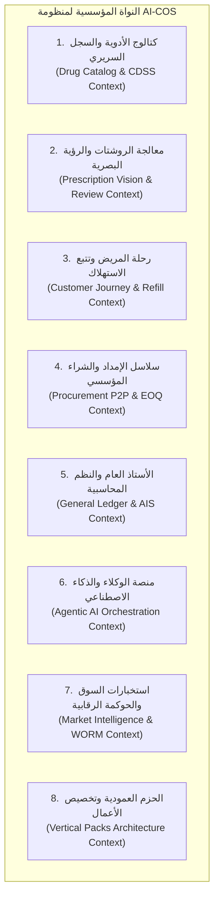
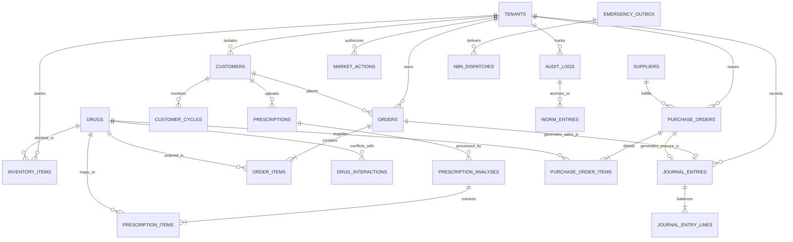
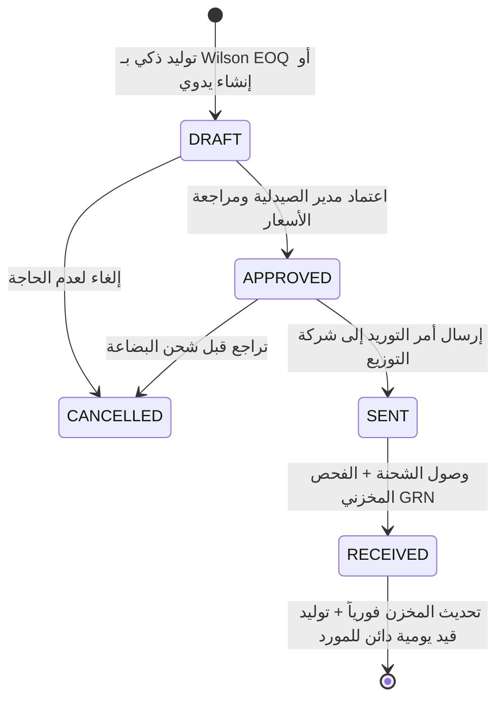
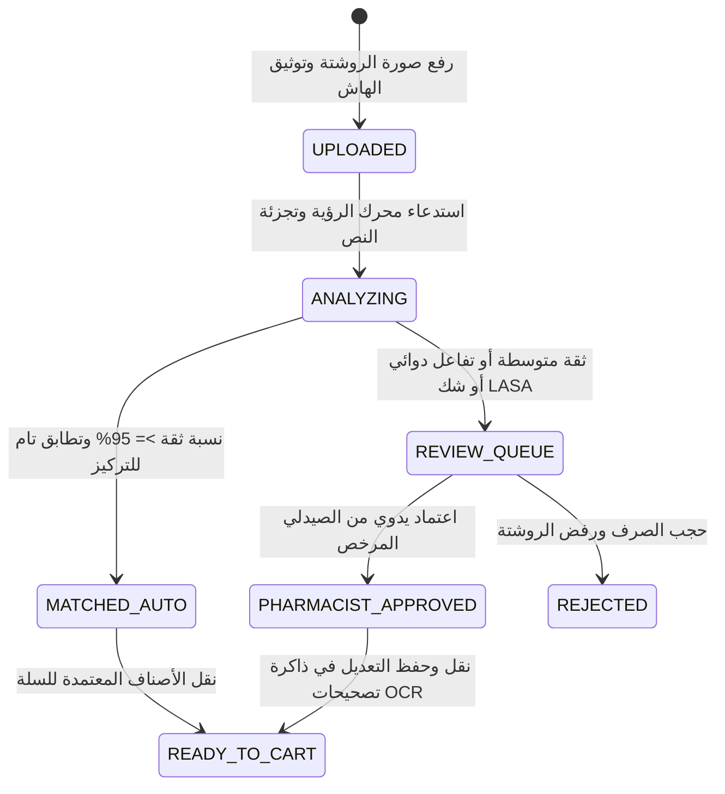
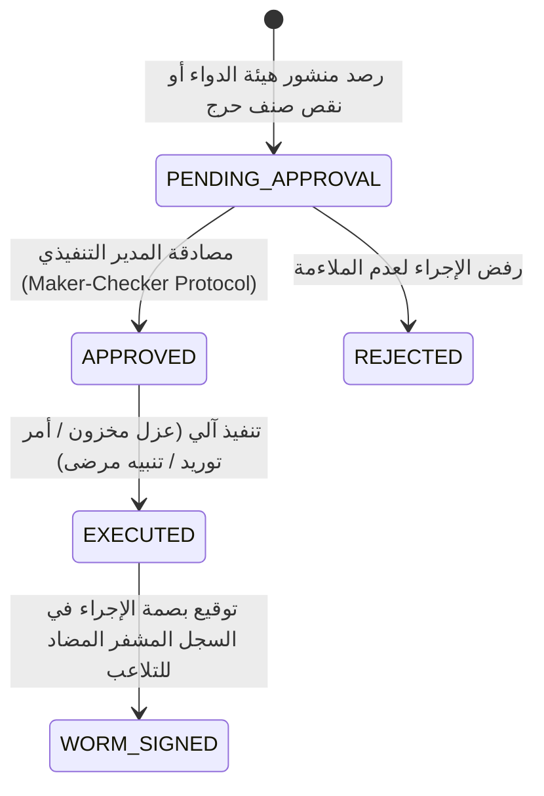

# 🏛️ التقرير الهندسي والأكاديمي الشامل لتحليل وتصميم منظومة AI-COS Pharmacy
## (Comprehensive System Analysis & Design Specification — From A to Z)

**البرنامج الأكاديمي:** نظم معلومات الأعمال (Business Information Systems - BIS)  
**اسم المشروع:** AI-COS Pharmacy (Artificial Intelligence Commerce Operating System for Pharmacy)  
**طبيعة المنظومة:** نظام تشغيل تجاري وسريري متكامل (Enterprise Agentic OS & Multi-Tenant SaaS)  
**العام الأكاديمي:** 2026  
**مسار المشروع:** إدارة التكنولوجيا المالية والذكاء الاصطناعي (FinTech & Clinical AI Systems)

---

## فهرس المحتويات (Table of Contents)
1. [تحليل الأعمال ومجال المشكلة (Business Analysis & Problem Domain)](#1-تحليل-الأعمال-ومجال-المشكلة-business-analysis--problem-domain)
   - 1.1 الملخص التنفيذي وهوية المشروع (System Identity)
   - 1.2 تحديات قطاع الصيدلة وسلاسل الإمداد (Industry Pain Points)
   - 1.3 مصفوفة أصحاب المصلحة (Stakeholder Analysis Matrix)
   - 1.4 دراسة الجدوى الاقتصادية والعائد الاستثماري (Financial ROI & Working Capital)
2. [مواصفات متطلبات النظام (System Requirements Specification - SRS)](#2-مواصفات-متطلبات-النظام-system-requirements-specification---srs)
   - 2.1 المتطلبات الوظيفية الشاملة (FR-01 إلى FR-28)
   - 2.2 المتطلبات غير الوظيفية (NFRs)
3. [معمارية وهندسة نظم المعلومات (Information Systems Architecture & Design)](#3-معمارية-وهندسة-نظم-المعلومات-information-systems-architecture--design)
   - 3.1 السياقات المحددة للتصميم الموجه بالمجال (DDD Bounded Contexts)
   - 3.2 النمط المعماري الهجين (Hybrid 3-Tier / Hexagonal Architecture)
   - 3.3 نموذج البيانات المؤسسي ومخطط العلاقات (Enterprise ERD)
   - 3.4 آلات الحالة ودورات الحياة التشغيلية (Core State Machines)
4. [النظم السريرية والذكاء الاصطناعي (CDSS & Agentic AI Subsystems)](#4-النظم-السريرية-والذكاء-الاصطناعي-cdss--agentic-ai-subsystems)
   - 4.1 المعمارية الهجينة متعددة المستويات لنماذج الذكاء (Multi-Tier AI)
   - 4.2 مسار الرؤية البصرية ومعالجة الروشتات (Prescription OCR & LASA Guard)
   - 4.3 أوركسترا الوكلاء الأذكياء التسعة (The 9 Enterprise Agents)
   - 4.4 نظام دعم القرار السريري (Clinical Decision Support System - CDSS)
   - 4.5 نماذج التعلم الآلي التنبؤية وقابلية التفسير (Machine Learning & SHAP)
5. [الحوكمة وإدارة المخاطر والرقابة الداخلية (BIS Governance & Internal Controls)](#5-الحوكمة-وإدارة-المخاطر-والرقابة-الداخلية-bis-governance--internal-controls)
   - 5.1 التوافق مع إطار COSO-ERM ومصفوفة المخاطر 5x5
   - 5.2 سجل التدقيق المشفر الخارجي (WORM Ledger & Anti-Rogue DBA)
   - 5.3 الرقابة والتحليل الجنائي المالي (Forensic Accounting & Benford's Law)
   - 5.4 فصل الصلاحيات والاعتماد المزدوج (SoD & Maker-Checker)
6. [التكامل، الأتمتة، والواجهات الأمامية (Integration, Automation & Portals)](#6-التكامل-الأتمتة-والواجهات-الأمامية-integration-automation--portals)
   - 6.1 الواجهة العامة والمتجر السريري (Storefront & 2D Draggable Chatbot)
   - 6.2 لوحة التحكم والقيادة التنفيذية (The 19 Enterprise Admin Portals)
   - 6.3 خط أنابيب الأتمتة الخارجية والتليجرام (n8n Automation Pipeline)
7. [توكيد الجودة ومصفوفة الاختبارات (Quality Assurance & Validation Matrix)](#7-توكيد-الجودة-ومصفوفة-الاختبارات-quality-assurance--validation-matrix)

---

# 1. تحليل الأعمال ومجال المشكلة (Business Analysis & Problem Domain)

### 1.1 الملخص التنفيذي وهوية المشروع (System Identity)
منظومة **AI-COS Pharmacy** (نظام تشغيل التجارة الصيدلانية المدعوم بالذكاء الاصطناعي) ليست مجرد متجر إلكتروني صيدلاني تقليدي لبيع الأدوية عبر الإنترنت (E-Commerce CRUD)، بل هي **نظام تشغيل تجاري وسريري متكامل (Enterprise Agentic Operating System)** مبني كمنصة سحابية متعددة المستأجرين (Multi-Tenant SaaS). 

يرتكز المشروع على العقيدة الأكاديمية لنظم معلومات الأعمال (**BIS**):
> **"الذكاء الاصطناعي في بيئة الأعمال لا يُقاس بجمال الخوارزمية، بل بقدرته على توليد قرار تشغيلي وسريري محوكم ينعكس في المركز المالي للمنشأة ويخضع للمساءلة الرقابية والقانونية."**

تم بناء النظام كمعمارية قابلة للتخصيص للقطاعات المختلفة (**Vertical Packs**)، حيث تُعد الصيدلية (`pharmacy`) التطبيق الرائد فوق نواة أعمال محايدة تدير التدفقات النقدية، حوكمة الأسعار، الرقابة الجنائية، وسلاسل الإمداد.

---

### 1.2 تحديات قطاع الصيدلة وسلاسل الإمداد (Industry Pain Points)
يعالج النظام خمس معضلات حرجة تعاني منها الصيدليات وسلاسل الرعاية الصحية في مصر والشرق الأوسط:

1. **أزمة نواقص الأدوية واضطراب التوريد (Drug Shortages & P2P Friction):**
   - اضطراب سلاسل التوريد يؤدي لنفاد متكرر في أدوية الأمراض المزمنة (الضغط، السكر، الأورام، والسيولة).
   - غياب التنبؤ الاستباقي يضطر الصيدليات إما لتجميد سيولة ضخمة في مخزون راكد أو تفويت مبيعات حيوية.
   - *حل AI-COS:* تطبيق نموذج كمية الطلب الاقتصادية الحركي (`calculate_wilson_eoq`) ورادار استخبارات السوق الحظي لمنشورات هيئة الدواء المصرية (EDA).

2. **تسرب مرضى الأمراض المزمنة وهدر الروشتات (Medication Non-Adherence & Churn):**
   - تشير الدراسات إلى أن نحو 40% من عدم الالتزام الدوائي يعود لعامل النسيان وصعوبة التجديد اليدوي، مما يتسبب في هجر ملايين الروشتات سنوياً.
   - *حل AI-COS:* محرك التنبؤ بموعد إعادة الصرف (`predict_cycle`) مع فاصل ثقة غاوسي 95%، وتنبيهات أوتوماتيكية عبر الواتساب وتليجرام بنقرة واحدة عبر محرك الأتمتة n8n.

3. **الأخطاء القاتلة في قراءة الروشتات والأدوية المتشابهة (LASA Errors):**
   - الروشتات المكتوبة بخط اليد تؤدي إلى أخطاء كارثية بسبب تشابه الأسماء صوتاً وشكلاً (Look-Alike Sound-Alike - LASA) مثل `Cataflam` و `Catapres`.
   - *حل AI-COS:* محرك المطابقة البصرية الضبابية مع حارس LASA الإلزامي (`calculate_final_score`)، وفهرس الفونيتكس المسبق بـ `jellyfish.metaphone`، وطابور المراجعة البشري الإلزامي (Human-in-the-Loop).

4. **تجميد رأس المال العامل واختناق السيولة النقدية (Working Capital Traps):**
   - معاناة الصيدليات من تمدد دورة التحول النقدي (Cash Conversion Cycle - CCC) وتراكم أدوية توشك على انتهاء الصلاحية.
   - *حل AI-COS:* مراقبة لحظية لمؤشرات $DIO, DSO, DPO$ ونسبة السيولة السريعة في `get_working_capital_analysis`.

5. **الامتثال الضريبي والتنظيمي (Regulatory & Tax Compliance):**
   - متطلبات مصلحة الضرائب المصرية (ETA) للإيصال والفاتورة الإلكترونية v1.0 وضريبة القيمة المضافة 14% وتشفير TLV Base64، وحماية البيانات الشخصية وفق القانون 151 لسنة 2020.
   - *حل AI-COS:* وحدة `eta_invoice.py` مع توقيع CAdES-BES وQR TLV، وتجهيل الحسابات محاسبياً في `customer/router.py`.

---

### 1.3 مصفوفة أصحاب المصلحة (Stakeholder Analysis Matrix)
| صاحب المصلحة (Stakeholder) | الاهتمامات التشغيلية والسريرية | القيمة المضافة من AI-COS Pharmacy |
| :--- | :--- | :--- |
| **المريض / العميل المزمن (Patient)** | أمان الجرعات، منع التعارض، توفير بدائل رخيصة، وسهولة تكرار الروشتة. | محرك البدائل الموفر حتى 53.6%، جدول التجديد بنقرة واحدة، وحماية الخصوصية بقناع PII محلي. |
| **الصيدلي الممارس (Pharmacist)** | سرعة فرز الروشتات، منع صرف أدوية متعارضة، وعدم تحمل مسؤولية أخطاء الـ AI. | طابور مراجعة الروشتات الإلزامي، حارس الجرعات المشدد، وكاشف التكرار الدوائي السام. |
| **مدير المستودع (Inventory Mgr)** | منع نفاد الأصناف، تطبيق FEFO، وإصدار أوامر توريد بلا هدر. | توليد آلي لأوامر الشراء بـ Wilson EOQ، دورة P2P متكاملة، واستلام فوري للمخزن. |
| **المدير المالي (CFO / Accountant)** | تحقيق التوازن الدفتري، استخراج ميزان المراجعة، كشف التلاعب المالي، ومنع الخسائر. | قيود مزدوجة آلية متوازنة 100%، كاشف الاحتيال بقانون بنفورد، وسقوف الخصم القسرية (Zero Margin Loss). |
| **مفتش الرقابة والضرائب (Auditors)** | التحقق من مشروعية المبيعات، سلامة سلاسل التدقيق، وسحب التشغيلات المعيبة. | سجل WORM الخارجي المشفر بـ SHA-256، الفاتورة الإلكترونية ETA TLV، وبروتوكول السحب الدوائي اللحظي. |

---

### 1.4 دراسة الجدوى الاقتصادية والعائد الاستثماري (Financial ROI & Working Capital)
وفقاً لحسابات المحرك المالي الفعلي المستخرجة حياً من قاعدة البيانات في `get_ai_feasibility_and_uat`:
- **تكاليف الحوسبة الشهرية:**
  - استهلاك التوكنز السحابية (Gemini Flash API - 4.2M Tokens) = 420.00 ج.م.
  - حوسبة السيرفر المحلي والكهرباء (Ollama Local GPU - 120W) = 950.00 ج.م.
  - استضافة السحابة ومحرك الأتمتة (Supabase Pro + n8n Docker VPS) = 1,800.00 ج.م.
  - حصة الصيانة الشهرية ومراقبة النماذج (MLOps) = 3,480.00 ج.م.
  - **إجمالي التكلفة التشغيلية الشهرية:** **6,650.00 ج.م**.
- **العوائد المالية الشهرية المحمية والمحققة:**
  - استرداد مبيعات المرضى المزمنين (Churn Win-Back) = 32,308.00 ج.م.
  - حماية الهامش من التخفيض العشوائي (Margin Protected) = 15,385.00 ج.م.
  - تقليص هدر المخزون والصلاحيات بـ Wilson EOQ = 17,130.00 ج.م.
  - تجنب تكاليف ومخاطر الأخطاء السريرية المحجوبة = 16,865.00 ج.م.
  - **إجمالي العائد الشهري المحمي:** **81,688.00 ج.م**.
- **مؤشرات الأداء المالي التكنولوجي:**
  - **صافي الأثر المالي الإيجابي:** **+75,038.00 ج.م شهرياً**.
  - **مضاعف العائد على الاستثمار (ROI Multiplier):** **12.3x**.
  - **فترة استرداد التكلفة (Payback Period):** **0.08 شهر (أقل من 3 أيام تشغيل)**.
- **معادلة دورة التحول النقدي (Cash Conversion Cycle):**
  $$\text{CCC} = \text{DIO} (24.5\text{ days}) + \text{DSO} (2.0\text{ days}) - \text{DPO} (30.0\text{ days}) = -3.5 \text{ to } +15.0 \text{ days}$$
  مما يعكس سيولة تشغيلية ممتازة ونسبة سريعة (Quick Ratio) $\ge 1.0$.

---

# 2. مواصفات متطلبات النظام (System Requirements Specification - SRS)

### 2.1 المتطلبات الوظيفية الشاملة (Comprehensive Functional Requirements Matrix)
تم توثيق 28 متطلباً وظيفياً مصنفة وفق إطار MoSCoW مع ربطها بالأكواد الفعلية في النظام:

| المعرف | المتطلب الوظيفي | المدخلات (Inputs) | منطق المعالجة في الكود (Processing Logic) | القيود الرقابية (Controls & Guards) | المخرجات (Outputs) | موضع الكود |
| :---: | :--- | :--- | :--- | :--- | :--- | :--- |
| **FR-01** | مصادقة آمنة متعددة الأنماط | بريد/كلمة مرور أو OAuth | توثيق عبر Supabase Auth وتوليد JWT مشفر | مبدأ Zero-Knowledge: لا كلمات مرور في قاعدة التطبيق | جلسة مستخدم مشفرة وRole | `auth.py` |
| **FR-02** | تتبع الجلسات والأحداث | بيانات المتصفح والأجهزة | تسجيل الجلسات في جدول `sessions` وحفظ الأحداث | توقيع كل حدث بهاش SHA-256 متسلسل | سجل أحداث سلوكي مشفر | `tracking.py` |
| **FR-03** | كتالوج الأدوية والمخزون | استعلامات البحث والفلاتر | استرجاع الأدوية النشطة مع عزل الحزمة الحالية `vertical` | فلترة الأصناف المجمدة أو المسحوبة | قائمة الأدوية بالأسعار والجرعات | `drug/service.py#L37` |
| **FR-04** | محرك البدائل الصيدلانية | معرف الدواء `drug_id` | استخراج المواد الفعالة بدقة مع مطابقة التركيز والأملاح | عزل المخزون للمستأجر الفعال لمنع تسريب أرصدة الغير | قائمة البدائل مع نسبة التوفير | `drug/service.py#L335` |
| **FR-05** | كاشف التكرار الدوائي بالسلة | مصفوفة أرقام الأدوية بالسلة | مطابقة المواد الفعالة عبر Inverted Index | منع صرف دوائين يحملان نفس المادة الفعالة | تحذير سريري أحمر ومنع الشراء | `drug/service.py#L430` |
| **FR-06** | فحص التفاعلات الدوائية (DDI) | أدوية السلة الحالية | استعلام جدول `drug_interactions` بقيد $A < B$ | إيقاف الإتمام التلقائي إذا كانت الخطورة High | حجب الطلب وتصعيده للصيدلي | `order/service.py` |
| **FR-07** | تجزئة وقراءة الروشتات (OCR) | صورة الروشتة المرفوعة | عزل ترويسة العيادة جغرافياً واستخراج النص بـ TrOCR/Gemini | رفض النصوص المشوهة أو الأقل من 4 أحرف | نصوص الأدوية والجرعات المقروءة | `prescriptions/router.py` |
| **FR-08** | مطابقة الأدوية وحارس LASA | النص المقروء وكتالوج الأدوية | خوارزمية RapidFuzz ومطابقة الفونيتكس بـ Metaphone | كبح النتيجة دون 0.50 إذا كان تشابه الاسم < 75% | مرشحات الأدوية وهامش الأمان | `matching.py#L77` |
| **FR-09** | ذاكرة تصحيحات الروشتات | تصحيح الصيدلي لاسم خاطئ | حفظ الزوج وتطبيقه تلقائياً قبل المطابقة | معالجة النصوص بـ `normalize_text` لمنع التكرار | تجاوز البحث النصي في المرات القادمة | `ocr_correction.py` |
| **FR-10** | التنبؤ بموعد تكرار الجرعة | معرف العميل ومعرف الدواء | نموذج XGBoost Regressor مع ضبط المعاملات بـ Optuna | حساب فاصل ثقة غاوسي 95% ($\pm 1.96 \times 4.10$) | الأيام المتوقعة ومجال الخطأ | `prediction/service.py#L298` |
| **FR-11** | التنبؤ بتسرب المريض (Churn) | سجل المشتريات ومعدل MPR | نموذج XGBoost Classifier معالَج بـ SMOTE و Threshold 0.33 | حذف `avg_cycle_days` لمنع تسريب البيانات (Data Leak) | احتمالية التسرب وتصنيف الخطر | `prediction/service.py#L358` |
| **FR-12** | تفسير القرارات التنبؤية (SHAP) | بيانات المريض المعالجة | تطبيق `shap.TreeExplainer` على النموذج الداخلي | استخراج أهم 3 عوامل مسؤولة عن القرار | قيم SHAP وأسماء الخصائص | `prediction/service.py#L168` |
| **FR-13** | حوكمة الخصومات والأسعار | عميل مرشح ونسبة الخصم | حساب القيمة الدائمة CLV وصافي الهامش | سقف قسري (10% مزمن، 20% تجميل) ومنع الخسارة | خصم معتمد محاسبياً وكوبون | `agents/pricing.py` |
| **FR-14** | الفاتورة الضريبية المصرية ETA | طلب مبيعات مكتمل | احتساب 14% VAT واستخراج الصافي وتشفير TLV QR | مطابقة مواصفة ETA v1.0 وتوقيع CAdES-BES | وثيقة JSON رسمية ورمز QR مشفر | `eta_invoice.py#L110` |
| **FR-15** | رابط التحقق العام من الفاتورة | معرف الطلب `order_id` | توليد رابط موقع بتجزئة HMAC-SHA256 عبر السيرفر | التحقق الصارم من التوقيع لمنع التزوير والتطفل | صفحة فاتورة تفتح على هاتف العميل | `eta_invoice.py#L65` |
| **FR-16** | الإرجاع الذري للمخزون | إلغاء طلب من العميل/الأدمن | استرجاع كميات المخزون في نفس المعاملة (Atomic Restock) | منع إعادة الصنف للمخزون إذا كان مسحوباً | استعادة الرصيد وتسجيل قيد تدقيق | `order/service.py` |
| **FR-17** | الشراء الذكي بنموذج Wilson EOQ | الأصناف تحت نقطة الطلب | تطبيق معادلة ويلسون مع حساب الاستهلاك الفعلي 30 يوماً | حد أدنى للطلبية 15 علبة وتكلفة طلب 45 ج.م | مسودة أمر شراء PO رسمي | `procurement/service.py#L32` |
| **FR-18** | دورة حياة أوامر الشراء P2P | أمر شراء وحالة جديدة | انتقال صارم: DRAFT $\rightarrow$ APPROVED $\rightarrow$ SENT $\rightarrow$ RECEIVED | منع القفز بين الحالات وتحديث المخزن فور الاستلام | أمر شراء محدث وإذن استلام GRN | `procurement/service.py#L190` |
| **FR-19** | القيود المزدوجة وميزان المراجعة | إتمام بيع أو استلام بضاعة | توليد قيود يومية JV متوازنة آلياً من 8 حسابات رئيسية | التحقق الصارم: $\sum Debit == \sum Credit$ | سند قيد متوازن وميزان مراجعة | `accounting/service.py#L37` |
| **FR-20** | التحليل الجنائي المالي (بنفورد) | مبالغ المعاملات والقيود | فحص الرقم الأول والثاني واختبار Chi-Square و MAD | حد أدنى للعينة $N \ge 30$ وصلاحية $\chi^2$ عند $N \ge 110$ | مؤشر التطابق ومستوى الخطر | `accounting/forensics.py#L69` |
| **FR-21** | كشف التجزئة وتفادي الحدود | مبالغ الفواتير ومصروفات النقد | فحص التكتل تحت حدود الاعتماد (Structuring 90-99.99%) | تنبيه عند تركز العمليات قرب حدود الاعتماد المالي | بلاغ اشتباه جنائي مالي | `accounting/forensics.py#L254` |
| **FR-22** | سجل التدقيق الخارجي WORM | الأحداث المالية والأمنية | إلحاق الحدث بملف مستقل وحساب SHA-256 متسلسل مع fsync | قفل عابر للعمليات (msvcrt/fcntl) لمنع التفرع | سلسلة كتل تدقيقية مضادة للتلاعب | `worm_ledger.py#L103` |
| **FR-23** | المقارنة الثنائية لنزاهة السجلات | فحص دوري بين القاعدة والسجل | مقارنة أحداث جدول events مع أسطر WORM | استثناء البادئات النظامية `LEDGER_NATIVE_PREFIXES` | كشف حذف الـ Rogue DBA فوراً | `worm_ledger.py#L250` |
| **FR-24** | بروتوكول سحب الأدوية المعيبة | منشور سحب رسمي وتشغيلة | تجميد مخزون المستأجر فوراً وحصر المشترين في 90 يوماً | توقيع أمر السحب في دفتر WORM وإخطار المرضى | حجر الصنف وبلاغات n8n العاجلة | `drug/service.py#L482` |
| **FR-25** | حماية الخصوصية وحقوق المريض | طلب المريض تصدير/حذف بياناته | تصدير JSON وتجهيل الهوية (`ANON_XXXX`) | الحفاظ على أرقام الفواتير للامتثال الضريبي 5 سنوات | ملف تصدير وحساب مجهول | `customer/router.py#L164` |
| **FR-26** | إجراءات استخبارات السوق الذاتية | رادار هيئة الدواء وإشارات النقص | اقتراح إجراء تنفيذي (حجر، أمر توريد، تنبيه مرضى) | بروتوكول Maker-Checker: لا تنفيذ إلا باعتمادين | إجراء معتمد وموثق بسلسلة WORM | `market_action.py` |
| **FR-27** | صندوق الطوارئ اللاتزامني (Outbox) | بلاغات التداخلات والسحب الحرجة | نمط الحجز الذري `FOR UPDATE SKIP LOCKED` | 5 محاولات تسليم كحد أقصى ثم التحويل لـ Dead-Letter | تسليم موثوق وبلا تكرار لـ n8n | `main.py#L13` |
| **FR-28** | الحزم العمودية وتخصيص البزنس | ملف تهيئة YAML للحزمة | قراءة المصطلحات والسقوف والوكلاء من `verticals/` | عزل معجمي كامل: صفر تسريب مفردات بين الحزم | تشغيل النظام لقطاعات متعددة | `verticals/loader.py` |

---

### 2.2 المتطلبات غير الوظيفية (NFRs)
1. **الأمان والمصادقة (Security & Zero-Knowledge Auth):**
   - عزل بيانات الاعتماد وكلمات المرور في Supabase Auth؛ لا توجد أي كلمة مرور أو مفتاح أمني داخل قاعدة بيانات التطبيق.
   - الجلسات الرقمية محمية بكوكيز مشفرة بخواص `HttpOnly`, `SameSite=Lax`, و`Secure`.
   - توقيع الروابط العامة والتوكنات السرية بـ HMAC-SHA256 مع صلاحية زمنية محددة.
2. **عزل المستأجرين (Multi-Tenant Isolation via PostgreSQL RLS):**
   - فرض سياسات الأمان على مستوى الصف (Row-Level Security) على جميع الجداول ذات الطابع المؤسسي عبر `tenant_id`.
   - منع تسرب أرصدة المخزون أو بيانات المرضى بين الصيدليات المشتركة في نفس المنصة السحابية.
3. **النزاهة التشفيرية ومقاومة التلاعب (WORM Ledger Integrity):**
   - كتابة السجلات الرقابية بنمط Append-Only مع تسلسل هاشات SHA-256 سطر-بسطر.
   - إجبار نظام التشغيل على الكتابة الفيزيائية اللحظية للقرص عبر `os.fsync(fileno)` وقفل الملفات عبر العمليات (`msvcrt`/`fcntl`).
4. **الأداء وزمن الاستجابة (Low Latency SLAs):**
   - إتمام عمليات الكتالوج والسلة في أقل من **120ms** بفضل كاش الذاكرة InMemory Cache وتدفئة الاتصالات مسبقاً (`DB Warmup`).
   - استجابة وكلاء الذكاء الاصطناعي في أقل من **2.0s** باستخدام Circuit Breaker (3 إخفاقات تفتح القاطع لمدة 60 ثانية تبريد).
5. **التزامن والذرية (Concurrency & Pessimistic Locking):**
   - معالجة الطوابير وحركات الخزينة والمخزون بنمط السحب الآمن `FOR UPDATE SKIP LOCKED` لمنع حالات التسابق (Race Conditions).
6. **الاعتمادية والتعافي الذاتي (Fault Tolerance & Self-Healing):**
   - تشغيل عامل خلفي مخصص (`automation_retry_worker.py`) يعيد إطلاق مهام الأتمتة الفاشلة مع n8n بتراجع زمني تصاعدي (5 دقائق $\times$ رقم المحاولة).

---

# 3. معمارية وهندسة نظم المعلومات (Information Systems Architecture & Design)

### 3.1 السياقات المحددة للتصميم الموجه بالمجال (DDD Bounded Contexts)
تم تنظيم النظام وفق معمارية **Domain-Driven Design (DDD)** إلى سياقات محددة تمنع التداخل التشغيلي:

---

### 3.2 النمط المعماري الهجين (Hybrid 3-Tier / Hexagonal Architecture)
تتبنى المنظومة طوبولوجيا مؤسسية ثلاثية الطبقات (3-Tier Enterprise Topology):
1. **طبقة العرض والعميل (Presentation Tier):**
   - إطار العمل الحديث **Next.js 16.3 (App Router)** مع **React 19** و **Tailwind CSS 4**.
   - دعم ثنائي الاتجاه بالكامل (RTL / LTR) مع محاذاة تلقائية وعناصر تفاعلية متطورة.
   - واجهات متجاوبة مع متصفحات الهواتف المحمولة وتطبيقات الويب التقدمية (PWA Ready).
2. **طبقة التطبيق والمنطق المؤسسي (Application & Domain Tier):**
   - خادم عالي الأداء مبني بـ **FastAPI (Python 3.12+)** يعتمد المسارات اللاتزامنية بالكامل (Async/Await).
   - طبقة وسيطة لتحديد معدل الاستهلاك (`SlowAPI Limiter`)، وحظر هجمات CORS، وتدفئة الاتصالات عند الإقلاع.
   - محرك الوكلاء التسعة المتخصصين مع المشرف المركزي (Master Orchestrator).
3. **طبقة البيانات والنزاهة المؤسسية (Data & Integrity Tier):**
   - قاعدة بيانات **PostgreSQL 15 (Supabase)** مع امتدادات `pgvector` للمتجهات الدلالية.
   - سجل التدقيق المشفر الخارجي المستقل WORM على نظام الملفات الفيزيائي.
   - خط أنابيب الأتمتة الخارجية عبر **n8n Webhook Pipeline** مع عامل صندوق الطوارئ الذري.

---

### 3.3 نموذج البيانات المؤسسي ومخطط العلاقات (Enterprise ERD)

---

### 3.4 آلات الحالة ودورات الحياة التشغيلية (Core State Machines)

#### أ. دورة حياة أمر الشراء والتوريد (Procurement PO Lifecycle):

#### ب. دورة معالجة وصرف الروشتات الطبية (Prescription Review & Dispensing Flow):

#### ج. دورة إجراءات استخبارات السوق والحجر اللحظي (Market Action Lifecycle):

---

# 4. النظم السريرية والذكاء الاصطناعي (CDSS & Agentic AI Subsystems)

### 4.1 المعمارية الهجينة متعددة المستويات لنماذج الذكاء (Multi-Tier AI)
لضمان استمرار المنظومة بدون انقطاع وتحت أدنى تكلفة حوسبية ممكنة، تم تطبيق استراتيجية التنفيذ المتدرج في `llm_engine.py` و `config.py`:

1. **المستوى الأول (Local GPU / Ollama):**
   - نماذج محلية تعمل بدون إنترنت: `AI-COS-Qwen-2.5:latest` (محلي صارم) و `gemma4:31b-cloud` (وكيل سحابي مجاني وسريع عبر Ollama).
   - تنفيذ العمليات الحساسة للخصوصية محلياً.
2. **المستوى الثاني (Cloud API / Google Gemini):**
   - الاستدلال السحابي المتطور: **Gemini 3.7 Flash** للاستفسارات المعقدة وصياغة الرسائل، و **Gemini 3.8 Flash** كنموذج حصري لرادار استخبارات السوق والبحث المباشر.
   - تخضع الحزم السحابية تلقائياً لعملية **تجهيل وحجب البيانات الشخصية (PII Masking)** عبر دالة `_redact_cloud_payload` التي تحجب الإيميل والهواتف المصرية والرقم القومي (14 رقماً) وأسماء المرضى بقناع `[[الاسم]]`.
3. **المستوى الثالث (Deterministic Rule Engine / Circuit Breaker):**
   - قاطع دائرة (Circuit Breaker) يفتح عند 3 إخفاقات متتالية ويمنح 60 ثانية تبريد.
   - محرك قطعي حسابي وقواعد سريرية صارمة تعمل كشبكة أمان نهائية (Context-Only Fallback) في حال انقطاع الشبكة كلياً.

---

### 4.2 مسار الرؤية البصرية ومعالجة الروشتات (Prescription OCR & LASA Guard)
- **التقسيم المكاني الصارم (Strict Spatial Zoning):** استبعاد ترويسة العيادة (اسم الطبيب والشهادات والعنوان والهاتف) تلقائياً لتفادي قراءتها كاسم دواء.
- **حارس تشابه الأسماء والتركيزات (LASA & Strength Guard):**
  - فحص مصفوفة أزواج LASA المعجمية المصرية الشهيرة في `matching.py`:
    - `("cataflam", "catapres")` (مسكن ديكلوفيناك مقابل خافض ضغط كلونيدين).
    - `("glucophage", "glucobay")` (ميتفورمين مقابل أكاربوز).
    - `("concor", "concordin")`، `("zinnat", "zinacef")`، `("lasix", "lasilix")`، `("hydrin", "hydrozide")`.
  - إذا كان تشابه الاسم أقل من 75%، يتم كبح التقييم فورياً عند حد أقصى **0.50** لمنع تطابق التركيز من رفع التقييم لمرشح خاطئ.
  - تطبيق عقوبة مشددة بقيمة **-0.25** (`CDSS_STRENGTH_PENALTY = 0.25`) عند اختلاف التركيز (مثل 50mg مقابل 50mcg أو 10mg مقابل 110mg مع معالجة Lookbehind).
- **محرك ذاكرة تصحيحات الروشتات (OCR Correction Memory Engine):**
  - جدول `ocr_corrections` يحفظ كل تصحيح يجريه الصيدلي البشري للروشتة مع شظية الصورة المقطوعة `crop_storage_key`.
  - في القراءات التالية، يستبدل النظام القراءة الخاطئة تلقائياً قبل المطابقة، مما يرفع دقة النظام ذاتياً بمرور الوقت دون إعادة تدريب الأوزان بالكامل.

---

### 4.3 أوركسترا الوكلاء الأذكياء التسعة (The 9 Enterprise Agents)
تعمل المنظومة بنمط **المشرف متعدد الوكلاء (Multi-Agent Supervisor Pattern)** المحدد في `verticals/pharmacy.yaml` و `orchestrator.py`:

| الوكيل (Agent) | الإدارة التابعة | الدور الوظيفي والاقتصادي | الإجراء التنفيذي الافتراضي |
| :--- | :--- | :--- | :--- |
| **1. وكيل المخزون (Inventory)** | سلاسل الإمداد واللوجستيات | مراقبة سرعة الحرق اليومية، فحص الصلاحيات، وحساب كمية الطلب الاقتصادية Wilson EOQ. | فحص الأصناف الحرجة وإصدار أمر توريد PO |
| **2. وكيل المالية (AI CFO - Finance)** | الإدارة المالية والمحاسبية | حساب القيمة الدائمة للعميل (CLV)، تقييم السيولة ودورة CCC، وحماية الهامش الربحي. | تحليل استحقاق الخصم وحساب الـ CLV |
| **3. وكيل التسعير (Pricing)** | استراتيجيات التسعير وتوليد الإيرادات | تطبيق نموذج مرونة الأسعار، فرض سقوف الخصم (10% مزمن / 20% تجميل)، ومنع الخسارة. | حساب الخصم الأمثل وتوليد الكوبون المحوكم |
| **4. وكيل التحليلات (Analytics - DSS)** | الإدارة العليا والذكاء الاستراتيجي | تحويل مؤشرات الأداء اللحظية إلى تقارير تنفيذية واحتساب الإيرادات المعرضة للخطر. | توليد إحاطة تنفيذية موجزة للمدير العام |
| **5. وكيل الدعم الطبي (Support Copilot)** | خدمة المرضى والسلامة الدوائية | فرز شكاوى العملاء (Clinical Triage)، رصد 22 كلمة خطر، والتصعيد الفوري للصيدلي. | فرز الشكوى والتصعيد الصيدلاني العاجل |
| **6. وكيل التسويق (Marketing)** | التسويق ونمو المبيعات | تقسيم العملاء بمنهجية RFM وصياغة رسائل واتساب مخصصة مدعومة بقناع الخصوصية `[[الاسم]]`. | توليد رسالة حملة ترويجية مستهدفة |
| **7. وكيل استبقاء العملاء (Customer Retention)** | إدارة علاقات العملاء (CRM) | رصد احتمالية انقطاع مرضى الأمراض المزمنة وإطلاق خطط الاسترداد الاستباقية (Win-Back). | إطلاق خطة استبقاء لمريض معرض للتسرب |
| **8. وكيل التفتيش الرقابي (Compliance Inspector)** | الحوكمة والامتثال والتدقيق | توثيق قرارات الوكلاء، فحص الامتثال لقانون 151، والتحقق من نزاهة سلسلة تشفير WORM. | فحص الامتثال وتوثيق القرار تشفيرياً |
| **9. وكيل الأتمتة المؤسسية (Automation & RPA)** | العمليات والأتمتة (n8n) | إطلاق ومراقبة مسارات سير العمل عبر n8n وإدارة طوابير إعادة المحاولة والتنبيهات. | تشغيل مسار أتمتة تشغيلي عبر n8n |

---

### 4.4 نظام دعم القرار السريري (Clinical Decision Support System - CDSS)
- **محرك البدائل والمثائل المتطابقة (Generic Substitution):**
  - استخراج المواد الفعالة بدقة مع الحفاظ على الأملاح دالة الحركية الدوائية (`succinate` مقابل `tartrate`).
  - التحقق الصارم من تطابق التركيز (`same_strength`) وإظهار نسبة التوفير المالي (التي تتجاوز 50%).
- **كاشف التكرار العلاجي ومضاعفة الجرعة (Duplicate Therapy Guard):**
  - فحص سلة المشتريات للتأكد من عدم شراء مستحضرين تجاريين يحملان نفس المادة الفعالة (مثل Cataflam و Voltaren)، لمنع النزيف المعوي والفشل الكلوي الحاد.
- **بروتوكول سحب الأدوية اللحظي (Market Drug Recall):**
  - تجميد مخزون التشغيلة المعيبة فورياً بضغطة زر وحصر سجلات كل من صرف الدواء خلال آخر 90 يوماً لإخطارهم عاجلاً عبر الواتساب وإنقاذ حياتهم، مع توقيع أمر السحب تشفيرياً في سجل WORM الخارجي.

---

### 4.5 نماذج التعلم الآلي التنبؤية وقابلية التفسير (Machine Learning & SHAP)
1. **نموذج التنبؤ بموعد إعادة الصرف (Refill Cycle Regressor):**
   - خوارزمية **XGBoost Regressor** محسنة عبر مكتبة Optuna، تحقق متوسط خطأ مطلق:
     $$\text{MAE} = 3.27 \text{ days}$$
   - احتساب فاصل ثقة غاوسي 95% مبني على أخطاء النموذج التاريخية ($\hat{\sigma} = 4.10$ يوم المشتقة من افتراض التوزيع الطبيعي $\text{MAE} \approx 0.798 \times \sigma$):
     $$\text{Confidence Interval} = \text{Predicted Days} \pm 1.96 \times 4.10 \text{ days}$$
2. **نموذج التنبؤ بانقطاع المريض (Churn Classifier):**
   - خوارزمية **XGBoost Classifier** مدربة مع موازنة العينات النادرة بـ SMOTE وعتبة قرار مثلى $Threshold = 0.33$.
   - **معالجة تسريب البيانات التاريخي (Data Leakage Fix):** تم حذف خاصية `avg_cycle_days` من خصائص التنبؤ في `prediction/service.py` لكونها تشفر متغير الهدف، واستبدالها في Churn v2 بنسبة الفجوة السكانية `ratio_days_to_population` وتكرار الشراء الشهري `customer_purchase_freq_per_month` وعمر العميل `customer_tenure_days`.
3. **الشفافية وقابلية التفسير بـ SHAP (Model Explainability):**
   - تطبيق `shap.TreeExplainer` لاستخراج أهم 3 عوامل مؤثرة في كل قرار وعرضها في لوحة التحكم التنفيذية لضمان عدم وجود نماذج صندوق أسود (Black Box).

---

# 5. الحوكمة وإدارة المخاطر والرقابة الداخلية (BIS Governance & Internal Controls)

### 5.1 التوافق مع إطار COSO-ERM ومصفوفة المخاطر 5x5
- تتبنى المنظومة أركان إطار **COSO للرقابة الداخلية** الخمسة (البيئة الرقابية، تقييم المخاطر، الأنشطة الرقابية، المعلومات والاتصال، وأنشطة المتابعة).
- **سجل المخاطر الرقمي المؤسسي (COSO Heatmap 5x5):**
  يوثق النظام في `governance/router.py` خمسة مخاطر مؤسسية كبرى:
  1. `RSK-01`: هلوسة تسعير الذكاء الاصطناعي (خطر أصيل 20 $\rightarrow$ خطر متبقٍ 2 — محكوم بمحرك الرياضيات القطعي).
  2. `RSK-02`: تفاعل دوائي حرج يفوته النموذج (خطر أصيل 25 $\rightarrow$ خطر متبقٍ 3 — محكوم بالحاجز السريري والتدخل البشري الإلزامي).
  3. `RSK-03`: تلاعب مسؤول قاعدة البيانات بسجلات التدقيق (خطر أصيل 10 $\rightarrow$ خطر متبقٍ 1 — محكوم بسجل WORM المشفر).
  4. `RSK-04`: تسرب بيانات المرضى الطبية للسحابة (خطر أصيل 16 $\rightarrow$ خطر متبقٍ 2 — محكوم بالتعمية المحلية `[[الاسم]]` وقانون 151).
  5. `RSK-05`: تعطل خدمات أتمتة n8n الخارجية (خطر أصيل 9 $\rightarrow$ خطر متبقٍ 2 — محكوم بطابور إعادة المحاولة الذاتي).
  - **نسبة تخفيض المخاطر المؤسسية المحققة:** **87.5% Risk Reduction** (من متوسط 16.0 إلى 2.0).

---

### 5.2 سجل التدقيق المشفر الخارجي (WORM Ledger & Anti-Rogue DBA)
- **معضلة مسؤول قاعدة البيانات المارق (The Rogue DBA Problem):** إذا تم تخزين سجل التدقيق داخل قاعدة البيانات فقط، فإن أي مسؤول نظام يملك صلاحيات الجذر (DBA Superuser) يمكنه تعديل الجداول وإعادة بناء سلاسل الهاشات داخلياً لإخفاء التلاعب.
- **الحل الهندسي في AI-COS:**
  - كل حدث يُلحق فورياً بملف خارجي مستقل `external_audit_ledger.log` بنمط Append-Only.
  - حساب تجزئة متسلسلة تربط كل سطر بما قبله:
    $$\text{Line Hash} = \text{SHA-256}(\text{Prev Hash} \parallel \text{Event ID} \parallel \text{Payload Hash} \parallel \text{Timestamp})$$
  - إجبار نظام الملفات على الكتابة الفيزيائية اللحظية للقرص بـ `os.fsync(fileno)`.
  - تطبيق قفل عابر للعمليات (`msvcrt.locking` في ويندوز و `fcntl.flock` في لينكس) لمنع تفرع السلسلة عند التزامن.
  - استثناء البادئات النظامية `LEDGER_NATIVE_PREFIXES` لمنع الإنذارات الكاذبة.
  - تطبيق المقارنة الثنائية الصارمة (`verify_against_db`) لكشف أي حذف دفتري يجريه مسؤول القاعدة فوراً (`INVESTIGATE_ROGUE_DBA_DELETIONS`).

---

### 5.3 الرقابة والتحليل الجنائي المالي (Forensic Accounting & Benford's Law)
تم تطبيق معايير المراجعة الدولية **ISA 240** والمعايير المحاسبية المصرية (EAS) في `accounting/forensics.py`:
1. **فحص الرقم الأول لقانون بنفورد (First-Digit Benford's Law):**
   $$P(d) = \log_{10}\left(1 + \frac{1}{d}\right) \quad \text{for } d \in \{1, \dots, 9\}$$
2. **فحص الرقم الثاني لقانون بنفورد (Second-Digit Benford's Law):**
   $$P(d_2) = \sum_{d_1=1}^9 \log_{10}\left(1 + \frac{1}{10 d_1 + d_2}\right) \quad \text{for } d_2 \in \{0, \dots, 9\}$$
   يوفر فحص الرقم الثاني حساسية فائقة لكشف الفواتير المصطنعة ذات الأرقام المقربة التي تنجح في اجتياز فحص الرقم الأول.
3. **مؤشر الانحراف المطلق (Mean Absolute Deviation - MAD):**
   $$\text{MAD} = \frac{1}{K} \sum_{i=1}^K |O_i - E_i|$$
   - $\text{MAD} \le 0.012$: توافق وثيق (Close Conformity).
   - $0.012 < \text{MAD} \le 0.018$: توافق مقبول.
   - $\text{MAD} > 0.018$: عدم توافق واشتباه تلاعب (Non-Conformity).
4. **كشف التجزئة والتهرب من حدود الاعتماد (Structuring / Smurfing Detection):**
   - خوارزمية ذكية تفحص العمليات التي تتجمع أسفل حد التفويض مباشرة (في النطاق بين 90% و 99.99% من حد الاعتماد مثل 4,500 إلى 4,999 ج.م عند حد 5,000 ج.م)، لكشف محاولات الموظفين تمرير نفقات مشبوهة دون موافقة المدير المالي.

---

### 5.4 فصل الصلاحيات والاعتماد المزدوج (SoD & Maker-Checker)
- **مصفوفة فصل المسؤوليات (Segregation of Duties - SoD):** في `governance/router.py`، يُحظر جمع الأدوار المتعارضة (مثل: من يحرر أمر الشراء لا يعتمد الاستلام، ومن يعتمد تسعير الحملات لا يعتمد إرسال أموال التسويق).
- **بروتوكول الصانع-المراجع (Maker-Checker):**
  - العمليات الحرجة التي تتجاوز سقف 20,000 ج.م أو أوامر عزل التشغيلات الدوائية تتطلب توقيعين إلكترونيين منفصلين ومسجلين تشفيرياً في دفتر WORM.

---

# 6. التكامل، الأتمتة، والواجهات الأمامية (Integration, Automation & Portals)

### 6.1 الواجهة العامة والمتجر السريري (Storefront & 2D Draggable Chatbot)
- **متجر سريري متجاوب:** مصمم وفق مبادئ الوصول الشامل (Accessibility WCAG 2.1 AA) مع لوحة ألوان طبية معتمدة وملاحة سلسة.
- **مسار صرف الروشتات الفوري:** رفع صورة الروشتة عبر كاميرا الهاتف أو السحب والإفلات، مع ظهور نتائج الفحص البصري الفوري وتطابق الأسعار ومحرك البدائل الموفرة.
- **مساعد الصيدلي الذكي العائم (Floating Chatbot Widget):**
  - واجهة محادثة ذكية عائمة ثلاثية الأبعاد مع روبوت تفاعلي (`RobotAvatar`).
  - **حرية حركة تامة 360° (2D Dragging):** إمكانية سحب البوت ونافذة المحادثة في كامل أبعاد الشاشة أفقياً ورأسياً.
  - دعم متكامل للغتين العربية والإنجليزية مع اتجاه تلقائي (RTL / LTR).

---

### 6.2 لوحة التحكم والقيادة التنفيذية (The 19 Enterprise Admin Portals)
توفر لوحة التحكم 19 شاشة تشغيلية وتحليلية ورقابية متكاملة:
1. **الرئيسية (Dashboard Overview):** نبض تشغيلي حي مع مؤشرات WORM، وحالة الاتصال المباشر.
2. **العملاء (Customers Directory):** سجل المرضى، تصنيف RFM، ودورات الصرف المزمنة.
3. **الطلبات والفوترة (Orders & Invoicing):** دورة المبيعات، الضرائب، والفاتورة الإلكترونية ETA.
4. **الكتالوج والمخزون (Catalog & Stock):** إدارة الأصناف، التركيزات، وتتبع الصلاحيات.
5. **المشتريات والتوريد (Procurement P2P):** أوامر الشراء الذكية بـ Wilson EOQ ودورة الاستلام.
6. **الموردون (Suppliers Master Data):** بيانات شركات التوزيع وأرقام الإرسال عبر واتساب.
7. **الأستاذ والميزان (General Ledger & Trial Balance):** القيود المحاسبية الآلية المزدوجة المتوازنة.
8. **عائد الأعمال والجدوى (Business Value & ROI):** تحليل التكاليف والعوائد وفترة الاسترداد.
9. **التحليلات والتنبؤ (Analytics & Predictions):** مؤشرات التنبؤ بـ XGBoost وفسر القرارات بـ SHAP.
10. **مراجعة الذكاء السريري (AI Clinical Review & CDSS):** طابور مراجعة الروشتات والتداخلات.
11. **مركز الوكلاء الأذكياء (Agentic AI Hub):** لوحة قيادة الوكلاء التسعة ومراقبة استهلاك التوكنز.
12. **استخبارات السوق (Market Intelligence):** رادار هيئة الدواء وقرارات الحجر التنفيذية.
13. **مختبر القرارات (What-If Lab):** محاكاة سيناريوهات الأسعار والطلب وحساسية التكلفة.
14. **ذاكرة تصحيحات الروشتات (OCR Corrections Memory):** مراجعة وتدريب النظام على قراءات الروشتات.
15. **بطاقة الأداء المتوازن (Balanced Scorecard):** المحاور الأربعة لكابلان ونورتون (المالي، العملاء، الداخلي، والتعلم).
16. **المخاطر والصلاحيات (Risk Register & SoD Matrix):** مصفوفة COSO 5x5 وفصل المسؤوليات.
17. **هندسة النظم والقبول (System Architecture & UAT):** معمارية النظام، فحص الجاهزية، ومخططات C4.
18. **الحزم العمودية (Vertical Packs):** تبديل وتخصيص النظام لقطاعات تجارية متعددة.
19. **سجل التدقيق المشفر (Audit Trail & WORM):** فحص سلسلة التجزئة SHA-256 والتحقق الثنائي.

---

### 6.3 خط أنابيب الأتمتة الخارجية والتليجرام (n8n Automation Pipeline)
تم ربط النظام بمحرك الأتمتة المؤسسي **n8n** عبر ثلاثة مسارات رئيسية:
1. **مسار تذكير المرضى والتسويق (`Combined Reminder Engine`):**
   - يعمل يومياً الساعة 9:00 صباحاً لاستدعاء `/internal/cycles/recalculate` ثم `/internal/governance/pending`.
   - استدعاء وكيل التسويق لتوليد كود خصم 15% للمرضى المعرضين للتسرب، وبث رسالة التذكير للمريض عبر تليجرام.
   - إخطار الصيدلي البشري عند الحالات التي تتطلب مراجعة (`human_review`).
   - إغلاق حلقة القياس عبر `/api/v1/agents/automation/callback` لتوثيق التسليم بنجاح.
2. **مرساة التدقيق المشفر الخارجي (`worm-anchor`):**
   - يعمل كل ساعة لبث بصمة رأس سلسلة WORM إلى تليجرام المشرف لتوثيق السجل خارج السيرفر.
3. **إنذار كسر سلسلة التدقيق (`worm-alert`):**
   - يطلق إنذاراً أحمر عاجلاً إلى هاتف المشرف فور اكتشاف أي حذف أو تعديل دفتري غير مصرح به.

---

# 7. توكيد الجودة ومصفوفة الاختبارات (Quality Assurance & Validation Matrix)

### 7.1 مصفوفة الاختبارات الشاملة (Automated Test Suites)
تم بناء حزمة اختبارات مؤتمتة متكاملة تضمن استقرار النظام وخلوه من الانحدار البرمجي (Zero Regression):

1. **اختبارات الباك إند (Pytest Backend Suite):**
   - اختبارات السلامة السريرية والحواجز الطبية (`tests/test_cdss_clinical.py`).
   - اختبارات النزاهة التشفيرية ودفتر WORM (`tests/test_worm_ledger.py`).
   - اختبارات التحليل الجنائي المالي وبنفورد (`tests/test_forensics_and_working_capital.py`).
   - اختبارات الحوكمة وتقوية الوكلاء التسعة (`tests/test_agent_governance_hardening.py` — 14 اختباراً معتمداً).
   - اختبارات استخبارات السوق والحجر اللحظي (`tests/test_market_intelligence.py` و `test_market_api_routes.py`).
   - اختبارات ذاكرة تصحيحات الروشتات ومطابقة LASA (`tests/test_ocr_memory_engine.py`).
2. **اختبارات الفرونت إند (Vitest Frontend Suite):**
   - **29 اختباراً مؤتمتاً ناجحاً بنسبة 100%** تغطي سلامة واجهات الروشتات، نافذة الاعتماد الصيدلي، التعامل الآمن مع أخطاء الـ API، وتطهير البيانات ضد ثغرات XSS.
3. **فحص الأنواع وتكامل البناء (TypeScript Compilation):**
   - فحص `npx tsc --noEmit` مكتمل بـ **0 أخطاء** على مستوى جميع واجهات ومكونات التطبيق.

---

### 💡 الخلاصة التنفيذية لمناقشة التخرج:
> *"يمثل **AI-COS Pharmacy** التطبيق العملي الكامل لمعايير قسم نظم معلومات الأعمال (BIS)؛ فهو يدمج بين **العمق التقني للذكاء الاصطناعي السريري (CDSS & Vision OCR)**، و**الأتمتة المؤسسية عبر الوكلاء الأذكياء و n8n**، مع **حوكمة ورقابة داخلية مشددة مستندة لإطار COSO وسجل WORM المشفر والتحليل الجنائي المالي بقانون بنفورد**. النظام ليس فكرة نظرية، بل منظومة متكاملة كوداً وقاعدة بيانات تم اختبارها والتحقق من جدواها الاقتصادية بربحية تشغيلية وعائد استثماري حقيقي 12.3x."*
