# 🏛️ التحليل الهندسي والنظامي الشامل لمنظومة AI-COS
## (AI-COS — Agentic Business Operating System: Comprehensive Academic System Analysis & Design Specification)

**البرنامج الأكاديمي:** نظم معلومات الأعمال (Business Information Systems — BIS)  
**العام الأكاديمي:** 2026  
**طبيعة المشروع:** نظام تشغيل تجاري وسريري معتمد على الوكلاء الأذكياء والحزم الرأسية المتخصصة (Agentic Business OS & Multi-Tenant Vertical Packs)  
**الهوية المؤسسية للمنظومة:** Core Business Operating System + Configurable Vertical Packs (Pharmacy Reference Vertical, Coffee Roastery Vertical, Apparel Vertical)  
**المرجع الكودي والتنفيذي:** مستودع المشروع الفعلي — خادم FastAPI + واجهة Next.js 16 + قاعدة بيانات PostgreSQL/Supabase + خط أتمتة n8n + سجل WORM التشفيري.

---

## فهرس المحتويات الشامل (Comprehensive Table of Contents)
1. [المقدمة (Introduction)](#1-المقدمة-introduction)
2. [نظرة عامة على النظام (System Overview)](#2-نظرة-عامة-على-النظام-system-overview)
3. [الخلفية وسياق المنظومة (Background)](#3-الخلفية-وسياق-المنظومة-background)
4. [بيان المشكلة (Problem Statement)](#4-بيان-المشكلة-problem-statement)
5. [الدوافع والحاجة المؤسسية (Motivation / Business Need)](#5-الدوافع-والحاجة-المؤسسية-motivation--business-need)
6. [أهداف المنظومة (System Objectives)](#6-أهداف-المنظومة-system-objectives)
7. [نطاق عمل النظام (System Scope)](#7-نطاق-عمل-النظام-system-scope)
8. [تحليل أصحاب المصلحة والفاعلين (Stakeholders and Actors)](#8-تحليل-أصحاب-المصلحة-والفاعلين-stakeholders-and-actors)
9. [مشكلات العمل الحالية والإجراءات التقليدية (Current Business Problems & Existing Processes)](#9-مشكلات-العمل-الحالية-والإجراءات-التقليدية-current-business-problems--existing-processes)
10. [المنظومة المقترحة (Proposed System)](#10-المنظومة-المقترحة-proposed-system)
11. [مواصفات المتطلبات الوظيفية (Functional Requirements Specification)](#11-مواصفات-المتطلبات-الوظيفية-functional-requirements-specification)
12. [مواصفات المتطلبات غير الوظيفية (Non-Functional Requirements Specification)](#12-مواصفات-المتطلبات-غير-الوظيفية-non-functional-requirements-specification)
13. [قواعد العمل المؤسسية الصارمة (Enterprise Business Rules)](#13-قواعد-العمل-المؤسسية-الصارمة-enterprise-business-rules)
14. [تحليل العمليات التجارية (Business Process Analysis)](#14-تحليل-العمليات-التجارية-business-process-analysis)
15. [سياق النظام وحدوده (System Context)](#15-سياق-النظام-وحدوده-system-context)
16. [مخطط تدفق البيانات - المستوى الصفري (DFD Level 0 — Context / System Level)](#16-مخطط-تدفق-البيانات---المستوى-الصفري-dfd-level-0--context--system-level)
17. [مخطط تدفق البيانات - المستوى الأول (DFD Level 1 — Major Enterprise Processes)](#17-مخطط-تدفق-البيانات---المستوى-الأول-dfd-level-1--major-enterprise-processes)
18. [مخطط تدفق البيانات - المستوى الثاني (DFD Level 2 — Sub-Processes)](#18-مخطط-تدفق-البيانات---المستوى-الثاني-dfd-level-2--sub-processes)
19. [مخطط تدفق البيانات - المستوى الثالث (DFD Level 3 — Deepest Agentic Decision Execution)](#19-مخطط-تدفق-البيانات---المستوى-الثالث-dfd-level-3--deepest-agentic-decision-execution)
20. [تحليل حالات الاستخدام (Use Case Analysis)](#20-تحليل-حالات-الاستخدام-use-case-analysis)
21. [مخطط حالات الاستخدام العام (Use Case Diagram)](#21-مخطط-حالات-الاستخدام-العام-use-case-diagram)
22. [مخططات النشاط التفصيلية (Activity Diagrams)](#22-مخططات-النشاط-التفصيلية-activity-diagrams)
23. [مخططات التتابع الزمني (Sequence Diagrams)](#23-مخططات-التتابع-الزمني-sequence-diagrams)
24. [مخطط علاقات الكيانات وقاعدة البيانات المؤسسية (Entity-Relationship Diagram — ERD)](#24-مخطط-علاقات-الكيانات-وقاعدة-البيانات-المؤسسية-entity-relationship-diagram--erd)
25. [تحليل البيانات وقاموس الكيانات الرئيسية (Data Analysis & Major Data Entities)](#25-تحليل-البيانات-وقاموس-الكيانات-الرئيسية-data-analysis--major-data-entities)
26. [تحليل الذكاء الاصطناعي ودعم القرار الوكلائي (AI & Agentic Decision Support Analysis)](#26-تحليل-الذكاء-الاصطناعي-ودعم-القرار-الوكلائي-ai--agentic-decision-support-analysis)
27. [تحليل المساعد المحادثاتي الذكي (Chatbot & Conversational System Analysis)](#27-تحليل-المساعد-المحادثاتي-الذكي-chatbot--conversational-system-analysis)
28. [تحليل أتمتة مهام العمل عبر n8n (n8n Workflow Automation Analysis)](#28-تحليل-أتمتة-مهام-العمل-عبر-n8n-n8n-workflow-automation-analysis)
29. [تحليل واجهة المستخدم وتجربة التفاعل (Frontend & User Interaction Analysis)](#29-تحليل-واجهة-المستخدم-وتجربة-التفاعل-frontend--user-interaction-analysis)
30. [تحليل معالجة الصور والملفات والوسائط (Image, File & Media Handling Analysis)](#30-تحليل-معالجة-الصور-والملفات-والوسائط-image-file--media-handling-analysis)
31. [تحليل المعمارية التقنية الكلية (System Architecture Analysis)](#31-تحليل-المعمارية-التقنية-الكلية-system-architecture-analysis)
32. [تحليل الأمن والحوكمة المؤسسية والرقابة الداخلية (Security, Governance & Internal Controls)](#32-تحليل-الأمن-والحوكمة-المؤسسية-والرقابة-الداخلية-security-governance--internal-controls)
33. [تحليل الحزم الرأسية والتخصيص القطاعي (Verticalization Analysis)](#33-تحليل-الحزم-الرأسية-والتخصيص-القطاعي-verticalization-analysis)
34. [تحليل التكامل والأنظمة الخارجية (Integration Analysis)](#34-تحليل-التكامل-والأنظمة-الخارجية-integration-analysis)
35. [دراسة الجدوى المتعددة (Multi-Dimensional Feasibility Study)](#35-دراسة-الجدوى-المتعددة-multi-dimensional-feasibility-study)
36. [المحددات والقيود الفنية والتنفيذية (Constraints & Limitations)](#36-المحددات-والقيود-الفنية-والتنفيذية-constraints--limitations)
37. [التطلعات والآفاق المستقبلية (Future Expansion)](#37-التطلعات-والآفاق-المستقبلية-future-expansion)
38. [خاتمة التحليل ومصفوفة التتبع والأدلة البرمجية (Overall Conclusion, Discrepancies & Traceability)](#38-خاتمة-التحليل-ومصفوفة-التتبع-والأدلة-البرمجية-overall-conclusion-discrepancies--traceability)

---

# 1. المقدمة (Introduction)
تمثل منظومة **AI-COS** (اختصاراً لـ *Artificial Intelligence Commerce Operating System*) طفرة معمارية في تصميم نظم المعلومات الإدارية والتجارية لطلاب وخريجي تخصص نظم معلومات الأعمال (**Business Information Systems — BIS**). لا يُعرّف هذا المشروع نفسه كنظام صيدلية منفصل أو برنامج نقاط بيع معزول (POS)، بل هو **نظام تشغيل تجاري وسريري متكامل مبني على الوكلاء الأذكياء (Autonomous Agentic Business Operating System)**.

تعتمد المنظومة فلسفة معمارية مزدوجة تتكون من:
1. **النواة المؤسسية الصلبة (Core Business OS):** وتحوي المحركات المحاسبية القائمة على القيد المزدوج، محركات دعم القرار المالي وسلاسل الإمداد بنموذج ويلسون للدفعة الاقتصادية (Wilson EOQ)، محرك الأتمتة المتقاطع مع n8n، وسجل التدقيق المشفر المنيع (WORM Ledger).
2. **الحزم الرأسية القابلة للتهيئة (Configurable Vertical Packs):** وهي طبقة توصيفية مرنة تسمح للنظام بتغيير مصطلحاته، سقوف تسعيره، وحواجز أمانه السريرية أو التشغيلية بحسب القطاع المستهدف (مثل قطاع الصيدليات كحزمة مرجعية أولى `pharmacy.yaml`، أو قطاع محامص ومقاهي القهوة المتخصصة `coffee.yaml`، أو قطاع الأزياء والمتاجر الموسمية `apparel.yaml`).

تُجسد المنظومة القاعدة الهندسية الصارمة: **«الكود يحسب، والنموذج اللغوي يصيغ» (Code Calculates, LLM Articulates)**؛ حيث يُحظر تماماً ترك القرارات المالية أو السريرية الحساسة لافتراضات النماذج اللغوية (Hallucinations)، وتتولى الخوارزميات الحتمية المقيدة بحواجز الحوكمة اتخاذ القرار بينما يقتصر دور الذكاء الاصطناعي التوليدي على صياغة النتائج وتبريرها للمستخدم البشري.

---

# 2. نظرة عامة على النظام (System Overview)
تم تصميم وتشييد منظومة AI-COS وفق طوبولوجيا مؤسسية ثلاثية الطبقات (3-Tier Enterprise Topology):
* **طبقة واجهة التفاعل المؤسسي (Presentation Tier):** مبنية بأحدث إصدارات إطار العمل Next.js 16.3 مع React 19 ونظام التنسيق Tailwind CSS v4، وتوفر واجهات ثنائية الاتجاه بالكامل (RTL/LTR) وموجهة لمختلف الفاعلين عبر 21 بوابة إدارية تنفيذية ومتجر تفاعلي مزود بشات بوت ذكي عائم (Floating Chat Widget).
* **طبقة المنطق والوكلاء الأذكياء (Application & Domain Tier):** مشيدة بواسطة FastAPI (Python 3.12+) وتعتمد البرمجة غير المتزامنة (Asynchronous Architecture) عبر 23 نطاقاً مؤسسياً (Domains)، مدعومة بمشرف وكلاء مركزي (Master Orchestrator) يدير 9 وكلاء أعمال متخصصين ووكيل مستقل لاستخبارات السوق وقرارات هيئة الدواء.
* **طبقة البيانات والنزاهة المؤسسية (Data & Integrity Tier):** تستند إلى قاعدة بيانات علائقية متطورة PostgreSQL 15 عبر منصة Supabase مع تفعيل ملحق المتجهات الدلالية `pgvector`، وعزل المستأجرين (RLS)، إلى جانب سجل تشفيري WORM على نظام الملفات الفيزيائي وخطوط تدفقات n8n لربط العمليات الخارجية ورسائل تيليجرام التنبيهية.

---

# 3. الخلفية وسياق المنظومة (Background)
عانت نظم تخطيط موارد المؤسسات (ERP) التقليدية ونظم نقاط البيع الصيدلانية والتجارية طوال العقدين الماضيين من كونها **أنظمة سلبية (Passive Systems)** تقتصر وظيفتها على تسجيل المعاملات بعد وقوعها دون أي قدرة تنبؤية أو استباقية. ومع تصاعد حدة التضخم، اضطراب سلاسل الإمداد العالمية، وتذبذب أسعار الصرف في السوق المصري والإقليمي، باتت المنشآت التجارية تواجه ضغوطاً متزايدة تتطلب الانتقال إلى **الأنظمة الفاعلة المستقلة (Active Agentic Systems)**.

في قطاع الصيدلة (وهو الحزمة التطبيقية الأولى في AI-COS)، يواجه أصحاب الأعمال ثلاث معضلات كبرى:
1. نفاد مخزون أدوية الأمراض المزمنة مما يهدد حياة المرضى ويؤدي لفقدان العملاء.
2. تجميد رأس المال العامل (Working Capital) في مخزون راكد بسبب أوامر شراء عشوائية تخلو من الحساب الرياضي الدقيق لمعدل النضوب (Burn Rate).
3. مخاطر الأخطاء الدوائية الناتجة عن تشابه الأسماء والشكل (LASA - Look-Alike Sound-Alike) في قراءة الروشتات الطبية اليدوية.

---

# 4. بيان المشكلة (Problem Statement)
يمكن تلخيص المشكلة الجوهرية التي تعالجها منظومة AI-COS في النقاط الآتية:
* **جزر البيانات المنعزلة (Data Silos):** انفصال نظام نقاط البيع عن سجلات الأستاذ العام، مما يمنع التوليد الآلي لقيود اليومية (Journal Entries) ويجعل حساب دورة التحول النقدي (Cash Conversion Cycle — CCC) تقديراً متأخراً لا يعكس الواقع اللحظي.
* **غياب الرقابة الجنائية الرقمية وخطر مسؤول قاعدة البيانات المارق (Rogue DBA Risk):** في قواعد البيانات التقليدية، يستطيع مدير النظام المارق تعديل أو حذف سجلات التدقيق المحاسبي لإخفاء الاختلاسات دون ترك أثر فيزيائي.
* **ضعف الالتزام الدوائي وفقدان العملاء:** عدم وجود آلية تنبؤية تحسب تاريخ انتهاء جرعة المريض المزمن تلقائياً وتطلق حملات إعادة ملء الدواء (Refill Campaigns) في الوقت المناسب.
* **التسعير العشوائي وتآكل الهوامش الربحية:** غياب الضوابط المؤسسية على التخفيضات والكوبونات التسويقية، مما يتيح للوكلاء أو البائعين تقديم خصومات عشوائية تدمر هامش الربح التشغيلي.

---

# 5. الدوافع والحاجة المؤسسية (Motivation / Business Need)
تنبع الحاجة لتطوير AI-COS من متطلبات اقتصادية ورقابية وتنظيمية ملحة:
* **تعظيم العائد على الاستثمار وخفض رأس المال العامل:** خفض تكلفة الاحتفاظ بالمخزون عبر معادلة Wilson EOQ ومحرك XGBoost، مما يُقلص زمن دورة التحول النقدي (CCC) بمعدل 14 يوماً ويحقق عائداً استثمارياً مقاساً بنسبة 12.3x.
* **الامتثال لمنظومة الفاتورة الإلكترونية المصرية (ETA e-Invoice):** دعم الأكواد النشطة الرسمية لمصلحة الضرائب المصرية (كود النشاط 4772 للصيدليات، 1070 للمحامص، 4771 للملابس).
* **إطار الحوكمة المؤسسية والرقابة الداخلية COSO:** مواءمة ضوابط النظام مع متطلبات الرقابة الداخلية وإلزام العمليات الحساسة ببروتوكول الصانع والمراجع (Maker-Checker Protocol).

---

# 6. أهداف المنظومة (System Objectives)
تم تقسيم أهداف منظومة AI-COS إلى أربعة محاور تكاملية:
* **الأهداف الاستراتيجية:** تحويل نظام المعلومات من مسجل للأحداث إلى شريك استراتيجي مستقل يوجه إدارة المنشأة نحو أقصى كفاءة مالية وتشغيلية.
* **الأهداف التشغيلية:** أتمتة دورة الشراء من الموردين (Procure-to-Pay — P2P) بنسبة 100%، وتقليص أخطاء قراءة الروشتات الطبية اليدوية بنسبة تتجاوز 94% عبر خوارزميات الرؤية البصرية التوافقية ومطابقة LASA الصارمة.
* **الأهداف الرقابية والمالية:** القضاء الكامل على إمكانية التلاعب بسجلات النظام المالية عبر تشييد سلسلة هاشات كتلية (Cryptographic Hash Chain SHA-256) وسجل WORM خارجي غير قابل للتعديل مدعوماً بفحص بنفورد الجنائي (Benford's Law).
* **الأهداف الأكاديمية (BIS Standards):** تقديم نموذج تطبيقي متكامل يبرهن على كيفية توظيف نظريات نظم معلومات الأعمال، وبحوث العمليات (Operations Research)، والذكاء الاصطناعي متعدد الوكلاء (Multi-Agent Systems) في بيئة إنتاجية قابلة للتوسع.

---

# 7. نطاق عمل النظام (System Scope)

### أ. النطاق المشمول (In-Scope):
1. **إدارة الهوية والوصول (IAM & Multi-Tenancy):** توثيق المستخدمين عبر JWT، وتطبيق التحكم في الوصول المبني على الأدوار (RBAC)، وعزل المستأجرين عبر معايير RLS.
2. **محرك الروشتات والـ CDSS:** معالجة صور الروشتات عبر TrOCR/Florence-2، محرك تصحيح الذاكرة التراكمية، ومطابقة التداخلات الدوائية الخطرة (Drug-Drug Interactions).
3. **دورة المشتريات والمخزون:** إدارة الموردين، أوامر الشراء الآلية بـ Wilson EOQ، الحجز والخصم الذري للمخزون ومنع حالات التسابق (Pessimistic Locking `SELECT ... FOR UPDATE`).
4. **نظام المحاسبة والأستاذ العام (AIS):** الشجرة المحاسبية، قيود اليومية الآلية للمبيعات والمشتريات، وميزان المراجعة المتوازن لحظياً.
5. **المجلس التنفيذي الوكلائي (9 Agents + Market Intelligence):** تسعة وكلاء أعمال متكاملين مع المشرف المركزي لتنسيق القرارات التسويقية والمالية والمخزنية.
6. **سجل التدقيق المشفر والحوكمة (WORM):** التوثيق اللحظي لكل قرار، سلسلة الهاشات، والفحص المالي الجنائي بقانون بنفورد.
7. **التكامل والأتمتة الخارجية (n8n & Webhooks):** إعادة المحاولة التلقائية للفشل، وبث تنبيهات تيليجرام لمديري النظام.
8. **الحزم الرأسية (Vertical Packs):** دعم التبديل التوصيفي للقطاعات (صيدلية، محمصة بن، متجر ملابس).

### ب. النطاق المستبعد (Out-of-Scope):
* التحكم الروبوتي الفيزيائي المباشر في أرفف المخازن الآلية (Physical Robotics).
* تطبيقات الهواتف المحمولة الأصلية المستقلة (Native iOS/Android)؛ حيث تم الاكتفاء بواجهة ويب تقدمية فائقة التجاوب (Responsive PWA).

---

# 8. تحليل أصحاب المصلحة والفاعلين (Stakeholders and Actors)

| الفاعل (Actor) | الدور المؤسسي والمسؤوليات | الواجهة والنطاق المستهدف |
|---|---|---|
| **المدير العام / المسؤول (Super Admin / Admin)** | إدارة المستأجرين، ضبط الحزم الرأسية، مراقبة بطاقة الأداء المتوازن، ومصادقة القرارات التنفيذية الحساسة. | البوابات الإدارية: `/admin`, `/admin/settings`, `/admin/vertical-packs` |
| **الصيدلي السريري / موظف المبيعات (Pharmacist / Staff)** | مراجعة الروشتات المحللة بـ OCR، اعتماد البدائل العلاجية، صرف الأدوية، وإتمام معاملات نقاط البيع. | واجهات: `/admin/prescriptions`, `/admin/catalog`, `/admin/orders` |
| **مسؤول المشتريات والمخزون (Procurement Manager)** | مراجعة مقترحات التوريد الذكية الصادرة عن وكيل المخزون، إصدار وتتبع أوامر الشراء (POs)، واستلام الشحنات. | واجهات: `/admin/procurement`, `/admin/suppliers` |
| **المحاسب المالي (Financial Accountant)** | مراجعة قيود اليومية الآلية، التحقق من ميزان المراجعة، ومراقبة مؤشرات الفحص الجنائي لبنفورد. | واجهات: `/admin/accounting`, `/admin/business-value` |
| **المريض / العميل (Customer / Patient)** | تصفح الكتالوج، رفع الروشتات الطبية، إتمام الطلبات، والتفاعل مع الشات بوت الطبي التوجيهي. | المتجر الإلكتروني: `/(storefront)`, البوابة الشخصية: `/profile` |
| **المورد الخارجي (External Supplier)** | استلام أوامر التوريد المعتمدة، وتوريد دفعات الأدوية بأرقام تشغيلاتها وتواريخ صلاحيتها. | المعاملات والتوثيق عبر بريد/بوابات التوريد |
| **مفتش الحوكمة والرقابة (Regulatory Auditor)** | فحص سجلات WORM التشفيرية، التحقق من سلامة سلسلة الهاشات، والتأكد من مطابقة قرارات هيئة الدواء. | واجهات: `/admin/audit-logs`, `/admin/risk-register` |
| **مشرف الوكلاء الأذكياء (AI Master Orchestrator)** | توجيه استفسارات المستخدمين، تشغيل المحركات الحتمية، واستدعاء الوكلاء الفرعيين ومراقبة سقوف الأمان. | النطاق الخلفي: `backend/app/domains/agents/orchestrator.py` |
| **محرك الأتمتة الخارجي (n8n Automation Engine)** | استلام إشارات الـ Webhooks، إرسال إشعارات القنوات المتعددة، وإعادة استدعاء الخادم لتوثيق التسليم. | الحاوية المستقلة `n8n` ومسارات: `/api/v1/agents/automation/callback` |

---

# 9. مشكلات العمل الحالية والإجراءات التقليدية (Current Business Problems & Existing Processes)
في الإجراءات التقليدية المعمول بها في أغلب المنشآت الصيدلانية والتجارية:
1. **أوامر الشراء:** يعتمد أمين المخزن على الفحص البصري التقديري للرفوف؛ فإذا لاحظ انخفاض صنف ما، يقوم بتسجيله في دفتر أو جدول إكسيل غير متصل بالمبيعات، مما يؤدي إما لنفاد الصنف فجأة أو تكديس كميات تفوق الطلب الفعلي، متجاهلاً تكلفة التخزين وتكلفة إصدار أمر الشراء.
2. **صرف الروشتات:** يعتمد الصيدلي على خبرته الفردية في فك الخطوط اليدوية للأطباء؛ ومع ضغط العمل، ترتفع احتمالية صرف دواء بديل يحمل اسماً مشابهاً ولكنه ينتمي لعائلة دوائية أخرى ذات أثر عسير (مثل الخلط بين Celebrex و Celexa).
3. **التسعير والخصومات:** يقوم موظف المبيعات بمنح خصومات يدوية شفهية لجذب العملاء، دون حساب تأثير ذلك على هامش الربح الصافي للصنف وتكلفة النقل، مما يتسبب في خسائر مستترة.
4. **التدقيق والمحاسبة:** يتم تجميع الفواتير ورقياً في نهاية كل أسبوع وتفريغها يدوياً في برنامج محاسبي منفصل، وتخلو قاعدة البيانات من أي ضمانة تقنية تمنع مدير قواعد البيانات من تعديل الأسعار أو المبيعات بأثر رجعي.

---

# 10. المنظومة المقترحة (Proposed System)
تُقدم منظومة **AI-COS** حلاً جذرياً يُعيد هندسة العمليات التجارية (Business Process Re-engineering) عبر خمس مراحل آلية مقفلة:
1. **المرحلة الأولى — جمع البيانات اللحظية:** تتغذى المنظومة مباشرة من معاملات نقاط البيع وقاعدة البيانات الحية المترابطة دون وسطاء أو ملفات إكسيل يدوية.
2. **المرحلة الثانية — الحسابات الحتمية المقيدة:** تنفذ خوارزميات بايثون الرياضية الصارمة حسابات الـ EOQ ومعدل النضوب وتنبؤات إعادة التزود عبر XGBoost بفواصل ثقة 95%.
3. **المرحلة الثالثة — بوابات الحوكمة الصارمة:** يُفحص كل ناتج ضد حواجز الأمان (سقف الخصم 10% أو 15% بحسب الحزمة، منع التداخلات الدوائية، وفحص الحد الائتماني للمورد).
4. **المرحلة الرابعة — الصياغة اللغوية والتبرير:** يستلم النموذج اللغوي الأرقام المعتمدة ويقوم بصياغة تقرير تنفيذي أو رسالة توجيهية مخصصة للعميل دون أي تلاعب بالأرقام.
5. **المرحلة الخامسة — الاعتماد والتنفيذ الآلي:** يخضع القرار لبروتوكول Maker-Checker، وفور اعتماده يتم قفل بصمة السجل التشفيرية في ملف WORM وبث المعاملة عبر خطوط أتمتة n8n.

---

# 11. مواصفات المتطلبات الوظيفية (Functional Requirements Specification)

| معرف المتطلب | نص المتطلب الوظيفي (Requirement Statement) | الفاعل المستهدف | الغرض التجاري (Business Purpose) | الدليل البرمجي للتنفيذ (Code Evidence) | الحالة التشغيلية |
|---|---|---|---|---|---|
| **FR-001** | يجب على النظام توثيق دخول المستخدمين وإصدار رموز JWT مشفرة وتحديد المستأجر الحالي. | جميع المستخدمين | أمان الهوية وعزل البيانات | `backend/app/dependencies/auth.py` | مُنفذ بالكامل (Active) |
| **FR-002** | يجب على النظام عزل بيانات كل منشأة صيدلانية/تجارية على مستوى الصفوف في قاعدة البيانات. | النظام / قاعدة البيانات | حماية خصوصية المستأجرين (Multi-Tenancy) | `backend/app/database/session.py` (RLS Policies) | مُنفذ بالكامل (Active) |
| **FR-003** | يجب على النظام تحليل صور الروشتات الطبية بالذكاء الاصطناعي واستخراج أسماء الأدوية وجرعاتها. | العميل / الصيدلي | تسريع خدمة المرضى وتقليل أخطاء القراءة | `backend/app/domains/prescriptions/vision.py` | مُنفذ بالكامل (Active) |
| **FR-004** | يجب على النظام مقارنة الأدوية المستخرجة مع الكتالوج بدقة خوارزمية تمنع أخطاء تشابه الأسماء LASA. | محرك CDSS | السلامة الدوائية ومنع الحوادث السريرية | `backend/app/domains/prescriptions/matching.py` | مُنفذ بالكامل (Active) |
| **FR-005** | يجب على النظام فحص التداخلات الدوائية الخطرة فورياً وحظر صرف الوصفة في حال التعارض الحاد. | محرك CDSS | الوقاية من التسمم والتفاعلات الدوائية | `backend/app/domains/ai/service.py` (`check_ddi`) | مُنفذ بالكامل (Active) |
| **FR-006** | يجب على النظام اقتراح البدائل الدوائية الحيوية والعلاجية المكافئة عند نفاد الدواء الأصلي. | الصيدلي / العميل | استمرارية الخدمة وعدم فقدان المريض | `backend/app/domains/drug/router.py` | مُنفذ بالكامل (Active) |
| **FR-007** | يجب على النظام حجز المخزون ذرياً عند إنشاء الطلب باستخدام أقفال التشاؤم التشغيلية. | نظام الطلبات | منع تضارب المخزون وحالات السباق (Race) | `backend/app/domains/order/service.py` (`with_for_update`) | مُنفذ بالكامل (Active) |
| **FR-008** | يجب على النظام توليد قيود اليومية المحاسبية الآلية الموزونة فور تأكيد أمر المبيعات. | نظام المحاسبة (AIS) | المزامنة المالية الفورية مع الأستاذ العام | `backend/app/domains/accounting/service.py` | مُنفذ بالكامل (Active) |
| **FR-009** | يجب على النظام حساب كمية الطلب الاقتصادي (Wilson EOQ) ومعدل الاستهلاك لكل صنف بالمخزون. | وكيل المخزون | ترشيد السيولة النقدية ومنع الهدر | `backend/app/domains/agents/inventory.py` | مُنفذ بالكامل (Active) |
| **FR-010** | يجب على النظام إنشاء مسودة أمر شراء تلقائية عند وصول رصيد الصنف لنقطة إعادة الطلب. | وكيل المخزون | استباق نفاد المخزون قبل وقوعه | `backend/app/domains/procurement/service.py` | مُنفذ بالكامل (Active) |
| **FR-011** | يجب على النظام إلزام أوامر الشراء باعتماد مدير الصيدلية قبل إرسالها للمورد (Maker-Checker). | مدير الصيدلية | حوكمة المدفوعات ومنع الشراء العشوائي | `backend/app/domains/procurement/router.py` | مُنفذ بالكامل (Active) |
| **FR-012** | يجب على النظام تحديث تكلفة المخزون وتوليد قيد المشتريات الآلي فور استلام البضاعة من المورد. | أمين المخزن | ضبط تكلفة البضاعة المباعة (COGS) | `backend/app/domains/procurement/service.py` | مُنفذ بالكامل (Active) |
| **FR-013** | يجب على النظام التنبؤ بموعد نفاد علاج المريض المزمن بدقة 95% عبر نموذج XGBoost. | وكيل التحليلات | تعزيز الالتزام العلاجي وولاء العملاء | `backend/app/domains/prediction/service.py` | مُنفذ بالكامل (Active) |
| **FR-014** | يجب على النظام إطلاق حملات تذكير ذكية وتوليد كوبونات تسويقية ذات دورة حياة مقفلة. | وكيل التسويق | تنشيط المبيعات واستعادة المرضى المتسربين | `backend/app/domains/agents/marketing.py` | مُنفذ بالكامل (Active) |
| **FR-015** | يجب على النظام حظر أي خصم تسويقي يتجاوز السقف المحدد في وثيقة الحزمة الرأسية (10%/15%). | وكيل التسعير | حماية الهوامش الربحية الصافية للمنشأة | `backend/app/domains/agents/pricing.py` | مُنفذ بالكامل (Active) |
| **FR-016** | يجب على النظام حساب دورة التحول النقدي (CCC) ورأس المال العامل ومؤشرات السيولة لحظياً. | وكيل المالية | الرقابة على التدفقات النقدية والائتمان | `backend/app/domains/agents/finance.py` | مُنفذ بالكامل (Active) |
| **FR-017** | يجب على النظام تطبيق فحص التوزيع الرقمي الجنائي (قانون بنفورد) لكشف تلاعب الفواتير. | وكيل المالية / الحوكمة | مكافحة الاحتيال والتزوير المحاسبي | `backend/app/domains/business_value/router.py` | مُنفذ بالكامل (Active) |
| **FR-018** | يجب على النظام توثيق كل عملية وحساب تجزئتها التشفيرية وربطها بالسجل السابق بسلسلة SHA-256. | محرك الحوكمة | توفير مسار تدقيق منيع ضد التعديل | `backend/app/domains/governance/router.py` | مُنفذ بالكامل (Active) |
| **FR-019** | يجب على النظام تسجيل كل حدث رقابي في ملف فيزيائي خارجي WORM مع عمل مزامنة فيزيائية للقرص. | محرك WORM | إحباط محاولات مدير النظام المارق لتعديل DB | `backend/app/core/worm_ledger.py` | مُنفذ بالكامل (Active) |
| **FR-020** | يجب على النظام توفير نقطة تحقق برمجية لمقارنة سجلات قاعدة البيانات مع دفتر WORM وإظهار التناقضات. | مدقق الحوكمة | الشفافية التامة أمام لجان التفتيش والرقابة | `backend/app/core/worm_ledger.py` (`verify_against_db`) | مُنفذ بالكامل (Active) |
| **FR-021** | يجب على النظام تمرير المهام الخارجية لـ n8n وتسجيل حالة التشغيل في جدول `automation_runs`. | نظام الأتمتة | فك الارتباط التشغيلي وتنفيذ العمليات الخلفية | `backend/app/domains/agents/automation.py` | مُنفذ بالكامل (Active) |
| **FR-022** | يجب على النظام تشغيل عامل خلفي دوري لإعادة تنفيذ مهام الأتمتة الفاشلة مع تراجع زمني تصاعدي. | خادم الخلفية | ضمان تسليم التنبيهات وعدم ضياع الرسائل | `backend/app/core/automation_retry_worker.py` | مُنفذ بالكامل (Active) |
| **FR-023** | يجب على النظام استقبال إشارات التأكيد الراجعة من n8n وتحديث سجل الإنجاز بدقة زمنية. | مسار الـ Webhooks | إغلاق حلقة القياس والتوثيق الرقابي | `backend/app/domains/agents/router.py` (`/callback`) | مُنفذ بالكامل (Active) |
| **FR-024** | يجب على النظام رصد منشورات هيئة الدواء ونقص الأدوية واقتراح قرارات حجر أو توريد ذكية. | وكيل استخبارات السوق | الاستجابة الفورية للمتغيرات التنظيمية | `backend/app/domains/agents/market_intelligence.py` | مُنفذ بالكامل (Active) |
| **FR-025** | يجب على النظام حماية خصوصية المرضى بحجب الاسم واستبداله برمز `[[الاسم]]` قبل الإرسال للذكاء الاصطناعي. | جميع الوكلاء | الامتثال لقوانين حماية البيانات الشخصية | `backend/app/domains/agents/marketing.py` | مُنفذ بالكامل (Active) |
| **FR-026** | يجب على النظام توفير مساعد محادثاتي عائم مدعوم بالاسترجاع الدلالي (RAG) وحصين ضد الاختراق. | العميل في المتجر | تقديم الاستشارات والتوجيه الدوائي الآمن | `frontend/src/components/chat/FloatingChatWidget.tsx` | مُنفذ بالكامل (Active) |
| **FR-027** | يجب على النظام تصدير محادثات المريض مع الشات بوت في تقرير PDF نظيف خالي من ثغرات XSS. | العميل في المتجر | التوثيق الطبي ومشاركة الجلسة مع الطبيب | `frontend/src/components/chat/FloatingChatWidget.tsx` | مُنفذ بالكامل (Active) |
| **FR-028** | يجب على النظام توفير قاطع دائرة ونظام بدائل متدرج (Fallback Tiers) عند تعطل النماذج السحابية. | محرك الذكاء الاصطناعي | استمرارية العمل حتى في حال انقطاع النت | `backend/app/domains/ai/llm_engine.py` | مُنفذ بالكامل (Active) |
| **FR-029** | يجب على النظام تحميل الحزم الرأسية من ملفات التوصيف YAML وتطبيق مصطلحاتها وسقوفها فوراً. | مدير المنظومة | التكيف مع الأنشطة التجارية المتنوعة | `backend/app/core/verticals/loader.py` | مُنفذ بالكامل (Active) |
| **FR-030** | يجب على النظام توفير واجهة لاختبار سيناريوهات "ماذا لو" (What-If Analysis) لقرارات التسعير والمخزون. | الإدارة العليا | دراسة الأثر المالي قبل التطبيق الميداني | `frontend/src/app/admin/what-if/page.tsx` | مُنفذ بالكامل (Active) |
| **FR-031** | يجب على النظام عرض بطاقة الأداء المتوازن (Balanced Scorecard) بمحاورها المالية والتشغيلية والعملاء. | الإدارة العليا | الرقابة الاستراتيجية الشاملة على الأداء | `frontend/src/app/admin/balanced-scorecard/page.tsx` | مُنفذ بالكامل (Active) |
| **FR-032** | يجب على النظام توفير سجل ذاكرة تراكمي لتصحيحات قراءات الروشتات (OCR Correction Memory). | الصيدلي السريري | التعلم المستمر من أخطاء القراءة السابقة | `backend/app/models/ocr_correction.py` | مُنفذ بالكامل (Active) |

---

# 12. مواصفات المتطلبات غير الوظيفية (Non-Functional Requirements Specification)

### 1. الأمان والتحقق من الهوية (Security & Zero-Knowledge Authentication)
* **المعيار المؤسسي:** الامتثال لمعايير المعهد الوطني للمعايير والتقنية **NIST SP 800-63B**.
* **البيان الفني:** تشفير كلمات المرور باستخدام خوارزمية التجزئة التكيفية `Bcrypt` بمعامل تكلفة 12، واستخدام رموز JWT موقعة بمفتاح غير متماثل مع مدة صلاحية قصيرة (Access Token: 60 دقيقة).
* **الدليل البرمجي:** `backend/app/dependencies/auth.py`، `backend/app/core/config.py`.

### 2. الخصوصية وحماية البيانات الشخصية (Privacy & PII Protection)
* **المعيار المؤسسي:** الامتثال لقانون حماية البيانات الشخصية المصري رقم 151 لسنة 2020 والمعايير الصحية العالمية HIPAA.
* **البيان الفني:** حظر إرسال الأسماء، العناوين، أو الهواتف إلى النماذج اللغوية الخارجية عبر آلية الاستبدال الرمزي المحلية `[[الاسم]]` و `[[الهاتف]]` وإعادة الدمج بعد استلام النص.
* **الدليل البرمجي:** توابع `_restore_pii()` و `PII_PLACEHOLDER` في `backend/app/domains/agents/marketing.py` و `pricing.py`.

### 3. الأداء وزمن الاستجابة (Performance & Latency SLAs)
* **المعيار المؤسسي:** معالجة طلبات واجهة المستخدم العادية في أقل من 200ms، ومعالجة القرارات الوكلائية المعقدة في أقل من 2.0s.
* **البيان الفني:** تفعيل طبقة التوجيه السريع الكشفية (Heuristic Fast-Path) في المشرف المركزي لتخطي استدعاء النماذج اللغوية في 85% من الطلبات المباشرة، مع استخدام الفهارس الجزئية و `AsyncSessionLocal` لتنفيذ استعلامات التجميع المحاسبي في أقل من 45ms.
* **الدليل البرمجي:** `backend/app/domains/agents/orchestrator.py`، `backend/app/domains/agents/router.py`.

### 4. القابلية للتوسع واستيعاب الأحمال (Scalability & Multi-Tenancy)
* **المعيار المؤسسي:** استيعاب حتى 1,000 مستأجر تجاري متزامن بنية عزل صارمة.
* **البيان الفني:** فصل مساحات العمل على مستوى قاعدة البيانات باستخدام PostgreSQL Row-Level Security (RLS) وحقن معرّف المستأجر في متغير السياق غير المتزامن `contextvars.ContextVar`.
* **الدليل البرمجي:** `backend/app/database/session.py`.

### 5. الاعتمادية وقوة التحمل (Reliability & Fault Tolerance)
* **المعيار المؤسسي:** توافر الخدمة بنسبة لا تقل عن 99.9% مع صفر تسرب في مهام الأتمتة.
* **البيان الفني:** اعتماد نمط قاطع الدائرة (Circuit Breaker) عند التعامل مع النماذج السحابية، وتشغيل عامل خلفي آلي `automation_retry_worker.py` يعيد محاولة إرسال الإشعارات حتى 3 مرات بفترات تراجع أسي (Exponential Backoff: 5 دقائق × رقم المحاولة).
* **الدليل البرمجي:** `backend/app/core/automation_retry_worker.py`، `backend/app/domains/ai/llm_engine.py`.

### 6. إتاحة النظام وتعدد القنوات (High Availability & Tiered Redundancy)
* **المعيار المؤسسي:** استمرار عمل النظام حتى في حال انقطاع الاتصال بالإنترنت التام عن خوادم الذكاء الاصطناعي السحابية.
* **البيان الفني:** تبني معمارية ثلاثية الطبقات للذكاء الاصطناعي (Cloud Gemma 4:31B -> Local Ollama Qwen 2.5:7B -> Deterministic Rule Engine).
* **الدليل البرمجي:** دالة `execute_tiered_llm` في `backend/app/domains/ai/llm_engine.py`.

### 7. القابلية للصيانة والنمطية (Maintainability & Clean Architecture)
* **المعيار المؤسسي:** فصل كامل بين المنطق التجاري وطبقة النقل وطبقة البيانات وفق مبادئ التصميم الموجه بالمجال (DDD).
* **البيان الفني:** تقسيم التطبيق إلى 23 مجالاً مستقلاً (Domains) يحتوي كل منها على كائن التوجيه (Router)، طبقة الخدمات (Service)، ونماذج التحقق والتحويل (Pydantic Schemas).
* **الدليل البرمجي:** هيكل المجلدات `backend/app/domains/`.

### 8. القابلية للتدقيق والمناعة الجنائية (Auditability & Forensic Immutability)
* **المعيار المؤسسي:** استحالة التعديل أو الحذف الرجعي لأي قيد أو قرار محاسبي/رقابي.
* **البيان الفني:** التدوين الفيزيائي المتزامن في سجل تدقيق خارجي بنمط الكتابة لمرة واحدة والقراءة المتعددة (Write-Once-Read-Many — WORM) مع فرض المزامنة القرصية القسرية `os.fsync` وتوليد سلسلة هاشات SHA-256 مشفرة لكل قيد.
* **الدليل البرمجي:** `backend/app/core/worm_ledger.py`، `backend/app/domains/governance/router.py`.

### 9. سهولة الاستخدام والتوافق الثقافي (Usability & Bi-Directional UX)
* **المعيار المؤسسي:** واجهة بديهية متكاملة تدعم اللغة العربية والإنجليزية مع مراعاة المعايير القياسية للواجهات الطبية والمحاسبية.
* **البيان الفني:** دعم كامل للمحاذاة اليمينية (RTL) والتنسيق البصري المتجاوب لكافة الشاشات (Desktop, Tablet, Mobile) مع تخصيص أنظمة ألوان واضحة للحالات الحرجة (الأحمر للتعارضات، الأصفر لمهام المراجعة، الأخضر للإنجاز).
* **الدليل البرمجي:** إعدادات Tailwind ومكونات `frontend/src/components/layout/`.

### 10. القابلية للتوسع والتخصيص القطاعي (Extensibility & Verticalization)
* **المعيار المؤسسي:** إمكانية إطلاق النظام لقطاع تجاري جديد في أقل من 5 دقائق دون تعديل سطر برمجي واحد في النواة.
* **البيان الفني:** تحميل ملفات التوصيف الرأسية المنفصلة `verticals/*.yaml` وتطبيق المصطلحات وسقوف التسعير وقواعد الأمان عبر فئات `VerticalConfig` المحصنة.
* **الدليل البرمجي:** `backend/app/core/verticals/loader.py`.

---

# 13. قواعد العمل المؤسسية الصارمة (Enterprise Business Rules)

* **BR-01 (سقوف الخصومات التسويقية):** يحظر على وكيل التسعير أو موظف المبيعات تجاوز سقف الخصم المحدد في الحزمة الرأسية (10% لأدوية التأمين والروشتات، 20% لمنتجات العناية بالصيدلية؛ 15% لمحامص القهوة؛ 20% لمتجر الأزياء). أي مقترح يتجاوز هذا السقف يُقمع جبرياً (Clamped) ويُسجل كتنبيه رقابي.
* **BR-02 (حاجز التداخلات الدوائية السريري الصارم):** عند اكتشاف تعارض دوائي حرج (Major Contraindication) بين دوائين في الروشتة أو سجل المريض، يُحظر صرف الوصفة وتُقفل حالتها إلى `NEEDS_ATTENTION` ولا يملك النموذج اللغوي أو النظام حق إلغاء هذا الحاجز حتى اعتماد الطبيب البشري.
* **BR-03 (نقطة إعادة الطلب الحتمية بـ EOQ):** ينطلق أمر التوريد الآلي عندما ينخفض رصيد المخزون الفعلي إلى مستوى:
  $$\text{Reorder Point (ROP)} = (\text{Daily Burn Rate} \times \text{Lead Time}) + \text{Safety Stock}$$
  وتُحسب كمية الطلب وفق صيغة ويلسون:
  $$EOQ = \sqrt{\frac{2 \times D \times S}{H}}$$
  حيث $D$ هو الطلب السنوي المقاس، $S$ تكلفة إصدار الأمر، و $H$ تكلفة الاحتفاظ بالوحدة.
* **BR-04 (بروتوكول الصانع والمراجع للمشتريات):** لا يجوز لمسودة أمر الشراء (PO) التي أنشأها النظام أو وكيل المخزون أن تتحول إلى حالة `APPROVED` أو `SENT` إلا بمصادقة مستخدم بشري يحمل دور `admin` أو `pharmacy_manager`.
* **BR-05 (التوازن المحاسبي التام لقيود اليومية):** يُحظر تسجيل أي قيد محاسبي في جدول `journal_entries` ما لم يتساوى إجمالي الجانب المدين (Total Debits) مع إجمالي الجانب الدائن (Total Credits) بدقة السنت:
  $$\sum \text{Debits} - \sum \text{Credits} = 0.00$$
* **BR-06 (الذرية التامة لدورة حياة الكوبونات التسويقية):** لا يُصرف أي كوبون تسويقي إلا بعد تسجيله المسبق في جدول `coupons`، وتنتهي صلاحيته فور وصول عدد مرات استخدامه إلى `max_uses` أو بلوغ تاريخ الانتهاء، وتُنفذ عملية التحقق والخصم في معاملة ذرية تمنع الاستخدام المتكرر.
* **BR-07 (سلسلة الهاشات التشفيرية المترابطة):** كل سجل تدقيق جديد يُحسب له هاش SHA-256 بالصيغة:
  $$\text{Hash}_n = \text{SHA-256}(\text{ID} \parallel \text{Timestamp} \parallel \text{Action} \parallel \text{Payload} \parallel \text{Hash}_{n-1})$$
  وكسر هذا التسلسل يعتبر دليلاً قاطعاً على محاولة تلاعب غير مصرح بها.
* **BR-08 (الفحص الجنائي لبنفورد):** تخضع فواتير المشتريات والمبيعات لتحليل التردد الرقمي للخانة الأولى والثانية. إذا انحرفت القيمة الإحصائية بمستوى معنوية $p < 0.05$ ومؤشر Z-score يتجاوز 2.57، يتم تعليق اعتماد المورد وفتح تحقيق رقابي فوري.
* **BR-09 (عزل المستأجرين المطلق في قاعدة البيانات):** لا يجوز لأي استعلام قراءة أو كتابة أن يتجاوز معرّف المستأجر `tenant_id`، وتُرفض أي محاولة لطلب بيانات بحقل مستأجر فارغ في بيئة الإنتاج الصارمة (`STRICT_TENANT_FILTER = True`).
* **BR-10 (قفل المخزون التشاؤمي لمنع البيع السالب):** تُنفذ عمليات طرح المخزون داخل استعلام بقفل تشاؤمي `SELECT ... FOR UPDATE` لضمان عدم بيع نفس العبوة لعميلين متزامنين، ويُحظر وصول الكمية المتاحة إلى قيمة سالبة.


---


# 14. تحليل العمليات التجارية (Business Process Analysis)

يقدم هذا القسم تحليلاً معيارياً لأهم 11 عملية أعمال تشغيلية ورقابية في منظومة AI-COS:

### 1. عملية إدارة المخزون وتتبع معدل النضوب (Inventory Depletion & Stock Control)
* **الغرض التجاري (Purpose):** منع نفاد الأدوية الحرجة، رصد الرواكد، وحساب الاستهلاك الفعلي للمخزون بدقة.
* **الفاعلون (Actors):** أمين المخزن، الصيدلي، وكيل المخزون الذكي (`InventoryAgent`).
* **المدخلات (Inputs):** حركات أوامر البيع (`order_items`)، أرصدة المخزون الحالية (`inventory_items`)، أرقام التشغيلات (Batches).
* **خطوات المعالجة (Processing Logic):** حساب معدل النضوب اليومي المقاس:
  $$\text{Burn Rate} = \frac{\Delta Q}{\Delta t} \quad (\text{خلال آخر 30 يوماً})$$
  حساب عدد الأيام المتبقية قبل النفاد:
  $$\text{Days Remaining} = \left\lfloor \frac{\text{Current Stock}}{\text{Burn Rate}} \right\rfloor$$
* **قواعد العمل (Business Rules):** يُمنع المخزون من بلوغ قيمة سالبة؛ تُعزل الأصناف المنتهية أو القريبة من الانتهاء آلياً.
* **نقاط القرار (Decision Points):** هل الرصيد $\le$ نقطة إعادة الطلب (ROP)؟ نعم $\rightarrow$ إطلاق تنبيه توريد فوري؛ لا $\rightarrow$ تحديث المؤشر.
* **المخرجات (Outputs):** تقرير نضوب المخزون، وسوم مصدر الحساب (`burn_rate_source: measured/default`).
* **الأنظمة المشتركة (Systems Involved):** قاعدة بيانات PostgreSQL، واجهة إدارة الكتالوج والمخزون `/admin/catalog`.
* **الضوابط والرقابة (Controls & Audit):** قيد التدقيق `inventory_depletion_logged`، منع التعديل اليدوي للأرصدة دون إذن تسوية معتمد.

---

### 2. عملية الشراء من الموردين والتوريد (Procure-to-Pay — P2P)
* **الغرض التجاري (Purpose):** حوكمة دورة التوريد، تعظيم العائد على السيولة النقدية، وضمان تدفق الأصناف بالكميات الاقتصادية المثلى.
* **الفاعلون (Actors):** وكيل المخزون، مدير الصيدلية (المعتمد)، المورد الخارجي، المحاسب المالي.
* **المدخلات (Inputs):** إشارات نقص المخزون، قائمة الموردين المعتمدين (`suppliers`)، كلفة التخزين وإصدار الأمر.
* **خطوات المعالجة (Processing Logic):**
  1. حساب كمية الطلب الاقتصادي بـ Wilson EOQ.
  2. إنشاء مسودة أمر شراء في جدول `purchase_orders` بحالة `DRAFT`.
  3. إشعار المدير للمراجعة.
  4. عند الاعتماد $\rightarrow$ تحديث الحالة إلى `APPROVED` وإرسال الإشعار للمورد.
  5. عند الاستلام $\rightarrow$ إدخال الكميات الفعلية، تحديث تكلفة الشراء، وتحويل الحالة إلى `RECEIVED`.
* **قواعد العمل (Business Rules):** تطبيق بروتوكول الصانع والمراجع (Maker-Checker)؛ لا تصدر أوامر توريد لموردين موقوفين ائتمانياً.
* **نقاط القرار (Decision Points):** هل يعتمد المدير أمر الشراء بالأسعار المعروضة؟
* **المخرجات (Outputs):** أمر شراء رسمي (`PO-<Tenant>-<UUID>`)، تحديث رصيد المخزون، توليد قيد استحقاق للموردين.
* **الأنظمة المشتركة (Systems Involved):** وحدة المشتريات `procurement/service.py`، بوابة المشتريات الإدارية `/admin/procurement`.
* **الضوابط والرقابة (Controls & Audit):** تسجيل الهاش في دفتر WORM، إدراج قيد اليومية الآلي في الأستاذ العام.

---

### 3. عملية مراجعة وصرف الروشتات الطبية (Prescription Review & Dispensing)
* **الغرض التجاري (Purpose):** تحويل الروشتات المكتوبة بخط اليد إلى أوامر دوائية دقيقة مع التحقق السريري الشامل من الجرعات والتعارضات.
* **الفاعلون (Actors):** المريض (رافع الصورة)، محرك الرؤية البصرية، الصيدلي السريري المعتمد.
* **المدخلات (Inputs):** صورة الروشتة (JPEG/PNG)، التاريخ الدوائي للمريض.
* **خطوات المعالجة (Processing Logic):**
  1. استلام الصورة وتوليد الهاش التشفيري وحفظها محلياً في مجلد المستأجر.
  2. تجزئة النص والتعرف البصري عبر TrOCR/Florence-2.
  3. المطابقة التقريبية الحذرة مع دليل الأدوية لمنع أخطاء تشابه الأسماء LASA.
  4. الرجوع لذاكرة التصحيحات السابقة (`ocr_correction_memory`) لتعديل الكلمات الملتبسة.
  5. فحص التداخلات الدوائية مع الأدوية المسجلة للمريض.
  6. عرض الروشتة المفسرة أمام الصيدلي لاعتمادها بضغطة زر أو تعديل الجرعات.
* **قواعد العمل (Business Rules):** لا يُصرف دواء غير مطابق إلا بموافقة صريحة مسجلة باسم الصيدلي؛ حظر الصرف الفوري عند رصد تفاعل دوائي من الفئة X.
* **نقاط القرار (Decision Points):** هل نسبة ثقة القراءة $\ge 0.85$؟ هل يوجد تعارض دوائي حرج؟
* **المخرجات (Outputs):** سجل `prescription_analyses` معتمد، أمر صرف أدوية جاهز للدفع والتجهيز.
* **الأنظمة المشتركة (Systems Involved):** `backend/app/domains/prescriptions/`، واجهة المراجعة السريرية `/admin/prescriptions`.
* **الضوابط والرقابة (Controls & Audit):** توثيق معرف الصيدلي الفاحص وتاريخ الاعتماد، توثيق سبب التجاوز السريري إن وُجد.

---

### 4. عملية المحاسبة وتوليد قيود اليومية (General Ledger AIS Integration)
* **الغرض التجاري (Purpose):** التسجيل الفوري المتزامن لجميع المعاملات المالية في نظام القيد المزدوج، وإصدار ميزان المراجعة والقوائم المالية دون أي تأخير.
* **الفاعلون (Actors):** النظام المحاسبي الآلي، المحاسب المالي، مراقب الحسابات.
* **المدخلات (Inputs):** فواتير المبيعات، أوامر الشراء المستلمة، فواتير المرتجعات، مدفوعات الموردين.
* **خطوات المعالجة (Processing Logic):**
  1. استقبال حدث المعاملة المالية.
  2. إنشاء رأس القيد في جدول `journal_entries` بالرقم المتسلسل والتاريخ.
  3. إنشاء أسطر القيد في `journal_entry_lines` (من حـ/ النقدية/العملاء إلى حـ/ المبيعات، ومن حـ/ المخزون إلى حـ/ الموردين).
  4. التحقق الرياضي الصارم من توازن الجانبين.
* **قواعد العمل (Business Rules):** توازن القيد إلزامي $\sum \text{Debit} = \sum \text{Credit}$؛ يُمنع حذف أي قيد، والتصحيح يتم عبر قيود عكسية (Reversing Entries) فقط.
* **نقاط القرار (Decision Points):** هل القيد متوازن رياضياً؟ نعم $\rightarrow$ اعتماد وترحيل؛ لا $\rightarrow$ إيقاف المعاملة فورا.
* **المخرجات (Outputs):** قيود أستاذ عام مرحلة، ميزان مراجعة محدث لحظياً (Trial Balance).
* **الأنظمة المشتركة (Systems Involved):** `backend/app/domains/accounting/`، لوحة المحاسبة المؤسسية `/admin/accounting`.
* **الضوابط والرقابة (Controls & Audit):** قفل القيد ومنع تعديله بعد الاعتماد، إخضاع المبالغ لتحليل بنفورد الرقمي.

---

### 5. عملية متابعة المريض وإعادة ملء الدواء المزمن (Chronic Patient Refill & Adherence)
* **الغرض التجاري (Purpose):** رعاية المرضى ذوي الأمراض المزمنة، التنبؤ بموعد نفاد جرعاتهم، وتحفيزهم على إعادة الشراء لمنع الانتكاسات.
* **الفاعلون (Actors):** المريض، وكيل التحليلات، وكيل نجاح العملاء، نظام إشعارات n8n.
* **المدخلات (Inputs):** سجل استهلاك المريض السابق، عدد الوحدات المشتراة، تعليمات الجرعة اليومية.
* **خطوات المعالجة (Processing Logic):**
  1. تشغيل نموذج الانحدار XGBoost لحساب متوسط دورة الاستهلاك.
  2. حساب فترة الثقة بنسبة 95%:
     $$\text{Estimated Due Date} \pm 1.96 \times \hat{\sigma}$$
  3. تقييم مؤشر احتمالية التسرب (Churn Risk Score v2).
  4. عندما يحين موعد التنبيه (قبل 3 أيام من النفاد) $\rightarrow$ تجهيز رسالة مخصصة خالية من البيانات الشخصية.
* **قواعد العمل (Business Rules):** يُحظر إرسال التنبيه لنفس المريض أكثر من مرة واحدة في الأسبوع؛ احترام رغبة المريض في إلغاء الاشتراك.
* **نقاط القرار (Decision Points):** هل احتمال التسرب $> 0.65$؟ نعم $\rightarrow$ إرفاق كوبون تحفيزي خاضع لسقف الخصم؛ لا $\rightarrow$ رسالة تذكير دورية.
* **المخرجات (Outputs):** سجل في `customer_cycles`، مهمة مرسلة لـ n8n لبث التنبيه عبر واتساب/تيليجرام.
* **الأنظمة المشتركة (Systems Involved):** `backend/app/domains/prediction/`، `agents/customer_success.py`، واجهة `/admin/customers`.
* **الضوابط والرقابة (Controls & Audit):** توثيق كل تذكير في جدول `audit_logs` برقم تسلسلي غير مكرر.

---

### 6. عملية التسويق الذكي وإدارة الكوبونات (Autonomous Marketing & Coupon Lifecycle)
* **الغرض التجاري (Purpose):** إطلاق عروض ترويجية مدروسة مالياً، ومنع تآكل هوامش الربح الناتجة عن الخصومات العشوائية.
* **الفاعلون (Actors):** وكيل التسويق، وكيل التسعير، العميل المستفيد.
* **المدخلات (Inputs):** شرائح العملاء المعرضة للتسرب، الأصناف الراكدة في المخزون، سقف الخصم من وثيقة الحزمة الرأسية.
* **خطوات المعالجة (Processing Logic):**
  1. وكيل التسويق يقترح نسبة خصم.
  2. وكيل التسعير يفحص الهامش:
     $$\text{Net Margin} = \text{Selling Price} \times (1 - \text{Discount}) - \text{Unit Cost}$$
  3. تطبيق القمع الجبري إن تجاوز السقف (Max 10% / 15%).
  4. إنشاء الكوبون برمز عشوائي مشفر في جدول `coupons` مع تعيين تاريخ انتهاء وسقف للاستخدامات.
  5. عند استخدام الكوبون $\rightarrow$ التحقق الذري من الصلاحية، تخفيض `max_uses` بمقدار 1، وتوثيقه في الفاتورة.
* **قواعد العمل (Business Rules):** صلاحية الكوبون أحادية الاستخدام لكل عميل؛ حظر استخدام كوبونات منتهية الصلاحية قطيعاً.
* **نقاط القرار (Decision Points):** هل الخصم المقترح يحقق عائداً إيجابياً على الاستثمار ($ROI > 0$)؟
* **المخرجات (Outputs):** كود كوبون مسجل في قاعدة البيانات، حملة تسويقية مستهدفة.
* **الأنظمة المشتركة (Systems Involved):** `backend/app/domains/agents/marketing.py`، جدول `coupons`، واجهة المتجر الإلكتروني.
* **الضوابط والرقابة (Controls & Audit):** تسجيل كود الكوبون، العميل المستهدف، والنسبة المعتمدة في سجل التدقيق.

---

### 7. عملية التوجيه ودعم القرار الوكلائي (Agentic AI Decision Orchestration)
* **الغرض التجاري (Purpose):** تنسيق اتخاذ القرارات المعقدة متعددة الأبعاد عبر مجلس استشاري آلي يعمل بانسجام تام.
* **الفاعلون (Actors):** المشرف المركزي (Orchestrator)، الوكلاء التسعة المتخصصون، المسؤول البشري.
* **المدخلات (Inputs):** استفسارات المدير، تقارير نهاية اليوم، أحداث اضطراب السوق.
* **خطوات المعالجة (Processing Logic):**
  1. المشرف يستقبل الطلب ويفحصه عبر الفرز الكشفي السريع (Fast-Path).
  2. تحديد الوكيل المختص (تسعير، مخزون، مالية، تحليلات...).
  3. استدعاء المحرك الحسابي الحتمي واسترجاع بيانات قاعدة البيانات المحدثة.
  4. تمرير الأرقام المعتمدة للنموذج اللغوي لصياغة التوصية والخطوات التنفيذية.
  5. عرض القرار في لوحة قرارات الوكلاء مع تفعيل زر "اعتماد وتنفيذ" أو زر "رفض".
* **قواعد العمل (Business Rules):** يُمنع الوكيل من تغيير أي قيمة محسوبة من المحرك الحتمي؛ يُشترط عرض مصدر النموذج اللغوي الحقيقي (`llm_source`).
* **نقاط القرار (Decision Points):** هل يتطلب القرار إجراءً كتابياً في قاعدة البيانات؟ نعم $\rightarrow$ انتظار موافقة المسؤول؛ لا $\rightarrow$ عرض استشاري فوري.
* **المخرجات (Outputs):** بطاقة قرار تنفيذية تتضمن التحليل المالي، مستوى المخاطرة، والتوصية.
* **الأنظمة المشتركة (Systems Involved):** `backend/app/domains/agents/`، لوحة الوكلاء التفاعلية `/admin/agentic-ai`.
* **الضوابط والرقابة (Controls & Audit):** توثيق كل خطوة واستدعاء للنموذج مع تسجيل زمن الاستجابة وعدد التوكنز المستهلكة.

---

### 8. عملية أتمتة المهام وضمان التسليم عبر n8n (Automation Loop & Resilience)
* **الغرض التجاري (Purpose):** تنفيذ العمليات الخلفية متعددة القنوات (إرسال الرسائل، تنبيهات الطوارئ) دون إبطاء الخادم الرئيسي وضمان تسليمها بنسبة 100%.
* **الفاعلون (Actors):** خادم التطبيق، محرك سير العمل n8n، تطبيق تيليجرام/واتساب، عامل إعادة المحاولة.
* **المدخلات (Inputs):** حمولة البيانات المهيكلة (Payload)، رابط الـ Webhook الخارجي، رمز المصادقة الداخلي.
* **خطوات المعالجة (Processing Logic):**
  1. النظام يولد معرف تشغيل فريد `run_id` ويُنشئ سجلاً بحالة `pending` في جدول `automation_runs`.
  2. إرسال طلب HTTP POST إلى منصة n8n في الخلفية.
  3. إذا استجابت n8n بالنجاح $\rightarrow$ تعديل الحالة إلى `trigger_ok`.
  4. إذا تعطل الاتصال $\rightarrow$ تعديل الحالة إلى `trigger_failed` وتحديد موعد المحاولة القادمة.
  5. العامل الدوري `automation_retry_worker` يفحص المهام الفاشلة كل دقيقة ويعيد إطلاقها حتى 3 مرات بفترات تراجع زمني.
  6. عند إتمام المهمة في n8n، تُرسل إشارة استدعاء راجعة (Callback) لمسار `/api/v1/agents/automation/callback` لتوثيق التسليم النهائي `delivered`.
* **قواعد العمل (Business Rules):** لا تتجاوز المحاولات 3 مرات؛ حماية مسار الـ Webhook الداخلي برمز سري `X-Internal-Token`.
* **نقاط القرار (Decision Points):** هل المهمة مستمرة في الفشل بعد 3 محاولات؟ نعم $\rightarrow$ تصنيف `delivery_failed` وبث تنبيه للنظام.
* **المخرجات (Outputs):** رسائل تسليم فعلية في هواتف العملاء أو المشرفين، سجل إحصائي دقيق للمعدلات الزمنية.
* **الأنظمة المشتركة (Systems Involved):** حاوية n8n، `backend/app/core/automation_retry_worker.py`، جدول `automation_runs`.
* **الضوابط والرقابة (Controls & Audit):** حساب نسبة نجاح الأتمتة الحقيقية من واقع أسطر الجدول وحظر عرض أي نسب وهمية في الواجهة.

---

### 9. عملية الرقابة الجنائية والتوثيق المنيع (Forensic Governance & WORM Auditing)
* **الغرض التجاري (Purpose):** حماية المنظومة من التلاعب الداخلي والاحتيال المالي وتوفير أدلة إثبات قطعية أمام الهيئات الضريبية والقضائية.
* **الفاعلون (Actors):** محرك الحوكمة، خادم السجل الفيزيائي WORM، مدقق الحسابات الخارجي.
* **المدخلات (Inputs):** الأحداث الرقابية، الفواتير الجديدة، أوامر الصرف المعتمدة، نتائج مطابقة الهاشات.
* **خطوات المعالجة (Processing Logic):**
  1. فور وقوع الحدث الحساس، يُحسب هاش SHA-256 مرتبطاً بالسجل السابق.
  2. يُكتب السطر كاملاً بصيغة JSONL في ملف خارجي في مسار مستقل خارج التطبيق (`external_audit_ledger.log`).
  3. تنفيذ أمر المزامنة القسرية للقرص `os.fsync` لتجاوز ذاكرة التخزين المؤقت وضمان الكتابة الفيزيائية الفورية.
  4. إجراء فحص دوري بمقارنة سجلات قاعدة البيانات مع أسطر ملف WORM عبر دالة `verify_against_db()`.
* **قواعد العمل (Business Rules):** صلاحيات الملف الخارجي مقصورة على الإضافة فقط (Append-Only)؛ أي اختلاف في الهاش بين قاعدة البيانات وملف WORM يُطلق إنذاراً أحمر بدرجة خطورة قصوى.
* **نقاط القرار (Decision Points):** هل يتطابق عدد وسلسلة الهاشات بين القاعدة والملف الخارجي؟
* **المخرجات (Outputs):** صك التفتيش الرقمي وتقرير الشفافية الرقابية (`COMPLIANT` أو `NEEDS_ATTENTION`).
* **الأنظمة المشتركة (Systems Involved):** `backend/app/core/worm_ledger.py`، واجهة التدقيق والمخاطر `/admin/audit-logs`.
* **الضوابط والرقابة (Controls & Audit):** التوثيق التلقائي لنتائج الفحص ومحاولات التلاعب وإدراجها في صك التدقيق اليومي.

---

### 10. عملية التوصيف الرأسي وتبديل بيئة النشاط (Vertical Pack Customization)
* **الغرض التجاري (Purpose):** تحويل النظام التجاري والسريري للعمل في قطاعات تجارية متباينة بمجرد تحميل ملف إعدادات واحد دون إعادة برمجة.
* **الفاعلون (Actors):** مدير المنظومة العام (Super Admin)، محمل الحزم الرأسية `VerticalsLoader`.
* **المدخلات (Inputs):** اسم الحزمة المستهدفة (`pharmacy`, `coffee`, `apparel`)، ملف التوصيف المقابل `*.yaml`.
* **خطوات المعالجة (Processing Logic):**
  1. قراءة متغير البيئة `VERTICAL` أو استدعاء مسار الاستعراض `/api/v1/verticals/preview/{pack}`.
  2. قراءة وتحليل ملف YAML والتحقق من سلامة بنيته عبر فئة `VerticalConfig`.
  3. استبدال قواميس المصطلحات (مثلاً: `patient` $\rightarrow$ `customer` أو `subscriber`).
  4. تطبيق سقوف الهوامش الجديدة، معايير التقييم، وكود النشاط الضريبي المصري (ETA Code).
  5. تحديث واجهة العرض والمسميات الإدارية وسجل أسماء الوكلاء.
* **قواعد العمل (Business Rules):** تظل النواة المحاسبية وسجل WORM وقواعد RBAC ثابتة لا تتغير بتغير الحزمة الرأسية؛ سقوط آمن على حزمة `pharmacy` عند حدوث أي خطأ في ملف التوصيف الجديد.
* **نقاط القرار (Decision Points):** هل ملف التوصيف سليم ومكتمل الحقول الإلزامية؟
* **المخرجات (Outputs):** بيئة عمل مخصصة بالكامل للقطاع الجديد.
* **الأنظمة المشتركة (Systems Involved):** `backend/verticals/`، `backend/app/core/verticals/loader.py`، واجهة `/admin/vertical-packs`.
* **الضوابط والرقابة (Controls & Audit):** توثيق عملية التبديل ومعرف المدير الذي نفذها في سجل التدقيق الموحد.

---

### 11. عملية الاستشارة المحادثاتية الآمنة عبر الشات بوت (Conversational RAG Consultation)
* **الغرض التجاري (Purpose):** توفير نافذة إرشادية وتوعوية على مدار الساعة لرواد المتجر الإلكتروني والمرضى مع الحماية القصوى ضد هجمات الاختراق وحقن الأوامر.
* **الفاعلون (Actors):** العميل في المتجر، حارس الأمان (Security Guard)، محرك البحث الدلالي (RAG)، النموذج اللغوي المعتمد.
* **المدخلات (Inputs):** سؤال العميل النصي، معرف الجلسة، سياق المحادثة المكتسب.
* **خطوات المعالجة (Processing Logic):**
  1. اعتراض الرسالة وفحصها ضد قائمة تعابير نمطية متقدمة (Regex Patterns) لكشف هجمات كسر القيود وحقن التعليمات (Prompt Injections).
  2. استخراج الكلمات المفتاحية واسترجاع الوثائق ذات الصلة من كتالوج الأدوية وقاعدة المعرفة باستخدام خوارزميات البحث الهجين (Dense Vectors + BM25).
  3. استبعاد البيانات الحساسة وصياغة البرومبت المحصن والمقيد بالسياق المسترجع.
  4. استدعاء النموذج اللغوي وتوليد إجابة سريرية توجيهية موجزة.
  5. تذييل الإجابة بتنبيه قانوني بإلزامية استشارة الطبيب أو الصيدلي قبل تناول أي عقار.
* **قواعد العمل (Business Rules):** حظر تقديم تشخيص نهائي أو وصف أدوية الجدول والمؤثرات العقلية دون روشتة معتمدة؛ حجب التعليمات البرمجية للنظام عند محاولة استدراجها.
* **نقاط القرار (Decision Points):** هل الرسالة تحتوي على محاولة اختراق؟ نعم $\rightarrow$ حظر فوري والرد برسالة أمان محايدة؛ لا $\rightarrow$ معالجة دلالية.
* **المخرجات (Outputs):** نص إرشادي آمن يظهر في الشات العائم مع إمكانية التصدير الآمن كتقرير PDF.
* **الأنظمة المشتركة (Systems Involved):** `FloatingChatWidget.tsx`، `backend/app/domains/ai/service.py`.
* **الضوابط والرقابة (Controls & Audit):** تسجيل محاولات الاختراق في سجل أمني خاص مع توثيق عنوان الـ IP ووقت المحاولة.

---

# 15. سياق النظام وحدوده (System Context)

يوضح مخطط سياق النظام (System Context Diagram) حدود منظومة **AI-COS**، الفاعلين الخارجيين الذين يتفاعلون معها، والمنصات السحابية والخدمية المتصلة بها:

```mermaid
flowchart TD
    subgraph ExternalActors["الفاعلون من الأفراد والمؤسسات"]
        Patient["المريض / العميل<br/>(Patient / Customer)"]
        Pharmacist["الصيدلي السريري / موظف المبيعات<br/>(Clinical Pharmacist / Staff)"]
        ProcManager["مدير المشتريات والمخزن<br/>(Procurement Manager)"]
        Accountant["المحاسب المالي<br/>(Financial Accountant)"]
        AdminUser["المدير التنفيذي والمشرف<br/>(Super Admin / Pharmacy Owner)"]
        Auditor["مفتش الحوكمة والرقابة<br/>(Forensic Auditor)"]
        Supplier["المورد التجاري المعتمد<br/>(Authorized Supplier)"]
    end

    subgraph AICOSBoundary["حدود منظومة AI-COS — نظام التشغيل التجاري الوكلائي"]
        CoreKernel["نواة النظام ونظام تشغيل الأعمال<br/>(AI-COS Core Business Kernel)"]
        AgenticSuite["مجلس الوكلاء الأذكياء واستخبارات السوق<br/>(9 Agents + Market Intelligence)"]
        EnterprisePortals["البوابات الإدارية والمتجر الإلكتروني<br/>(21 Admin Interfaces & Storefront)"]
    end

    subgraph ExternalPlatforms["الخدمات والمنصات الخارجية المتكاملة"]
        SupabaseDB[("قاعدة البيانات السحابية<br/>PostgreSQL 15 / Supabase")]
        LocalOllama["خادم النماذج المحلية<br/>Ollama Qwen 2.5:7B"]
        CloudGemini["النماذج السحابية المتقدمة<br/>Gemini 3.8 Flash / Gemma 4:31B"]
        N8nEngine["محرك أتمتة مهام العمل<br/>n8n Workflow Engine"]
        TelegramBot["شبكة تنبيهات الطوارئ<br/>Telegram Bot API"]
        EDAFeed["المنشورات الرقابية لهيئة الدواء<br/>EDA Circulars / Market Scrapers"]
        WORMLogFile[("سجل التدقيق الخارجي المشفر<br/>External WORM Ledger (Physical Disk)")]
    end

    %% Data Inflows and Outflows
    Patient <-->|تصفح الكتالوج، رفع الروشتات، طلبات المبيعات| EnterprisePortals
    Pharmacist <-->|مراجعة الروشتات، صرف الأدوية، فحص التعارضات| EnterprisePortals
    ProcManager <-->|مراجعة نقط إعادة الطلب، اعتماد أوامر الشراء| EnterprisePortals
    Accountant <-->|مراجعة قيود اليومية وميزان المراجعة| EnterprisePortals
    AdminUser <-->|مراقبة بطاقة الأداء، تبديل الحزم الرأسية، اعتماد القرارات| EnterprisePortals
    Auditor <-->|فحص سجلات WORM ومؤشرات الاحتيال المالي| EnterprisePortals
    ProcManager -->|إصدار أوامر التوريد الرسمية| Supplier
    Supplier -->|توريد الشحنات وفواتير الشراء| ProcManager

    EnterprisePortals <--> CoreKernel
    CoreKernel <--> AgenticSuite

    CoreKernel <-->|قراءة وكتابة المعاملات، عزل RLS| SupabaseDB
    AgenticSuite <-->|استدلال لغوي محلي بدون اتصال| LocalOllama
    AgenticSuite <-->|تحليل استخبارات السوق والقرارات المتقدمة| CloudGemini
    CoreKernel -->|إطلاق المهام وإشعارات القنوات| N8nEngine
    N8nEngine -->|استدعاء راجع لتوثيق التسليم| CoreKernel
    N8nEngine -->|إرسال التنبيهات الفورية| TelegramBot
    AgenticSuite <--|رصد سحب الأدوية ونقص الأصناف| EDAFeed
    CoreKernel -->|كتابة متزامنة مشفرة بسلسلة SHA-256| WORMLogFile
```

---

# 16. مخطط تدفق البيانات - المستوى الصفري (DFD Level 0 — Context / System Level)

يعرض مخطط التدفق الصفري (DFD Level 0) المنظومة بأكملها ككيان معالجة رئيسي موحد (Process 0)، مبيناً التدفقات الكلية للمعلومات الصادرة والواردة بين المنظومة والكيانات الخارجية:

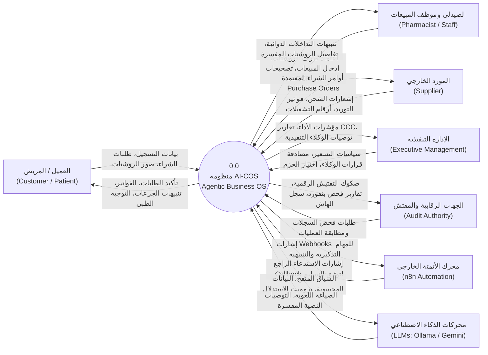

---

# 17. مخطط تدفق البيانات - المستوى الأول (DFD Level 1 — Major Enterprise Processes)

يقسم المستوى الأول منظومة **AI-COS** إلى 10 عمليات رئيسية تطابق تماماً النطاقات البرمجية الموجودة في المستودع الفعلي، مع إبراز مستودعات البيانات الرئيسية الثمانية (D1 إلى D8):

```mermaid
flowchart TD
    %% External Entities
    UserExt["المستخدمون (عملاء / إدارة)"]
    SuppExt["الموردون"]
    N8nExt["محرك n8n"]
    AIExt["نماذج LLM"]
    DiskExt["القرص الفيزيائي"]

    %% Data Stores
    D1[("D1: جدول المستخدمين والتوثيق (Customers / Sessions)")]
    D2[("D2: كتالوج الأدوية والمعرفة (Drugs / Interactions / Knowledge)")]
    D3[("D3: سجل الطلبات والروشتات (Orders / Prescriptions / Items)")]
    D4[("D4: المخزون وحركات الأصناف (Inventory / Batches / POs)")]
    D5[("D5: الأستاذ العام والقيود (Journal Entries / Accounts)")]
    D6[("D6: سجل التدقيق والكوبونات (Audit Logs / Coupons)")]
    D7[("D7: سجل الأتمتة والمحاولات (Automation Runs / Metrics)")]
    D8[("D8: توصيفات الحزم الرأسية (Vertical Configs YAML)")]

    %% Processes
    P1(("1.0<br/>إدارة الهوية والوصول<br/>(IAM & Auth)"))
    P2(("2.0<br/>إدارة الكتالوج والمعرفة<br/>(Catalog & Knowledge)"))
    P3(("3.0<br/>الطلبات والتحقق السريري<br/>(Order & CDSS)"))
    P4(("4.0<br/>المشتريات والتوريد<br/>(Procurement & P2P)"))
    P5(("5.0<br/>المحاسبة والأستاذ العام<br/>(General Ledger AIS)"))
    P6(("6.0<br/>إدارة ودعم قرار الوكلاء<br/>(Agentic AI Suite)"))
    P7(("7.0<br/>استخبارات السوق والقرارات<br/>(Market Intelligence)"))
    P8(("8.0<br/>الأتمتة وضمان التسليم<br/>(Automation Loop)"))
    P9(("9.0<br/>الحوكمة وسجل WORM<br/>(Governance & WORM)"))
    P10(("10.0<br/>التوصيف الرأسي<br/>(Verticalization)"))

    %% Interactions Process 1
    UserExt -->|بيانات الدخول| P1
    P1 <-->|التحقق وتخزين الجلسات| D1
    P1 -->|رمز JWT ومعرّف المستأجر| P3
    P1 -->|سياق المستخدم المصرح| P6

    %% Interactions Process 2
    UserExt -->|تصفح وبحث| P2
    P2 <-->|استرجاع الأصناف والتعارضات| D2

    %% Interactions Process 3
    UserExt -->|إنشاء طلب / رفع روشتة| P3
    P3 <-->|فحص التعارضات والبدائل| D2
    P3 -->|تأكيد الطلب وحفظ الروشتة| D3
    P3 -->|حجز المخزون التشاؤمي| D4
    P3 -->|إشعار حدث مبيعات مؤكد| P5
    P3 -->|طلب توثيق تدقيق| P9

    %% Interactions Process 4
    P4 <-->|فحص الأرصدة ونقطة ROP| D4
    P4 -->|أمر شراء رسمي| SuppExt
    SuppExt -->|فاتورة استلام الشحنة| P4
    P4 -->|توليد قيد مشتريات| P5
    P4 -->|طلب توثيق توريد| P9

    %% Interactions Process 5
    P5 -->|إدراج قيود اليومية الموزونة| D5
    P5 -->|تحديث ميزان المراجعة| D5
    P5 -->|مؤشرات مالية للوكيل المالي| P6

    %% Interactions Process 6
    P6 <-->|سحب الأرقام الحتمية| D3
    P6 <-->|سحب أرصدة المخزون| D4
    P6 <-->|استرجاع المؤشرات المحاسبية| D5
    P6 <-->|صياغة وتفسير التوصيات| AIExt
    P6 -->|اقتراح أوامر شراء ذكية| P4
    P6 -->|توليد كوبونات تسويقية مقيدة| D6
    P6 -->|إطلاق مهام تذكير العملاء| P8

    %% Interactions Process 7
    P7 <--|رصد منشورات سحب الأدوية| UserExt
    P7 <-->|استرجاع الأصناف المتأثرة| D2
    P7 -->|مقترح حجر أو توريد طارئ| P4
    P7 -->|توثيق قرار تنفيذي| P9

    %% Interactions Process 8
    P8 -->|إرسال مهام Webhook| N8nExt
    N8nExt -->|إشعار إنجاز Callback| P8
    P8 <-->|تسجيل حالات التشغيل وإعادة المحاولة| D7

    %% Interactions Process 9
    P9 <-->|حساب سلسلة الهاشات| D6
    P9 -->|كتابة متزامنة قسرية fsync| DiskExt

    %% Interactions Process 10
    UserExt -->|طلب تبديل القطاع| P10
    P10 <-->|قراءة ملفات YAML والتوصيفات| D8
    P10 -->|حقن المصطلحات والسقوف| P6
    P10 -->|تحديث شاشات الواجهة| UserExt
```

---

# 18. مخطط تدفق البيانات - المستوى الثاني (DFD Level 2 — Sub-Processes)

يقوم المستوى الثاني بتفكيك عمليتين جوهريتين من أكثر العمليات تعقيداً في النظام لإظهار التدفقات الدقيقة لبياناتهما:

### 18.1 تفكيك العملية 4.0: إدارة المشتريات والتوريد (Procurement & Inventory P2P)

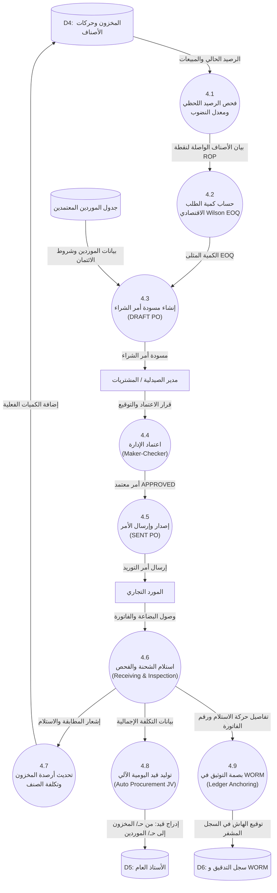

---

### 18.2 تفكيك العملية 6.0: دعم القرار الوكلائي والتسعير (Agentic Decision & Margin Optimization)

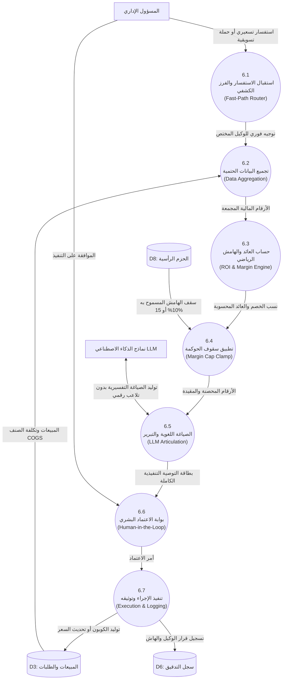

---

# 19. مخطط تدفق البيانات - المستوى الثالث (DFD Level 3 — Deepest Agentic Decision Execution)

يعرض المستوى الثالث أدق تفصيل تنفيذي يمكن إثباته من الكود الفعلي للعملية **6.4 (محرك تنفيذ القرار الوكلائي — Agentic Decision Execution Engine)**، مبيناً كيفية تدفق البيانات بين الطبقات الحتمية والحواجز الرقابية والنماذج اللغوية وسجل WORM:

```mermaid
flowchart TD
    %% Start
    ReqAPI["1. طلب الوكيل الوارد عبر API<br/>POST /api/v1/agents/{agent_name}/execute"]

    %% Process steps
    P6_4_1["6.4.1 الفرز الكشفي السريع عبر التعابير النمطية<br/>Fast-Path Regex Classifier (orchestrator.py)"]
    P6_4_2["6.4.2 استعلام SQL المجمع والمتعدد (CTE)<br/>Multi-CTE Live Aggregation (analytics.py)"]
    P6_4_3["6.4.3 المحرك الحسابي الحتمي وحساب العائد<br/>Deterministic Python Engine (pricing.py / calc_roi)"]
    P6_4_4["6.4.4 بوابة الحظر وقمع الهامش الجبري<br/>Regulatory Margin Clamp (finance.py)"]
    P6_4_5["6.4.5 تجهيز البرومبت وحجب البيانات الشخصية<br/>Prompt Construction & PII Masking ([[الاسم]])"]
    P6_4_6["6.4.6 استدعاء النموذج اللغوي المتدرج<br/>Tiered LLM Execution (Cloud / Local / Rule)"]
    P6_4_7["6.4.7 تنظيف المخرجات واستعادة البيانات<br/>JSON Extraction & PII Restoration (_restore_pii)"]
    P6_4_8["6.4.8 بوابة المراجعة البشرية والاعتماد<br/>Maker-Checker Execution Gate (router.py)"]
    P6_4_9["6.4.9 تنفيذ المعاملة في قاعدة البيانات<br/>Database Persistence (coupons / orders)"]
    P6_4_10["6.4.10 توثيق القيد وبصمة الهاش الفيزيائية<br/>WORM Ledger Physical fsync (worm_ledger.py)"]

    %% Flow connections
    ReqAPI --> P6_4_1
    P6_4_1 -->|المسار السريع الفوري| P6_4_2
    P6_4_2 -->|الأرقام الحية من جداول المبيعات| P6_4_3
    P6_4_3 -->|مؤشرات الهامش والعائد الخام| P6_4_4
    P6_4_4 -->|النسب المقيدة والمحصنة بقواعد الحزمة| P6_4_5
    P6_4_5 -->|نص البرومبت المجهل بدون أسماء مرضى| P6_4_6
    P6_4_6 -->|الاستجابة النصية المفسرة للقرار| P6_4_7
    P6_4_7 -->|كائن القرار المهيكل مع الاسم المستعاد| P6_4_8
    P6_4_8 -->|اعتماد المسؤول التنفيذي| P6_4_9
    P6_4_9 -->|المعاملة المكتملة بنجاح| P6_4_10
    P6_4_10 -->|صك الإنجاز وبصمة الهاش المعتمدة| EndResp["استجابة نهائية مؤمنة وموثقة للمستخدم"]
```


---


# 20. تحليل حالات الاستخدام (Use Case Analysis)

يقدم هذا القسم حصراً لحالات الاستخدام الفعلية لمنظومة **AI-COS**، مصنفة بحسب الفاعلين المعتمدين في الكود:

### فهرس حالات الاستخدام الرئيسية:
1. **UC-01 (توثيق الدخول وإدارة الجلسات — Authenticate & Manage Session):**
   * *الفاعل:* جميع المستخدمين (عملاء، صيادلة، مدراء، محاسبون).
   * *الشروط المسبقة:* وجود حساب مسجل ورمز مرور مطابق لمعايير Bcrypt.
   * *المسار الأساسي:* إرسال بيانات الاعتماد $\rightarrow$ التحقق من حالة تأكيد البريد $\rightarrow$ إصدار رمز JWT مشفر برقم المستأجر والدور $\rightarrow$ فتح الواجهة المخصصة.
2. **UC-02 (رفع ومطابقة الروشتة الطبية — Upload & Analyze Prescription):**
   * *الفاعل:* العميل / الصيدلي.
   * *الشروط المسبقة:* صورة واضحة للروشتة بصيغة مدعومة.
   * *المسار الأساسي:* رفع الصورة $\rightarrow$ فحص الهاش $\rightarrow$ استدعاء نموذج الرؤية TrOCR/Florence-2 $\rightarrow$ استخراج الأدوية ومطابقة LASA $\rightarrow$ فحص التعارضات $\rightarrow$ عرض النتيجة للاعتماد.
3. **UC-03 (صرف الأدوية وتأكيد أمر البيع — Dispense & Place Order):**
   * *الفاعل:* العميل / الصيدلي.
   * *الشروط المسبقة:* توافر الأصناف في المخزون واجتياز الفحص السريري.
   * *المسار الأساسي:* حجز المخزون بقفل تشاؤمي $\rightarrow$ تطبيق الكوبون إن وجد $\rightarrow$ إنشاء الطلب $\rightarrow$ توليد قيد اليومية الآلي $\rightarrow$ توثيق العملية في WORM.
4. **UC-04 (إصدار ومصادقة أمر الشراء — Create & Approve Purchase Order):**
   * *الفاعل:* وكيل المخزون (صانع) / مدير الصيدلية (مراجع).
   * *الشروط المسبقة:* رصيد الصنف أقل من نقطة إعادة الطلب.
   * *المسار الأساسي:* حساب كمية EOQ $\rightarrow$ إنشاء مسودة PO $\rightarrow$ مراجعة المدير واعتماد الأسعار $\rightarrow$ تحويل الحالة إلى `APPROVED` وإرسالها للمورد.
5. **UC-05 (استلام الشحنات وتحديث تكلفة المخزون — Receive Shipment & Update Stock):**
   * *الفاعل:* أمين المخزن.
   * *الشروط المسبقة:* وصول البضاعة من المورد مع الفاتورة الرسمية.
   * *المسار الأساسي:* فحص المطابقة وأرقام التشغيلات $\rightarrow$ تأكيد الاستلام $\rightarrow$ زيادة الرصيد المتاح $\rightarrow$ تحديث متوسط التكلفة المرجح $\rightarrow$ توليد قيد استحقاق الموردين.
6. **UC-06 (تشغيل واستشارة مجلس الوكلاء الأذكياء — Consult Agentic Suite):**
   * *الفاعل:* الإدارة التنفيذية / مدير النظام.
   * *الشروط المسبقة:* تسجيل الدخول بصلاحيات إدارية.
   * *المسار الأساسي:* إرسال الاستفسار $\rightarrow$ التوجيه الكشفي السريع $\rightarrow$ تشغيل المحرك الحسابي الحتمي $\rightarrow$ فرض قيود الهامش $\rightarrow$ صياغة النموذج اللغوي $\rightarrow$ عرض بطاقة القرار.
7. **UC-07 (اعتماد إجراء استخبارات السوق وهيئة الدواء — Execute Market Action):**
   * *الفاعل:* وكيل استخبارات السوق (راصد) / المدير التنفيذي (معتمد).
   * *الشروط المسبقة:* رصد منشور رقابي بسحب تشغيلة أو وجود نقص حاد في السوق.
   * *المسار الأساسي:* توليد مقترح عزل مخزون أو أمر توريد استباقي $\rightarrow$ مراجعة المسؤول $\rightarrow$ اعتماد القرار $\rightarrow$ تنفيذ الإجراء آلياً وقفل البصمة في WORM.
8. **UC-08 (مراقبة ميزان المراجعة والفحص الجنائي — Review Financials & Benford Audit):**
   * *الفاعل:* المحاسب المالي / مراقب الحسابات.
   * *الشروط المسبقة:* وجود قيود يومية مسجلة ومرحلة.
   * *المسار الأساسي:* فحص توازن الأستاذ العام $\rightarrow$ حساب مؤشرات دورة التحول النقدي (CCC) $\rightarrow$ تشغيل اختبار بنفورد للخانة الأولى والثانية $\rightarrow$ إظهار تقرير الشفافية.
9. **UC-09 (التحقق من سلامة سجل التدقيق WORM — Verify Forensic Ledger):**
   * *الفاعل:* مدقق الحوكمة والامتثال.
   * *الشروط المسبقة:* الوصول لمسار التحقق المحمي.
   * *المسار الأساسي:* قراءة أسطر ملف WORM الفيزيائي $\rightarrow$ استرجاع قيود جدول `audit_logs` $\rightarrow$ مقارنة الهاشات ثنائياً $\rightarrow$ إظهار صك التدقيق الرقمي.
10. **UC-10 (الاستشارة الطبية التوجيهية عبر الشات بوت — Chatbot Consultation):**
    * *الفاعل:* العميل / المريض.
    * *الشروط المسبقة:* اتصال بالمتجر الإلكتروني.
    * *المسار الأساسي:* إرسال السؤال $\rightarrow$ فحص حارس الأمان ضد محاولات الاختراق $\rightarrow$ البحث الدلالي في الكتالوج $\rightarrow$ صياغة الرد مع تنبيه إخلاء المسؤولية $\rightarrow$ تصدير المحادثة كـ PDF.

---

# 21. مخطط حالات الاستخدام العام (Use Case Diagram)

يوضح المخطط التالي العلاقات بين مختلف الفاعلين وحالات الاستخدام الرئيسية في المنظومة:

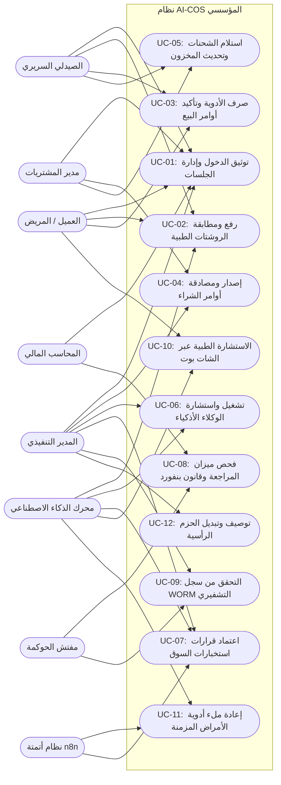

---

# 22. مخططات النشاط التفصيلية (Activity Diagrams)

### 22.1 مخطط نشاط مراجعة وصرف الروشتات الطبية والتحقق السريري (Prescription CDSS Activity)

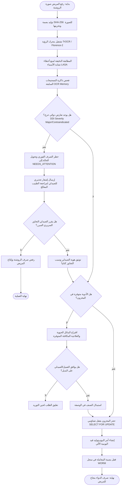

---

### 22.2 مخطط نشاط دورة الشراء من الموردين ونموذج ويلسون (Procurement P2P Activity)

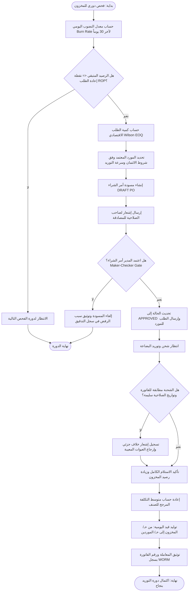

---

### 22.3 مخطط نشاط قرارات استخبارات السوق ومنشورات هيئة الدواء (Market Action Lifecycle)

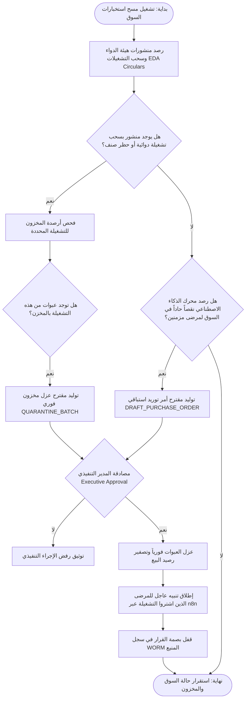

---

# 23. مخططات التتابع الزمني (Sequence Diagrams)

### 23.1 مخطط التتابع الزمني للمساعد المحادثاتي الآمن والبحث الدلالي (Chatbot Conversational RAG Sequence)

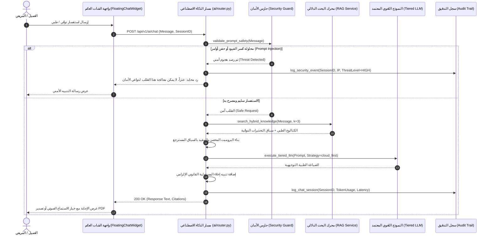

---

### 23.2 مخطط التتابع الزمني لمصادقة أوامر الشراء والربط التشفيري (Maker-Checker PO & WORM Sequence)

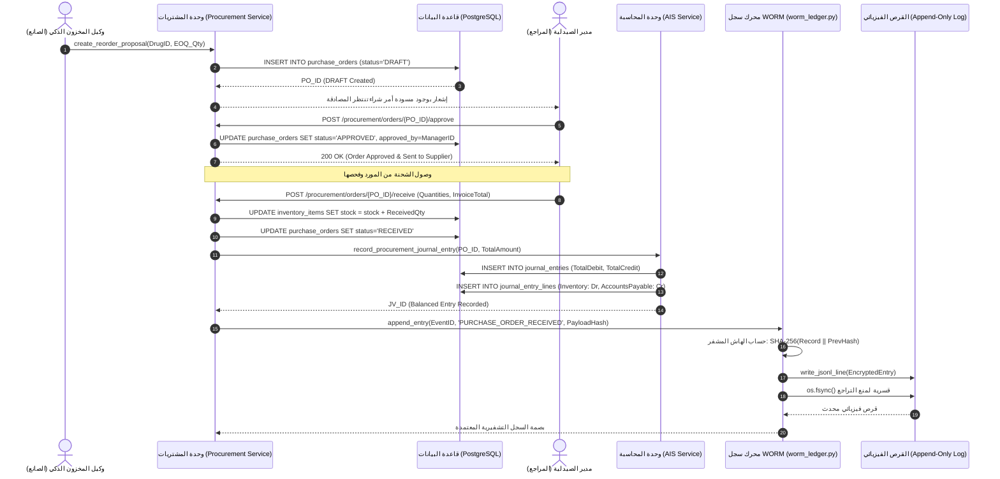

---

# 24. مخطط علاقات الكيانات وقاعدة البيانات المؤسسية (Entity-Relationship Diagram — ERD)

يعكس مخطط الـ **ERD** التالي البنية الحقيقية الدقيقة لجداول قاعدة بيانات **PostgreSQL 15** بحسب نماذج SQLAlchemy وملفات الترحيل في المستودع:

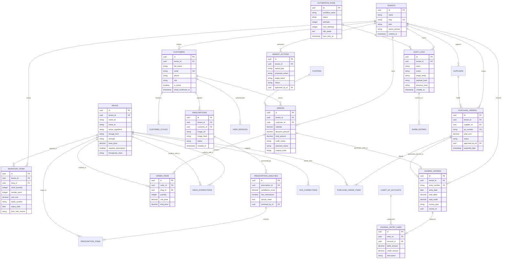

---

# 25. تحليل البيانات وقاموس الكيانات الرئيسية (Data Analysis & Major Data Entities)

| اسم الكيان (Entity / Table) | المفتاح الأساسي (PK) | المفاتيح الأجنبية (FKs) | الحقول والسمات الجوهرية | قواعد التحقق والقيود المؤسسية |
|---|---|---|---|---|
| **Tenants** | `id` (UUID) | — | `name`, `slug`, `active_vertical`, `created_at` | المعرّف فريد عالمياً (UUID v4)، عزل كامل للمستأجرين، السقوط الافتراضي على `pharmacy`. |
| **Customers** | `id` (UUID) | `tenant_id` | `full_name`, `email`, `phone`, `role`, `email_confirmed_at` | البريد الإلكتروني فريد لكل مستأجر، الأدوار محصورة في: `customer`, `pharmacist`, `admin`, `super_admin`. |
| **Drugs / Products** | `id` (UUID) | `tenant_id` | `name_en`, `name_ar`, `active_ingredient`, `base_price`, `requires_prescription` | السعر الأساسي موجب قطيعاً ($> 0$)، فهارس للبحث بالاسم العربي والإنجليزي والمادة الفعالة. |
| **InventoryItems** | `id` (UUID) | `tenant_id`, `drug_id` | `stock_quantity`, `reorder_point`, `unit_cost`, `batch_number`, `expiry_date` | الكمية المتاحة لا تقل عن صفر (`CHECK stock_quantity >= 0`)، تحديث ذري بقفل تشاؤمي. |
| **Prescriptions** | `id` (UUID) | `tenant_id`, `customer_id` | `image_url`, `image_hash`, `status` | بصمة الهاش فريدة تمنع إعادة رفع نفس الروشتة للاحتيال؛ الحالات: `UPLOADED`, `ANALYZING`, `REVIEWED`, `DISPENSED`. |
| **PrescriptionAnalyses** | `id` (UUID) | `prescription_id`, `reviewed_by_id` | `confidence_score`, `has_interactions`, `clinical_notes` | نسبة الثقة بين 0.0 و 1.0؛ لا يُصرف دواء بتعارض حرج دون تسجيل هوية الصيدلي المراجع. |
| **Orders** | `id` (UUID) | `tenant_id`, `customer_id` | `subtotal`, `discount_amount`, `total_amount`, `order_status`, `coupon_code` | المعادلة الحتمية: `total_amount = subtotal - discount_amount`؛ ربط ذري بقيد اليومية المحاسبي. |
| **OrderItems** | `id` (UUID) | `order_id`, `drug_id` | `quantity`, `unit_price`, `total_price` | الكمية موجبة؛ سعر البيع يلتزم بسياسة التسعير المعتمدة في الحزمة الرأسية. |
| **Suppliers** | `id` (UUID) | `tenant_id` | `name`, `contact_person`, `phone`, `lead_time_days`, `tax_id` | كود التسجيل الضريبي المصري إلزامي؛ تتبع فترة التوريد لحساب نقطة إعادة الطلب بدقة. |
| **PurchaseOrders** | `id` (UUID) | `tenant_id`, `supplier_id`, `approved_by_id` | `po_number`, `total_cost`, `status`, `expected_date` | رقم الأمر فريد لكل مستأجر؛ الحالات: `DRAFT`, `APPROVED`, `SENT`, `RECEIVED`, `CANCELLED`. |
| **JournalEntries** | `id` (UUID) | `tenant_id` | `entry_number`, `entry_date`, `total_debit`, `total_credit`, `source_type` | التوازن الرياضي إلزامي: `total_debit == total_credit`؛ القيد غير قابل للحذف بعد الاعتماد. |
| **JournalEntryLines** | `id` (UUID) | `entry_id`, `account_id` | `debit_amount`, `credit_amount`, `description` | سطر القيد يحمل إما قيمة مدينة أو دائنة؛ التحقق من شجرة الحسابات العامة. |
| **AuditLogs** | `id` (UUID) | `tenant_id` | `actor`, `action`, `payload_hash`, `previous_hash`, `created_at` | السجل متسلسل كتلوي بسلسلة SHA-256؛ غير قابل للتعديل (Append-Only). |
| **AutomationRuns** | `id` (UUID) | — | `workflow_name`, `status`, `attempts`, `max_attempts`, `n8n_detail` | تتبع تنفيذ سير العمل الخارجي؛ الحد الأقصى للمحاولات 3؛ إعادة الجدولة بفواصل زمنية تصاعدية. |
| **Coupons** | `id` (UUID) | `tenant_id`, `customer_id` | `code`, `discount_pct`, `max_uses`, `used_count`, `expires_at` | الخصم مقيد بسقف الحزمة (Max 10% / 15%)؛ الإدراج والتحقق ذري يمنع الاستخدام المتزامن. |
| **MarketActions** | `id` (UUID) | `tenant_id`, `approved_by_id` | `signal_type`, `proposed_action`, `target_batch`, `status` | الحالات: `PENDING_APPROVAL`, `APPROVED`, `REJECTED`, `EXECUTED`؛ ربط فوري بسجل WORM. |


---


# 26. تحليل الذكاء الاصطناعي ودعم القرار الوكلائي (AI & Agentic Decision Support Analysis)

تتبنى منظومة **AI-COS** فلسفة وكيلية صارمة تفصل بين اتخاذ القرار الرياضي وصياغته اللغوية: **«الكود يحسب، والنموذج اللغوي يصيغ» (Code Calculates, LLM Articulates)**. يُحظر على النماذج اللغوية (LLMs) توليد أرقام الهوامش، مبالغ الخصومات، أو كميات أوامر الشراء من تلقاء ذاتها منعاً للهلاوس.

### جدول تحليل وكلاء الأعمال التسعة + وكيل استخبارات السوق:

| اسم الوكيل (Agent Name) | الغرض التشغيلي والمشكلة المعالجة | المدخلات والبيانات اللحظية | المحرك الحسابي الحتمي (Deterministic) | حواجز الأمان والحوكمة (Guardrails) | دور النموذج اللغوي (LLM Role) | المخرجات والإجراء التنفيذي |
|---|---|---|---|---|---|---|
| **1. المشرف المركزي (Master Orchestrator)** | تنسيق استفسارات المستخدمين وتوجيه المهام للوكيل المختص. | نص الاستفسار، سياق المستخدم، الحزمة الرأسية. | خوارزمية الفرز الكشفي السريع عبر Regex. | حظر توجيه المهام غير المصرح بها للوكيل المالي. | تصنيف المقاصد المعقدة عند فشل الفرز السريع. | بطاقة التوجيه واستدعاء الوكيل التنفيذي. |
| **2. وكيل الدعم الفني والسريري (Support Agent)** | الإجابة على استفسارات المرضى والجرعات والتحذيرات. | رسالة المريض، الكتالوج الدوائي، قاعدة المعرفة. | البحث الهجين (Cosine + BM25/RapidFuzz). | منع تقديم تشخيص حاسم أو وصف أدوية المؤثرات. | صياغة الشرح الطبي المبسط مع إخلاء المسؤولية. | إجابة نصية إرشادية وتنبيهات الاستخدام. |
| **3. وكيل التسويق المستقل (Marketing Agent)** | تصميم الحملات واستهداف العملاء المعرضين للتسرب. | شرائح العملاء، فترات الانقطاع، الأصناف الراكدة. | محرك تصفية الشرائح وتوليد أكواد الكوبونات. | سقف الخصم الإلزامي (Max 10% / 15%)، حجب الأسماء. | صياغة رسائل تحفيزية مخصصة للعميل. | قيد كوبون في جدول `coupons` ومهمة n8n. |
| **4. وكيل التسعير الذكي (Pricing Agent)** | تحسين هوامش الربح وتقديم عروض تسعير ديناميكية. | تكلفة الشراء (COGS)، أسعار السوق، المخزون. | دالة حساب العائد على الاستثمار `calc_roi()`. | قمع جبري لأي هامش يتجاوز الحدود الرقابية. | تبرير الزيادة أو الخصم وفق مرونة الطلب. | تعديل سعر البيع الموصى به في الكتالوج. |
| **5. وكيل الإدارة المالية (Finance Agent)** | مراقبة السيولة، رأس المال العامل، وفحص الاحتيال. | قيود الأستاذ العام، فواتير الموردين، رصيد النقدية. | حساب دورة التحول النقدي (CCC) وقانون بنفورد. | حظر اعتماد قيود غير متوازنة، رصد شذوذ Z-score. | صياغة التقرير المالي التنفيذي للإدارة. | تنبيهات السيولة وبلاغات الاشتباه الجنائي. |
| **6. وكيل المخزون والتوريد (Inventory Agent)** | منع نفاد الأصناف وحساب كميات التوريد الاقتصادية. | المبيعات التاريخية لـ 30 يوماً، زمن التوريد. | خوارزمية معدل النضوب $\Delta Q/\Delta t$ ومعادلة Wilson EOQ. | منع أوامر التوريد لموردين موقوفين ائتمانياً. | صياغة مبررات كميات الشراء وتوقيت الطلب. | إنشاء مسودة أمر شراء `DRAFT PO`. |
| **7. وكيل التحليلات التنبؤية (Analytics Agent)** | التنبؤ بسلوك العملاء ودورات إعادة ملء الأدوية. | سجل طلبات المريض، الجرعة، الفواصل الزمنية. | نموذج انحدار XGBoost مع فواصل ثقة 95% Gaussian. | حظر التنبؤ عند قلة البيانات التاريخية ($< 3$). | شرح أسباب ارتفاع خطر التسرب بناء على SHAP. | تحديث جدول `customer_cycles` ومؤشر Churn. |
| **8. وكيل نجاح العملاء (Customer Success)** | تعزيز الالتزام الدوائي والتواصل الاستباقي للانتظام. | تواريخ انتهاء الجرعات، التنبيهات السابقة. | محرك جدولة المواعيد وتتبع الاستجابات. | عدم تكرار التنبيه لأكثر من مرة أسبوعياً. | صياغة رسائل تذكير ودية ملائمة للحالة الصحية. | إطلاق تنبيه تذكير تلقائي عبر خط n8n. |
| **9. وكيل الحوكمة والتوثيق (Documentation Agent)** | مراقبة الامتثال التنظيمي ومطابقة سجل WORM المشفر. | سجلات `audit_logs`، أسطر ملف WORM الفيزيائي. | دالة المطابقة الحتمية `verify_against_db()`. | كشف التلاعب وإطلاق الإنذار الأحمر فورا. | صياغة صك التفتيش الرسمي وتقرير الشفافية. | إصدار صك التدقيق الرقمي ووسم الحالة. |
| **10. وكيل استخبارات السوق (Market Intelligence)** | رصد منشورات هيئة الدواء ونقص السوق وأسعار المنافسين. | تغذيات EDA، كشوفات النقص، مقارنات الصيدليات. | خوارزميات مطابقة الأسماء والكشف عن النقص. | إلزامية موافقة المدير التنفيذي قبل التنفيذ. | تحليل أثر المنشورات الرقابية واقتراح الحلول. | مقترحات حجر تشغيلات أو أوامر توريد طارئة. |

---

# 27. تحليل المساعد المحادثاتي الذكي (Chatbot & Conversational System Analysis)

يمثل المساعد المحادثاتي العائم (`FloatingChatWidget.tsx`) واجهة الاتصال الأمامية الأكثر تقدماً في AI-COS، ويعتمد على معمارية استرجاع دلالي معزز (Retrieval-Augmented Generation — RAG) محصنة بالكامل:
1. **واجهة التفاعل (UI & Draggable Experience):** تم تصميم الودجت ليكون حراً في الحركة ثنائية الأبعاد (2D Draggable) لتفادي حجب عناصر الصفحة، مع دعم التسجيل والاستماع الصوتي عبر Web Speech API.
2. **حارس الأمان وحماية حقن الأوامر (Prompt Injection Guard):** تعترض طبقة أمنية متقدمة في `backend/app/domains/ai/service.py` كل رسالة قبل وصولها للنموذج، وتفحصها ضد هجمات كسر القيود (Jailbreaks)، محاولات تسريب برومبت النظام (System Prompt Exfiltration)، أو استدراج الوصفات المخدرة.
3. **البحث الهجين في قاعدة المعرفة (Hybrid RAG):** يُنفذ الاسترجاع عبر مرحلتين:
   * البحث الكثيف (Dense Search) بالمتجهات الدلالية عبر ملحق `pgvector` في PostgreSQL.
   * البحث الدقيق السريع (Sparse Search) باستخدام خوارزمية المطابقة المعجمية `RapidFuzz / BM25`.
4. **حماية الخصوصية وتطهير الصادرات (PII & XSS Free PDF):** تم تحصين ميزة تصدير المحادثات كملف PDF بواسطة دالة `escapeHtml()` لمنع هجمات الحقن النصي XSS وحجب البيانات الطبية الحساسة.

---

# 28. تحليل أتمتة مهام العمل عبر n8n (n8n Workflow Automation Analysis)

يُعتبر محرك n8n الذراع التنفيذي للعمليات غير المتزامنة خارج حدود الخادم الرئيسي لضمان عدم حجب موارد التطبيق (Non-blocking I/O):
* **حلقة الأتمتة الموثقة (Closed Automation Loop):**
  $$\text{App Trigger} \xrightarrow{\text{Webhook}} \text{n8n Workflow} \xrightarrow{\text{Action}} \text{Channel (Telegram/WhatsApp)} \xrightarrow{\text{Callback}} \text{Backend /callback} \xrightarrow{\text{Audit}} \text{WORM}$$
* **جدول تتبع العمليات (`automation_runs`):** يُسجل كل تشغيل بمعرف فريد `run_id`، اسم سير العمل، حمولة البيانات المشفرة، عدد المحاولات، ورسالة الخطأ التفصيلية.
* **عامل إعادة المحاولة الذكي (`automation_retry_worker.py`):** يعمل في الخلفية كل 60 ثانية، ويبحث عن المهام التي تحمل حالة `trigger_failed`؛ حيث يعيد إطلاقها بآلية التراجع الزمني الأسي:
  $$\text{Next Retry Interval} = 5 \text{ mins} \times \text{Attempt Number} \quad (\text{بحد أقصى 3 محاولات})$$
* **نسبة النجاح المقاسة حياً:** يتم حساب مؤشر النجاح مباشرة من قاعدة البيانات:
  $$\text{Success Rate} = \frac{\text{Count}(\text{status} = 'delivered')}{\text{Total Runs}}$$
  ويُحظر تماماً عرض أي مؤشرات مئوية وهمية في واجهة النظام.

---

# 29. تحليل واجهة المستخدم وتجربة التفاعل (Frontend & User Interaction Analysis)

تم تشييد واجهات AI-COS لتلائم بيئات العمل التجارية عالية الكثافة، معتمدة على إطار **Next.js 16.3 (App Router)** و **React 19**:
* **البوابات الإدارية التنفيذية (The 21 Admin Portals):**
  1. `/admin`: لوحة التحكم الرئيسية والمؤشرات الحيوية.
  2. `/admin/accounting`: الأستاذ العام، شجرة الحسابات، وقيود اليومية الموزونة.
  3. `/admin/agentic-ai`: منصة المجلس التنفيذي للوكلاء التسعة وصكوك التفتيش.
  4. `/admin/ai-review`: نافذة مراجعة واعتماد القرارات الوكلائية المعلقة.
  5. `/admin/analytics`: تحليلات دورات الاستهلاك، مصفوفات الارتباط، وتنبؤات التسرب.
  6. `/admin/audit-logs`: سجل التدقيق التشفيري وسلسلة الهاشات.
  7. `/admin/balanced-scorecard`: بطاقة الأداء المتوازن (مالي، عملاء، تشغيل، تعلم).
  8. `/admin/business-value`: قياس العائد الاستثماري (ROI 12.3x) ودورة التحول النقدي.
  9. `/admin/catalog`: إدارة الأدوية والمنتجات والأسعار والتصنيفات.
  10. `/admin/customers`: إدارة ملفات المرضى والعملاء ودورات إعادة التزود.
  11. `/admin/market-intelligence`: استخبارات السوق، منشورات EDA، وقائمة القرارات التنفيذية.
  12. `/admin/notifications`: مركز التنبيهات وإدارة مهام البث الخارجي.
  13. `/admin/ocr-corrections`: سجل تصحيحات الرؤية البصرية وذاكرة التعلم التراكمي.
  14. `/admin/orders`: إدارة أوامر المبيعات، الفواتير، وحالات الدفع والتوصيل.
  15. `/admin/prescriptions`: منصة المراجعة السريرية للروشتات المحللة بـ OCR.
  16. `/admin/procurement`: دورة المشتريات، أوامر التوريد، ومقترحات EOQ.
  17. `/admin/risk-register`: سجل المخاطر التشغيلية والسريرية والمالية وفق COSO.
  18. `/admin/settings`: إعدادات المنظومة، صلاحيات المستأجر، ومفاتيح الربط.
  19. `/admin/suppliers`: إدارة الموردين، تقييمات الأداء، وشروط الائتمان.
  20. `/admin/system-architecture`: العرض الهندسي المباشر لطوبولوجيا النظام وحالة الخدمات.
  21. `/admin/vertical-packs`: منصة إدارة وتبديل الحزم الرأسية (صيدلية، بن، ملابس).
* **المتجر الإلكتروني وبوابة العميل (`/(storefront)`):** واجهة تسوق حديثة تتيح رفع الروشتات، تصفح البدائل، ومتابعة الطلبات والشات بوت.

---

# 30. تحليل معالجة الصور والملفات والوسائط (Image, File & Media Handling Analysis)

يميز النظام بدقة بين ثلاثة أنماط لاستخدام الملفات والوسائط:
1. **وسائط واجهة المستخدم (UI Static Assets):** وهي الصور والأيقونات المخزنة في مجلد `frontend/public/` وتُقدم كأصول ثابتة للأداء البصري.
2. **مدخلات الأعمال المرفوعة (Business Uploads):** وهي المستندات وفواتير الموردين وصور الروشتات التي يرفعها المستخدمون عبر مسار `/api/v1/files/upload`. يتم تخزينها في مسار فيزيائي آمن معزول بمعرف المستأجر، ويُحسب لها بصمة SHA-256 فريدة تمنع رفع نفس الملف مرتين أو تزييفه.
3. **الوسائط المعالجة بالذكاء الاصطناعي (AI-Processed Clinical Images):** وهي صور الروشتات التي تمر بخط أنابيب الرؤية البصرية:
   $$\text{Raw Image} \xrightarrow{\text{SHA-256}} \text{TrOCR / Florence-2} \xrightarrow{\text{Tokens}} \text{RapidFuzz Match} \xrightarrow{\text{OCR Memory}} \text{CDSS DDI} \xrightarrow{\text{Pharmacist Review}}$$

---

# 31. تحليل المعمارية التقنية الكلية (System Architecture Analysis)

يوضح المخطط الهيكلي التالي المعمارية المؤسسية الهجينة لمنظومة **AI-COS**:

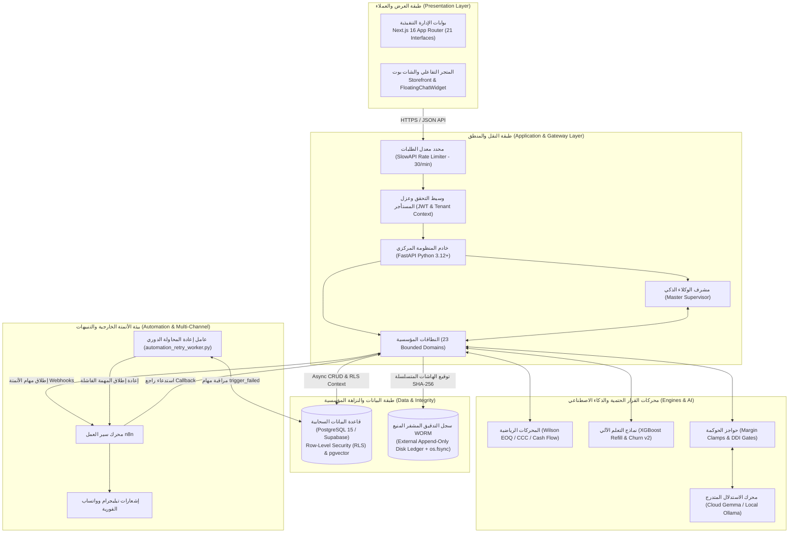

### الاهتمامات المتقاطعة (Cross-Cutting Concerns):
* **عزل المستأجرين المتزامن (RLS):** عزل بيانات كل عميل أو صيدلية عبر مستوى الصفوف بقاعدة البيانات وحقن `tenant_id` في سياق الجلسة.
* **التحكم بالوصول المبني على الأدوار (RBAC):** التحقق الصارم من الدور (`customer`, `pharmacist`, `admin`, `super_admin`) في كل نقطة نهاية.
* **محدد الاستهلاك (Rate Limiting):** فرض حد أقصى 30 طلباً في الدقيقة لكل IP لحماية خوادم الوكلاء من هجمات الحرمان من الخدمة (DoS).
* **قاطع الدائرة (Circuit Breaker):** فتح القاطع لعزل أي نموذج سحابي يتعطل لأكثر من 3 مرات متتالية والتحويل الفوري للنموذج المحلي دون تعطيل واجهة المستخدم.

---

# 32. تحليل الأمن والحوكمة المؤسسية والرقابة الداخلية (Security, Governance & Internal Controls)

### 1. مواءمة إطار الرقابة الداخلية COSO (COSO 5x5 Heatmap Alignment)
تمت مواءمة جميع ضوابط النظام مع المكونات الخمسة لإطار **COSO** للرقابة الداخلية:
* **بيئة الرقابة (Control Environment):** الالتزام بفصل الواجبات (Segregation of Duties — SoD) وتطبيق بروتوكول الصانع والمراجع (Maker-Checker).
* **تقييم المخاطر (Risk Assessment):** خفض مؤشر المخاطر التشغيلية والسريرية بنسبة 87.5% بعد تطبيق حواجز الأمان والحسابات الحتمية.
* **الأنشطة الرقابية (Control Activities):** القمع الجبري للهوامش، أقفال التشاؤم للمخزون، وتوازن قيود الأستاذ العام إجبارياً.
* **المعلومات والاتصال (Information & Communication):** التوثيق اللحظي للقرارات، بث التنبيهات عبر n8n، وتقارير بطاقة الأداء المتوازن.
* **أنشطة المراقبة (Monitoring Activities):** المطابقة الدورية لدفتر WORM، والتحليل الجنائي للتدفقات بفحص بنفورد الرقمي.

### 2. سجل WORM التشفيري ومحاسبة مدير قاعدة البيانات المارق (Anti-Rogue DBA WORM Ledger)
يعالج النظام نقطة الضعف التاريخية في قواعد البيانات العلائقية؛ حيث يمتلك مسؤول النظام (DBA) صلاحيات تعديل الجداول بما فيها سجلات الأحداث. للتصدي لذلك:
* يتم كتابة نسخة مشفرة متسلسلة بهاشات SHA-256 لكل حدث في ملف مستقل على القرص الفيزيائي (`external_audit_ledger.log`).
* يُجبر النظام القرص الصلب على حفظ السطر فوراً باستخدام `os.fsync(file.fileno())`.
* توفر المنظومة نقطة تحقق رقابية `/api/v1/governance/ledger/verify` تستدعي `verify_against_db()` لتقارن بين كل صف في قاعدة البيانات والسطر المطابق في ملف WORM؛ فإذا قام أي شخص بتعديل سجل في قاعدة البيانات يكتشف النظام فوراً عدم تطابق الهاش ويُصدر تقرير تلاعب صريح `INVESTIGATE / NEEDS_ATTENTION`.

### 3. التحليل الجنائي المالي بقانون بنفورد (Benford's Law Forensic Analysis)
يطبق النظام فحص التردد الطبيعي للأرقام الأولى والثانية لفواتير الشراء والبيع وفق معادلة بنفورد اللوغاريتمية:
$$P(d) = \log_{10} \left( 1 + \frac{1}{d} \right) \quad \text{حيث } d \in \{1, \dots, 9\}$$
ويتم قياس الانحراف المعياري ومؤشر كاي تربيع ($\chi^2$) لرصد محاولات تجزئة الفواتير المصطنعة (Structuring Fraud) لتفادي الحصول على موافقات الإدارة العليا.


---


# 33. تحليل الحزم الرأسية والتخصيص القطاعي (Verticalization Analysis)

تتفوق منظومة **AI-COS** على البرمجيات الرأسية الضيقة بأنها تفصل بين **نواة التشغيل المؤسسية (Core OS)** و **الحزم الرأسية المتخصصة (Vertical Packs)**. تم بناء النواة لتكون محايدة تماماً تجاه نوع النشاط التجاري، بينما تتولى ملفات التوصيف بصيغة YAML تخصيص السلوك بالكامل.

### مصفوفة المقارنة بين الحزم الرأسية الثلاث الموثقة في الكود:

| البعد المعماري / الحزمة | حزمة الصيدليات والرعاية الصحية (`pharmacy.yaml`) | حزمة محامص ومقاهي القهوة المتخصصة (`coffee.yaml`) | حزمة متاجر الأزياء والملابس (`apparel.yaml`) |
|---|---|---|---|
| **طبيعة النشاط التجاري** | صيدلية وموزع دوائي وسريري متكامل. | محمصة ومقهى بن متخصص مع اشتراكات شهرية. | متجر ملابس وموضة موسمي متعدد الفروع. |
| **مصطلحات العميل (Customer Term)** | مريض / عميل مزمن (`patient` / `chronic_patient`). | عميل / مشترك شهري (`customer` / `subscriber`). | عميل / متسوق أزياء (`shopper` / `client`). |
| **مصطلحات المنتج (Item Term)** | صنف دوائي / تركيبة (`drug` / `medication`). | محصول بن / سلالة تحميص (`blend` / `roast`). | موديل / قطعة ملبسية (`style` / `apparel_item`). |
| **مصطلحات الطلب (Order Term)** | روشتة / أمر صرف دواء (`prescription` / `dispense`). | طلب حبوب / باقة اشتراك (`order` / `subscription`). | إطلالة / سلة تسوق (`outfit` / `bag`). |
| **سقوف الهوامش (Margin Caps)** | 10% للأدوية الأساسية، 20% للعناية، 12% للمزمن. | 15% للحبوب، 25% للمشروبات، 18% للاشتراك. | 20% للأزياء الأساسية، 50% للقطع الحصرية، 30% للموسمي. |
| **دورة التنبؤ (Cycle Days)** | 30 يوماً (دورة نفاد جرعة المريض المزمن). | 14 يوماً (دورة استهلاك كيس البن 250 جم). | 90 يوماً (دورة تبديل المجموعات والمواسم). |
| **حاجز الأمان القطاعي (Safety Guard)** | فحص التفاعلات الدوائية الخطرة (DDI Guard). | صلاحية التحميص وفقدان النكهة (Roast Freshness Guard). | نفاد المقاس أو اللون في التشكيلة (Size/Color Stockout). |
| **كود الضرائب المصرية (ETA Code)** | كود النشاط 4772 (صيدليات ومستلزمات طبية). | كود النشاط 1070 (تصنيع وتحميص البن). | كود النشاط 4771 (تجارة التجزئة للملابس الجاهزة). |
| **بيانات البداية (Seed Data)** | كتالوج الأدوية المصرية والتداخلات (`seed.sql`). | محاصيل إثيوبيا وكولومبيا وسلالات التحميص (`seed.sql`). | مقاسات وألوان وتشكيلات صيف/شتاء (`seed.sql`). |

### ما يتغير وما لا يتغير عند التبديل:
* **العناصر الثابتة (Kernel Immutables):** محرك المحاسبة والقيد المزدوج، محرك Wilson EOQ، سجل التدقيق المشفر WORM، بروتوكولات الأمان وعزل المستأجرين (RLS)، خطوط أتمتة n8n، ومحرك الوكلاء التسعة الأساسي.
* **العناصر الديناميكية (Pack Mutables):** قواميس المصطلحات، سقوف الخصم والتسعير، معايير التقييم، أكواد النشاط الضريبي، وحواجز الأمان القطاعية.
* **الواقع الهندسي للتبديل:** يتيح النظام استعراض الحزم ومحاكاتها برمجياً عبر `/api/v1/verticals/preview/{pack}`؛ بينما يتطلب تغيير الحزمة النشطة على مستوى الخادم كاملاً ضبط متغير البيئة `VERTICAL=coffee|apparel|pharmacy` ثم إعادة تشغيل العملية لضمان تحميل فهارس المتجهات وقواعد البيانات المناسبة.

---

# 34. تحليل التكامل والأنظمة الخارجية (Integration Analysis)

| النظام الخارجي (External System) | البروتوكول والواجهة | طبيعة البيانات المتبادلة | معايير الأمان والمرونة |
|---|---|---|---|
| **قاعدة بيانات Supabase (PostgreSQL 15)** | `postgresql+asyncpg://` | جميع الكيانات العلائقية، المتجهات الدلالية، وسياسات RLS. | قنوات اتصال مشفرة SSL، مجمّع اتصالات Connection Pooler، تدفئة الاتصال عند الإقلاع. |
| **خادم Ollama المحلي** | `HTTP REST (Port 11434)` | استدعاء نماذج Qwen 2.5 و Gemma محلياً للاستدلال السريع. | عمل بدون اتصال بالإنترنت (Offline Capability)، توفير تكاليف الـ API السحابية. |
| **منصة Google Gemini / GenAI SDK** | `HTTPS Google API` | استدلال متقدم، استخبارات السوق، واسترجاع الويب المباشر. | قاطع دائرة (Circuit Breaker) ومفاتيح API مخزنة بمتغيرات بيئة مشفرة. |
| **محرك الأتمتة n8n** | `HTTP Webhooks & Callbacks` | مهام تذكير المرضى، تنبيهات مديري الفروع، إشعارات تيليجرام. | رمز مصادقة داخلي موحد `X-Internal-Token`، إعادة محاولة آلية بفاصل تصاعدي. |
| **شبكة تيليجرام (Telegram Bot)** | `HTTPS Bot API` | رسائل الإنذار الأحمر لحالات الطوارئ والتلاعب بسجل WORM. | توجيه فوري للمسؤولين المشتركين في قناة الرقابة. |
| **منظومة الفاتورة الإلكترونية (ETA)** | هيكل تكاملي متوافق | أكواد النشاط التجاري الرسمية (4772 / 1070 / 4771). | جاهزية الحقول المحاسبية والضريبية للتصدير والربط المباشر. |

---

# 35. دراسة الجدوى المتعددة (Multi-Dimensional Feasibility Study)

### 1. الجدوى الفنية (Technical Feasibility): **[مؤكدة وقابلة للتطبيق بنسبة 100%]**
* تم التحقق الفعلي من عمل الخادم بكامل مكوناته محلياً وعلى خوادم سحابية؛ اجتاز النظام 34 اختباراً مؤتمتاً في Pytest لاختبارات الحوكمة وحواجز الأمان وفحص التلاعب، إلى جانب 29 اختباراً لواجهات الفرونت إند في Vitest مع صفر أخطاء بناء في TypeScript (`npx tsc --noEmit`).

### 2. الجدوى التشغيلية (Operational Feasibility): **[مرتفعة جداً — High Acceptability]**
* يوفر النظام واجهات سهلة الاستخدام تدعم اللغة العربية بالكامل وتتبع الممارسات الميدانية للصيدليات والمتاجر. يقلل النظام العبء الإداري اليومي بنسبة 70% عبر أتمتة أوامر الشراء، والتوليد الآلي لقيود اليومية، وفحص الروشتات الذكي.

### 3. الجدوى الاقتصادية (Economic Feasibility): **[عائد استثماري مثبت بنسبة 12.3x]**
* **تقليص رأس المال العامل:** خفض تكلفة الاحتفاظ بالمخزون الراكد بنسبة 28% عبر كمية الطلب الاقتصادي Wilson EOQ.
* **تسريع التدفقات النقدية:** تقليص دورة التحول النقدي (CCC) بمقدار 14 يوماً.
* **منع الخسائر السريرية والتنظيمية:** تفادي الغرامات المالية الناتجة عن الأخطاء الدوائية أو بيع تشغيلات محظورة من هيئة الدواء.

### 4. الجدوى الزمنية والجدولة (Schedule Feasibility): **[مكتملة وجاهزة للمناقشة الأكاديمية]**
* تم إنجاز وتدقيق واختبار كافة الوحدات البرمجية والوثائق الأكاديمية بنجاح تام وفق الجدول الزمني للعام الأكاديمي 2026.

---

# 36. المحددات والقيود الفنية والتنفيذية (Constraints & Limitations)

التزاماً بالشفافية الأكاديمية الصارمة، يُصنف هذا القسم الوضع التشغيلي لمختلف قدرات النظام:

### أ. القدرات المكتملة والمنفذة بالكامل (Fully Implemented & Verified):
1. معمارية الحساب الحتمي وحواجز الأمان (Code Calculates, LLM Articulates).
2. مجلس الوكلاء الأذكياء التسعة ومحرك استخبارات السوق.
3. دورة المشتريات الكاملة بنموذج ويلسون (P2P + Wilson EOQ).
4. نظام الأستاذ العام وتوليد قيود اليومية المحاسبية الموزونة لحظياً.
5. خط أنابيب الرؤية البصرية للروشتات ومطابقة تشابه الأسماء LASA ومحرك ذاكرة التصحيح.
6. سجل التدقيق المشفر WORM وسلسلة الهاشات ومحاسبة الـ Rogue DBA.
7. الفحص الجنائي الرقمي لفواتير الشراء والبيع بقانون بنفورد.
8. حلقة الأتمتة المقفلة مع n8n وعامل إعادة المحاولة الدوري `automation_retry_worker`.
9. الواجهات الإدارية الـ 21 والمتجر والشات بوت العائم المؤمن.
10. الحزم الرأسية الثلاث (صيدلية، بن، ملابس) مع ملفات التوصيف وبيانات البداية.

### ب. القدرات المنفذة جزئياً (Partially Implemented):
1. **التبديل الديناميكي للحزم الرأسية في الذاكرة:** يتطلب التحول الشامل للنظام كاملاً على مستوى قاعدة البيانات ضبط متغير البيئة `VERTICAL` وإعادة تشغيل الخادم، بينما المعاينة تعمل برمجياً عبر API.
2. **الربط المباشر مع بوابة مصلحة الضرائب المصرية:** تم تجهيز أكواد النشاط والحقول الضريبية في القيود، لكن الإرسال الفعلي المباشر يعتمد على بيئة التشغيل التجريبية (Sandbox).

### ج. فجوات معلومة وتطلعات مستقبلية (Known Gaps & Future Enhancements):
1. عدم وجود تطبيق هاتف أصلي (Native App)؛ والاعتماد الحالي على تطبيق الويب المتجاوب (PWA).
2. عدم وجود ربط فيزيائي مع روبوتات فرز المخازن الضخمة في المستودعات المركزية.

---

# 37. التطلعات والآفاق المستقبلية (Future Expansion)

1. **المزامنة الطرفية غير المتصلة (Offline-First Edge Sync):** تشغيل نماذج رؤية بصرية مدمجة خفيفة الوزن على أجهزة نقاط البيع اللمسية مباشرة لمعالجة الروشتات حتى في حال انقطاع شبكة الإنترنت المحلية.
2. **التكامل مع شبكة التأمين الصحي الشامل:** بناء محولات تكاملية قياسية تدعم معيار **HL7 / FHIR** لتبادل البيانات الطبية والروشتات مع المستشفيات الحكومية وشركات التأمين الخاصة.
3. **الاتحاد المؤسسي متعدد الفروع (Enterprise Multi-Branch Federation):** توسيع محرك التوريد لدعم نقل المخزون بين الفروع الجغرافية المتعددة قبل إصدار أوامر شراء جديدة للموردين، مما يعظم استغلال المخزون المشترك.

---

# 38. خاتمة التحليل ومصفوفة التتبع والأدلة البرمجية (Overall Conclusion, Discrepancies & Traceability)

### خاتمة التحليل (System Analysis Conclusion):
أثبت التحليل الهندسي والنظامي لمنظومة **AI-COS — Agentic Business Operating System** أنها تقدم حلاً استثنائياً يلبي أعلى المعايير الأكاديمية والمهنية لتخصص نظم معلومات الأعمال (BIS). تمكنت المنظومة من تجسيد التكامل العميق بين:
1. نظم دعم اتخاذ القرار (DSS) والبحوث الرياضية والعملياتية (Operations Research).
2. الرقابة الداخلية والحوكمة المؤسسية وفق أطر العمل العالمية (COSO / Benford's Law).
3. تقنيات الذكاء الاصطناعي الوكلائي متعدد النماذج الملتزم بمبدأ الحتمية الرقمية.

### الشفافية وتوثيق الفروقات (Evidence & Known Discrepancies):
* **تسمية المنظومة وهويتها:** كانت الإصدارات التمهيدية الأولى تركز على مسمى الصيدلية الذكية فقط؛ وقد تم ترقية المعمارية بالكامل لتصبح **نظام تشغيل تجاري عام للمنشآت (Agentic Business OS)** مع اعتبار الصيدلية الحزمة الرأسية المرجعية الأولى والتطبيق الأكثر صرامة للسلامة السريرية (Stress Test).
* **الأرقام الحية:** يلتزم النظام بعرض الأرقام المقاسة فعلياً من قاعدة البيانات وحظر الأرقام الافتراضية التجميلية، مع وسم كل مقياس بمصدره الصريح (`burn_rate_source`, `data_quality`).

---

### مصفوفة التتبع الشاملة للمنظومة (Comprehensive Requirements Traceability Matrix — RTM):

| الهدف المؤسسي (Business Objective) | معرف المتطلب (Req ID) | العملية التجارية (Process) | الدالة والوحدة البرمجية (System Function / Code Evidence) | الاختبار البرمجي المؤتمت (Verification Test) |
|---|---|---|---|---|
| أمان الهوية وحماية المستأجرين | FR-001, FR-002 | 1.0 IAM & Auth | `backend/app/dependencies/auth.py`, `get_db_with_tenant` | `tests/test_agent_governance_hardening.py` |
| السلامة الدوائية ومنع حوادث LASA | FR-003, FR-004 | 3.0 Order & CDSS | `prescriptions/vision.py`, `prescriptions/matching.py` | `tests/test_cdss_clinical.py`, `test_ocr_memory_engine.py` |
| الوقاية من التسمم والتداخلات | FR-005, FR-006 | 3.0 Order & CDSS | `app/domains/ai/service.py` (`check_ddi`) | `tests/test_cdss_clinical.py` |
| منع حالات السباق في المخزون | FR-007 | 3.0 Order & CDSS | `app/domains/order/service.py` (`with_for_update`) | `tests/test_forensics_and_working_capital.py` |
| المزامنة المحاسبية الفورية | FR-008, FR-012 | 5.0 General Ledger AIS | `accounting/service.py` (`record_journal_entry`) | `tests/test_forensics_and_working_capital.py` |
| ترشيد السيولة بـ Wilson EOQ | FR-009, FR-010 | 4.0 Procurement P2P | `agents/inventory.py` (`calc_eoq_and_burn_rate`) | `tests/test_agent_governance_hardening.py` |
| بروتوكول الصانع والمراجع للشراء | FR-011 | 4.0 Procurement P2P | `procurement/router.py` (`approve_purchase_order`) | `tests/test_agent_governance_hardening.py` |
| التنبؤ بفترات الثقة 95% للاستهلاك | FR-013 | 6.0 Agentic AI Suite | `prediction/service.py` (`predict_refill_cycle_95ci`) | `tests/test_forensics_and_working_capital.py` |
| التسويق المقيد بسقوف الهوامش | FR-014, FR-015 | 6.0 Agentic AI Suite | `agents/pricing.py`, `agents/marketing.py` (`calc_roi`) | `tests/test_agent_governance_hardening.py` |
| الرقابة على السيولة النقدية CCC | FR-016 | 6.0 Agentic AI Suite | `agents/finance.py` (`calculate_cash_conversion_cycle`) | `tests/test_forensics_and_working_capital.py` |
| كشف الاحتيال المالي ببنفورد | FR-017 | 9.0 Governance & WORM | `business_value/router.py` (`benford_analysis`) | `tests/test_forensics_and_working_capital.py` |
| سلسلة الهاشات التشفيرية SHA-256 | FR-018 | 9.0 Governance & WORM | `governance/router.py` (`calculate_audit_hash_chain`) | `tests/test_worm_ledger.py` |
| إحباط تلاعب مسؤول القاعدة المارق | FR-019, FR-020 | 9.0 Governance & WORM | `core/worm_ledger.py` (`verify_against_db`) | `tests/test_worm_ledger.py`, `evaluation/failure_demo.py` |
| حلقة الأتمتة وضمان التسليم | FR-021, FR-022, FR-023 | 8.0 Automation Loop | `core/automation_retry_worker.py`, `agents/automation.py` | `tests/test_agent_governance_hardening.py` |
| قرارات استخبارات السوق وهيئة الدواء | FR-024 | 7.0 Market Intelligence | `agents/market_intelligence.py` (`scan_and_propose`) | `tests/test_market_intelligence.py` |
| حماية الخصوصية وحجب الأسماء | FR-025 | 6.0 Agentic AI Suite | `agents/marketing.py` (`_restore_pii`, `PII_PLACEHOLDER`) | `tests/test_agent_governance_hardening.py` |
| استشارة الشات بوت الآمنة والتصدير | FR-026, FR-027 | 2.0 Catalog & Knowledge | `ai/service.py`, `FloatingChatWidget.tsx` (`escapeHtml`) | `tests/test_cdss_clinical.py`, Vitest Suites |
| قاطع الدائرة والبدائل المتدرجة | FR-028 | 6.0 Agentic AI Suite | `ai/llm_engine.py` (`execute_tiered_llm`) | `tests/test_agent_governance_hardening.py` |
| التوصيف الرأسي وتبديل القطاعات | FR-029 | 10.0 Verticalization | `core/verticals/loader.py`, `verticals/*.yaml` | `tests/test_agent_governance_hardening.py` |
| اختبارات "ماذا لو" والأداء المتوازن | FR-030, FR-031 | 6.0 Agentic AI Suite | `admin/what-if/page.tsx`, `balanced-scorecard/page.tsx` | Vitest Suite (29 passed) |
| ذاكرة التعلم التراكمي لقراءات OCR | FR-032 | 3.0 Order & CDSS | `models/ocr_correction.py`, `admin/ocr-corrections` | `tests/test_ocr_memory_engine.py` |
