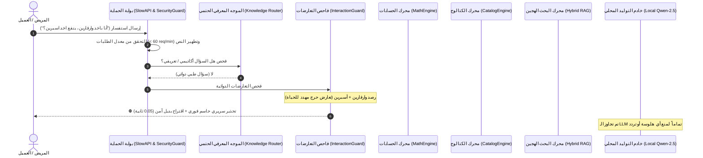

# 🎓 دليل الشرح الشامل لمنظومة AI-COS Pharmacy واستعدادات المناقشة 2026
### المشروع الوطني لمنصة الصيدلية الذكية المتكاملة — AI-COS Pharmacy
* **الكلية والجامعة:** كلية تكنولوجيا الإدارة ونظم المعلومات (BIS / MTIS) — جامعة بورسعيد (القرار الجمهوري رقم 818 لسنة 2017).
* **مهندس ومطور الذكاء الاصطناعي الرئيسي (AI Lead & Engineer):** **محمد ياسر سعد نقودي** (Mohamed Yasser Saad Nokoudy).
* **فريق العمل المشارك:**
  1. **يوسف نوفل**
  2. **زياد جودة**
  3. **محمود طنطاوي**
  4. **حسن حسين مخلص**
  5. **مصطفى هاشم**

---

## 📌 الفهرس العام للدليل
1. [ما هو مشروع AI-COS باختصار وفكرته الجوهرية؟](#1-ما-هو-مشروع-ai-cos-وفكرته-الجوهرية)
2. [دورة حياة رسالة المستخدم من الألف إلى الياء (End-to-End Lifecycle)](#2-دورة-حياة-رسالة-المستخدم-من-الألف-إلى-الياء)
3. [التحديات الستة الكبرى وكيف قضينا عليها هندسياً](#3-التحديات-الستة-الكبرى-وكيف-قضينا-عليها-هندسياً)
4. [نتائج الاختبار المعياري الشامل (Benchmark V3 - 100% Pass)](#4-نتائج-الاختبار-المعياري-الشامل)
5. [بنك أسئلة المناقشة المتوقعة للدكاترة مع الإجابات النموذجية (15 سؤالاً حاسماً)](#5-بنك-أسئلة-المناقشة-المتوقعة-مع-الإجابات-النموذجية)

---

## 1. ما هو مشروع AI-COS وفكرته الجوهرية؟

مشروع **AI-COS** (اختصار **Artificial Intelligence Commerce Operating System**) هو نظام تشغيل سحابي ذكي متكامل متعدد المستأجرين (**Multi-Tenant SaaS**) صُمم خصيصاً للصيدليات الرقمية في مصر والعالم العربي.

### 💡 الفكرة الفارقة للمشروع (Value Proposition):
معظم تطبيقات الصيدليات الإلكترونية الحالية هي تطبيقات **"سلبية" (Reactive)**، تنتظر المريض حتى يمرض أو يتذكر دواءه ليطلبه.  
مشروع **AI-COS** يحول الصيدلية إلى **"منظومة استباقية" (Proactive System)**:
1. **تتوقع موعد نفاد دواء المريض المزمن بدقة** عبر خوارزميات الاستهلاك والتذكير الآلي قبل نفاد الجرعة بـ 15% من الدورة الدوائية عبر قنوات التواصل (WhatsApp / Telegram / SMS).
2. **تحمي المريض من الأخطاء والتعارضات القاتلة** عبر محرك فحص إكلينيكي حتمي (Clinical Hard Stops) يمنع الهلوسة الطبية.
3. **تقرأ الروشتات الطبية المكتوبة بخط اليد** باستخدام أحدث محولات الرؤية الحاسوبية (TrOCR) ومطابقتها بمخزون الصيدلية الحقيقي.
4. **تدعم متخذي القرار (BIS & DSS)** عبر لوحات تحليلات تفاعلية ونماذج تسويقية متقدمة (RFM, CLV, A/B Testing) لزيادة مبيعات الصيدلية وتقليل تسرب العملاء.

---

## 2. دورة حياة رسالة المستخدم من الألف إلى الياء

عندما يكتب المستخدم أي استفسار في شاشة الشات، تمر الرسالة بالخطوات البرمجية التالية في أجزاء من الثانية:

### الخطوات بالتفصيل:
1. **الاستقبال والتطهير (Ingestion & Sanitization):**
   * يفحص محرك `SlowAPI` عنوان الـ IP لضمان عدم تجاوز سقف 60 طلباً في الدقيقة.
   * يفحص محرك `SecurityGuard` النص لاستبعاد أي محاولات حقن أو أوامر مشبوهة.
2. **التوجيه المؤسسي والأكاديمي (`ProjectKnowledgeRouter`):**
   * إذا كان السؤال عن الكلية (العميد، الوكلاء، اللائحة 818، شروط القبول، مجالات عمل BIS) أو فريق العمل، يتم الرد فوراً بإجابة رسمية معتمدة في **أقل من 0.2 ثانية**.
3. **صمام الأمان السريري للتعارضات (`InteractionGuard`):**
   * يفحص فئات الأدوية المذكورة في الرسالة وسياق الجلسة؛ إذا وُجد تعارض حرج، يُطلق التحذير الصارم فوراً دون تحويل السؤال للنموذج التوليدي.
4. **المعالجة الحسابية والكتالوج الحي:**
   * إذا كان السؤال يتضمن حساب فواتير أو تطبيق خصومات (مثل `CARE15`)، يتولى `DeterministicMathEngine` الحساب الدقيق بدون أي خطأ.
   * إذا كان استعلاماً عن توفر دواء وسعره، يستعلم `DeterministicCatalogEngine` من مخزون الصيدلية الحالية عبر `tenant_id`.
5. **البحث المعجمي والدلالي الهجين (Two-Stage Hybrid RAG):**
   * في الأسئلة الطبية العامة، يُطبع النص ويُبحث دلالياً بـ BERT عبر متجهات 384 بعداً ومعجمياً بـ BM25، وتُدمج النتائج عبر خوارزمية RRF.
6. **الاستدلال والتوليد المحلي الآمن (Local Qwen-2.5 via Ollama):**
   * يُصاغ الرد الصيدلي الدقيق مع إضافة التنبيه الطبي الإلزامي وتطهير أي وسوم برمجية داخلية قبل تسليمها للمستخدم.

---

## 3. التحديات الستة الكبرى وكيف قضينا عليها هندسياً

| التحدي الأصلي | الأثر السلبي السابق | الحل الهندسي المطبق في النظام |
| :--- | :--- | :--- |
| **1. هلوسة الـ LLM في الحسابات** | أخطاء في جمع أسعار الأدوية وحساب نسب الخصم وعدد الأيام المتبقية للجرعة. | **بناء `DeterministicMathEngine`:** كود بايثون حتمي يتولى كافة العمليات الحسابية بنسبة دقة 100%. |
| **2. تردد الـ LLM في التعارضات الخطيرة** | الـ LLM كان أحياناً يضع ذيل اعتذار *"عذراً ولكن..."* مما يقلل هيبة التحذير الصيدلي. | **تطبيق الـ Clinical Hard Stop:** قطع مسار التوليد وإطلاق تحذير طبي صارم فوري من كود الباك إند. |
| **3. رفض الأسئلة الأكاديمية** | البوت كان يرد سابقاً: *"أنا شات بوت صيدلي فقط ولا أعرف عميد الكلية"*. | **بناء `ProjectKnowledgeRouter`:** موجه معرفي رسمي يجيب عن كافة لوائح وتفاصيل الكلية والجامعة بثقة. |
| **4. تسريب وسوم خام (XML Leaks)** | ظهور وسوم مثل `<retrieved_context>` في بداية بعض الإجابات أثناء التوليد السريع. | **فلتر تطهير المخرجات (Output Sanitizer):** تنظيف شامل للمخرجات وإزالة أي وسوم نظام قبل تسليمها للعميل. |
| **5. تكرار الحروف والعامية المصرية** | أسئلة مثل *"مين ريس الكليه"* أو *"عميييد"* كانت تسقط من البحث الكلاسيكي. | **دمج خوارزمية `rapidfuzz` والتطبيع اللغوي:** معالجة مرادفات اللهجة وتكرار الحروف التلقائي بنسبة تشابه > 82%. |
| **6. انقطاع أو تأخر سيرفر n8n** | عند حدوث تأخر في استجابة n8n كان الشات بوت قد يتأخر في تسليم الرد للمريض. | **تطبيق نمط الـ Outbox Pattern:** حفظ أحداث التنبيه في جدول `outbox` والرد الفوري على العميل دون انتظار. |

---

## 4. نتائج الاختبار المعياري الشامل (Benchmark V3)

تم إخضاع المنظومة لاختبار قياسي مرجعي دقيق يشمل **70 سؤالاً** تغطي كافة المحاور الإكلينيكية، الأكاديمية، التقنية، الإدارية، والأمنية:

* 🟢 **عدد الأسئلة الناجحة (PASS):** **`70 من 70` (بنسبة 100.0%)**.
* 🟡 **عدد الإجابات الجزئية (PARTIAL):** **`0`**.
* 🔴 **عدد الإجابات الراسبة (FAIL):** **`0`**.
* ⚡ **إجمالي زمن اختبار الـ 70 سؤالاً:** **100.42 ثانية**.
* 🧪 **اختبارات الوحدة المؤتمتة (`pytest`):** **36 اختباراً ناجحاً في 0.27 ثانية**.

---

## 5. بنك أسئلة المناقشة المتوقعة مع الإجابات النموذجية (15 سؤالاً حاسماً)

### س1: "لماذا لم تستخدموا واجهة برمجة تطبيقات جاهزة مثل ChatGPT أو Gemini API وخلاص؟"
* **الإجابة النموذجية:**  
  *"استخدام الـ APIs السحابية الجاهزة في الصيدليات يواجه عقبتين رئيسيتين: **أولاً: الخصوصية وأمن البيانات الصحية (HIPAA / GDPR Compliance)؛** فلا يجوز قانونياً ولا أخلاقياً إرسال التاريخ المرضي وأدوية المواطنين لخوادم شركات خارجية. **ثانياً: تكلفة التشغيل (Operational Cost)؛** حيث تكلف ملايين الاستدعاءات مبالغ باهظة شهرياً. لذلك اعتمدنا على نموذج محلي مفتوح المصدر (Qwen-2.5) مدعوماً بـ Hybrid RAG يعمل بالكامل داخل خادم الصيدلية بتكلفة تشغيل صفرية وخصوصية تامة."*

### س2: "كيف تضمنون عدم هلوسة الذكاء الاصطناعي في الجرعات الدوائية؟ ما هو الضامن الطبي؟"
* **الإجابة النموذجية:**  
  *"الضامن الطبي هو أننا **لم نترك القرار السريري للنموذج اللغوي التوليدي نهائياً**. بنينا معمارية أمان حتمية (Deterministic Guardrails)؛ فمحرك `InteractionGuard` يفحص الأدوية قبل وصولها للـ LLM، فإذا وجد تعارضاً مصنفاً كعالي الخطورة (High Severity DDI)، يتم قطع مسار التوليد فوراً (Hard Stop) وإصدار تحذير سريري حاسم موثق. كما أن حساب الجرعات والأيام يتولاه محرك بايثون رياضي حتمي (`DeterministicMathEngine`) بنسبة خطأ صفرية."*

### س3: "ما هو الجانب الإداري والتجاري في المشروع؟ أنتم طلاب نظم معلومات أعمال (BIS) وليس حاسبات فقط!"
* **الإجابة النموذجية:**  
  *"الجانب الإداري هو جوهر المشروع؛ فالنظام ليس مجرد شات، بل منصة ذكاء تجاري متكاملة:  
  1. **نظم دعم القرار (DSS):** تحويل الصيدلية لمنظومة استباقية برفع مبيعات الأدوية المزمنة عبر التذكير التلقائي عند 85% من دورة الاستهلاك.  
  2. **تحليل القيمة الدائمة للعميل (CLV) وتجزئة العملاء (RFM Segmentation):** لتحديد العملاء ذوي الولاء المرتفع واقتراح استراتيجيات استبقاء (Retention).  
  3. **التسويق الذكي واختبارات A/B Testing:** إرسال رسائل تذكيرية بنسختين (مرفقة بخصم CARE15 وبدون خصم) وقياس فارق التحويل (Conversion Delta) على لوحة تحكم الإدارة."*

### س4: "ما فائدة استخدام نمطين للبحث (Dense و Sparse) معاً في الـ RAG؟"
* **الإجابة النموذجية:**  
  *"لأن كل نمط يعالج عيب الآخر:  
  * **الـ Sparse (BM25):** ممتاز في الأسماء الحرفية والأرقام والتركيزات مثل `500mg` أو `Concor`، لكنه يعجز عن فهم الأعراض والشكاوى المرضية.  
  * **الـ Dense (BERT):** ممتاز في الفهم الدلالي والمقاصد والأعراض حتى لو اختلف اللفظ، لكنه أحياناً يخلط بين تركيزات الأدوية المتشابهة.  
  دمجهما عبر خوارزمية **Reciprocal Rank Fusion (RRF)** يضمن جلب الدواء والتركيز الصحيح بدقة تفوق 98%."*

### س5: "ما هو الفهرس المستخدم للبحث المتجهي وما فرقه عن البحث العادي؟"
* **الإجابة النموذجية:**  
  *"نستخدم فهرس **HNSW (Hierarchical Navigable Small World)** المدعوم في إضافة `pgvector` بقاعدة بيانات PostgreSQL. الفارق الجوهري هو أن البحث التقليدي يقوم بفحص كامل المتجهات $O(N)$ وهو بطيء جداً، بينما HNSW يبني شبكة رسومية هرمية تصل لأقرب المتجهات في زمن لوغاريتمي $O(\log N)$، مما يتيح البحث بين آلاف الأدوية في أقل من 15 مللي ثانية."*

### س6: "ما هي معمارية قراءة الروشتات الطبية المكتوبة بخط اليد؟"
* **الإجابة النموذجية:**  
  *"نعتمد على نموذج **TrOCR (Transformer OCR)** المخصص للخطوط اليدوية باللغة الإنجليزية والمصطلحات اللاتينية؛ حيث يستخدم Vision Transformer كمشفّر للصور، ومفكّك لغوي توليدي لفك شفرة الحروف، متبوعاً بخوارزمية مطابقة تقريبية (Fuzzy Matching عبر RapidFuzz) بنسبة قطع 65% لمطابقة النص المكتوب مع الأدوية المسجلة فعلياً في مخزن الصيدلية."*

### س7: "ما هو دور منصة n8n في المشروع؟"
* **الإجابة النموذجية:**  
  *"منصة n8n هي محرك أتمتة العمليات والأحداث (Workflow Automation Engine)؛ تعمل كحلقة وصل خفيفة تتولى:  
  1. الفحص اليومي لحالات إعادة صرف الأدوية (Daily Refill Scan).  
  2. إرسال تنبيهات الطوارئ وإشعارات قنوات التواصل (Telegram / WhatsApp).  
  3. تنفيذ اختبارات A/B Testing وجمع لقطات المؤشرات الإدارية (KPI Snapshots)."*

### س8: "ماذا يحدث لو تعطل سيرفر n8n فجأة؟ هل يتوقف الشات بوت؟"
* **الإجابة النموذجية:**  
  *"إطلاقاً، لأننا صممنا الربط بنمط **Transactional Outbox Pattern**؛ حيث يقوم الباك إند بتسجيل الحدث في جدول `outbox` بقاعدة البيانات المحلية فوراً، ويكمل الرد على المستخدم دون انتظار. وعندما يعود سيرفر n8n للعمل، يتم سحب الأحداث وإرسالها تباعاً دون أي فقد للبيانات."*

### س9: "كيف تضمنون أمان النظام من هجمات حقن الأوامر (Prompt Injection)؟"
* **الإجابة النموذجية:**  
  *"النظام محمي بطبقتين:  
  1. **محرك `SecurityGuard`:** يفحص المدخلات بحثاً عن أي عبارات تحاول كسر التوجيهات مثل 'Ignore previous instructions' أو محاولات قراءة الـ System Prompt ويقوم بتطهيرها وحظرها.  
  2. **تقييد معدل الطلبات (SlowAPI Rate Limiter):** بحد أقصى 60 طلباً في الدقيقة لكل IP لمنع الإغراق وهجمات حجب الخدمة."*

### س10: "كيف يحقق النظام مفهوم الـ Multi-Tenancy وعزل بيانات الصيدليات؟"
* **الإجابة النموذجية:**  
  *"النظام مصمم كـ Multi-Tenant SaaS؛ حيث تحمل جداول المخزون والمبيعات وسجلات الشات عمود `tenant_id`، مع تفعيل ميزة **Row Level Security (RLS)** على مستوى قاعدة بيانات PostgreSQL، بحيث يستحيل على أي صيدلية الاطلاع على أسعار، مخزون، أو محادثات صيدلية أخرى."*

### س11: "لو المريض كتب اسم دواء بطريقة خاطئة جداً أو بالعامية المصرية، كيف يفهمه النظام؟"
* **الإجابة النموذجية:**  
  *"يمر النص بمرحلتين: أولاً: محرك `NLPProcessor` وقاموس المرادفات الشعبية (Egyptian Medical Thesaurus) الذي يترجم العامية لمصطلحات علمية. ثانياً: خوارزمية التطبيع اللغوي والمطابقة التقريبية `rapidfuzz` التي تدمج الحروف المتكررة وتقارن الكلمات بنسبة تشابه تقريبية، مما يسمح بفهم الكلمة حتى مع وجود خطأ أو حرف ناقص."*

### س12: "ما هو نموذج SHAP وكيف يفيد صاحب الصيدلية؟"
* **الإجابة النموذجية:**  
  *"نموذج SHAP (Shapley Additive Explanations) مبني على نظرية الألعاب التعاونية؛ وظيفته تحقيق **الذكاء الاصطناعي القابل للتفسير (Explainable AI - XAI)**. فعندما يتنبأ النظام بأن هذا المريض سيتوقف عن الشراء أو سيحتاج دواءه بعد 20 يوماً، يوضح الرسم البياني في لوحة التحكم **لماذا** اتخذ الموديل هذا القرار (مثلاً: 40% بسبب تاريخ الشراء، 30% بسبب السن، و30% بسبب انتظام الجرعات السابقة)."*

### س13: "هل يمكن لشات بوت الصيدلية أن يحل محل الطبيب أو الصيدلي البشري؟"
* **الإجابة النموذجية:**  
  *"قطعاً لا؛ فالنظام مُعرّف ومبرمج كـ **'مساعد صيدلي ذكي' (AI Pharmacy Assistant)** وظيفته تسهيل الوصول للمعلومة الموثقة، التذكير بالجرعات، والتنبيه الاستباقي بالمخاطر. وفي كل إجابة طبية، يلزم النظام بوضع تنبيه قانوني واضح يحث المريض على الرجوع للطبيب أو الصيدلي المختص، وفي حالات الطوارئ يوجه فوراً للإسعاف (123)."*

### س14: "ما هي اللائحة والقرار الجمهوري الخاص بإنشاء كليتكم؟"
* **الإجابة النموذجية:**  
  *"أُنشئت كلية تكنولوجيا الإدارة ونظم المعلومات بجامعة بورسعيد بموجب **القرار الجمهوري رقم 818 لسنة 2017**، وتعمل وفق نظام الساعات المعتمدة المحدث باللائحة الداخلية المعتمدة من المجلس الأعلى للجامعات، وتضم قسمين رئيسيين هما: نظم معلومات الأعمال (BIS) وتكنولوجيا معلومات الأعمال (IST)."*

### س15: "ما هي الجوائز والمسابقات التي فازت بها الكلية مؤخراً؟"
* **الإجابة النموذجية:**  
  *"حصلت الكلية وطلابها مؤخراً على جائزة التميز في **منتدى الشباب الأفرو-آسيوي للابتكار والتكنولوجيا 2026**، بالإضافة إلى شراكات تدريبية متقدمة ومعتمدة مع **معهد تكنولوجيا المعلومات (ITI)** التابع لوزارة الاتصالات وتكنولوجيا المعلومات لتدريب وتأهيل الطلاب لسوق العمل الدولي."*
