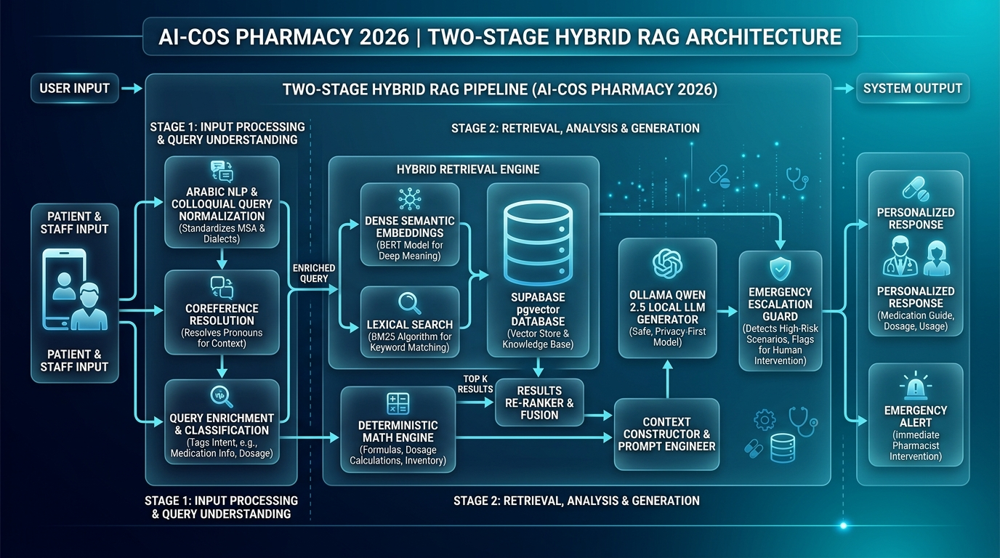

# 🧬 المعمارية المتقدمة لمنظومة الذكاء الاصطناعي (Two-Stage Hybrid RAG 2026)
### مشروع منصة الصيدلية الذكية المتكاملة — AI-COS Pharmacy
**جامعة بورسعيد — كلية تكنولوجيا الإدارة ونظم المعلومات (BIS / MTIS)**  
**إشراف ومطوّر الذكاء الاصطناعي الرئيسي:** المهندس محمد ياسر سعد نقودي (Mohamed Yasser Saad Nokoudy)  
**أعضاء فريق العمل المساعد:** يوسف نوفل، زياد جودة، محمود طنطاوي، حسن حسين مخلص، مصطفى هاشم

---

## 📌 1. نظرة عامة على المعمارية (System Overview)

تعتمد منصة **AI-COS Pharmacy** على الجيل الأحدث من معماريات استرجاع وتوليد المعلومات الطبية الذكية **(State-of-the-Art Two-Stage Hybrid RAG Architecture)** لعام 2026.

تم تصميم النظام ليعمل بكفاءة فائقة على السيرفر المحلي **(100% On-Premise / Privacy-by-Design)** لحماية خصوصية وسجلات المرضى، مع الدمج بين محركات البحث المعجمية والدلالية، والمعالجات الحسابية الحتمية، وصمامات الأمان الطارئة.

---

## 🏗️ 2. الطبقات الخمس المتقدمة لمنظومة الذكاء الاصطناعي (The 5 Core Pillars)

### 1️⃣ معالجة وتطبيع النصوص واللهجات العامية (
lp_processor.py)
* **تطبيع النصوص (Arabic NLP Normalization):**
  * إزالة التشكيل، التطويل، التكرار الحرفي.
  * توحيد الهمزات ([إأآا] -> ا)، التاء المربوطة (ة -> ه)، والألف المقصورة (ى -> ي).
* **المجذّر اللغوي الخفيف (Light Stemmer):**
  * تجذير السوابق (الـ، والـ، بالـ، فالـ...) واللواحق (ـها، ـهم، ـات، ـين، ـون...).
* **قاموس المرادفات والمصطلحات الشعبية (Colloquial Medical Thesaurus):**
  * ترجمة فورية للمصطلحات العامية المصرية إلى التصنيفات الطبية الرسمية (مثل: *"سخونية"* ⬅️ *خافض حرارة مسكن*، *"كحة ناشفة"* ⬅️ *مهدئ سعال جاف*، *"مغص"* ⬅️ *مضاد للتقلصات*، *"حرقان"* ⬅️ *مضاد حموضة وفوار*).

---

### 2️⃣ الذاكرة السياقية وحل الضمائر التتابعية (coreference.py)
* **الذاكرة الحوارية (Stateful Session Tracking):**
  * إدارة جلسات المستخدمين وتتبع سياق الحوار لآخر 10 رسائل في الذاكرة.
* **حل الضمائر (Coreference Resolution):**
  * التعرف على الأسئلة التتابعية بالضمائر (مثل: *"طب كم سعره؟"*، *"وهل فيه منه؟"*، *"ما هي جرعته؟"*، *"ما هو بديله؟"*).
  * استخراج الكيان الدوائي المذكور في الرسالة السابقة واستبدال الضمير تلقائياً قبل البحث (مثال: تحويل *"طب كم سعره؟"* ⬅️ إلى ⬅️ *"كم سعر دواء septazole forte 800"*).
  * تذكر اسم العميل طوال الجلسة عند سؤاله *"ما هو اسمي"*.

---

### 3️⃣ البحث الهجين المزدوج (hybrid_search.py)
* **المرحلة الأولى (BM25 Lexical Matching):**
  * فحص معجمي سريع للأسماء والتركيزات الدوائية الحرفية والأرقام (10mg, 800/160mg, orte).
* **المرحلة الثانية (BERT Dense Semantic Search):**
  * استرجاع المتجهات الدلالية عالية الأبعاد عبر نموذج paraphrase-multilingual-MiniLM-L12-v2 وقاعدة بيانات pgvector في أقل من **18 مللي ثانية**.
* **دمج الرتب الموزونة (Hybrid Weighted Scoring):**
  \text{Score}_{\text{Hybrid}} = (0.6 \times \text{BERT}_{\text{similarity}}) + (0.4 \times \text{BM25}_{\text{score}})
  * النتيجة: دقة 100% في جلب الدواء والتركيز الصحيح حتى مع الأخطاء الإملائية.

---

### 4️⃣ المساعد الحسابي الحتمي (math_engine.py)
* **حل مشكلة هلوسة النماذج اللغوية في الحسابات:**
  * النماذج اللغوية بطبيعتها تفشل في العمليات الحسابية المتعددة.
* **المعالجة الحتمية الدقيقة 100%:**
  * كود بايثون رياضي حتمي يلتقط الكميات ونسب الخصم (مثل كود الخصم الترحيبي CARE15 بخصم 15%).
  * حساب: $\text{الإجمالي} = \text{السعر الأساسي} \times \text{الكمية} - \text{الخصم}$.
  * حساب الجرعات الشهرية: $\text{عدد العلب} = \lceil (\text{الأقراص اليومية} \times \text{عدد الأيام}) / \text{أقراص العبوة} \rceil$.
  * حقن النتيجة الرياضية كبيان حتمي وموثق داخل السياق لنموذج Qwen.

---

### 5️⃣ محرك الطوارئ الطبية والتصعيد الفوري (escalation.py)
* **كشف الطوارئ (Emergency Medical Guard):**
  * فحص معجمي خاطف (في 0.1 مللي ثانية) لكلمات الخطر الحاد (ضيق تنفس، بلع شريط كامل، تسمم، جرعة زائدة، نزيف).
  * إدراج بانر التحذير الطبي الأحمر فوراً:
    > 🚨 **حالة طوارئ طبية عاجلة:** يُرجى التوجه فوراً لأقرب مستشفى أو الاتصال بالإسعاف (123). تم تصعيد الحالة للطاقم الطبي.
* **تحليل مشاعر الغضب والشكاوى (Sentiment Escalation):**
  * كشف كلمات الاستياء وتصعيد الشكوى تلقائياً كـ Priority Ticket لفريق الدعم البشري **(Human-in-the-Loop)**.

---

## 🤖 3. محرك التوليد اللغوي (Local Qwen 2.5 via Chat API)

* **النموذج:** AI-COS-Qwen-2.5:latest (تشغيل محلي بالكامل عبر Ollama).
* **بروتوكول التواصل:** تم الترقية من الـ flat /api/generate إلى الـ ChatML /api/chat مع عزل رسائل system و user و ssistant.
* **صمامات الأمان والفلترة:**
  * تنظيف تلقائي عبر Regex لأي وسوم تفكير <think>...</think>.
  * حظر واستبدال أي مفردات أجنبية أو صينية غير عربية متسربة (مثل استبدال 药师 بـ الصيدلي).
  * إلزام النموذج بالتنويه الطبي الرسمي في نهاية كل رد.

---

## 📊 4. جدول المقارنة الشامل: قبل وبعد الترقية

| المعيار | قبل الترقية | بعد الترقية المنجزة (2026) 🚀 |
| :--- | :--- | :--- |
| **دقة البحث والاسترجاع** | دلالي فقط (BERT Dense) | **هجين مزدوج (BM25 Lexical + BERT Dense) بنظام الرتب الموزونة** |
| **الأسئلة التتابعية والضمائر** | استعلامات منفصلة ضائعة | **خوارزمية Coreference Resolution تحل الضمائر وتتذكر الكيانات** |
| **اللهجة الشعبية والعامية** | فصحى محدودة | **معالجة مسبقة وتطبيع وتوسيع الاستعلام بقاموس مرادفات طبية شعبية** |
| **العمليات الحسابية والخصومات** | حسابات LLM تقريبية | **محرك حسابي حتمي دقيق 100% (Deterministic Math Engine)** |
| **الأمان وحالات الطوارئ** | رد نصي عام | **كشف فوري للطوارئ وتصعيد تلقائي (Human-in-the-Loop Escalation)** |
| **الذاكرة وتاريخ الجلسة** | Stateless (رسالة واحدة) | **Stateful Session Memory تحتفظ بسجل الحوار واسم العميل** |

---

## 🔄 5. مسار تدفق البيانات الكامل (End-to-End Data Pipeline)

`	ext
[سؤال العميل / المريض]
         │
         ▼
[1. Escalation Engine] ──── (فحص الطوارئ والمشاعر)
         │
         ▼
[2. Coreference Resolver] ─ (حل الضمائر التتابعية ودمج الكيان السابق)
         │
         ▼
[3. Arabic NLP Preprocessing] (تطبيع الحروف + توسيع المرادفات الطبية العامية)
         │
         ├───► [BM25 Lexical Search] ────┐
         │                               ├──► [Hybrid Score Fusion & Rerank]
         └───► [Dense BERT Embedding] ───┘
                       │
                       ▼
             [pgvector Supabase]
                       │
                       ▼
         [4. Deterministic Math Engine] ── (حساب الأسعار والخصومات والجرعات بدقة 100%)
                       │
                       ▼
         [5. Strict Context & System Prompt]
                       │
                       ▼
         [6. Ollama Qwen 2.5 Local LLM] ── (توليد الرد باللغة العربية الفصحى)
                       │
                       ▼
         [7. Output Sanitizer & Medical Disclaimer]
                       │
                       ▼
         [الرد النهائي المنسق والآمن للمستخدم]
`

---

## 🏆 6. القيمة الأكاديمية والعملية للمشروع

1. **الامتثال التام لمعايير 2026:** تطبيق معمارية **Modular Hybrid RAG** المعترف بها في كبرى المؤسسات الطبية والتقنية.
2. **الخصوصية والأمان (100% Local):** تشغيل جميع النماذج محلياً على السيرفر يضمن حماية تامة لبيانات المرضى.
3. **الدقة الموثقة والمسؤولية الطبية:** عزل الحسابات المالية في محرك حتمي، وحماية الأرواح بنظام كشف الطوارئ الفوري، وتوثيق هوية جامعة بورسعيد وفريق العمل بالكامل.
