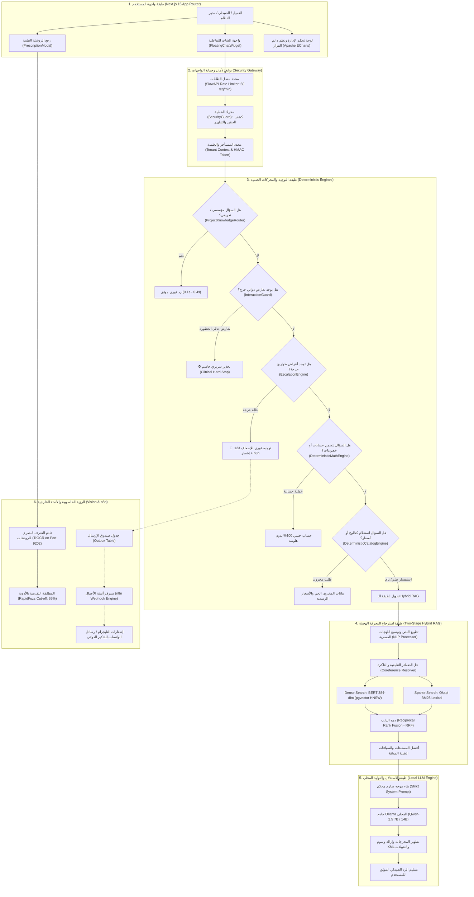

# 🏛️ المعمارية الهندسية الشاملة لمنظومة الذكاء الاصطناعي (AI-COS Pharmacy Architecture 2026)
### مشروع منصة الصيدلية الذكية المتكاملة — AI-COS Pharmacy
* **الكلية والجامعة:** كلية تكنولوجيا الإدارة ونظم المعلومات (BIS / MTIS) — جامعة بورسعيد (القرار الجمهوري 818 لسنة 2017).
* **مهندس ومطور الذكاء الاصطناعي الرئيسي (AI Lead & Engineer):** محمد ياسر سعد نقودي (Mohamed Yasser Saad Nokoudy).
* **فريق العمل المشارك:** يوسف نوفل، زياد جودة، محمود طنطاوي، حسن حسين مخلص، مصطفى هاشم.

---

## 📌 1. الفلسفة المعمارية للمشروع (Design Philosophy)

صُممت معمارية **AI-COS** وفقاً لثلاثة مبادئ هندسية صارمة:
1. **الخصوصية التامة وانعدام التكلفة (100% Privacy by Design & Zero Cost Inference):**
   الاعتماد التام على تشغيل النماذج محلياً (On-Premise) عبر نماذج مفتوحة المصدر (BERT + Qwen-2.5 محلياً عبر Ollama)، لمنع تسريب بيانات المرضى الحساسة لأي خوادم خارجية وتفادي تكاليف الاشتراكات السحابية الباهظة.
2. **الأمان السريري الحتمي (Deterministic Clinical Safety & Zero Hallucination):**
   عدم ترك القرارات الطبية والحرجة لاحتمالات الهلوسة في نماذج الـ LLM؛ بل تخضع لفلاتر ومحركات برمجية حتمية (Deterministic Hard Stops) تقطع التوليد العشوائي فور رصد أي خطر.
3. **تعدد المستأجرين مع العزل التام للبيانات (Multi-Tenant SaaS with Row Level Security):**
   تصميم المنظومة لتخدم مئات الصيدليات على نفس الخادم مع عزل تام للمخزون، الأسعار، وسجلات الشات لكل صيدلية (`tenant_id`).

---

## 🗺️ 2. المخطط المعماري العام للنظام (High-Level Architecture Diagram)



---

## 🧩 3. الشرح التفصيلي للطبقات المعمارية الست

### 🛡️ الطبقة الأولى: بوابة الأمان والتحكم في التدفق (Security & Rate Limiting)
* **محرك محدد الطلبات (SlowAPI Rate Limiter):**  
  يمنع هجمات حجب الخدمة (DoS) وإغراق السيرفر بتحديد سقف أقصى قدره **60 طلباً في الدقيقة لكل عنوان IP**.
* **صمام حماية المدخلات (`SecurityGuard`):**  
  فحص فوري للنصوص الواردة لمنع هجمات حقن التعليمات (Prompt Injection)، ومحاولات استخراج تعليمات النظام (System Prompt Leaks)، وهجمات XSS، مع تطهير النصوص قبل وصولها لمحركات الذكاء الاصطناعي.
* **عزل المستأجرين (Tenant Context):**  
  كل طلب شات يحمل معرف الصيدلية المشفر (`tenant_id`) ويخضع لسياسات الأمان على مستوى الصفوف (Row Level Security - RLS) في قاعدة البيانات.

---

### ⚡ الطبقة الثانية: الموجهات والمحركات الحتمية (Deterministic Bypass Engine)
تستهدف هذه الطبقة خفض زمن الاستجابة إلى **أقل من 0.3 ثانية** ومنع الهلوسة بنسبة 100%:

1. **موجه المعرفة المؤسسية والأكاديمية (`ProjectKnowledgeRouter`):**
   * يعالج استفسارات الكلية (العميد، الوكلاء، اللائحة 818، شروط القبول، مجالات عمل BIS) والتعريف بالمشروع وفريق العمل والسياسات الرسمية.
   * مدعوم بخوارزمية مطابقة تقريبية (`rapidfuzz`) وتطبيع لغوي متقدم يعالج اللهجة المصرية وتكرار الحروف السريع (مثل: *"مين ريس الكليه"*, *"عميييد"*).
2. **صمام الأمان السريري للتعارضات (`InteractionGuard - Clinical Hard Stop`):**
   * يفحص مدخلات المريض وتاريخ الأدوية لـ 10 عائلات دوائية حرجة (NSAIDs + أدوية السيولة، السيلدينافيل + النترات، أدوية الضغط + مزيلات الاحتقان...).
   * في حال وجود خطر جسيم، يُطلق تحذيراً سريرياً حاسماً فوريّاً **دون تحويل السؤال للـ LLM**، ما يمنع أي تردد أو اعتذار غير لائق.
3. **محرك الطوارئ الطبية (`EscalationEngine`):**
   * يكتشف الأعراض القاتلة (ألم الصدر الممتد، ضيق التنفس الحاد، علامات السكتة الدماغية).
   * يوجه المريض فوراً لطلب الإسعاف (123)، ويرسل إشعاراً عاجلاً عبر نمط `Outbox Pattern` إلى سير عمل n8n لتنبيه الطاقم الطبي.
4. **المساعد الحسابي الحتمي (`DeterministicMathEngine`):**
   * يعالج العمليات الحسابية بدقة متناهية (حساب إجمالي الفواتير، تطبيق كود الخصم CARE15 بنسبة 15%، وحساب كفاية الجرعات الدوائية وموعد التذكير الاستباقي قبل نفاد الدواء).
5. **محرك الكتالوج الحي (`DeterministicCatalogEngine`):**
   * يستعلم مباشرة من جدول `inventory_items` الخاص بالصيدلية الحالية، ويعيد الأسعار الرسمية والكميات المتاحة في المخزن الحي.

---

### 🔍 الطبقة الثالثة: البحث الدلالي والمعجمي الهجين (Two-Stage Hybrid RAG)
عندما يكون السؤال استفساراً طبياً عاماً، يتولى محرك الـ RAG المهمة عبر مرحلتين متكاملتين:

```
                  ┌────────────────────────────────────────┐
                  │       استفسار المستخدم المعالج         │
                  └──────────────────┬─────────────────────┘
                                     │
                 ┌───────────────────┴───────────────────┐
                 ▼                                       ▼
    ┌─────────────────────────┐             ┌─────────────────────────┐
    │  المرحلة 1: البحث المعجمي │             │  المرحلة 2: البحث الدلالي  │
    │       (Okapi BM25)      │             │   (Dense BERT Vectors)  │
    │  مطابقة المصطلحات بدقة   │             │   فهم المقصد والأعراض   │
    └────────────┬────────────┘             └────────────┬────────────┘
                 │                                       │
                 └───────────────────┬───────────────────┘
                                     ▼
                  ┌─────────────────────────────────────┐
                  │  خوارزمية دمج الرتب المتبادلة (RRF)   │
                  │   Reciprocal Rank Fusion Algorithm  │
                  └──────────────────┬────────────────┘
                                     ▼
                  ┌─────────────────────────────────────┐
                  │   أدق 3-5 فقرات موثقة من الكتالوج   │
                  └─────────────────────────────────────┘
```

1. **البحث المعجمي الحرفي (Sparse Retrieval - BM25):**  
   يبحث بدقة عن أسماء المواد الفعالة والأسماء التجارية والتركيزات الدوائية (مثل: *500mg, Concor, Paracetamol*).
2. **البحث المتجهي الكثيف (Dense Retrieval - BERT):**  
   يحول النص إلى تضمين متجهي كثيف (Vector Embedding) بـ 384 بعداً عبر نموذج `all-MiniLM-L6-v2`، ويستعلم من قاعدة بيانات **PostgreSQL + pgvector** باستخدام فهرس **HNSW** فائق السرعة.
3. **خوارزمية دمج الرتب (RRF):**  
   تدمج نتائج المحركين لتقديم أدق سياق صيدلي متكامل.

---

### 🧠 الطبقة الرابعة: الاستدلال والتوليد المحلي (Local LLM Inference)
* **المحرك المستخدم:** النموذج المتقدم **Qwen-2.5** (بحجم 7B أو 14B) عبر منصة **Ollama** المحلية على خادم الصيدلية.
* **الموجه الصارم (Strict System Prompt):**  
  يُلزم النموذج بعدم الإجابة إلا من واقع السياق الطبي المسترجع، وإرفاق التنبيه القانوني الإلزامي:  
  *(⚠️ تنبيه: هذا رد آلي عام. يُرجى استشارة الصيدلي أو الطبيب المختص قبل أي قرار دوائي).*
* **مطهّر المخرجات (Output Sanitizer):**  
  يقوم بفلترة المخرجات لمنع تسريب وسوم مثل `<retrieved_context>` أو أي أخطاء لغوية ناتجة عن سرعة الاستدلال.

---

### 👁️ الطبقة الخامسة: الرؤية الحاسوبية للروشتات (TrOCR Handwriting Vision)
* **الخادم المستقل:** يعمل محرك الرؤية على سيرفر محلي مستقل (Port 9202).
* **معمارية النموذج:** نموذج **TrOCR (Transformer OCR)** المتخصص في قراءة خط اليد للأطباء باللغة الإنجليزية والمصطلحات اللاتينية.
* **محرك المطابقة بالكتالوج (Catalog Fuzzy Matching):**  
  يستقبل النصوص المستخرجة ويمررها على خوارزمية **Levenshtein Distance** بمعدل قطع (Cut-off: 65%) لاكتشاف الدواء الصحيح في الصيدلية حتى لو كانت قراءة بعض الحروف غير مكتملة.

---

### ⚙️ الطبقة السادسة: أتمتة الأعمال ونظم المعلومات الإدارية (n8n & BIS Engines)
1. **سيناريو التذكير بالجرعات (Refill Reminder Workflow):**  
   يفحص دورياً الأدوية المزمنة للمرضى، ويطلق رسالة تذكيرية عند حلول $85\%$ من دورة استهلاك العبوة ($\text{Reminder Day} = \text{Avg Cycle} \times 0.85$).
2. **سيناريو اختبارات A/B Testing:**  
   يقسم العملاء بنسبة 50/50 بين رسالة تذكيرية عادية ورسالة تذكيرية مرفقة بكوبون خصم (مثل `CARE15`) لقياس التغير في معدل التحويل (Conversion Delta).
3. **نمط صندوق الإرسال المرن (Outbox Pattern):**  
   في حال تعطل خدمة n8n أو تأخرها، لا يتوقف الباك إند نهائياً بل يتم حفظ الحدث في جدول `outbox` ومعاودة إرساله لاحقاً بمجرد عودة الخدمة.
